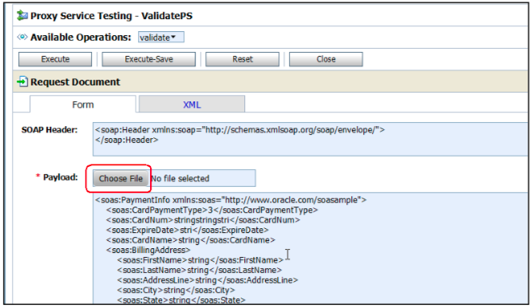

# Module 2: Payment validation

## Introduction
In this module, you will build your first Oracle SOA Suite 12c composite to validate a credit card payment.
In this composite, credit card payments will be validated and the payment status will be returned. If the payment is denied, the order will not be processed.

Avitek, a fictitious company, has embarked upon a modernization project to align with business goals of improving customer satisfaction. A key area of improvement will be streamlining the order process to provide better visibility tracking orders through credit approvals, fulfillment, shipment and delivery.

One of **the issue in the current application is that credit card payments are often denied for various, sometimes minor reasons, such as expiration date, etc. Since the process to correct these issues varies across Avitek’s order entry systems, on-premise or new adopted Cloud SaaS application there is no consistent follow-up and resolution with customers. Orders may end up lost or delayed in the system leading to customer dissatisfaction**.

The business has indicated a new credit card fraud detection system must be put in place before year’s end to thwart credit card abuses. A consistent fraud mechanism will require the credit validation process to be consolidated across all order entry systems.

The validate payment solution will look as the following from an architectural perspective:

## **Construct Payment Validation process flow**

The validation process are:
+ The payment information is retrieved from the database, using the credit card number quoted in the order message as the key. If there is no data available with this credit card number, payment is denied.
+ If data for the credit card number is available, the expiry date in the database record is compared to the expiry date listed in the order message. If they are not the same, the payment is also denied.
+ The last check compares if the total order amount is less than the daily limit on the credit card in the database.
+ When all tests are successful, the payment is authorized. Otherwise it’s denied.
+ The implementation of this service uses a BPEL process to retrieve the credit card data from the database and perform the tests outlined above. The service will return either Authorized or Denied as the payment status.

**Validation Payment, development Steps:**

## **STEP 1**:  Create a new SOA composite application 

Let's name the application e2e-1201-composites and the SOA project in JDeveloper called ValidatePayment.

To start designing the SOA composites, SOA 12c has a number of new features to improve sharing of common “code” between teams, departments or even from a partner to a customer. Part of that is the new SOA Templates feature. 

SOA templates can be used as starting points to accelerate the development of SOA applications. These templates will either be the foundation of a project or can be added to an existing project. All changes made after the import point will not be reflected in the original template.

The SOA templates come in three flavors:
+ Project templates: They include a complete project with all components and resources used and will be used when creating a new project in your SOA application.
+ Component templates: A component with all references resources and components. For example, a BPEL process that calls a business rule or adapter can be packaged as component template.
+ Custom activity templates: A scope in a BPEL process, which may include an invoke/receive from/to a partnerlink, can be packaged as a custom BPEL activity. For example, an assign activity and a call to an adapter. 

To make sure of the templates, please follow the steps below:
+ SOA templates that are located in the default directory (e.g. $MW_HOME\jdeveloper\integration\templates) will be recognized automatically. Additional directories can be added.
+ As the templates used for the labs have been unpacked into the ~/e2e-1201- orderprocessing/templates/ folder, we will add this directory to the list of folders that are scanned for templates.
+ In the main JDeveloper menu, please go to Tools --> Preferences.

+ 

+ In the Preferences window, go to SOATemplates. (If you do not see ‘SOA’ in the preferences, then you could create a new application, or open an existing one. This will load up SOA libraries, SOA preference will show up).

+   

+ Click the ‘+’ button, to add folder.
+ Navigate to ~/e2e-1201-orderprocessing/ templates.

+  

+ Click Select to accept your choice.

+  

+ Click OK to close the Preferences window.

## **STEP 2**:  Use a new template to create the ValidatePayment composite.

Create a new SOA application and project. There are various ways and shortcuts to do this, and in this case choose File > New > Application... from the menu.
+ From the Categories tree, click on General > Applications.
+ Select SOA Application from the Items field.

+  
+  
+ Click OK.
+ In the subsequent dialog for Create SOA Application, set the following fields, leaving the others
with their default values:
+ - a. Application Name: e2e-1201-composites
+ - b. Directory of your choice, as shown below
+ 

+ Click Next

+ When you create a new application, you are prompted to create a new project. Set the following fields:
+ - a. Project Name: ValidatePayment
+ - b. Keep the default Directory
+ - c. Project Features: SOA Suite
+ 

+ Click Next
+ The next step is to pick a ‘Standard Composite’, or a ‘SOA Template’. Choose ‘SOA Template’.

+ 

+ Select “ValidatePaymentTemplate”. Click Finish.
+ A new project “ValidatePayment” is created with some predefined components as derived from the template. A canvas displaying three swim lanes: services, components, and references; shown below
  
+ 

+ On the left hand side, you will see the Application Navigator, which shows all resources included in a SOA project.
+ This Navigator has been reorganized in SOA Suite 12c to make it easier to find all files related to SOA, and also to provide the option to customize the folder structure.
+ You will see a SOA folder under the project root. This is where all SOA related files and folders are stored, such as BPEL processes, schema files, WSDL files.
+ The composite.xml, which defines the structure of the composite, is located directly under the SOA folder. In previous releases, this file was just shown as composite.xml. This became confusing when several composite.xml files from different projects were open at the same time.

## **STEP 3**:  Review the various components of the composite.

+ In SOA Suite 12c, the project name is displayed in the navigator and in the composite tab label. It is displayed as ValidatePayment here.

+ 

+ The SOA folder has a number of subfolders with default names, which hold common SOA artifacts viz. BPEL, XML schemas, WSDL files, transformation-related files and events.
+ You will see new subfolders created when creating new components.
+ The structure and names of the subfolders can be customized to your liking, as long as all folders are located under SOA.

+ The composite diagram is shown here:
  

+ The External References swim lane contains the getpaymentInformation database adapter.

+ The next step will retrieve the payment information from the database, using the credit card number as the key. Based on expiry date, daily limit, and total amount of order, the app calculates whether the payment is authorized or denied. The database adapter will process choices, and provides a service that implements the operation specified. The WSDL file to represent that service is getPaymentInformation.wsdl.

+ In the center (components swim lane) is the validatePayment BPEL Process - it is the component that implement the orchestration in the SOA Suite.

+ In SOA 12c, This BPEL process will make use of two resource files: ValidatePayment-concrete.wsdl and CanonicalOrder.xsd.

+ On the left-side of swim lane, a  validatepaymentprocess_client_ep is the external client web service that input to the BPEL process.

## **STEP 4**:  Add a database connection to Java DB 

The Java DB is an embedded database inside JDeveloper 12c. The embedded weblogic requires to be started prior to establishing connection to the embedded database). Otherwise, Java DB will not be available.

The database adapter getpaymentInformation will connect to the SOA database. In order to do that, it needs a connection which contains all the details needed to connect to the database. The template does not carry the connection information – it leverages the connection(s) configured for the application.

+ 

+ In the Create Database Connection dialog, enter the following details: 
+ - Create Connection In: Application Resources
+ - Connection Name: SOA
+ - Connection Type: Java DB (Derby)

+ 

+ Server Name (localhost), Port (1527) and Database (soainfra) for the preconfigured Java DB are filled in automatically.
+ Click the Test Connection button and verify that your connection works.
+ You should see “Success!” like in the screenshot below

+ 

+ Click OK.
+ Ensure to save all changes by clicking the Save All icon at the top of JDeveloper.

+ 

+ Now build your project:
+ - Click on Build in the main menu
+ - Select Make ValidatePayment.jpr

+ 

+ You will see the build result in the Messages – Log window (at the bottom of JDeveloper)

+ If your log looks like this, everything is fine:

+ 

+ **Let's review the validate payment BPEL process.** 
+ - Double-click the BPEL process to open the BPEL designer shown here:

+ - The getPaymentInformation partnerlink already in the Partner Links swim lane. It is also connected via the Invoke activity.
    
+ The input and output variables for the adapter call are also defined. They are leveraged when the DB adapter is invoked.
+ Invoke activity is used when communicating with services, like adapters and web services.
+ - When defining an invoke activity, you can have the input (and output) variable created automatically. You can review these invoke activity and the variables using the new Property Inspector
+  - If the Property Inspector window is not open, go to Window --> Properties.
+  - If the window is open on the right hand side, you may want to drag and drop it into the middle at the bottom. On the left hand side of the property inspector you will see the same tabs as you would see when opening the activity for editing.

The variable designated for the **input** will contain the data (the credit card number) that will be sent to the service when it is invoked. It is automatically created with the correct type expected by the service. 

The name of the variable is a concatenation of the partner link name, the operation and “InputVariable”.
Similarly inspect the Output Variable by changing to the Output tab.

In the BPEL process, just above the invoke activity, is the Assign activity setCreditCardNumber. Use an Assign activity to assign data to a variable. In this case, the credit card number is assigned that was passed into the BPEL process to the getPaymentInformation service.

Double-click on the assign activity, to launch the Assign Editor:

+ On the left hand side (source), expand the variable Variables > Process > Variables > inputVariable > paymentInfo > ns3:PaymentInfo > ns3:CardNum
+ On the right hand side (target), expand Variables > Process > Variables > getPaymentInformation_getPaymentInformationSelect_InputVariable > getPaymentInformationSelect_inputParameters > ns4:ccnb
+ Note the mapping from ns3:CardNum on the left to ns4:ccnb on the right.
+ This creates a new copy rule, which can be seen at the bottom of the editor.
+ Click OK to return to the BPEL process.

We don’t need an assign activity for the output variable as we will define an XSLT map to determine if the payment is valid, based on the information returned by the database adapter.

Ensure to save everything before you continue.

## **STEP 5**: Import a custom activity template with an XSLT map 

This activity is to determine the payment status (Authorized or Denied), based on the daily limit and the total amount of order. Step 5 is to calculate payment status using an XSLT map (custom activity template)

+ an XSLT transformation is provided to determine if the payment is valid, based on the daily limit (retrieved from the database) and the total order amount (authorization amount in the order message, which has been calculated in the process order project by multiplying price and amount of every order item and adding them up).
+ The total amount of the order has to be smaller than the daily limit on the credit card.

The XSLT transformation is provided as a custom activity template.

To use the customer BPEL activity template, the directory should be included in the Tools --> Preferences --> SOA --> Templates. We already mapped the folder in a prior section when project template was used.
+ In your BPEL process, expand the Custom Activity Templates section in the BPEL activity palette.
+ If you don’t see the template, close and reopen the BPEL process.
+ You should see the CalculatePaymentStatusScope template in the list.

+ Drag and drop the CalculatePaymentStatusScope template under the getPaymentInformation invoke activity in the validatePaymentProcess BPEL process.

+ The template dialog shows you the Name and the Description of the template and all artifacts that are included. You will also see a list of conflicts: The template includes the CanonicalOrder.xsd, getPaymentInformation_table.xsd, and getPaymentInformation.wsdl which are already present in the composite:

+ You have the option to skip all conflict files, meaning you keep the ones in the composite, or overwrite all with those in the template. You can also make this decision individually. 
+ In this case we know that the files are identical and will skip all:

## **STEP 6**: Add a composite sensor PaymentStatus for the payment status

## **STEP 7**:  Deploy and test the project. 

## **STEP 8**: Optional: Use the debugging tool within JDeveloper to explore.
   In SOA Suite 12c, there is facility to set breakpoints in the composite editor, BPEL process. You’re able to stop at breakpoints, look at the data, step into, step out and so on. In a BPEL process, you’re also able to change the value of a variable while debugging.

### Details: ###
For more details of how to, please refer to Chapter 2, from <ins>**page 11 to 53**</ins> in the [SOAsuite 12c tutorial.pdf](https://oradocs-prodapp.cec.ocp.oraclecloud.com/documents/fileview/D62E7C999F2BB9C78C4D8085F6EE42C20DD5FE8D98D7/_SOASuite12c_Tutorial.pdf).

The lab tutorial pdf document can also be found on the desktop of your OCI Linux instance.

## **Register the validate payment composite on SOA Service Bus**

In previous section, you have completed the validatePayment process composite, you will now register this process composite on Service Bus.

Service Bus will protect consumers of the validatePayment composite from routine changes such as deployment location and implementation updates. Service Bus will help scale the service to handle higher volume of requests and provide resiliency for the service if it needs to be taken down for routine maintenance.

**Development Steps:**

## **STEP 10**:  Create a new Service Bus application and new project **ValidatePayment.**. 

[//]: # (click **Create Application**. )
[//]: # (images/2/continue-to-create-application-wizard.png)

[//]: # (Remove Steps 2 and 3)
## **STEP 11**: Create folders and import artifacts, WSDL and XSD resource click **Create App**.

    
## **STEP 12**: Configure a business service for the ValidatePayment composite and review properties.
    
 

## **STEP 13**: Configure proxy and pipeline and wire to the business service. 

Please review starting page 71 on the tutorial document.

   

## **STEP 14**: Test and Debug the end-to-end application.

Review
    

## **STEP 15**:   Test Console

 Review  
    

### Details: ###
  
Please follow the construction details from <ins>**page 54 to 77**</ins>, in the [SOAsuite 12c tutorial.pdf](https://oradocs-prodapp.cec.ocp.oraclecloud.com/documents/fileview/D62E7C999F2BB9C78C4D8085F6EE42C20DD5FE8D98D7/_SOASuite12c_Tutorial.pdf).

## **Summary**

Congratulations you completed your first SOA Suite 12c composite! in Part 1 and 2 for developing validate payment using SOA Composite approach.

You may proceed to the next lab.
<!--[Click here to navigate to the next Module 3](3-process-order-using-composite.md) -->

## Acknowledgements
* **Author** - <Name, Title, SOA Product Development>
* **Adapted for Cloud by** -  <Name, Group> -- optional
* **Last Updated By/Date** - <Name, Group, Month Year>
* **Workshop (or Lab) Expiry Date** - <Month Year> -- optional

## See an issue?
Please submit feedback using this [form](https://apexapps.oracle.com/pls/apex/f?p=133:1:::::P1_FEEDBACK:1). Please include the *workshop name*, *lab* and *step* in your request.  If you don't see the workshop name listed, please enter it manually. If you would like for us to follow up with you, enter your email in the *Feedback Comments* section.