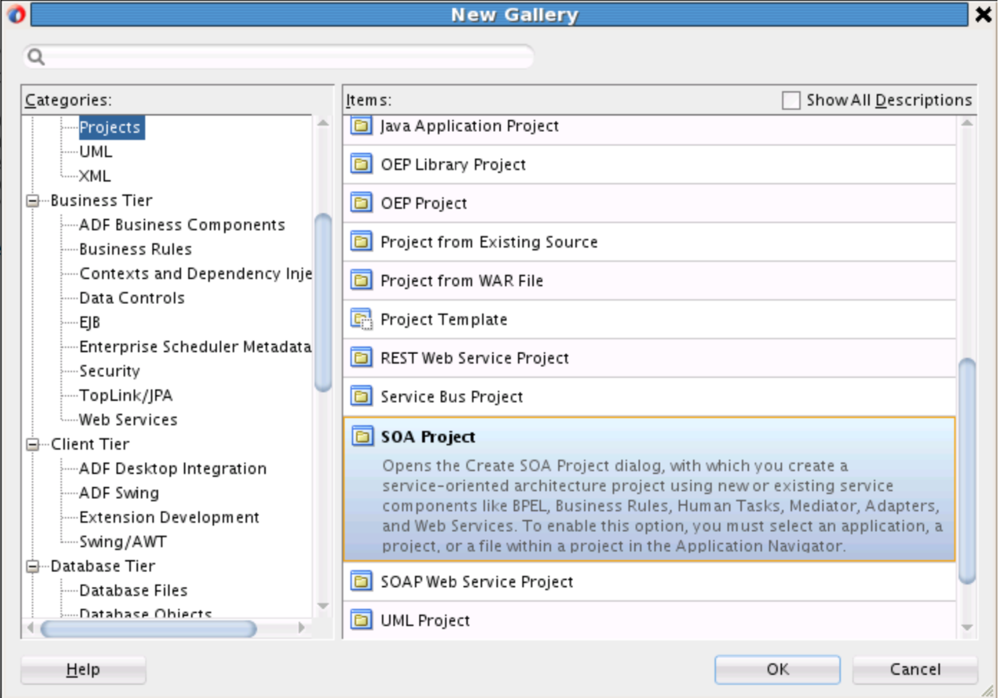
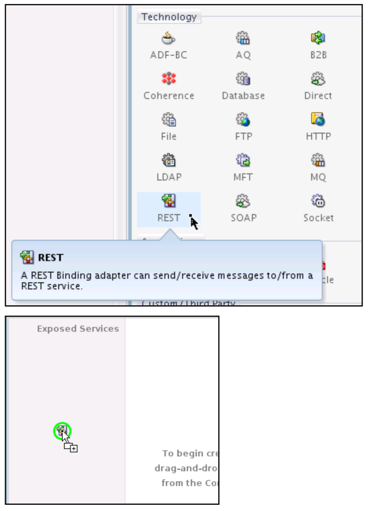
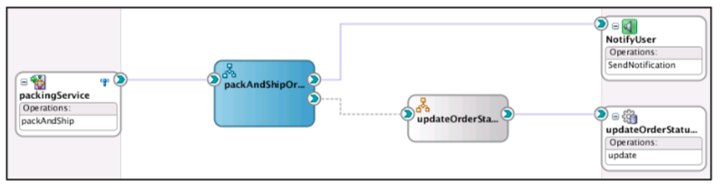

# Module 6: Pack and ship composite

## Introduction
In this module, you will build the first part of the order fulfillment service. After the order has been successfully processed, it needs to be packed and shipped. Avitek, as fictitious company, has a number of preferred shipping providers, each of them assigned to a specific shipping method. This method is calculated based on the shipping speed the customer chose when placing the order and the shipping state (in address).
Once the order has been shipped, an email is sent to the customer confirming the shipping provider and the order status is updated to Shipped.
This chapter will build the pack and ship service, including the email notification.

The pack and ship service is defined with a REST interface and accepts a Shipping resource (part of the canonical order message). It initiates the packing and shipping of one order and notifies the customer that the order has shipped. It also updates the order status in the database to Shipped.

## **STEP 1**: Create a new SOA project PackAndShipService 

Let's start a SOA project in JDeveloper with an empty composite in the application e2e-1201-composites. As SOA Suite 12c provides the following REST support:
- Enable REST support in new or existing services
- Integrate with external REST APIs
- Orchestrate a set of RESTful state transitions (RPC/HATEOAS approach)
- Support for XML, JSON (with automatic translation to and from XML), and URL-encoded GET/POST data

+ 
+ 
+ 

For detail instructions, from step 1 to 7, please start from <ins> **chapter 5, page 191 to 253** in the tutorial document</ins>. 

## **STEP 2**: Define a REST interface for the Packing Service Project

The packing service expects a shipping resource that includes all necessary information to pack and ship an order. It will also return a shipping resource with an updated order status. The operation that is going to be defined for this service will be a POST operation.
+ 
+ 
## **STEP 3**: Create a BPEL process for the packing

create a BPEL process exposing the REST interface, previously created.

 + Name: packAndShipOrder
+ Template: Define Service Later (The interface will be defined when we wire this process to the REST binding, later in the procedure.)

## **STEP 4**: Test the REST service within JDeveloper 12c

SOA REST services expose WADL files instead of WSDL files to define their interface. In order to be able to test the REST service, you will need to get the WADL location from EM FMWC.
+ Deploy the PackAndShip Service
+ Open EM FMWC: Error! Hyperlink reference not valid., substitute your own host name and port number.
+ Click on the deployed composite PackAndShipService

## **STEP 5**: Update the order status in the database, embedded Java DB

In addition to updating the order status in the shipping message, the order status must be updated in the database.
Previously, in chapter 3, this is an action that needs to be performed repeatedly. A component template has been prepared. It includes a standalone BPEL subprocess that calls a database adapter to update the order status.

## **STEP 6**: Add a composite sensor

By adding a sensor for the shipping provider to this composite.
You’ll be able to search for all orders that have been shipped with a specific shipping provider.
+ Open the composite view
+ Right-click on the REST service and choose Configure Sensors

+ 

## **STEP 7**: Setup an email notification

### **Details:**

- Ensure JDeveloper 12c is up and running
- The integrated server in JDeveloper 12c up and running with module 3 lab is completed.
- Should module 3 is not yet completed, please find its solution from page 191 in the SOAsuite 12c tutorial.
  
To commence this module 5, please start from <ins> **chapter 5, page 191 to 253** in the tutorial document</ins>.

The Pack and ship composite in JDeveloper would look as the following:

## **Summary**

This completes Module 5. You've successfully:

1. Created a new project PackAndShipService
2. Created a SOA REST inbound interface using Shipping as a resource
3. Built a SOA-BPEL (as process flow) to
   * set the status of the order shipped
   * update the status of the order
   * send an email to the customer that the order has been shipped
4. Add a composite sensor fo the ShippingProvider
5. Tested the service in JDeveloper
6. Inspect the process flow instance being tracked in the enterprise manager

 The next module will build the fulfillment order service, which identifies the shipping provider and calls the pack and ship service. You may proceed to the next module.

<!--[Click here to navigate to Module 6](6-order-fullfilment.md) -->

### **Learn More - Useful Links** ###

- SOA suite on  <a href="https://cloudmarketplace.oracle.com/marketplace/en_US/listing/70268091"> Marketplace  </a>
- <a href="https://cloudcustomerconnect.oracle.com/"> Community </a>
- <a href="https://www.oracle.com/middleware/technologies/soasuite.html"> Integration</a>

## Acknowledgements
* **Author** - Integration Product Development and NAT Solution Engineering
* **Adapted for Cloud by** -  <Name, Group> -- optional
* **Last Updated By/Date** - <Name, Group, Month Year>
* **Workshop (or Lab) Expiry Date** - <Month Year> -- optional

## See an issue?
Please submit feedback using this [form](https://apexapps.oracle.com/pls/apex/f?p=133:1:::::P1_FEEDBACK:1). Please include the *workshop name*, *lab* and *step* in your request.  If you don't see the workshop name listed, please enter it manually. If you would like for us to follow up with you, enter your email in the *Feedback Comments* section.