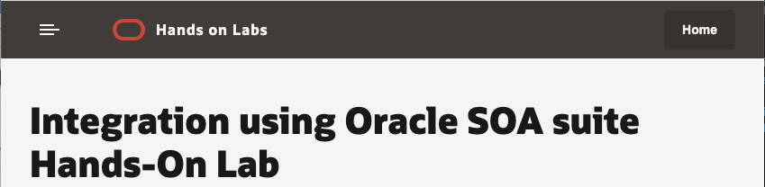
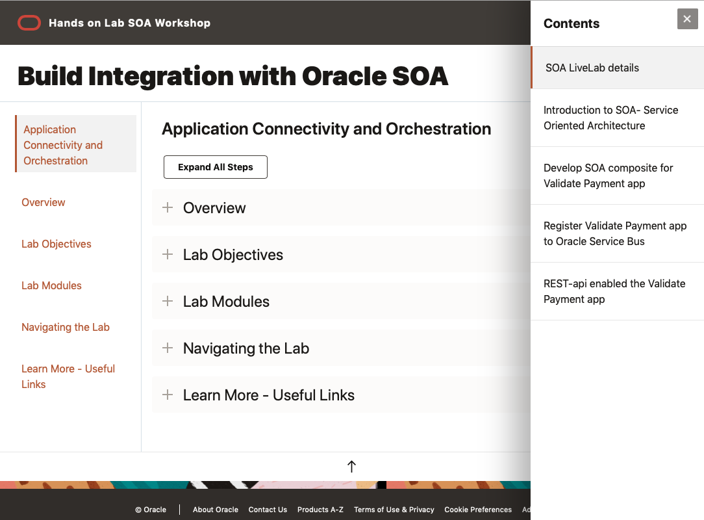

# Introduction

## Integration and Orchestration

### Overview

This Oracle SOA workshop demonstrate a business use case by walking through development of validate payment processing for an online ordering system. The ordering system also need to integrate with a mobile application soon. So, the composite SOA app must be able to support access through RESTful APIs.

In a separate, advanced workshop, an order processing system would provide direct integration with the packaging department to ship orders with preferred shipping providers based on the type of shipping service (2 day, 5-7 day shipping, and so on).

The bulk fulfillment process must run according to a predefined pick-up schedule. Upon fulfillment processing and orders being sent to the packaging department, a message must be communicated to the customer (either bulk or on-demand).

### Objectives

* Introducing SOA development tool, JDeveloper 12c
* Build SOA composite application using JDeveloper
* Design service orchestration using the composite app
* Deploy the composite application on the embedded Weblogic in JDeveloper

Estimated Workshop Time: 4 Hours

*{Note: For this lab, it assumes you have accessed to JDeveloper12c environment, which run on Linux instance on OCI.}*

## Modules

| # | Module | Estimate Time |
| --- | --- | --- |
| 1 | Introduction to SOA | 10 min |
| 2 | Build composite integration app for validating payment | 90 min |
| 3 | Register the composite app to Service Bus | 60 min |
| 4 | Enabled REST api access for Validate Payment app | 30 min |

<!-- ## Navigating the Lab
To return to this page from anywhere within the lab click on the "hamburger-menu" icon on the right-hand side.

Click the navigation menu icon, in the upper-left corner of the header, to see a list of modules in this lab. Click any of the list entries to navigate directly to that module.  -->

When you're ready to proceed, please click the Contents menu on the right-hand.

<!-- During the live lab, the tutorial pdf document can be found on the desktop of your OCI Linux instance.

 -->

## Learn More

- <a href= https://cloudmarketplace.oracle.com/marketplace/en_US/listing/74792101> SOA on Oracle Marketplace </a>
-   <a href= https://www.oracle.com/middleware/technologies/soasuite.html> SOA suite </a>
-   <a href= https://www.oracle.com/middleware/technologies/soasuite-learmore.html> Tutorials </a> 
-  <a href= https://docs.oracle.com/middleware/12211/soasuite/develop/SOASE.pdf> SOA Developer </a> 
- <a href= https://apex.oracle.com/community> Community </a>
-  <a href=https://www.oracle.com/technetwork/middleware/weblogic/learnmore/reducing-middleware-costs-2327571.pdf> Oracle Middleware </a>

## Acknowledgements
* **Author** - Daniel Tarudji, Solution Engineering - N.A Technology
* **Contributors** -  
* **Last Updated By/Date** - 
* **Workshop (or Lab) Expiry Date** - March 2021

## See an issue?
Please submit feedback using this [form](https://apexapps.oracle.com/pls/apex/f?p=133:1:::::P1_FEEDBACK:1). Please include the *workshop name*, *lab* and *step* in your request.  If you don't see the workshop name listed, please enter it manually. If you would like for us to follow up with you, enter your email in the *Feedback Comments* section.