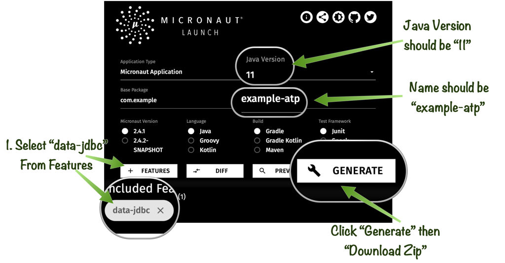

# Create the Micronaut Application

## Introduction

In this lab you are going to get create a Micronaut application locally and configure the application to communicate with an Oracle Autonomous Database instance.

If at any point you run into trouble completing the steps, the full source code for the application can be cloned from Github using the following command to checkout the code:

    <copy>
    git clone -b lab2 https://github.com/graemerocher/micronaut-hol-example.git
    </copy>

If you were unable to setup the Autonomous Database and necessary cloud resources you can also checkout a version of the code that uses an in-memory database:

    <copy>
    git clone -b lab2-h2 https://github.com/graemerocher/micronaut-hol-example.git
    </copy>


Estimated Lab Time: 15 minutes

### Objectives

In this lab you will:

* Create a new Micronaut application
* Configure the Micronaut application to connect to Autonomous database

### Prerequisites
- An Oracle Cloud account, Free Trial, LiveLabs or a Paid account

## **STEP 1**: Create a new Micronaut application

1. There are several ways you can get started creating a new Micronaut application. If you have the Micronaut CLI installed (see the [Installation instructions](https://micronaut-projects.github.io/micronaut-starter/latest/guide/#installation) for how to install) you can use the `mn` command to create a new application. Which will setup an application that uses the Oracle driver and Micronaut Data JDBC.


    ```
    <copy>
      mn create-app example-atp --jdk 11 --features oracle,data-jdbc
    cd example-atp
    </copy>
    ```


> **NOTE:** By default Micronaut will use the [Gradle](https://gradle.org/) build tool, however you can add `--build maven` if you prefer Maven.

2. If you do not have the Micronaut CLI installed and are running on Linux or OS X you can alternatively `curl` and `unzip`:

    ```
    <copy>
    curl https://launch.micronaut.io/example-atp.zip\?javaVersion\=JDK_11\&features\=oracle,data-jdbc -o example-atp.zip
    unzip example-atp.zip -d example-atp
    cd example-atp
    </copy>
    ```

3. If none of these options are viable you can also navigate to [Micronaut Launch](https://micronaut.io/launch/) in a browser and perform the following steps:

* Click the `Features` button and select the `oracle` and `data-jdbc` features
* Choose JDK 11 as the Java version.
* Then click `Generate` -> `Download Zip` which will produce a zip you can download and unzip locally with the created application.



## **STEP 2**: Configure the Micronaut Application

To configure the Micronaut application to work with Autonomous Database open the `src/main/resources/application.yml` file and modify the default datasource connection settings as follows replacing the `password` entry with the password you chose for the schema user in the previous lab:

    <copy>
    micronaut:
      application:
        name: example-atp
      executors:
        io:
          type: fixed
          nThreads: 75
    datasources:
      default:
        url: jdbc:oracle:thin:@mnociatp_high?tns_admin=/tmp/wallet
        driverClassName: oracle.jdbc.OracleDriver
        username: mnocidemo
        password: XXXXXXXX
        dialect: ORACLE
        data-source-properties:
          oracle:
            jdbc:
              fanEnabled: false     
    </copy>   

> **NOTE**: The password you enter should be the Schema user password not the Admin password for the Autonomous Database instance. 

## **STEP 3**: Configure Oracle Autonomous Database JDBC Drivers

If you are using Gradle add the following dependencies to the `build.gradle` file in the root of your project inside the `dependencies` block:

    <copy>
    runtimeOnly("com.oracle.database.security:oraclepki:21.1.0.0")
    runtimeOnly("com.oracle.database.security:osdt_cert:21.1.0.0")
    runtimeOnly("com.oracle.database.security:osdt_core:21.1.0.0")
    </copy>

Alternatively if you are using Maven, add the following dependencies to your `pom.xml` inside the `<dependencies>` element:

    <copy>
    <dependency>
        <groupId>com.oracle.database.security</groupId>
        <artifactId>oraclepki</artifactId>
        <version>21.1.0.0</version>
        <scope>runtime</scope>
    </dependency>
    <dependency>
        <groupId>com.oracle.database.security</groupId>
        <artifactId>osdt_cert</artifactId>
        <version>21.1.0.0</version>
        <scope>runtime</scope>
    </dependency>
    <dependency>
        <groupId>com.oracle.database.security</groupId>
        <artifactId>osdt_core</artifactId>
        <version>21.1.0.0</version>
        <scope>runtime</scope>
    </dependency>
    </copy>

## **STEP 4**: Configure Flyway to Create the Schema


Once you have configured the `DataSource`, add a dependency on `micronaut-flyway` to your `build.gradle` configuration inside the `dependencies` block:

    <copy>
    runtimeOnly("io.micronaut.flyway:micronaut-flyway")
    </copy>

or if using Maven, add to your `pom.xml` under `<dependencies>`:

    <copy>
    <dependency>
        <groupId>io.micronaut.flyway</groupId>
        <artifactId>micronaut-flyway</artifactId>
        <scope>runtime</scope>
    </dependency>
    </copy>

This enables support for the Open Source [Flyway database migration toolkit](https://flywaydb.org) which lets you define SQL scripts that manage and version your database schema so you can gradually evolve the schema along with new versions of your application.

To enable Flyway to run on startup, add the following configuration to your `application.yml`:

    <copy>
    flyway:
      datasources:
        default:
          enabled: true
    </copy>

Replace the contents of the file `src/main/resources/application-test.yml` with the following entry for flyway which will contain your test configuration and set Flyway to clean the schema when the application starts, to ensure tests run with fresh data:

    <copy>
    flyway:
      datasources:
        default:
          clean-schema: true
    </copy>

> **NOTE:** that in a real world scenario you would setup a separate database to run your tests against

## **STEP 5**: Defining a SQL Migration Script

The next step is to define a SQL migration script that will create the application's initial schema. To do that create a new SQL script in a file called `src/main/resources/db/migration/V1__create-schema.sql` and add the following SQL:

    <copy>
    CREATE TABLE "PET" ("ID" VARCHAR(36),"OWNER_ID" NUMBER(19) NOT NULL,"NAME" VARCHAR(255) NOT NULL,"TYPE" VARCHAR(255) NOT NULL);
    CREATE TABLE "OWNER" ("ID" NUMBER(19) PRIMARY KEY NOT NULL,"AGE" NUMBER(10) NOT NULL,"NAME" VARCHAR(255) NOT NULL);
    CREATE SEQUENCE "OWNER_SEQ" MINVALUE 1 START WITH 1 NOCACHE NOCYCLE;
    </copy>

The SQL above will create `owner` and `pet` tables to store data for owners and their pets in Autonomous Database.


You may now *proceed to the next lab*.

## Acknowledgements
- **Owners** - Graeme Rocher, Architect, Oracle Labs - Databases and Optimization
- **Contributors** - Chris Bensen, Todd Sharp, Eric Sedlar
- **Last Updated By** - Kay Malcolm, DB Product Management, August 2020
