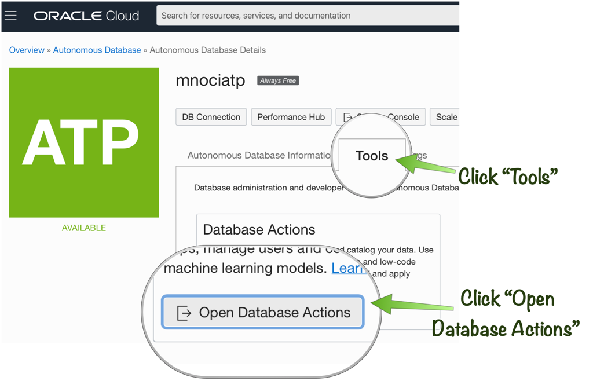

# Provision Oracle Autonomous Database

## Introduction
In this lab you are going to provision the Oracle Cloud instances needed to run a Micronaut application with Autonomous Database.

Estimated Lab Time: 20 minutes

### Objectives

In this lab you will:

* Provision an instance of Autonomous Database for use in the lab

### Prerequisites
- An Oracle Cloud account, Free Trial, LiveLabs or a Paid account

## **STEP 1**: Create the Autonomous Database Instance

1. Go to the Oracle Cloud Menu and select "Autonomous Transaction Processing" and then "Create Autonomous Database".


2. Enter "mnociatp" as the database name and select "Transaction Processing".


3. Choose "Shared Infrastructure" and ensure to select "Always Free".


4. Enter and take note of the Administrator password (must be at least 12 characters and container a number plus an upper case letter) and ensure "Allow secure access from everywhere" is selected.


5. Select "License Included" and then the "Create Autonomous Database" button to create your Autonomous Database Instance.


## **STEP 2**: Creating an Autonomous Database Schema User

1. On the "Autonomous Database Details" page select the "Tools" tab and then click "Open Database Actions".



2. Enter "ADMIN" for the username and the password you defined in the previous section.


3. Under "Development" select the "SQL" button to open up the SQL console.


4. Within the worksheet paste the following SQL which will create a schema user with a username of "mnocidemo" replacing the text XXXXXXXXX with a password of your choice:

    ```
    <copy>
    CREATE USER mnocidemo IDENTIFIED BY "XXXXXXXXX";
GRANT CONNECT, RESOURCE TO mnocidemo;
GRANT UNLIMITED TABLESPACE TO mnocidemo;
    </copy>
    ```

Once you have pasted the SQL into the worksheet click the "Run script" button to create the schema user.


## **STEP 3**: Download and Configure Wallet Locally

The Oracle Autonomous Database uses an extra level of security in the form of a wallet containing access keys for your new Database.

To connect locally you need to download and configure the ATP Wallet locally.

1. In the OCI Console, click on the burger menu and select 'Autonomous Transaction Processing' under 'Oracle Database'.

    

3. Find the newly created instance and click on it.

    

4. In the instance details, click on 'DB Connection'.

    

5. In the 'Database Connection' dialog, select 'Instance Wallet' and click 'Download Wallet'.

    

6. Enter (and confirm) the Admin password you used to create the Autonomous Database instance in the previous lab.

    

7. After the wallet zip has been downloaded, unzip it and move it to `/tmp/wallet`. You can do this with a single command in a terminal window on a Unix system, however the file can be extracted to a location of your choosing:

    ```
    <copy>
    unzip /path/to/Wallet_mnociatp.zip -d /tmp/wallet
    </copy>
    ```

8. Once downloaded your wallet directory should contain the following files:

   


You may now *proceed to the next lab*.

## Learn More

* [Oracle Cloud Resource Manager](https://docs.cloud.oracle.com/en-us/iaas/Content/ResourceManager/Concepts/resourcemanager.htm)
* [Oracle Cloud Autonomous Database](https://docs.cloud.oracle.com/en-us/iaas/Content/Database/Concepts/adboverview.htm)

## Acknowledgements
- **Owners** - Graeme Rocher, Architect, Oracle Labs - Databases and Optimization
- **Contributors** - Chris Bensen, Todd Sharp, Eric Sedlar
- **Last Updated By** - Kay Malcolm, DB Product Management, August 2020
