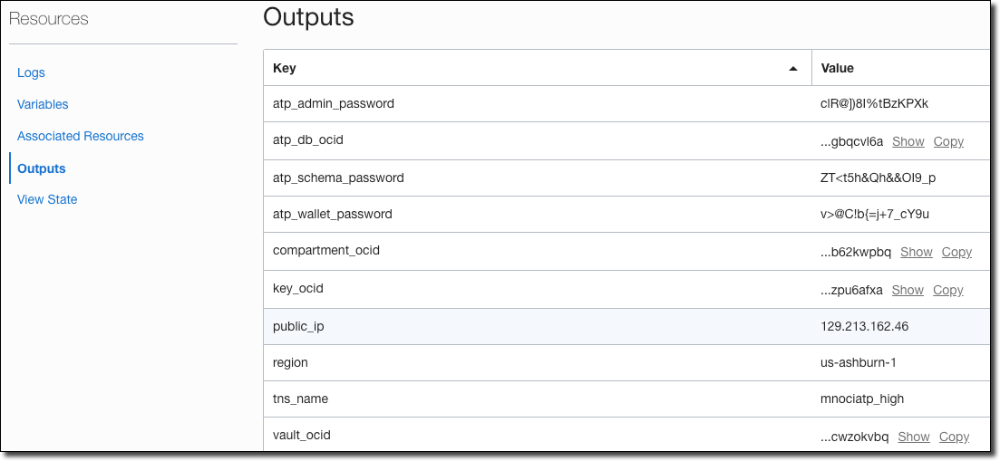

# Setup


## Setup OCI for Micronaut Development`

1. Create Infrastructure by downloading the Terraform configuration for this lab (stack.zip) from:

**NOTE:** Some platforms automatically unzip a .zip when downloaded. In that case you will have to zip it back up.

   https://github.com/recursivecodes/micronaut-data-jdbc-graal-atp/releases/latest/download/stack.zip

1. Go to the Resource Manager.

   

1. Click 'Create Stack':

   

1. Choose 'My Configuration', and upload the configuration zip:

   

1. Enter name, description and choose the compartment, then click 'Next':

   

1. Accept the default data in this section:

   

1. And this section:

   

1. Upload your public SSH key that was [created earlier](#create-an-ssh-keypair):

   ```
   cat ~/.ssh/id_oci.pub
   ```
   For example:
   ```
   ssh-rsa AAAAB3NzaC1yc2EAAAADAQABAAABAQC3+2IDGuVy+6VrE2zX9O0tPCU/xiEXpffxLt4E+Zrf8FyIaeRK1KH7O5JTNFNnIZPYizVMYGz3AyWE2ak0LwEy72BFwHaWIOOuYkwolSX9xpK1EtdKQleUSX/s87qvdchQYtcAKZGrVIKSefDuZN40oPR/DmuDZYUjuSQ8pek9NXF9ozdUS4W4sScXtkxQk0dpL8hmdn+iTqNK2bOkrBnTFxHCtqDjRHyqb8SCH91ODTgcyEj5aXjvkUMwUuUZe92ki/Jdu8ONxHSfTJKlQGzKstOeQ4nzVxnCKKdRZqY5yXlZ9qNymvNgGx3Xfy/h7N0p8IwjHtQ0rl66MAgSV44h id_oci
   ```

   

1. Accept this data. Click 'Next', review and create your stack.

   

1. On the stack details page, click 'Terraform Actions' and select 'Plan'.

   

1. Review the plan output, ensure no failures.

   

1. Click 'Terraform Actions' and select 'Apply'.

**Note:** This will take some time. While this happens setup the code for your local machine.

   

1. Choose the plan you just created, then click 'Apply'.

   

1. Review the output:

   

1. Collect the following values from the output:

   * compartment_ocid
   * tns_name
   * atp_admin_password
   * atp_schema_password
   * atp_wallet_password
   * atp_db_ocid
   * region

   **Note:** Java will be installed upon the first boot of the image. It will take 3-5 minutes to install, so it will not be *immediately* available in the VM.

## Create DB Schema

1. From Cloud Shell, download the script and run it:

   **Note:** If you did not [setup your OCI config](#setup-oci-cli-profile-on-local-machine) earlier, this step will not work.

   ```shell script
   wget -O setup.sh https://github.com/recursivecodes/micronaut-data-jdbc-graal-atp/releases/latest/download/setup.sh && bash setup.sh
   ```

   

1. Enter the values that you copied from the Terraform output when prompted. The script will produce several snippets of output to be used to build, run and deploy.

## Download Wallet

The Oracle Autonomous Database uses an extra level of security in the form of a wallet containing access keys for your new Database. This step

1. The Cloud Shell script will produce a snippet to be used to download your ATP wallet to your local machine. It will look similar to this (run locally):

   ```shell script
   oci db autonomous-database generate-wallet --autonomous-database-id ocid1.autonomousdatabase.oc1.iad... --file /tmp/wallet.zip --password [DB PASSWORD] && unzip /tmp/wallet.zip -d /tmp/wallet
   ```

   Run this script immediately to set up your wallet.
