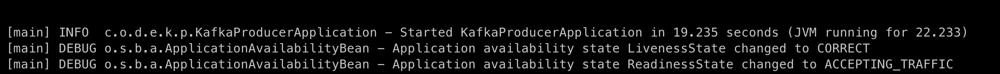
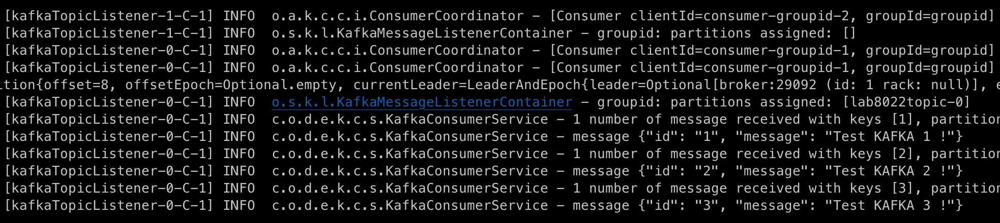

# Deploy and Test Kafka Broker and Kafka Producer and Consumer Microservices

## Introduction

This lab will show you how to deploy a kafka cluster, a producer microservices and a consumer microservices on your docker engine, walk through the functionality and explain how it works. Both microservices were developed using Spring Boot and Spring Kafka frameworks.

Estimated Time: 10 minutes

### Objectives

- Deploy and access the Kafka Cluster
- Deploy and access the Kafka Producer Microservices
- Deploy and access the Kafka Consumer Microservices
- Learn how they work

### Prerequisites

- *[Optional]* An Oracle Cloud paid account or free trial. To sign up for a trial account with $300 in credits for 30 days, click [Sign Up](http://oracle.com/cloud/free).
- A Docker Engine accessible.

## Task 1: Run Kafka Broker and Create a Topic

1. Execute the following sequence of commands to start the Kafka cluster and connect Broker to Lab8022 Network:

    ```bash
    <copy>
    cd $LAB_HOME/cloud-setup/confluent-kafka
    ./docker-compose up -d
    docker network connect lab8022network broker
    </copy>
    ```

2. Once successfully executed, check that the services are running:

    ```bash
    <copy>
    cd $LAB_HOME/cloud-setup/confluent-kafka
    ./docker-compose ps
    </copy>
    ```

    First you will see the four containers running but container from Connect Service will be *starting*
   

    After a few seconds, container from Connect Service will be *healthy*
    

3. Create a Topic:

    You are ready to create the topic *LAB8022_TOPIC*. Run the following command to create a new topic into the Kafka Broker:

    ```bash
    <copy>
    docker exec broker \
                kafka-topics --bootstrap-server broker:9092 \
                --create \
                --topic LAB8022_TOPIC
    </copy>
    ```

    After a WARNING message that you can disconsider, you will see the message **"Created topic LAB8022_TOPIC."**

## Task 2: Verify configurations and build applications

The Kafka Producer and Consumer were written using Spring Boot and Spring Kafka frameworks, the producer expose a REST services that will produce a message and publish it in the Kafka Broker created. And, on the other side, the consumer will subscribe to same topic, and consume messages. A very simple and common case but instructive and also important when comparable with the next Lab.

1. Confirm that Kafka Producer and Consumer Configurations are pointing to correct Broker Address and Topic.

    As you could verify in the above image, Kafka Broker is running at address Broker:9092. We have to confirm that this address is right inside the application.yml from the Producer App. A tip, internally to Docker, Kafka broker is advertised for other nodes on port 29092.

    ```bash
        <copy>cat $LAB_HOME/springboot-kafka/kafka-producer/src/main/resources/application.yaml</copy>
    ```

    Repeat for Kafka Consumer

    ```bash
        <copy>cat $LAB_HOME/springboot-kafka/kafka-consumer/src/main/resources/application.yaml</copy>
    ```

    The right configuration will be for both:

    - bootstrap-servers: broker:29092
    - topic-name: LAB8022_TOPIC

    

    ATTENTION: If you change these configurations, you will have to modify these parameters.

2. Build the Applications

    We are using Maven to build the applications producer and consumer, also the configuration module. Run this command to build them:

    ```bash
        <copy>
        cd $LAB_HOME/springboot-kafka
        mvn clean install -DskipTests
        </copy>
    ```

    As result, we will see that all modules were builded with success.

    

## Task 3: Deploy and Test Spring Boot Kafka Producer

1. Deploy Kafka Producer Microservice

    Now that we have the applications sucessuful builded , we can deploy them and test. Let's start with Producer. Run these commands to build the image and deploy the Producer inside the Docker Engine (the same running the Kafka Cluster):

    ```bash
        <copy>
        cd $LAB_HOME/springboot-kafka/kafka-producer
        ./build.sh
        </copy>
    ```

    Now, let's run the Producer :

    ```bash
        <copy>
        docker run --detach --name=kafka-producer --network lab8022network -p 8080:8080 kafka-producer:0.0.1-SNAPSHOT
        </copy>
    ```

    We can check the logs and see the Producer running and waiting for requests:

    ```bash
        <copy>
        docker logs kafka-producer
        </copy>
    ```

    

2. Test Kafka Producer Microservice

    We will use cURL command to test our Producer.

    ```bash
        <copy>
            curl -X POST -H "Content-Type: application/json" \
            -d '{ "id": "id1", "message": "message1" } ' \
            http://localhost:8080/placeMessage
        </copy>
    ```

    The result should be

    ```bash
        {"id":"0","statusMessage":"Successful"}%
    ```

    We also can validate if the message was published inside topic LAB8022_TOPIC.

    ```bash
        <copy>
            docker exec --interactive --tty broker \
            kafka-console-consumer --bootstrap-server broker:9092 \
                                --topic LAB8022_TOPIC \
                                --from-beginning
        </copy>
    ```

    The result will be similar to :

    

    You will need press Crtl+C to stop this process.

## Task 4: Deploy and Test Spring Boot Kafka Consumer

Now that we have Producer running and publishing events inside the Kafka Broker, let's do the same with Consumer.

1. Deploy Kafka Consumer Microservice

    We will follow the same steps to deploy and test kafka consumer microservice. Run these commands to build the image and deploy the Consumer inside the Docker Engine (the same running the Kafka Cluster):

    ```bash
        <copy>
        cd $LAB_HOME/springboot-kafka/kafka-consumer
        ./build.sh
        </copy>
    ```

    Now, let's run the Consumer :

    ```bash
        <copy>
        docker run --detach --name=kafka-consumer --network lab8022network kafka-consumer:0.0.1-SNAPSHOT
        </copy>
    ```

    We can check the logs and see the Consumer running:

    ```bash
        <copy>
        docker logs kafka-consumer
        </copy>
    ```

    

    And finally, We can now produce and consume messages from Kafka Broker, the result inside logs of Consumer will be:

    

You may now **proceed to the next lab...**

## Acknowledgements

- **Authors** - Paulo Simoes, Developer Evangelist; Paul Parkinson, Developer Evangelist; Richard Exley, Consulting Member of Technical Staff, Oracle MAA and Exadata
- **Contributors** - Mayank Tayal, Developer Evangelist; Sanjay Goil, VP Microservices and Oracle Database
- **Last Updated By/Date** - Paulo Simoes, February 2022
