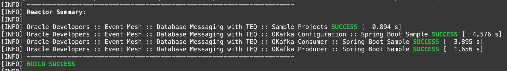

# Deploy and Test Oracle TEQ Broker and okafka Producer and Consumer Microservices

## Introduction

This lab will use Oracle Transactional Event Queues (TEQ) and okafka library, and demonstrate the Kafka compatibility of TEQ. Also, this module has the same Spring Boot producer and consumer microservices but using okafka in place of Kafka libraries, and TEQ in the database in place of Kafka as the event broker.

Estimated Time: 15 minutes

### Objectives

- Learn about Oracle Transactional Event Queues and okafka
- Deploy and access the OKafka Producer Microservices
- Deploy and access the OKafka Consumer Microservices
- Learn how they work

### Prerequisites

- *[Optional]* An Oracle Cloud paid account or free trial. To sign up for a trial account with $300 in credits for 30 days, click [Sign Up](http://oracle.com/cloud/free).
- The Autonomous Transaction Processing database.
- A Docker Engine accessible.

## Overview of the Oracle Transactional Event Queues (TEQ) Provisioning

The Oracle Transactional Event Queues (TEQ) and its subscriber agent were provisioned while running the configuration (setup phase). Below is a description of the steps taken to make these assets available.

1. Create Oracle Transactional Event Queues (TEQ):

    A user was created and some privileges were granted required to the creation and management of Oracle TEQ.

    ```sql
        <copy>
        create user <username> identified by <password>
        grant connect, resource to user
        grant execute on dbms_aqadm to user
        grant execute on dbms_aqin to user
        grant execute on dbms_aqjms to user
        grant aq_administrator_role to user
        grant aq_user_role to user
        grant select_catalog_role to user
        </copy>
    ```

    Once the user is available, the Transactional Event Queue was created using PL/SQL script. Only upper case Topic/queue names are allowed for this preview release.

    ```sql
    <copy>
        BEGIN
        sys.dbms_aqadm.create_sharded_queue(queue_name=>'LAB8022_TOPIC', multiple_consumers => TRUE);
        sys.dbms_aqadm.start_queue('LAB8022_TOPIC');
        END;
        /    
    </copy>
    ```

2. Once successfully executed, the subscriber agent was added:

    To enable production for a Transactional Event Queue, it is required register a subscriber agent. The bellow script create this agent.

    ```sql
    <copy>
        --- Create the subscriber agent
        DECLARE
        subscriber sys.aq$_agent;
        BEGIN
        subscriber := sys.aq$_agent('LAB8022_SUBSCRIBER', NULL, NULL);
        DBMS_AQADM.ADD_SUBSCRIBER(queue_name => 'LAB8022_TOPIC',   subscriber => subscriber);
        END;
        /
    </copy>
    ```

## Task 1: Verify configurations and build applications

The Oracle Transactional Event Queues is a powerful messaging backbone offered by Converged Oracle Database, that allow you to build a enterprise class data-centric microservices architecture. The okafka library, contains Oracle specific implementation of Kafka Client Java APIs and its implementation is built on AQ-JMS APIs, thus it is a requirement have the connection details.

1. Configure Oracle TEQ Producer and Consumer

    Configure a JMS connection is something very easy, we just need to get the information about the Database instance and the way we should follow to connect from the security perspective. As we are using in this lab the Oracle Autonomous Database (ATP), we have to use wallet. Again, to facilitate this laboratory, the setup already bring to us the wallet.

    To obtain the connection information at the Oracle Cloud Infrastructure Console. Locate your hamburger menu, on the left top corner, click in Oracle Database and select Autonomous Transaction Processing option.

    In ATP section, select the compartment created by the lab (ex: lab8022) to load the Database created by our setup script. You will find you ATP as bellow:

    

    Clicking on database name (ex: ab8022_ATP) will open our database details where you will have the DB Connection button. This button open the DB Connection window with detailed information about the ways to connect with Oracle Database.

    

    For example, we can use *tp* option clicking to copy the connection string and have access to details that we need to OKafka configration. Bellow one sample:

    ```text
    (description= (retry_count=20)(retry_delay=3)(address=(protocol=tcps)(port=1522)(host=adb.us-ashburn-1.oraclecloud.com))(connect_data=(service_name=xxxxxxxxxxxxxxx_lab8022_tp.adb.oraclecloud.com))(security=(ssl_server_cert_dn="CN=adwc.uscom-east-1.oraclecloud.com, OU=Oracle BMCS US, O=Oracle Corporation, L=Redwood City, ST=California, C=US")))
    ```

2. Fill the Connection properties.

    As the Database is generated during setup based on your environment, you will need to adjust the parameters from each microservices informing the right data to the connection (Oracle Database TNS Name, Service Name and Host Name and Port). These properties are stored in the *application.yaml* file from each microservices.

    For the Producer:

    ```bash
    <copy>
        vi $LAB_HOME/springboot-oracle-teq/okafka-producer/src/main/resources/application.yaml
    </copy>
    ```

    ```text
        okafka-server-config:
            oracle-instance-name: <ADB TNS Name, e.g. lab8022_tp>
            oracle-service-name: <ADB Service Name, e.g. xxxxxxxxxxxxxxx_lab8022_tp.adb.oraclecloud.com>
            oracle-net-tns_admin: /home/appuser/wallet
            tns-alias: <ADB TNS Name, e.g. lab8022_tp>
            security-protocol: SSL
            bootstrap-servers: <Host Name:Port>

        okafka-topic-config:
            topic-name: LAB8022_TOPIC
            num-of-partitions: 3
            replication-factor: 1
    ```

    For Consumer:

    ```bash
    <copy>
        vi $LAB_HOME/springboot-oracle-teq/okafka-consumer/src/main/resources/application.yaml
    </copy>
    ```

    ```text
        okafka-server-config:
            oracle-instance-name: <ADB TNS Name, e.g. lab8022_tp>
            oracle-service-name: <ADB Service Name, e.g. xxxxxxxxxxxxxxx_lab8022_tp.adb.oraclecloud.com>
            oracle-net-tns_admin: /home/appuser/wallet
            tns-alias: <ADB TNS Name, e.g. lab8022_tp>
            security-protocol: SSL
            bootstrap-servers: <Host Name:Port>

        okafka-topic-config:
            topic-name: LAB8022_TOPIC
            num-of-partitions: 3
            replication-factor: 1

        okafka-consumer-config:
            key-deserializer: org.oracle.okafka.common.serialization.StringDeserializer
            value-deserializer: org.oracle.okafka.common.serialization.StringDeserializer
            group-id: LAB8022_TOPIC_SUBSCRIBER
            enable-auto-commit: true
            auto-commit-interval-ms: 10000
            max-poll-records: 100    
    ````

3. Build the Applications

    Likewise the previous Lab, here we use Maven to build the applications producer and consumer, also the configuration module. Run this command to build them:

    ```bash
        <copy>
        cd $LAB_HOME/springboot-oracle-teq
        mvn clean install -DskipTests
        </copy>
    ```

    As result, we will see that all modules were builded with success.

    

## Task 3: Deploy and Test Spring Boot TEQ Producer

1. Deploy Oracle TEQ Producer Microservice

    Now that we have the applications sucessuful builded , we can deploy them and test. Let's start with Producer. Run these commands to build the image and deploy the Producer inside the Docker Engine:

    ```bash
        <copy>
        cd $LAB_HOME/springboot-oracle-teq/okafka-producer
        ./build.sh
        </copy>
    ```

    Now, let's run the Producer :

    ```bash
        <copy>
        docker run --detach --name=okafka-producer -p 8090:8080 okafka-producer:0.0.1-SNAPSHOT
        </copy>
    ```

    We can check the logs and see the Producer running and waiting for requests:

    ```bash
        <copy>
        docker logs okafka-producer
        </copy>
    ```

    

2. Test the Producer Microservice

    We will use cURL command to test our Producer.

    ```bash
        <copy>
            curl -X POST -H "Content-Type: application/json" -d '{ "id": "id1", "message": "okafka message 1" } ' http://localhost:8090/placeMessage
        </copy>
    ```

    The result should be

    ```bash
        {"id":"0","statusMessage":"Successful"}
    ```

## Task 4: Deploy and Test Spring Boot TEQ Consumer

Now that we have Producer running and publishing events inside the TEQ Broker, let's do the same with Consumer.

1. Deploy Oracle TEQ Consumer Microservice

    We will follow the same steps to deploy and test OKafka consumer microservice. Run these commands to build the image and deploy the Consumer inside the Docker Engine :

    ```bash
        <copy>
        cd $LAB_HOME/springboot-oracle-teq/okafka-consumer
        ./build.sh
        </copy>
    ```

    Now, let's run the Consumer :

    ```bash
        <copy>
        docker run --detach --name=okafka-consumer okafka-consumer:0.0.1-SNAPSHOT
        </copy>
    ```

    We can check the logs and see the Consumer running:

    ```bash
        <copy>
        docker logs -f okafka-consumer
        </copy>
    ```

    

    And finally, We can now produce and consume messages from Kafka Broker, the result inside logs of Consumer will be:

    

## Task 5: Stop Oracle TEQ Consumer

Let's stop the consumer microservice.

```bash
    <copy>
        docker stop okafka-consumer
    </copy>
```d

## Task 6: Deep diving in the Code

Now, we invite you to compare the codes for Kafka and OKafka Microservices and see that minor modification make possible use almost the Kafka Microservice code to build the TEQ / OKafka microservices. For example:

Look at *KafkaProducerService  class*.

```java

    import org.springframework.kafka.core.KafkaTemplate;

    public void send(ProducerRecord<String, String> producer) {
        LOG.info("Sending message='{}' to topic='{}'", producer.value(), producer.topic());
        ListenableFuture<SendResult<String, String>> kafkaResultFuture =
                kafkaTemplate.send(producer);
    }
```

Comparing with the same metho in *OKafkaProducerService* we can verify that we have exactly the same construction with the difference that in first one we can use KafkaTemplate that is a class from Spring Kafka framework that encapsules KafkaProducer, and in second as we don't have similar library from Spring project we call directly the OKafka Producer.

```java
    import org.oracle.okafka.clients.producer.KafkaProducer;
    ...
     public void send(ProducerRecord<String, String> prodRec) {
        LOG.info("Sending message='{}' to topic='{}'", prodRec.value(), prodRec.topic());
        kafkaProducer.send(prodRec);
    }
```

You may now **proceed to the next lab...**

## Want to Learn More?

- [Oracle Transactional Event Queues](https://docs.oracle.com/en/database/oracle/oracle-database/21/adque/index.html)
- [Kafka Java Client for Oracle Transactional Event Queues](https://github.com/oracle/okafka)).
- [https://developer.oracle.com/](https://developer.oracle.com/)

## Acknowledgements

- **Authors** - Paulo Simoes, Developer Evangelist; Paul Parkinson, Developer Evangelist; Richard Exley, Consulting Member of Technical Staff, Oracle MAA and Exadata
- **Contributors** - Mayank Tayal, Developer Evangelist; Sanjay Goil, VP Microservices and Oracle Database
- **Last Updated By/Date** - Paulo Simoes, February 2022
