# Build Virtual Machines in Developer Cloud Service

## Introduction

In this lab you will create template configuration files and using these files to build virtual machines in Oracle Developer Cloud Service.

Estimated time: 15 - 20 min

### Objectives

* Learn how to create template configuration files
* Learn how to build virtual machines in Oracle Developer Cloud Service.

### Prerequisites

This lab assumes you have completed the following labs:
* Lab: Sign up for a Free Trial
* Lab: Provision a DevCS Instance

## **Step 1**: Configure Virtual Machines Templates in DevCS

1. Now we need to configure one or two VM servers to be able to build your project developments. We will create a VM Build Server to be used to compile and Build Microservices components and another to compile and Build Fn Function (Serverless) components that will require a different set of Software components:

  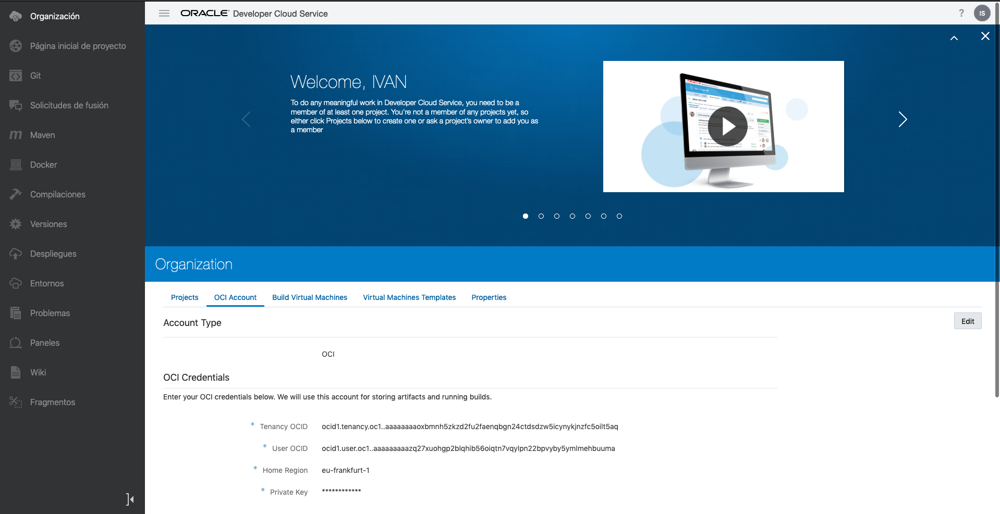

2. To do this, we have to create a first virtual Machine Template to be used with Microservices, so click the **Virtual Machines Templates** tab:

  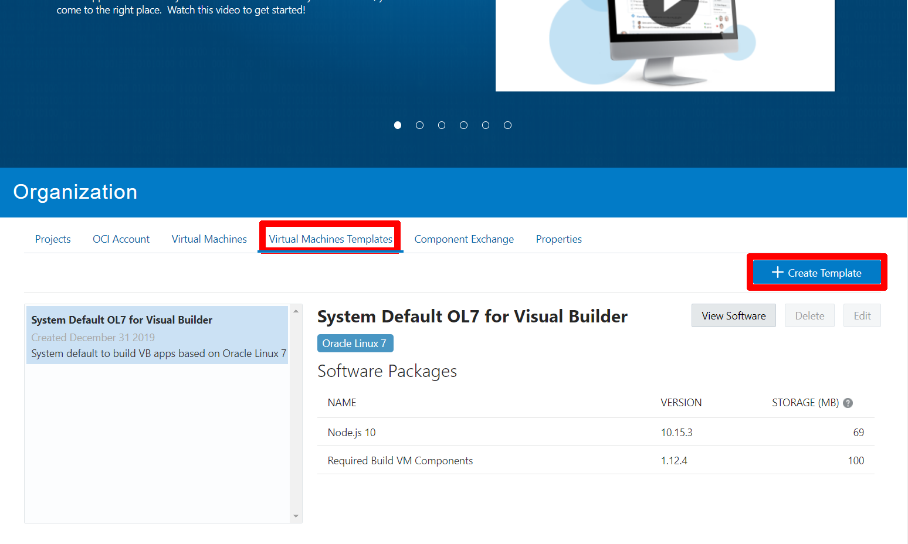

3. Click **Create**.

  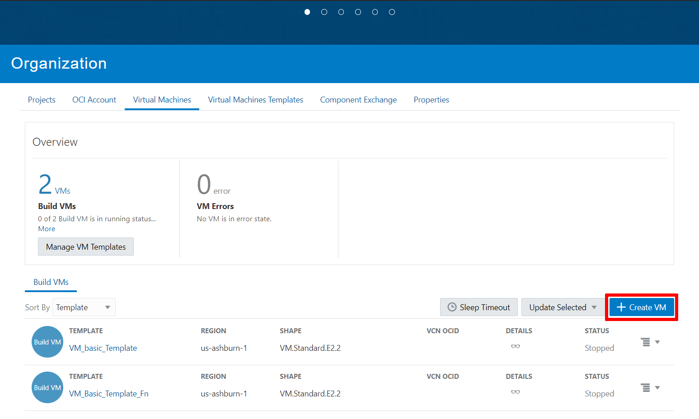

4. Provide a Name (like VM\_basic\_Template) and select Oracle Linux 7 as Platform.

  

5. Click **Configure Software**.

  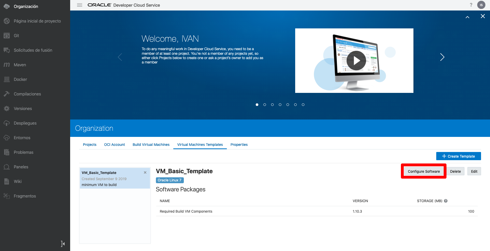

6. Now select the software packages we will require to build our project. If you remember from the introduction section, we will build microservices developed with Node JS v8 and Java . We will also require access to OCI so OCIcli will be required and thus Python will also be needed. Then we will have to build Docker images and deploy those images in a Kubernetes Cluster thus Kubectl will be needed too. Finally we also need the Minimum required Build VM components. So select the software components below:

    - Docker 17.12
    - Kubectl
    - Node.js 8
    - OCIcli
    - Python3 3.6
    - Required Build VM Components

  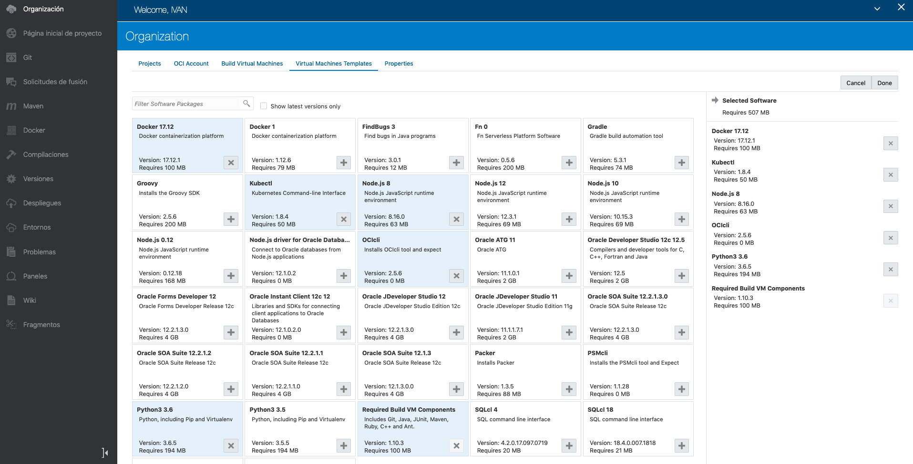

7. Click **Done** and we will have finally our VM template created like below:

  

8. Now we will create a second Virtual Machine Template for Serverless Components. Click **Create Template** again and fill in fields and click **Create**:

  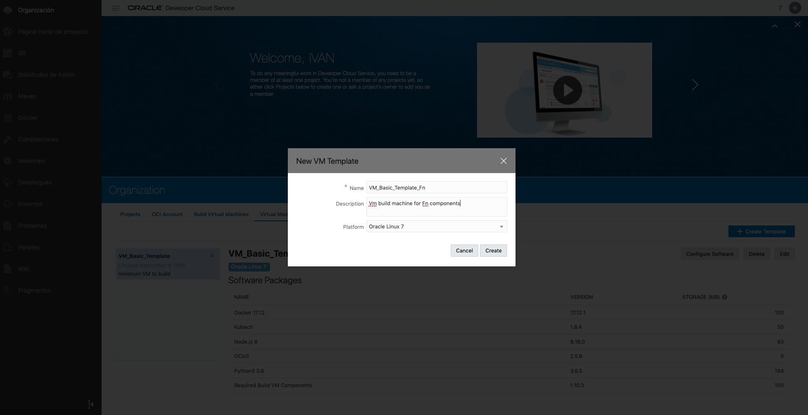

9. Now we will select specific Software components required for Fn Function build process. Click **Configure Software**:

  

10. Now configure software components. Fn 0 will have to be selected together with Docker, OCIcli, Kubectl, Python and required build VM components. Node JS and Java components are not required:

  

11. Click **Done** and these are the software components in VM template:

  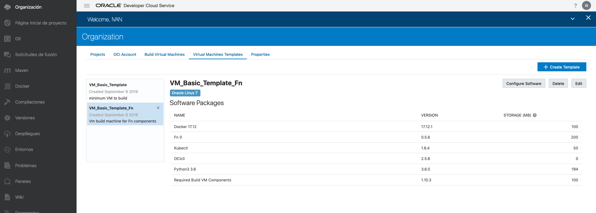

## **Step 2**: Build Virtual Machines configuration in DevCS

1. NNow we have to create a couple of real VM in OCI based on the Virtual Machine template we just created. So, we will select the **Virtual Machines** Tab and will click **Create**:

  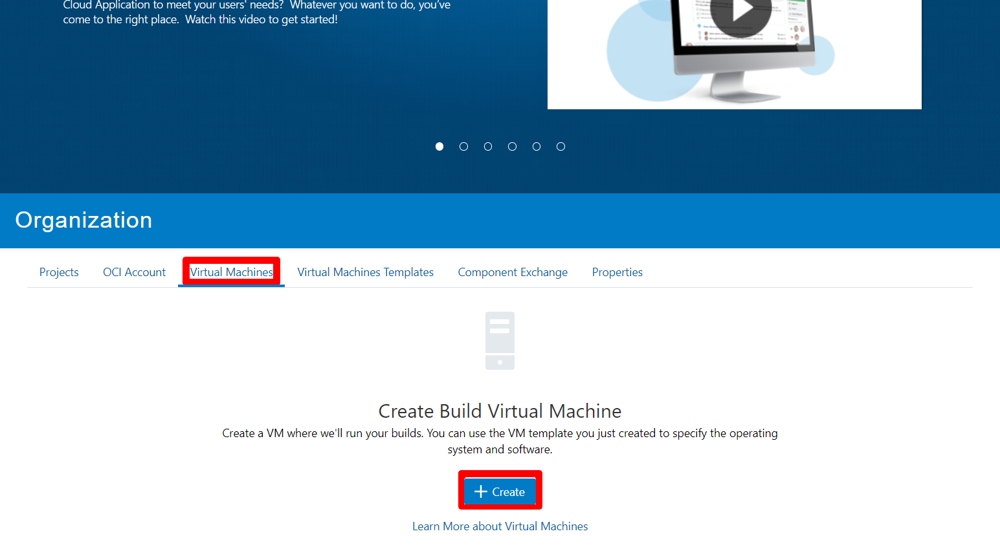

2. Now Select **1** as quantity, select the previously created template, your region and finally select the VM.Standard.E2.2 Shape:

  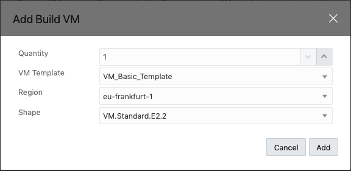

3. Now your VM will start the creation process.

  

4. It is important to modify the sleep timeout to a value such as 300 minutes (basically longer than lab duration) so that once started, the build server won’t automatically enter into sleep mode.

  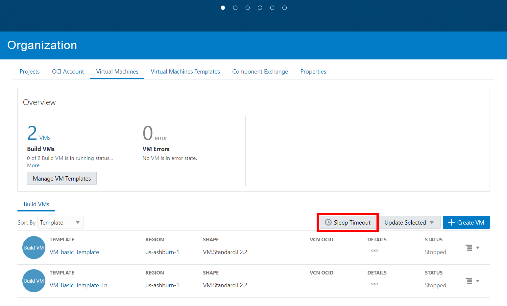

5. And now we will create a second virtual machine, following the same process but using the Fn Function defined template:

  

  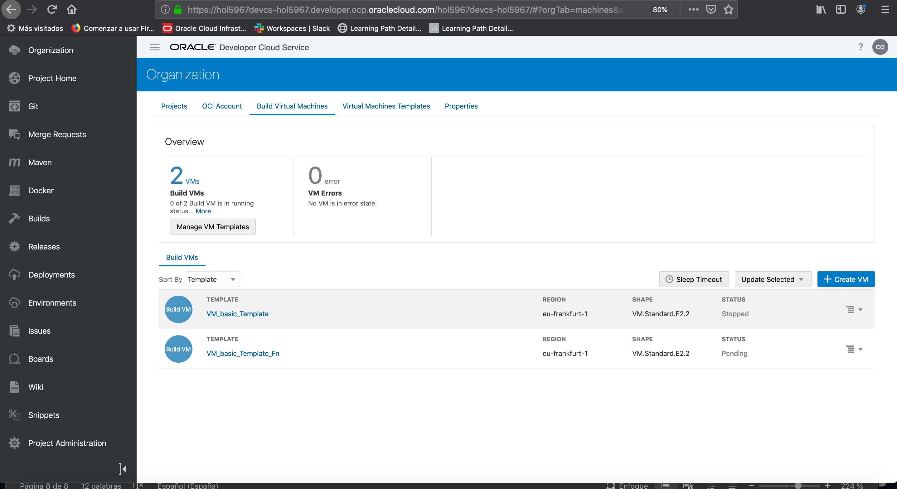

  *IMPORTANT NOTE: At this point try to manually start both VM Servers like in the screenshot below:*

  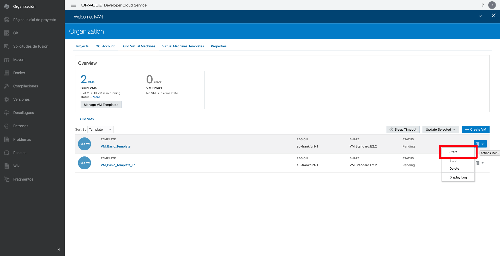

6. And check that the status changes to starting in both servers. You may need to refresh the page:

  

You can proceed to the next lab.

## Want to Learn More?

* [Oracle Developer Cloud Service Documentation](https://docs.oracle.com/en/cloud/paas/developer-cloud/index.html)

## Acknowledgements
* **Authors** -  Iván Postigo, Jesus Guerra, Carlos Olivares - Oracle Spain SE Team
* **Contributors** - Jaden McElvey, Technical Lead - Oracle LiveLabs Intern
* **Last Updated By/Date** - Tom McGinn, April 2020

## See an issue?
Please submit feedback using this [form](https://apexapps.oracle.com/pls/apex/f?p=133:1:::::P1_FEEDBACK:1). Please include the *workshop name*, *lab* and *step* in your request.  If you don't see the workshop name listed, please enter it manually. If you would like for us to follow up with you, enter your email in the *Feedback Comments* section. Please include the workshop name and lab in your request.
