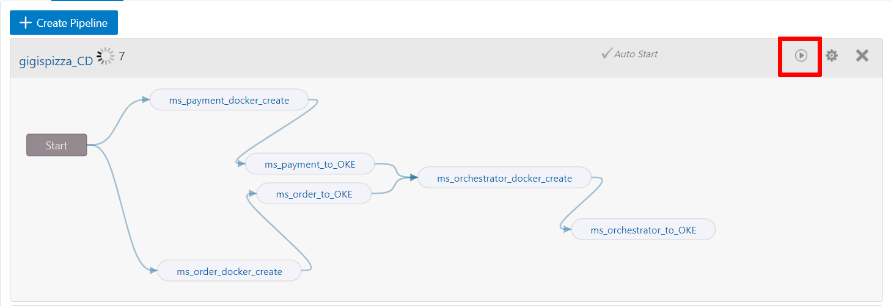

# Configure the Project to Match the Kubernetes Cluster

## Introduction

What we have to do now is to adapt parameters and code in project we have just imported to fit with our OKE deployment in your OCI tenancy.

Before we have to create DNS Zones in OCI. A zone is a portion of the DNS namespace. A Start of Authority record (SOA) defines a zone. A zone contains all labels underneath itself in the tree, unless otherwise specified.

Estimated time: 60 - 120 min

### Objectives

* Learn how to adapt parameters and code in project to fit with OKE deployment in OCI tenancy.

### Prerequisites

This lab assumes you have completed the following labs:
* Lab: Sign up for a Free Trial
* Lab: Provision a DevCS Instance
* Lab: Build Virtual Machines in Developer Cloud Service
* Lab: Create a Kubernetes Cluster
* Lab: Install the Front-end Client
* Lab: Import a Developer Cloud Service Project

## Task 1: Create DNS Zone

1. So let’s create a couple of DNS Zones. These will be used later to modify the DNSZONE parameter in project. In the OCI Dashboard Menu go to **Networking \> DNS Zone Management**.

  

2. If not selected yet, select the compartment we created earlier in the workshop. Then, click **Create Zone**.

  

3. And create a Manual Zone of type Primary named `hol5967` (for example ) and your username.com. If your username contains an @ do not type the @.The zone name should be `hol5967-USERNAME.com`.

4. Then click **Create**:

  

  

5. Repeat steps 1-4 to create a second DNS zone. Use the same parameters but add `front-` to the beginning of the zone name. The zone name should be `front-USERNAME.com`.

6. Your DNS zone management page should look like this.

  

Now let’s go back to DevCS instance and let’s configure Build Jobs and Git.

## Task 2: Configuring Builds

In this project we have three types of builds, one for Fn Function (Serverless) deployment, other 4 for docker build jobs and finally 4 others for OKE build jobs that will deploy previously generated docker images in OKE cluster.

### Fn Function Jobs modification

1. In DevCs interface, Click **Build Menu**, then select the Job named `fn_discount_to_FaaS_CK`. Then click **Configure** (from the right side of screen):

  

2. The screen will appear and will take you to Software tab where you have to select a Software template. Make sure you select `Vm_basic_Template_FN` so that Fn function build process will work:

  

3. Now click , then in **Git** tab and make sure that `discount-func.git` is selected as Repository

  

4. Then select **Parameter** and add your tenancy parameters. In the section named COMPARTMENTID paste your Compartment OCID. In the section named APIURL enter `https://functions.<YOUR-REGION>.oraclecloud.com`. In the section named OCIRSTORAGE enter `<OBJECT-STORAGE-NAMESPACE>/wedodevops`. For the OCIR section you will need to get the location of your region's OCIR server. Go [here](https://docs.cloud.oracle.com/en-us/iaas/Content/Registry/Concepts/registryprerequisites.htm#Availab) and copy the URL from your region. Record your OCIR because you will need it on the next step.

  

  

5. Finally select the steps tab and enter your tenancy details.
  
  Your registry host is your OCIR. For your docker login your username is `<object storage namespace>/<OCI tenancy user>`. Your password is the auth token for your user(you should have recorded this in a text file in an earlier lab).

  In the OCIcli section paste your User OCID, Fingerprint, Tenancy OCID, and Private Key in the cooresponding section. You should have recorded all of these in a previous lab. Set your region to your home region.

  For the FN OCI section your oracle compartment should be your compartment OCID(recorded in an earlier lab). Your passphrase should be `''`(two single qotes). This syntax signifies that your password is empty.

  Lastly scroll down to the Unix Shell section. Replace `$COMPARTMENTID` with your compartment OCID. Replace `$APIURL` with the same API URL from the parameters page. Replace both `$OCIR` with your OCIR(you found this on the last step). Replace `$OCIRSTORAGE` with `<OBJECT-STORAGE-NAMESPACE>/wedodevops`.

  

  

  Please don’t forget to click the save button.

### Docker Jobs modification

1. Now let’s change the 4 Docker Jobs. Go back to Builds menu and select the Job named:

  `front_orders_docker_create`

2. Then click **Configure**:

  

3. The screen will appear and will take you to Software tab where you have to select a Software template. Make sure you select `Vm_basic_Template` so that microservices and docker build process will work:

  

4. Now click , then the **Git** tab and make sure that `gigis-order-front.git` is selected as the repository.

  

5. Then select the **Steps** tab.

  

7. Under the sections title **Docker login**, **Docker build**, and **Docker push** set your **Registry Host** to the OCIR you found before [here](https://docs.cloud.oracle.com/en-us/iaas/Content/Registry/Concepts/registryprerequisites.htm#Availab). Under **Unix Shell** replace `<your_OCIR_region>.ocir.io` with your OCIR.

8. For **Docker Login** you have to enter `<object storage namespace>/<OCI tenancy user>` as a username and your `User Auth Token` as your password.

  

  

9. And click **Save**

10. Change the three other docker Jobs in the same way:

  	````
    - ms_orchestrator_docker_create
    - ms_order_docker_create
    - ms_payment_docker_create
  	````

### OKE Jobs modification

1. Now let’s change the 4 Docker Jobs. Go back to Builds menu and select the Job named:

	````
	Front_order_to_OKE
	````

2. Then click **Configure**:

  

3. The screen will appear and will take you to Software tab where you have to select a Software template. Make sure you select `Vm_basic_Template` so that microservices and docker build process will work:

  

4. Now click , then the Git tab and make sure that `gigis_order_front.git` is selected as Repository:

  

5. Click the **Parameters** tab.

  

6. Leave demozone as it is (default). Under the section named **OKECLUSTERID** paste your `Cluster OCID` as the default value. Under the section named **DNSZONE** paste the name of your dns zone as the default value. Under the section named **COMPARTMENTID** paste your `Compartment OCID` as the default value.

  *Important Note: For DNSZONE in this service select the value with the DNS Zone previously created with front- as the prefix.*

  

7. Click the **Steps** tab.

  

8. Under the **OCIcli** copy and paste your User OCID, Fingerprint, Tenancy OCID, and Private Key. Select your region from the dropdown.

  

9. And Click **Save**

10. Important Note: modify the three other docker Jobs in the same way as
previous job:

  *Important Note: For these jobs, select the DNS Zone name created without -front as the prefix.*

	- ms\_orchestrator\_to\_OKE    
		- VM Template: VM\_Basic\_Template    
		- Git Repo: microservice\_orchestrator.git

	- ms\_order\_to\_OKE    
		- VM Template: VM\_Basic\_Template    
		- Git Repo: gigis-order-front.git

	- ms\_payment\_to\_OKE:    
		- VM Template: VM\_Basic\_Template    
		- Git Repo: microservice-payment.git

## Task 3: Configuring Git repositories

Now let’s change the yaml in different GIT repositories to fit with your Tenancy details (review all but `db_management.git`, `discount-func.git` and `PizzaDeliveryMobileapp.git`).

1. Let’s get started by selecting `microservice_orchestrator.git`:

  

2. Select only `microservice-orchestrator.yaml` (the two other .yaml don’t require to be modified):

  

3. Now click the edit button. Go to line 34 and replace the sections in `<>` with your information.

  

4. Commit your changes.

  

5. Modify the three other .yaml files in the same way in each git.

  

6. Now it is time to manually launch the build process, but before we have to do a couple of things:

    - Create the application for the Fn function in OCI
    - Create a policy so that the Fn function Managed Service(FaaS) can manage all the resources in the tenancy

7. Let’s start creating the application for the Fn function in OCI. Go back to OCI Dashboard console and go to: **Developer Services \> Functions**:

  

8. Select your compartment:

  

9. Click **Create Application**:

  

10. Important Note: So that we don’t have to modify source code, the application name must be: `gigis-fn`. Also remember to add all of the subnets in your compartment. Then click **Create**.
  ````
  <copy>gigis-fn</copy>
  ````

  

## Task 4: Create Policy

1. Now let’s create the policy above mentioned. In OCI Console Menu go to **Identity \> Policies**.

  

2. If not selected yet, select root Compartment in List Scope Area and click **Create Policy**.

  

3. Fill in Name: `Fn_Tenancy_Policy_Resources` add a Description, add the text below to the statement section.

	````
	<copy>
	allow service FaaS to manage all-resources in tenancy
	</copy>
	````

  

4. Click **Create**:

  

  A new policy is created.

## Task 5: Run the Build Process

1. Now let’s run the build process to check if all the changes have been done correctly. Go back to DevCS Dashboard and select the  **Builds** menu. There select **Pipelines** tab:

  

2. Then in `gigispizza_CD` pipeline click **Build** so that build process starts: 

  

  

3. Check that the parameters are correct and click **Build Now**. Shortly afterwards The build process will start and you will have to wait for executor to start (an executor is one of the VM build servers that you previously configured):

  

4. Once an executor is assigned, you will have to check progress:

  

5. If job ends successfully you will see an screen like this:

  

  Note: If not successful, Click **View Recent Build History** and check what Job failed.

6. Now let’s launch the second pipeline named `gigispizza_front` in the same way, check parameters in popup window and click **Build now**:

  

7. If everything goes fine you should see an screen like this:

  

8. Finally go back to jobs tab, select the one named `fn_discount_to_FaaS_CK` and manually launch the build process for the Fn Function service by clicking **Build Now**:

  

9. Check that deployment is successful:

  

You can proceed to the next lab.

## Acknowledgements
* **Authors** -  Iván Postigo, Jesus Guerra, Carlos Olivares - Oracle Spain SE Team
* **Contributors** - Jaden McElvey, Technical Lead - Oracle LiveLabs Intern
* **Last Updated By/Date** - Madhusudhan Rao, Apr 2022
