# Create a Digital Assistant User Interface

## Introduction

This part of the hands-on lab is an entry-level exercise for modifying a skill in Oracle Digital Assistant.

Estimated time: 20 - 25 min

### Background

Oracle Digital Assistant is an environment for building digital assistants, which are user interfaces driven by artificial intelligence
(AI) that help users accomplish a variety of tasks in natural language conversations. Digital assistants consist of one or more skills, which are individual chatbots that are focused on specific types of tasks.

In this lab, we are going to modify a skill that can be used for interactions with a pizzeria, including ordering. As part of this process, you will:

  - Modify a conversation flow.
  - Validate, debug, and test your skill.

### What Do You Need?

  - Access to Oracle Digital Assistant. [http://hol.wedoteam.io:9990/botsui](http://hol.wedoteam.io:9990/botsui)

  - A basic knowledge about Oracle Digital Assistant. If it’s the first time that you use it, please read carefully each step with this format

  *Oracle Digital Assistant is a platform that allows enterprises to create and deploy digital assistants for their users.*

### Objectives

* Learn how to modify a skill in Oracle Digital Assistant.

### Prerequisites

This lab assumes you have completed the following labs:
* Lab: Sign up for a Free Trial
* Lab: Provision a DevCS Instance
* Lab: Build Virtual Machines in Developer Cloud Service
* Lab: Create a Kubernetes Cluster
* Lab: Install the Front-end Client
* Lab: Import a Developer Cloud Service Project
* Lab: Configure the Project to Match the Kubernetes Cluster
* Lab: Test the Implementation

## **Step 1**: Clone a Skill

In this lab, we're starting from an existing one. So, the first thing you will do is clone an existing skill.

1. With the Oracle Digital Assistant UI open in your browser, click  to open the side menu.

2. Click **Development** and select Skills.

3. Click  again to collapse the side menu.

4. Search “HOL\_Microservices”

  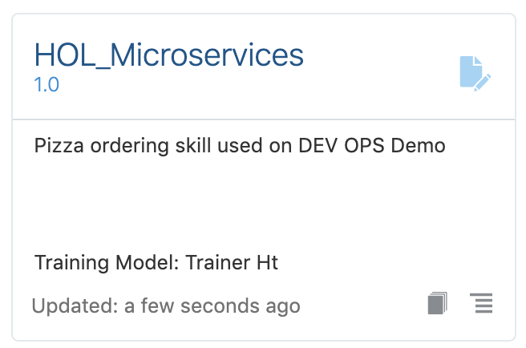

5. Click on the menu

  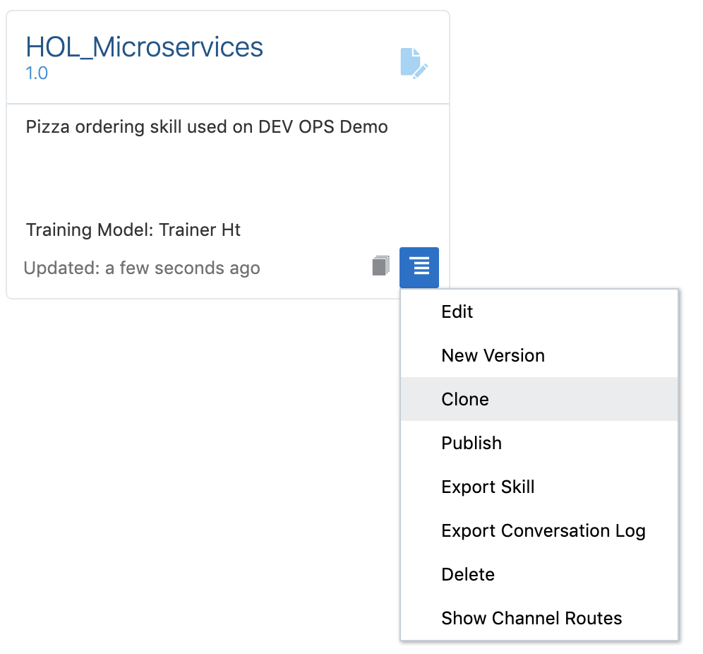

6. Click **Clone** to open Create clone form.

7. Introduce these values:
    - Display Name: HOL\_XX (where XX is your initials. Example: John Snow Green should use HOL\_JSG)
    - Name: HOL\_XX
    - Check “Open cloned skill bot afterwards”
    - Click “Clone” button

### Create Intents

*Oracle Digital Assistant's underlying natural language processing (NLP) engine doesn't inherently know about the business or task that skill is supposed to assist with. For the skill to understand what it should react to, you need to define intents and examples (utterances) for how a user would request a specific intent.*

As we don’t have enough time, we will skip this step.

## **Step 2**: Modify the Dialog Flow

*The dialog flow is a conversation blueprint that defines interactions users may have with the skill. Each interaction is defined as a state. Each state references a component, which renders a skill response, receives user input, sets and resets variables, resolves user intents, or authenticates users.*

On this case, we are going to modify the existing dialog flow to ask the user to carry out an upgrade of their order, and we will give him a towel.

1. After cloning the skill on step one, you can test that all it’s ok. So, click **Train** on the upper right corner.

  

2. We provide two models that learn from your corpus: Trainer Ht and Trainer Tm. Each uses a different algorithm to reconcile the user  input against your intents. Trainer Ht uses pattern matching while Trainer Tm a machine learning algorithm which uses word vectors.

  In this case, we are going to use Ht

  Now click **Submit**

  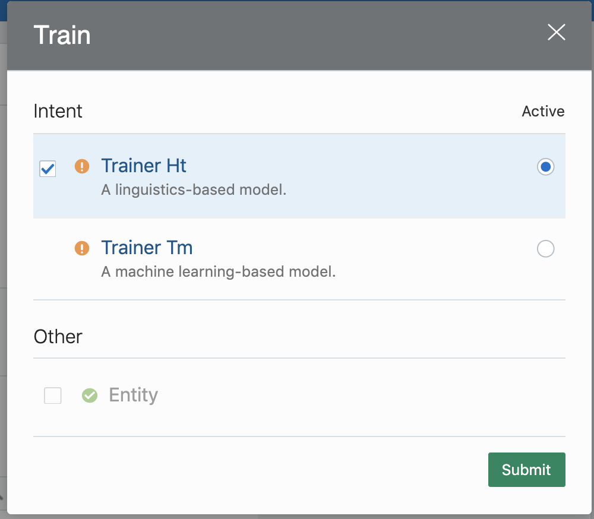

3. After a few seconds of training, you should receive a message that all it’s ok.

  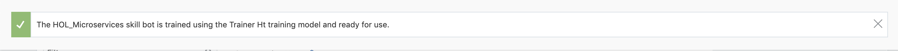

4. The dialog flow definition is the model for the conversation itself, one that lets you choreograph the interaction between a skill and its users. Oracle Digital Assistant provide a graphical editor (conversation designer) and code editor.

  Using the Skill Builder (code editor), you define the framework of the user-skill exchange in OBotML, Digital Assistant’s own implementation of YAML. This is a simple markup language, one that lets you describe a dialog both in terms of what your skill says and what it does.

  You define each bit of dialog and its related operations as a sequence of transitory states, which manage the logic within the dialog flow. To cue the action, each state node within your OBotML definition names a component that provides the functionality needed at that point in the dialog. States are essentially built around the components. They contain component-specific properties and define the transitions to other states that get triggered after the component executes.*

  Now, click **Flows** on the left side.

  

5. Now we are going to include a new state to ask the customer if they want an upgrade and a free towel. Go to line 12 and declare a new “upgrade” variable to collect the customer’s answer. Keep in mind that editor provide the autosaving feature, don’t look for a Save button ;-)

  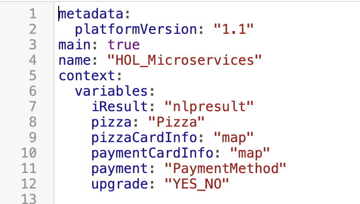

6. Include a new state to ask about the upgrade to the customer. Components give your skill its actual functionality. The state nodes in your dialog flow definition are built around them. These reusable units of work perform all manner of tasks and functions, from the basic management of the dialog flow to case-specific actions.

  Every state in your dialog flow names a component that performs an action, such as accepting user input, verifying that input, or responding with text. Each component has a specified set of properties that you can use to pass and receive values as well as control the component's behavior. For example, the following state uses the System.List component to display a list of values that the user can choose from.

  There are two types of components that you can use in a dialog flow – built-in components and custom components. When the Dialog Engine enters a state in the dialog flow, it assesses the component. When it encounters one of the built-in components (noted by System.), it executes one of the generic tasks, such as display a message or prompt the user to enter text. When the Dialog Engine discovers a custom component, however, it calls the component's service, which hosts one or more custom components.

7. Now, click **Components**.

  

8. On the components window, choose “User interface”

  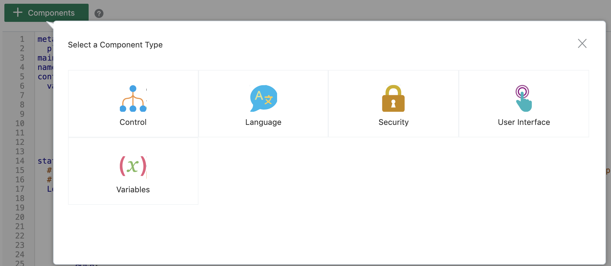

9. Now choose “Text”, after that on the value list select “confirmation” to insert the System.Text component after “confirmation” status and click **Apply**

  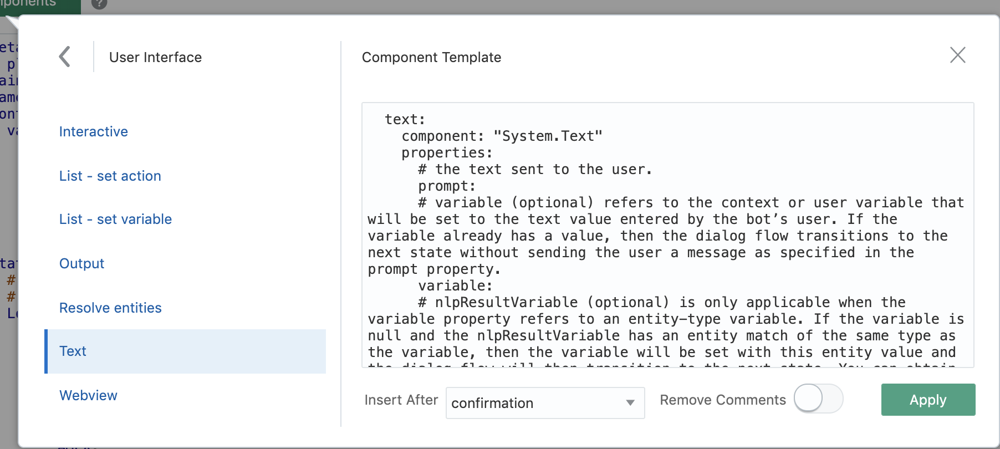

  The System.Text component enables your bot to set a context or user variable by asking the user to enter some text.

  When the Dialog Engine enters a System.Text state for the first time, it prompts the user to enter some text. When the user enters a value, the Dialog Engine returns to this state. The component processes the user response and if it can convert the user input to the variable type, it stores the value in the variable. The Dialog Engine moves on to another state when this variable has a value.

10. So, you can check that the new state has been included in the flow.

  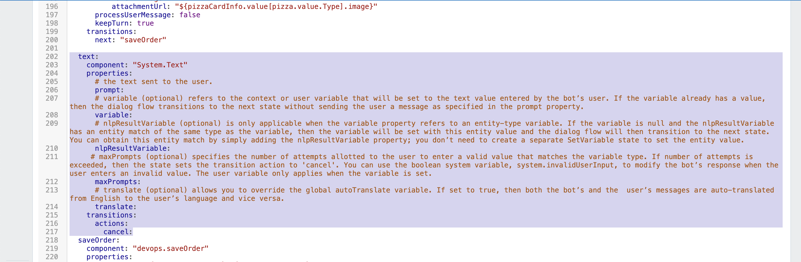

11. Rename “text” to “askUpgrade” as the state name. Fill in the blanks:

    - Prompt: "Do you want a 2-liter soda bottle for $1 and a free towel?"
    - variable: upgrade
    - Delete the following property "nlpResultVariable"
    - maxPrompts: 3 (to ask 3 times about the upgrade. If you answer something different to yes or no three times, the component will execute “cancel” action.)
    - translate: false
    - Update transition actions so that it looks like the following:

  

12. Move to the prior state named “confirmation” and change transition “next” value from “saveOrder” to “askUpgrade” to make the flow execute our new state. Result:

    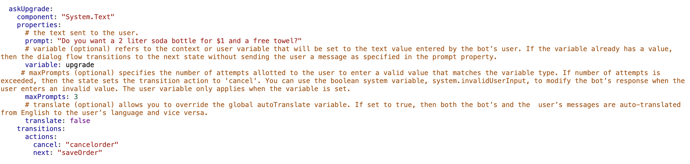

13. To check that your new code it’s okay, click **Validate**.

  

14. If all it’s okay, you will see this message:

  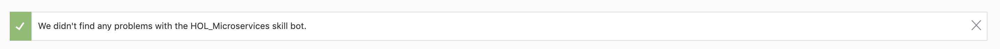

15. If you have received this alert, review all the steps again and keep in mind that all indentations are very important

  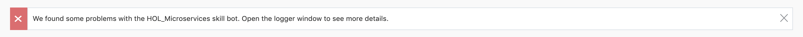

### Troubleshooting Errors in the Dialog Flow

If you don't see a success message, then most likely you misspelled a property name or did not follow the required two-space indenting
increments. In this case, scroll through the dialog flow until you see an  icon in the left margin. Mouse over the icon to display the tooltip with a description of the problem.

Besides, you can click the debug icon (), which appears to the left of the dialog flow editor. It often provides additional information about the reason. You close the debug window by clicking the debug icon again.

If you have gotten into a jam and can’t get anything to work, open the [flow.txt](https://docs.oracle.com/en/cloud/paas/digital-assistant/tutorial-skill/files/your-first-dialog-flow.txt), and replace the content in your dialog flow with the content from the file.

## **Step 3**: Orders against our microservices

Currently, our orders are being stored on a shared database. Now, we will modify the flow to point to our database.

*Most skills need to integrate with data from remote systems. For example, your skill might need to get a list of products or save order information. You use custom components to integrate a skill with a backend. Another use is to perform complex logic that you can't accomplish using FreeMarker. We are providing the custom components that carry out this actions.*

1. Look for state “saveOrder”

  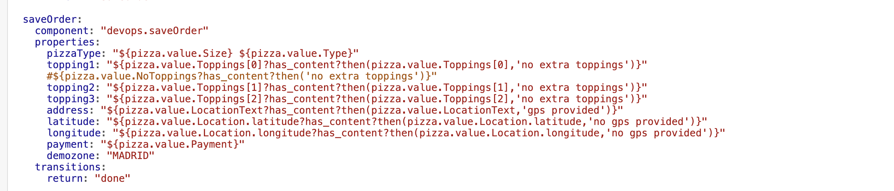

    - Change component name from devops.saveOrder to devops.saveOrderUpgrade
    - Change demozone value to yours. This value must be configured to the IP address of the microservice previously used and path to Creation order endpoint named: /createOrder. For example:

    - Include a new property named: upgrade with the variable you create to store the upgrade question "${upgrade.value.yesno}"
    - Also Include another property named email with the value of your email address so that this will be used as the email address that will appear in the order. For example: email: "carlos.j.olivares@oracle.com"

2. The final result looks like this:

  

## **Step 4**: Test Your Skill

Now that all of the skill's pieces are in place let's test its behavior.

1. Open the skill tester by clicking  on the bottom of the skill's left navigation bar.

2. Click Reset.

3. In the Message field, type I want to order a pizza and then press Enter.

  All kind of pizza will be shown (choose one)

  

  You should see a menu of pizza sizes:

  

4. In the pizza size menu, select an option, e.g. Small.

5. Select a topping e.g. 1 2 4 (Mushrooms, BBQ Sauce, Tuna)

  

6. Enter a delivery location

  You should receive an order confirmation similar to the one shown in the image below. Please click **Send Location**

  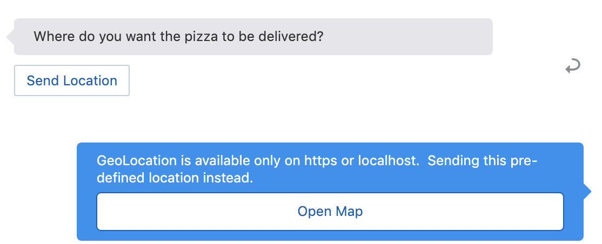

7. Immediately you will be asked about payment method

  

8. To end, our digital assistant will make a summary and ask about our upgrade.

  

9. Due to we have defined a YES\_NO variable, it only accepts "YES" or "NO" values. Other "YES" or "NO" synonyms are also recognized, such as "YEAH", "NOPE".

  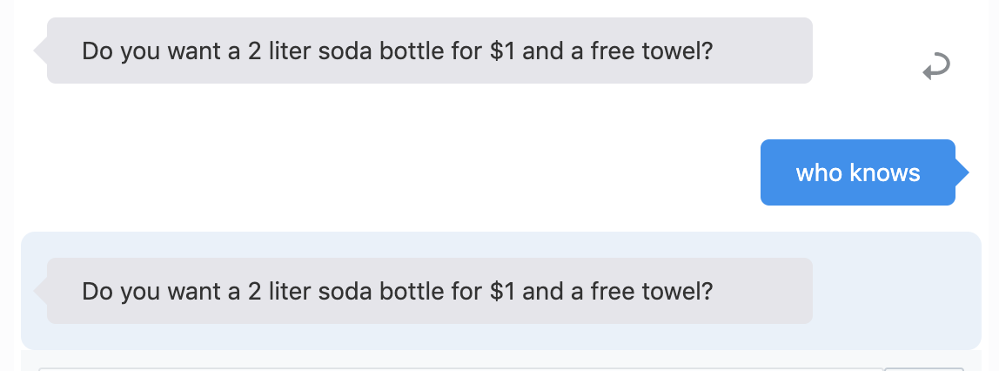

10. Now, we type Yes to finish the order.

  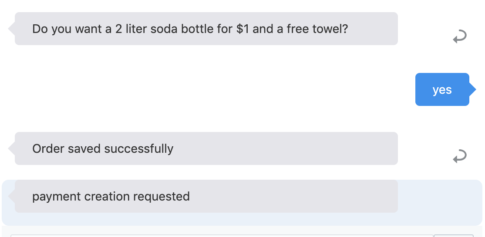

11. Click **Reset**. To clean conversation screen an reset all the variables.

12. Now try entering I want a large cheese basic pizza with mushrooms, tuna, and tomatoes paying with cash and pressing Enter.

  This time, you should be immediately presented with the results of the order after asking about the location.

  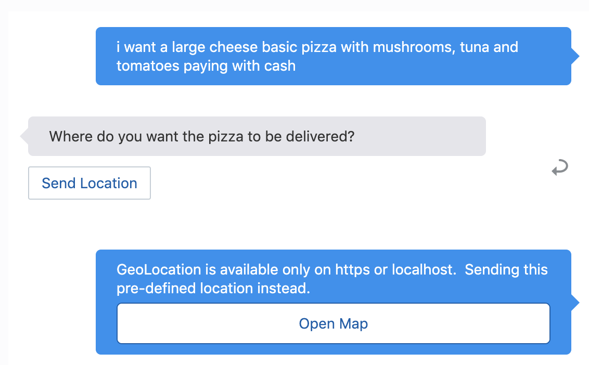

  

  

This concludes the workshop.

## Want to Learn More?
* [Using Oracle Digital Assistant](http://www.oracle.com/pls/topic/lookup?ctx=en/cloud/paas/digital-assistant&id=DACUA-GUID-386AB33B-C131-4A0A-9138-6732AE841BD8)

## Acknowledgements
* **Authors** -  Iván Postigo, Jesus Guerra, Carlos Olivares - Oracle Spain SE Team
* **Last Updated By/Date** - Tom McGinn, April 2020

## Need Help?
Please submit feedback or ask for help using our [LiveLabs Support Forum](https://community.oracle.com/tech/developers/categories/livelabsdiscussions). Please click the **Log In** button and login using your Oracle Account. Click the **Ask A Question** button to the left to start a *New Discussion* or *Ask a Question*.  Please include your workshop name and lab name.  You can also include screenshots and attach files.  Engage directly with the author of the workshop.

If you do not have an Oracle Account, click [here](https://profile.oracle.com/myprofile/account/create-account.jspx) to create one. Please include the workshop name and lab in your request.
