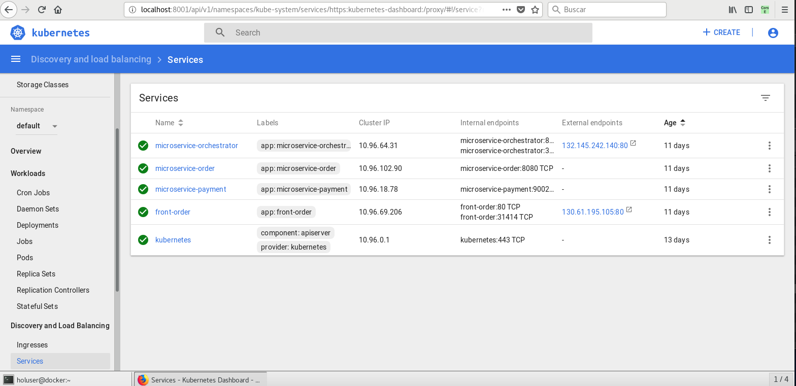
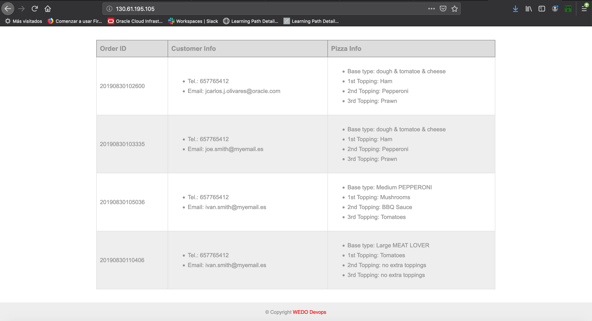
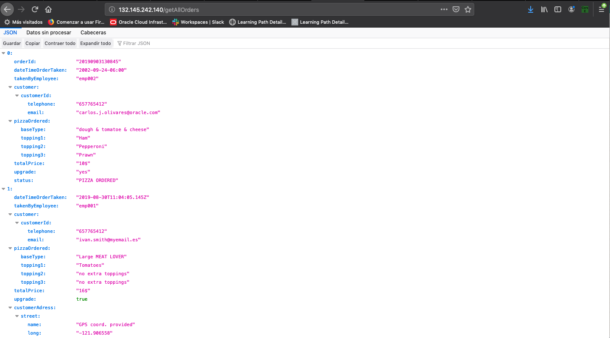
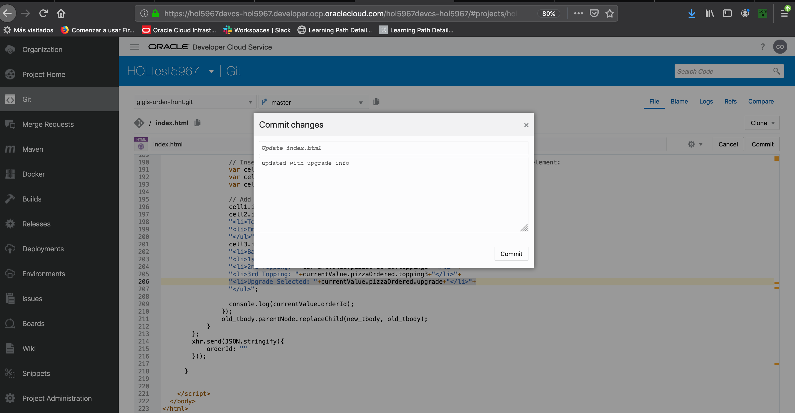
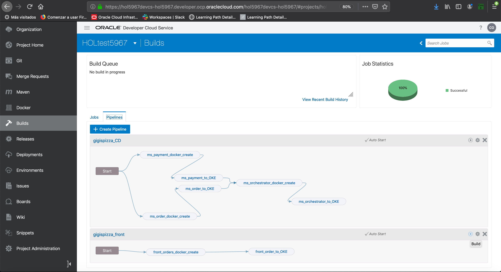
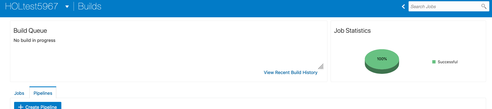
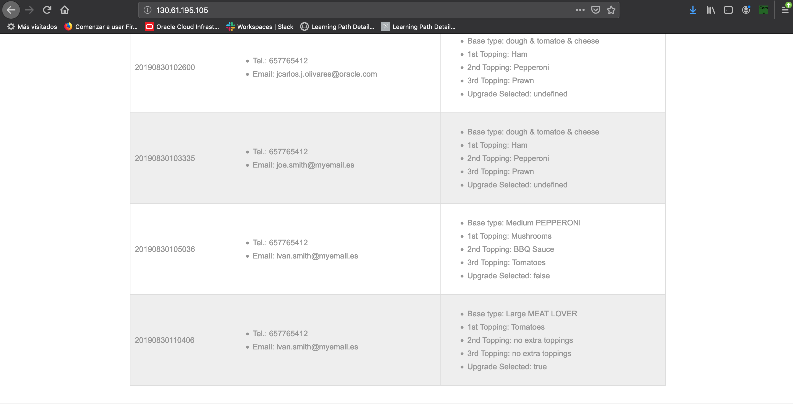
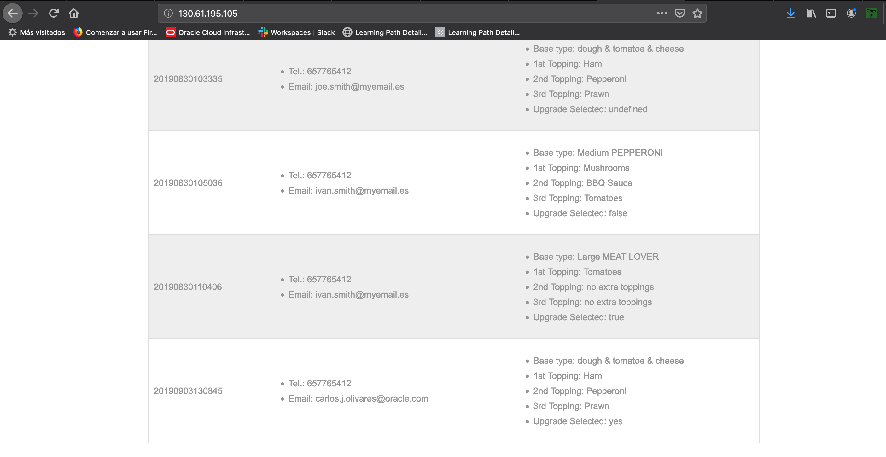
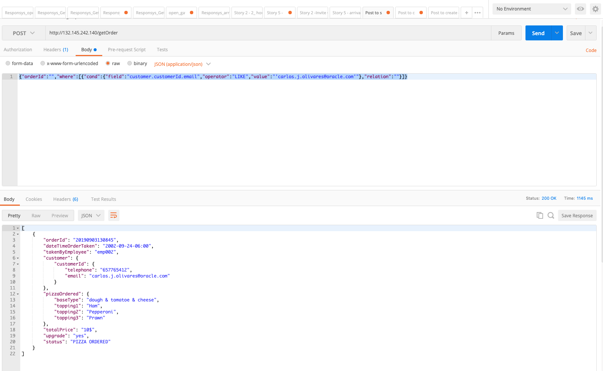

# Test the Implementation

## Introduction

Now let’s see how to check that our microservices have been correctly deployed first and then, that they are working correctly.

Estimated time: 15 - 20 min

### Objectives

* Learn how to check the working of deployed microservices

### Prerequisites

This lab assumes you have completed the following labs:
* Lab: Sign up for a Free Trial
* Lab: Provision a DevCS Instance
* Lab: Build Virtual Machines in Developer Cloud Service
* Lab: Create a Kubernetes Cluster
* Lab: Install the Front-end Client
* Lab: Import a Developer Cloud Service Project
* Lab: Configure the Project to Match the Kubernetes Cluster

## Task 1: Run Kubernetes Proxy

1. First, come back to VM and if not launch yet, run the Kubernetes proxy program to have access to Kubernetes Dashboard(explained already in section Using Virtualbox and a preconfigured VM image).

2. Once logged in, navigate to services section and make a note of the two public ip addresses created, one for microservice orchestrator and the other for the front end:

  

3. If you open a browser and navigate to front-end url, you should see a page with orders already created:

  Note: you may need to install a CORS plugin to avoid issues. We have used Firefox as browser and have installed the “CORS Everywhere” Extension:

  

4. If you now navigate to:

	````
	<microservice_orchestrator public ip>/getAllOrders
	````

  you should see all the orders created:

  

## Task 2: Modify the Project to match new feature

So that we can create a new upgrade feature to be used in Pizza orders, we will modify the frontend to support a new upgrade feature so that we can choose if we want to upgrade an order with a present or not.

1. To do this we have first to modify the. Frontend index.html feature so that we can see for each order if user has chosed upgrade or not. In next session we will modify a Digital Assistant(Skill in a chatbot) to ask for this upgrade before finish the pizza order. In DevCS go to gigis-order-front.git and open index.html:

  

2. Click edit button to modify it:

  

3. Add after toppings info in **line 206**.

	````
	"<li>Upgrade Selected: " + currentValue.upgrade + "</li>" +
	````

  Then commit your changes:

  

4. Go back to Builds section and then to pipelines tab and execute the gigispizza front pipeline:

  

5. Select Build Now button:

  

6. Check that build is successfully executed:

  

7. Now go back to gigis-frontend page opened in previous session, you still will see:

  

8. Reload the page and now you should see a new field Upgrade Selected appear:

  

## Task 3: Create a New Order
Now I can create a new order using postman.

1. It has to be a POST request to endpoint:

	````
	<orchestrator ip>/createOrder
	````

  Header:

	````
	Content-Type: application-json
	````

  And body of type raw(JSON):

	````
	<copy>
	json
	{
	"order": {
		"orderId": "FerInt047",
		"dateTimeOrderTaken": "2002-09-24-06:00",
		"takenByEmployee": "emp001",
		"customer": {
		"customerId": {
			"telephone": "657765412",
			"email": "ivan.smith@myemail.es"
		}
		},
		"pizzaOrdered": {
		"baseType": "dough & tomatoe & cheese",
		"topping1": "Cheese",
		"topping2": "Pepperoni",
		"topping3": "Prawn"
		},
		"totalPrice": "12$"
	},
	"payment": {
		"paymentid": "FerInt047",
		"paymentTime": "01-JUN-2019 12:45 AM",
		"orderId": "FerInt001",
		"paymentMethod": "AMEX",
		"serviceSurvey": "5",
		"totalPaid": "10",
		"customerId": "c345"
	},
	"customerAdress": {
		"street": "Plaza de la Puerta del Sol",
		"number": "s/n",
		"door": "",
		"email": "joe.smith@myemail.es",
		"cityCode": "28013",
		"city": "Madrid"
	}
	}
	</copy>
	````

  

2. After that check in Orders list that this request with orderId is correctly created and appears in Microservice URL:

  

3. You can also use postman to check for instance by searching by your user email (in my case [<span class="underline">carlos.j.olivares@oracle.com</span>](mailto:carlos.j.olivares@oracle.com)) that the order has been correctly created:

4. It has to be a GET request to endpoint:

	````
	<orchestrator ip>/getOrder
	````

  Header:

	````
	Content-Type: application-json
	````

  And body of type raw(JSON):

	````
	<copy>
	json
	{"orderId":"","where":[{"cond":{"field":"customer.customerId.email","operator":"LIKE","value":"'carlos.j.olivares@oracle.com'"},"relation":""}]}
	</copy>
	````

  

You can proceed to the next lab.

## Acknowledgements
* **Authors** -  Iván Postigo, Jesus Guerra, Carlos Olivares - Oracle Spain SE Team
* **Last Updated By/Date** - Madhusudhan Rao, Apr 2022
