# Lab 2: Data-centric microservices walkthrough with Helidon MP

## Introduction

This lab will show you how to deploy the microservices on your Kubernetes cluster, walk throught the functionality and explain how it works.

### Objectives

  -   Deploy and access the microservices
  -   Learn how they work

### What Do You Need?

* An Oracle Cloud paid account or free trial. To sign up for a trial account with $300 in credits for 30 days, click [here](http://oracle.com/cloud/free).
* The OKE cluster and the ATP databases that you created in Lab 1

## **STEP 1**: Understand shortcut commands and development process

A number of shortcut commands are provided in order to analyze and debug the workshop kubernetes environment including the following:

`msdataworkshop` - Lists all of the kubernetes resources (deployments, pods, services, secrets) involved in the workshop

`describepod` - Gives information on a given pod and can use abbreviated names for arguments, such as `describepod admin` or `describepod order`

`logpod` - Provides the logs for a given pod/container and can use abbreviated names for arguments, such as `logpod admin` or `logpod order`

`deletepod` - Deletes a given pod/container and can use abbreviated names for arguments, such as `deletepod admin` or `deletepod order`

As the deployments in the workshop are configured with `imagePullPolicy: Always` , once you have finished the workshop, you can develop and test changes to a microservice using the following sequence...
    
    1. Modify microservice source
    2. Run `./build.sh` to build and push the newly modified microservice image to the repository
    3. Run `deletepod` (eg `deletepod admin`, `deletepod order`, etc.) to delete the old pod and start a new pod with the new image.
    4. Verify changes.
    
If changes have been made to the deployment yaml then re-run `./deploy.sh` in the appropriate microservice's directory.

## **STEP 2**: Deploy and access FrontEnd UI microservice

1.  Run the deploy script.  This will create the deployment and pod for all the java images in the OKE cluster `msdataworkshop` namespace:

    ```
    <copy>cd $GRABDISH_HOME;./deploy.sh</copy>
    ```

   

2.  Once successfully created, check that the frontend pod is running:

    ```
    <copy>kubectl get pods --all-namespaces</copy>
    ```

  

  Alternatively, you can execute the `pods` shortcut command:

  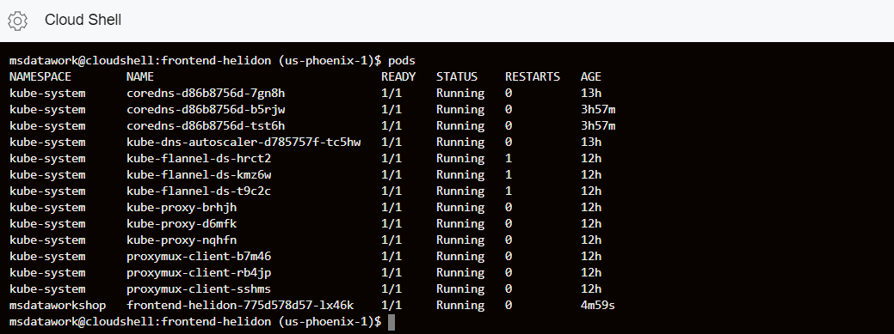

3. Check that the load balancer service is running, and write down the external IP
    address.

    ```
    <copy>kubectl get services --all-namespaces</copy>
    ```

  

  Alternatively, you can execute the `services` shortcut command.

  

4. You are ready to access the frontend page. Open a new browser tab and enter the external IP URL:

  `https://<EXTERNAL-IP>`

  Note that for convenience a self-signed certificate is used to secure this https address and so it is likely you will be prompted by the browser to allow access.
  
  You will then be prompted to authenticate to access the Front End microservices.  The user is `grabdish` and the password is the one you entered in Lab 1.
  
  
  
  You should then see the Front End home page. You've now deployed and accessed your first microservice of the lab!
  
  Note that links on Front End will not work yet as they access microservices that will be created and deployed in subsequent labs.

  We created a self-signed certificate to protect the frontend-helidon service.  This certificate will not be recognized by your browser and so a warning will be displayed.  It will be necessary to instruct the browser to trust this site in order to display frontend.  In a production implementation a certificate that is officially signed by a certificate authority should be used.
  
  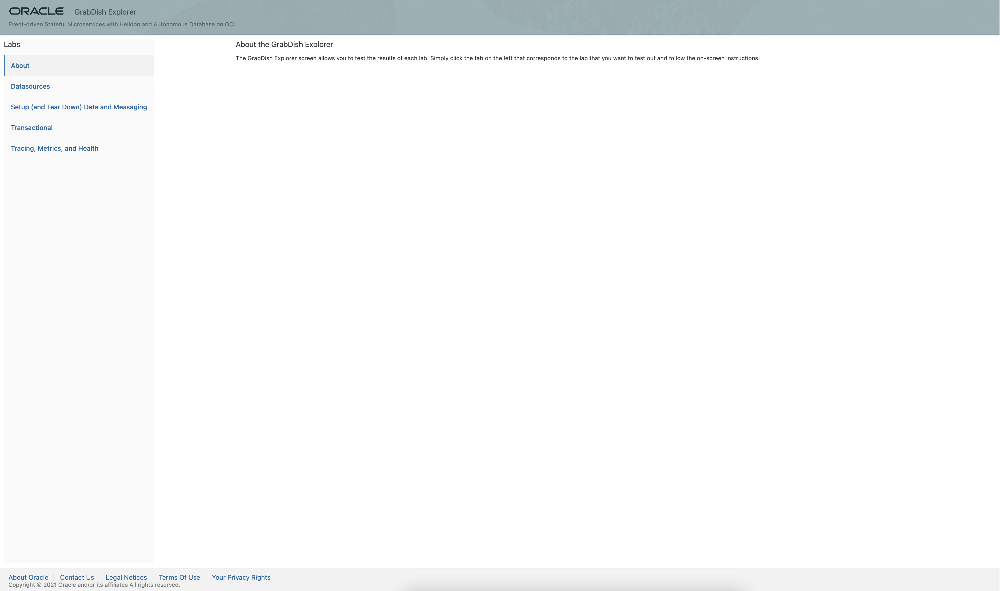

## **STEP 3**: Verify and understand ATP connectivity via Helidon microservice deployment in OKE
You will verify the connectivity from the frontend Helidon microservice to the atp admin microservice connecting to the ATP PDBs.

1.  First, let’s analyze the Kubernetes deployment YAML file: `admin-helidon-deployment.yaml`.

    ```
    <copy>cat $GRABDISH_HOME/admin-helidon/admin-helidon-deployment.yaml</copy>
    ```

    The volumes are set up and credentials are brought from each of the bindings
    (inventory and order). The credential files in the secret are base64 encoded
    twice and hence they need to be decoded for the program to use them, which
    is what the `initContainer` takes care. Once done, they will be mounted for
    access from the container `helidonatp`. The container also has the DB
    connection information such as the JDBC URL, DB credentials and Wallet,
    created in the previous step.

2.  Let’s analyze the `microprofile-config.properties` file.

    ```
    <copy>cat $GRABDISH_HOME/admin-helidon/src/main/resources/META-INF/microprofile-config.properties</copy>
    ```

    This file defines the `microprofile` standard. It also has the definition of
    the data sources that will be injected. You will be using the universal
    connection pool which takes the JDBC URL and DB credentials to connect and
    inject the datasource. The file has default values which will be overwritten
    with the values specific for our Kubernetes deployment.

3.  Let’s also look at the microservice source file `ATPAQAdminResource.java`.

    ```
    <copy>cat $GRABDISH_HOME/admin-helidon/src/main/java/oracle/db/microservices/ATPAQAdminResource.java</copy>
    ```

    Look for the inject portion. The `@Inject` will have the two data sources
    under `@Named` as “orderpdb” and “inventorypdb” which were mentioned in the
    `microprofile-config.properties` file.

## **STEP 4**: Verify order and inventory activity of GrabDish store

1.   Open the frontend microservices home page from the previous lab.
  If you need the URL again, execute the `services` shortcut command and note the External-IP:PORT of the msdataworkshop/frontend/LoadBalancer.
    ```
    <copy>services</copy>
    ```

     

2. Click **Transactional** under **Labs**.

   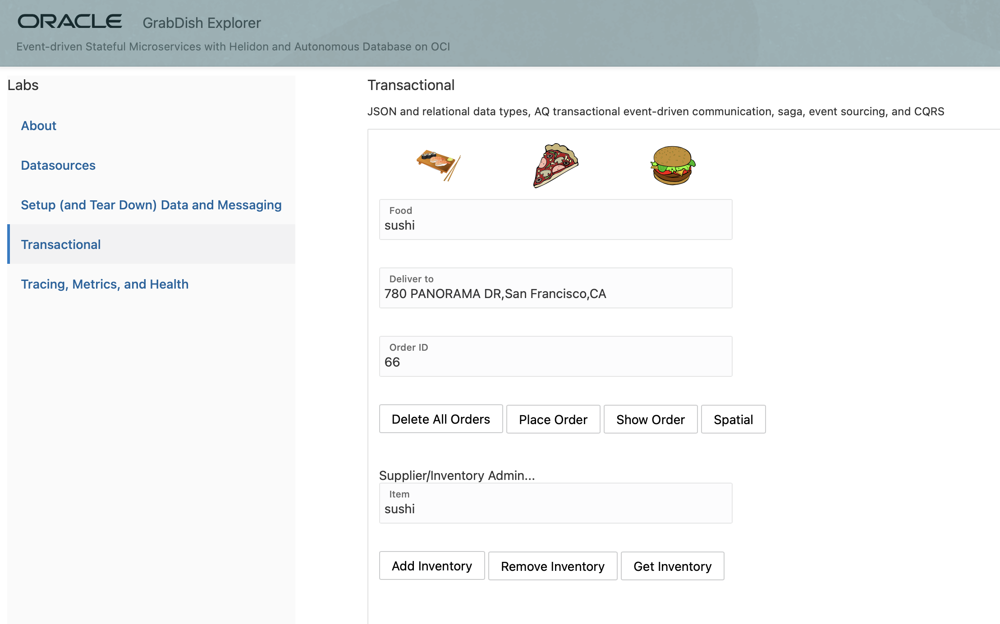

3. Check the inventory of a given item such as sushi, by typing `sushi`
    in the `food` field and clicking **Get Inventory**. You should see the inventory
    count result 0.

   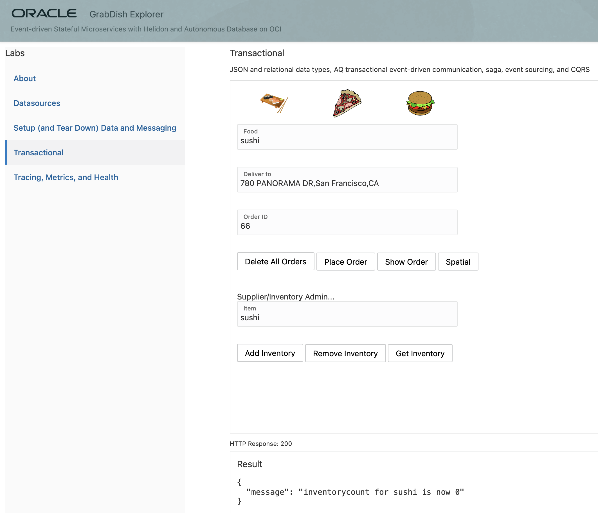

4. (Optional) If for any reason you see a different count, click **Remove Inventory** to bring back the count to 0.

5. Let’s try to place an order for sushi by clicking **Place Order**.

   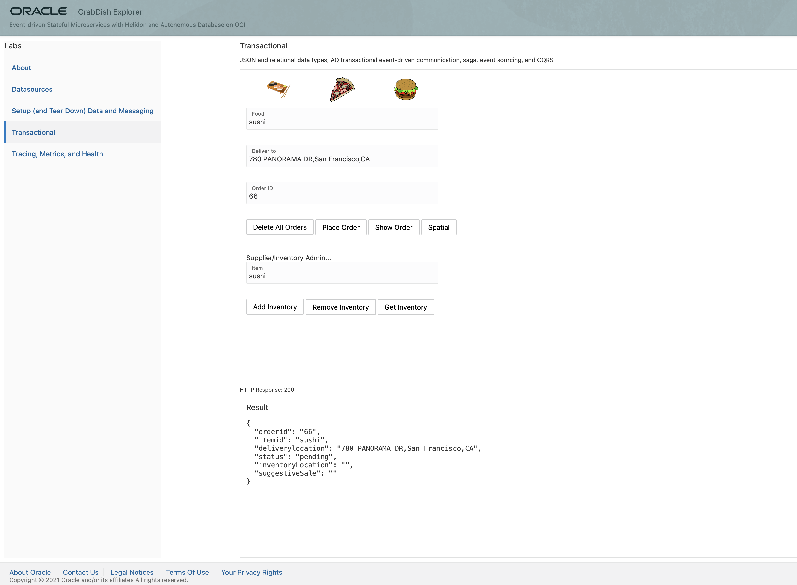

6. To check the status of the order, click **Show Order**. You should see a failed
    order status.

   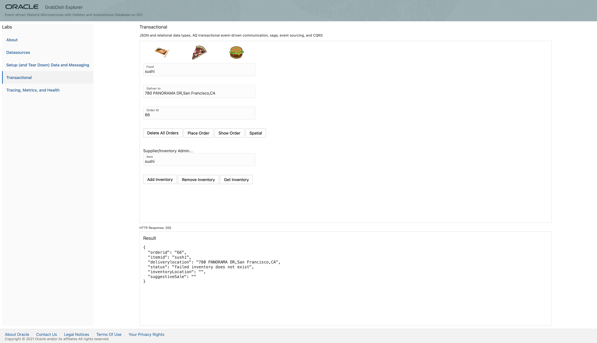

   This is expected, because the inventory count for sushi was 0.

7. Click **Add Inventory** to add the sushi in the inventory. You
    should see the outcome being an incremental increase by 1.

   

8. Go ahead and place another order by increasing the order ID by 1 (67) and then clicking **Place Order**. Next click **Show Order** to check the order status.

   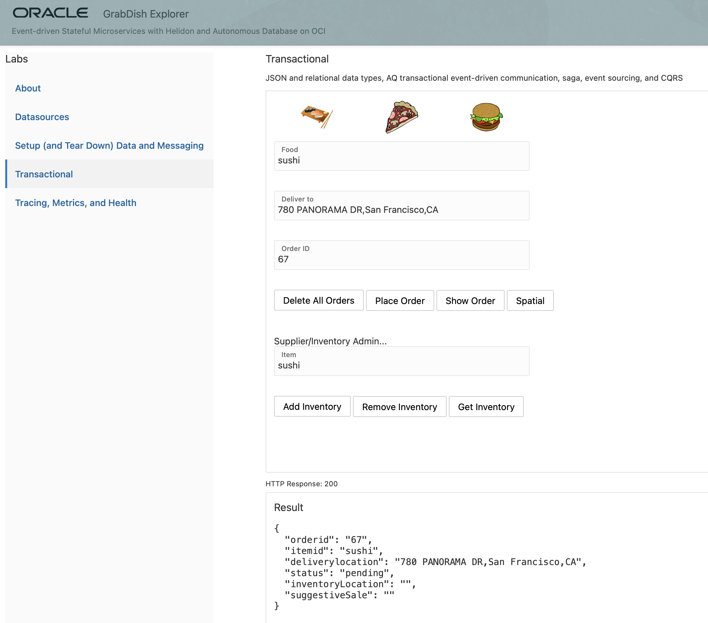

   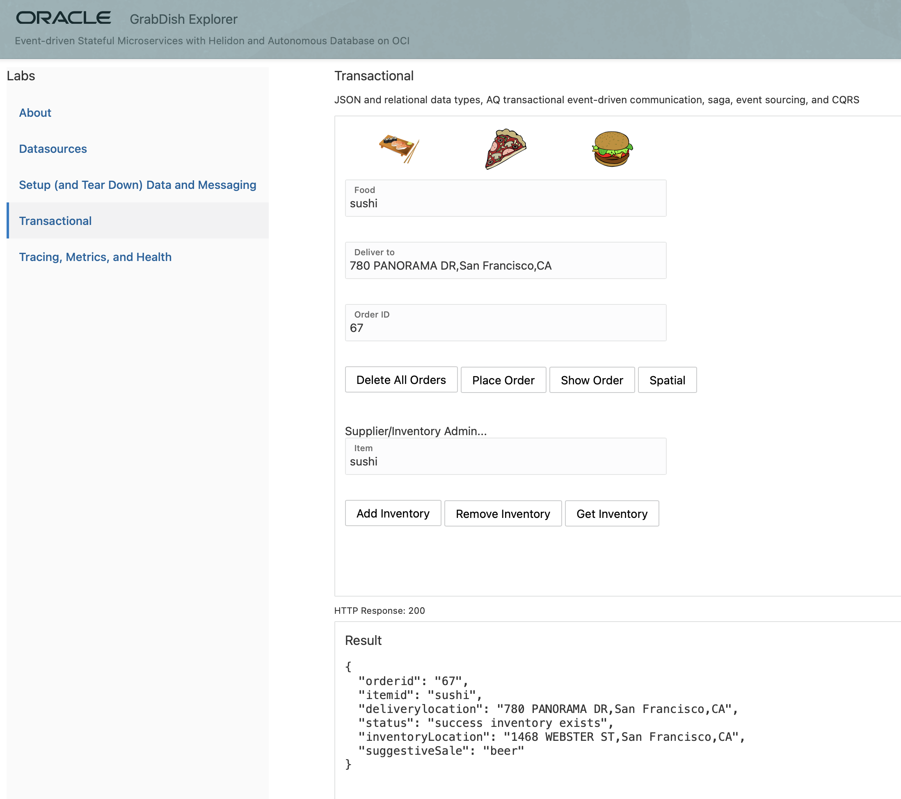

   The order should have been successfully placed, which is demonstrated with the order status showing success.


Although this might look like a basic transactional mechanic, the difference in the microservices environment is that it’s not using a two-phase XA commit, and therefore not using distributed locks. In a microservices environment with potential latency in the network, service failures during the communication phase or delays in long running activities, an application shouldn’t have locking across the services. Instead, the pattern that is used is called the saga pattern, which instead of defining commits and rollbacks, allows each service to perform its own local transaction and publish an event. The other services listen to that event and perform the next local transaction.

In this architecture, there is a frontend service which mimics some mobile app requests for placing orders. The frontend service is communicating with the order service to place an order. The order service is then inserting the order into the order database, while also sending a message describing that order. This approach is called the event sourcing pattern, which due to its decoupled non-locking nature is prominently used in microservices. The event sourcing pattern entails sending an event message for every work or any data manipulation that was conducted. In this example, while the order was inserted in the order database, an event message was also created in the Advanced Queue of the Oracle database.

Implementing the messaging queue inside the Oracle database provides a unique capability of performing the event sourcing actions (manipulating data and sending an event message) atomically within the same transaction. The benefit of this approach is that it provides a guaranteed once delivery, and it doesn’t require writing additional application logic to handle possible duplicate message deliveries, as it would be the case with solutions using separate datastores and event messaging platforms.

In this example, once the order was inserted into the Oracle database, an event message was also sent to the interested parties, which in this case is the inventory service. The inventory service receives the message and checks the inventory database, modifies the inventory if necessary, and sends back a message if the inventory exists or not. The inventory message is picked up by the order service which based on the outcome message, sends back to the frontend a successful or failed order status.

This approach fits the microservices model, because the inventory service doesn’t have any REST endpoints, and instead it purely uses messaging. The services do not talk directly to each other, as each service is isolated and accesses its datastore, while the only communication path is through the messaging queue.

This architecture is tied with the Command Query Responsibility Segregation (CQRS) pattern, meaning that the command and query operations use different methods. In our example the command was to insert an order into the database, while the query on the order is receiving events from different interested parties and putting them together (from suggestive sales, inventory, etc). Instead of actually going to suggestive sales service or inventory service to get the necessary information, the service is receiving events.

Let’s look at the Java source code to understand how Advanced Queuing and Oracle database work together.


What is unique to Oracle and Advanced Queuing is that a JDBC connection can be invoked from an AQ JMS session. Therefore we are using this JMS session to send and receive messages, while the JDBC connection is used to manipulate the datastore. This mechanism allows for both the JMS session and JDBC connection to exist within same atomic local transaction.

You have successfully configured the databases with the necessary users, tables and message propagation across the two ATP instances. You may proceed to the next step.

## **STEP 5**: Verify spatial

1. Click **Spatial** on the **Transactional** tab 

   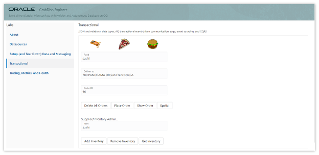

2. Check **Show me the Fusion** menu to make your choices for the Fusion Cuisine 

   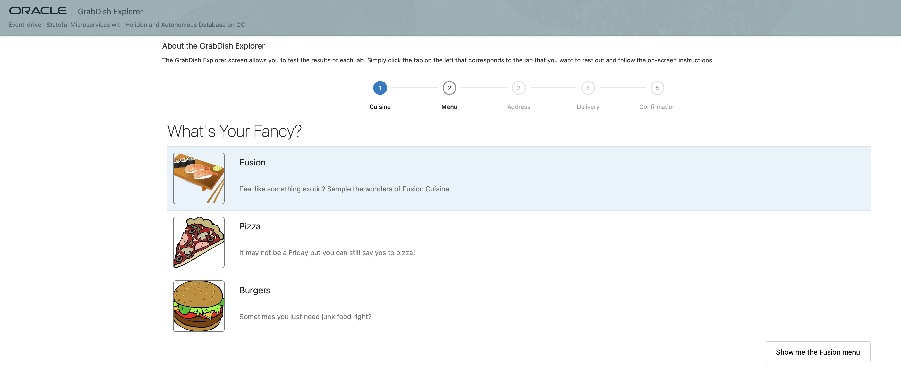

3. Click the plus sign to add Makizushi, Miso Soup, Yakitori and Tempura to your order and click **Ready to Order**. 

   

4. Click **Deliver here** to deliver your order to the address provided on the screen

   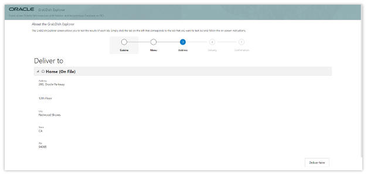

5. Your order is being fulfilled and will be delivered via the fastest route.

   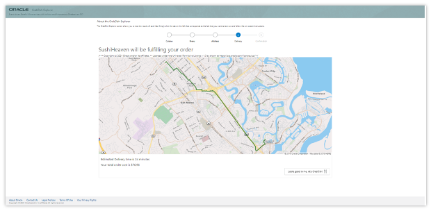

This demo demonstrates how geocoding (the set of latitude and longitude coordinates of a physical address) can be used to derive coordinates from addresses and how routing information can be plotted between those coordinates. 
Oracle JET web component <oj-spatial-map> provides access to mapping from an Oracle Maps Cloud Service and it is being used in this demo for initializing a map canvas object (an instance of the Mapbox GL JS API's Map class). The map canvas automatically displays a map background (aka "basemap") served from the Oracle Maps Cloud Service. 
This web component allows to simply integrate mapping into Oracle JET and Oracle Visual Builder applications, backed by the full power of Oracle Maps Cloud Service including geocoding, route-finding and multiple layer capabilities for data overlay. The Oracle Maps Cloud Service (maps.oracle.com or eLocation) is a full Location Based Portal. It provides mapping, geocoding and routing capabilities similar to those provided by many popular commercial online mapping services.


## **STEP 6**: Verify metrics

1. Notice @Timed and @Counted annotations on placeOrder method of $GRABDISH_HOME/order-helidon/src/main/java/io/helidon/data/examples/OrderResource.java

   


2. Click **Tracing, Metrics, and Health**

   

3. Click **Show Metrics** and notice the long string of metrics (including those from placeOrder timed and counted) in prometheus format.

   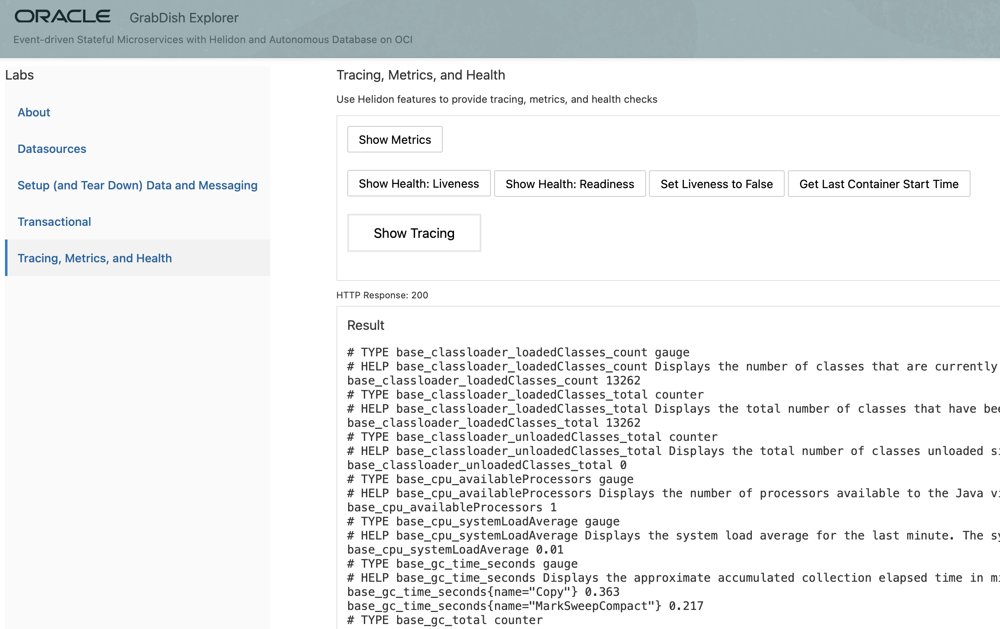

## **STEP 7**: Verify health

1. Oracle Cloud Infrastructure Container Engine for Kubernetes (OKE) provides health probes which check a given    container for its liveness (checking if the pod is up or down) and readiness (checking if the pod is ready to take
requests or not). In this STEP you will see how the probes pick up the health that the Helidon microservice advertises. Click **Tracing, Metrics, and Health** and click **Show Health: Liveness**

   

2. Notice health check class at `$GRABDISH_HOME/order-helidon/src/main/java/io/helidon/data/examples/OrderServiceLivenessHealthCheck.java` and how the liveness method is being calculated.

    

3. Notice liveness probe specified in `$GRABDISH_HOME/order-helidon/order-helidon-deployment.yaml` The `livenessProbe` can be set up with different criteria, such as reading from a file or an HTTP GET request. In this example the OKE health probe will use HTTP GET to check the /health/live and /health/ready addresses every 3 seconds, to see the liveness and readiness of the service.

   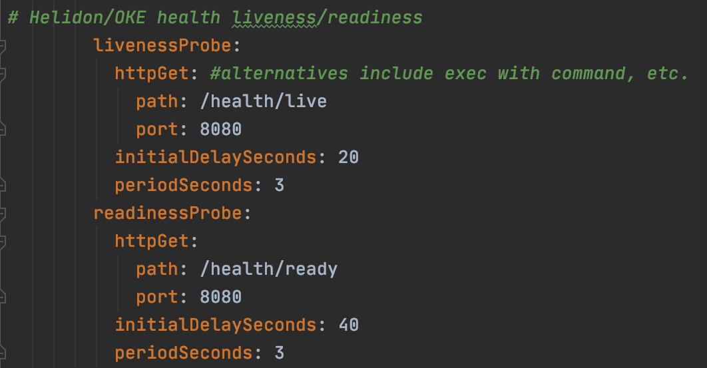

4. In order to observe how OKE will manage the pods, the microservice has been created with the possibility to set up the liveliness to “false”. Click **Get Last Container Start Time** and note the time the container started.

   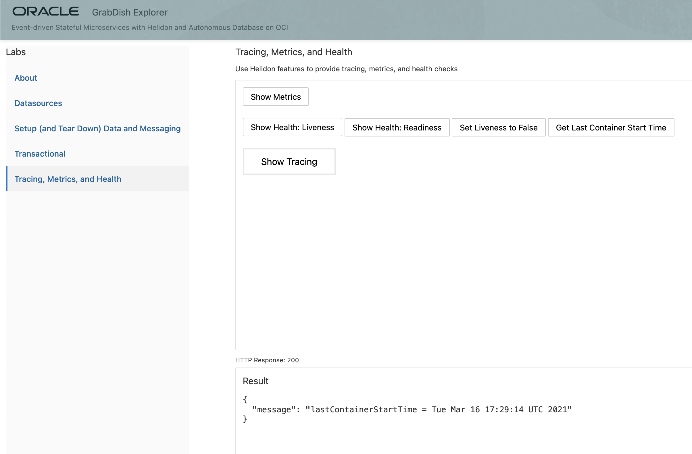

5. Click **Set Liveness to False** . This will cause the Helidon Health Check to report false for liveness which will result in OKE restarting the pod/microservice

   

6. Click **Get Last Container Start Time**.
   It will take a minute or two for the probe to notice the failed state and conduct the restart and as it does you may see a connection refused exception.

   

   Eventually you will see the container restart and note the new/later container startup time reflecting that the pod was restarted.

   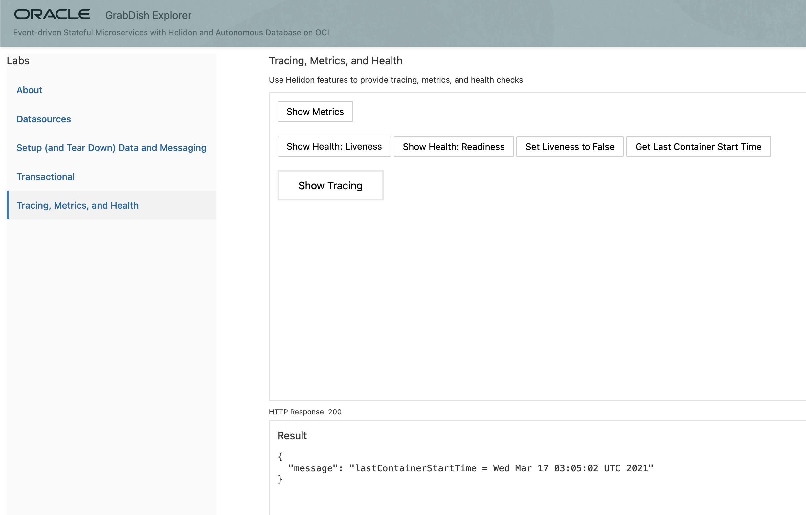

## Acknowledgements
* **Author** - Paul Parkinson, Dev Lead for Data and Transaction Processing, Oracle Microservices Platform, Helidon
               Richard Exley, Consulting Member of Technical Staff, Oracle MAA and Exadata
* **Adapted for Cloud by** - Nenad Jovicic, Enterprise Strategist, North America Technology Enterprise Architect Solution Engineering Team
* **Documentation** - Lisa Jamen, User Assistance Developer - Helidon
* **Contributors** - Jaden McElvey, Technical Lead - Oracle LiveLabs Intern
* **Last Updated By/Date** - Tom McGinn, June 2020

