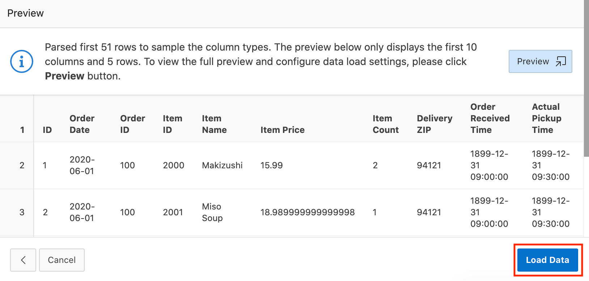

# Create an APEX App to Make Sense of the Data
## Overview

This lab will show you how to create an APEX application that will help make sense of the type of data being collected by the microservices created in the previous labs.

### Objectives

* Create an APEX workspace in ATP
* Create an APEX app using a file

### What Do You Need?

* An ATP database (created in Lab 1)

## **Step 1:** Create a new workspace in APEX

When you first access APEX you will need to log in as an APEX instance administrator to create a workspace. A workspace is a logical domain where you define APEX applications. Each workspace is associated with one or more database schemas (database users) which are used to store the database objects, such as tables, views, packages, and more. These database objects are generally what APEX applications are built on top of.

1.  Navigate to either of the ATP Database instances created in Lab 1. Click the **Tools** tab and then the **Open APEX** button.

    

2.  Enter the password for the Administration Services and click **Sign In to Administration**. The password should match the one you used when creating the ATP instance.

    

3.  Click **Create Workspace**.

   

4.  Set **Database User** to **DEMO**, enter a password (you may wish to reuse the admin password from before), and then click **Create Workspace**.

    

5.  After the workspace is created, click the **DEMO** link in the success message. This will log you out of APEX administration so that you can log into your new workspace.

    

6.  Enter the password you used when creating the workspace, check the **Remember workspace and username** checkbox, and then click **Sign In**.

    

You have successfully created an APEX workspace where you can begin creating applications.

## **Step 2:** Create a new APEX App

In this step, you will create a new APEX app based on a file that contains a small sample of the type of data that the microservices would collect.

1.  Click the following link to download an Excel file: <a href="https://objectstorage.us-ashburn-1.oraclecloud.com/p/naln4K9wHitqILEbK8mPVK6TDzHjsTpM17RNln4JHVU/n/c4u03/b/developer-library/o/order-items-data.xlsx">order-items-data.xlsx</a>. This is the data we will use to build the application in this lab.

2. Return to your APEX workspace and click the down arrow in the **SQL Workshop** tab, then select **SQL Commands**.

    

3. Enter the following code into the SQL Commands window, then click **Run** to execute the code. Once complete, you will have a new table named ORDER_ITEMS that you can use to store the data.

    ```
    <copy>
    create table order_items (
        id                      number,
        order_id                number,
        item_id                 number,
        item_name               varchar2(255),
        item_price              number(6,2),
        item_count              number,
        delivery_zip            varchar2(10),
        order_received_time     date,
        actual_pickup_time      date,
        actual_delivery_time    date,
        promised_time           date,
        constraint myorders_pk primary key (id)
    );
    </copy>
    ```

    After running the code, you should see the "Table created" message at the bottom under the **Results** tab.

    

4.  Click the **App Builder** tab.

    

5.  Select **Create** to create a new application.

    

6.  Click **From a File** since you will be creating an app based on the data in the Excel file downloaded before.

    

7.  Drag and drop the Excel file into the file drop zone.

    

    APEX will automatically upload and parse the document. When finished, you should see the following screen.

    

8.  Set **Load To** to **Existing Table** and use the **Table** selector to select the **ORDER_ITEMS** table.

    

    When ready, click the **Load Data** button at the bottom of the page to load the data from the file into the table.

    

9.  When the data load finishes, you will see a success message letting you know that 50 rows of data were inserted into the table. Click the **Create Application** button to create an application on top of the ORDER_ITEMS table.

    

10. You'll see a list of pages that APEX will automatically create in the new application, including a Dashboard, Faceted Search, Interactive Report, and Calendar pages.

    

    When ready, click the **Create Application** button at the bottom of the page to finish creating the app.

    

11. After the app is created, you will be redirected to its home page in the App Builder where you can view the pages in the app and access other important functionality. Click **Run Application** to see the app in runtime mode.

    

12. By default, the app uses APEX workspace account credentials for authentication. Enter **demo** for the **Username** and enter the password you used to create the workspace in **Password**, then click **Sign In**.

    

13. Now that you've logged into the application, take a few moments to explore what you get out of the box. Of course, this is just the starting point for a real app, but it's not bad for not having written any lines of code!

    
