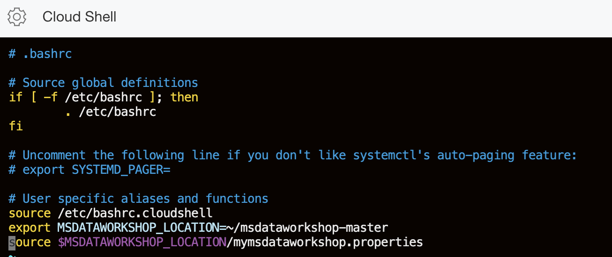

# Build Code from GitHub and Deploy Microservices

## Introduction

This lab will show you how to build images, push them to Oracle Cloud
Infrastructure Registry and deploy the microservices on our Kubernetes cluster.
You will also clone a GitHub repository.

### Objectives

  -   Clone a GitHub repository
  -   Build and push an image to OCI Registry
  -   Deploy and access the front-end microservice

### What Do You Need?

* An Oracle Cloud paid account or free trial. To sign up for a trial account with $300 in credits for 30 days, click [here](http://oracle.com/cloud/free).
* The OKE cluster and the ATP databases that you created in Lab 1
* Your updated `msdataworkshop.properties` file.

## **STEP 1**: Copy your msdataworkshop.properties to your root directory
In Lab 1 you downloaded a copy of the `msdataworkshop.properties` file and you updated it with all of the information generated while setting up OCI, OKE, and ATP. Now you will use your Cloud Shell to copy the contents of your local file into a `msdataworkshop.properties` file that you will create in your root directory (~/) so that this information can be used within the Cloud Shell in subsequent steps.  

1. Create an empty `msdataworkshop.properties` file in your root directory.

  ```
  <copy>cd ~ ; touch msdataworkshop.properties</copy>

  ```
2. Open the `msdataworkshop.properties` file that you just created in root:

  ```
  <copy>vi msdataworkshop.properties</copy>

  ```

3. Go to your text editor and copy the contents of your local `msdataworkshop.properties file`. Be sure to select all content from the file.

4. In vi, use the Insert key at the beginning of the file and then paste the content into the empty properties file. Make sure that you copied everything.

5. Complete the insert, save your changes, and close vi with the commands `ESC` and `:x` and `ENTER`

## **STEP 2**: Download workshop source code
To work with application code, you need to download a GitHub repository using
    the following curl and unzip command. The workshop assumes this is done from your root directory.

  ```
 <copy>cd ~ ; curl -sL https://tinyurl.com/y5rrqh37 --output master.zip ; unzip master.zip ; rm master.zip</copy>
   ```

  You should now see **msdataworkshop-master** in your root directory.

## **STEP 3**: Source the msdataworkshop.properties
1.  Set the value for `MSDATAWORKSHOP_LOCATION` and source the `msdataworkshop.properties` for the shell.

       Use the following command to update the ./bashrc file for the shell.

       ```
      <copy>echo 'export MSDATAWORKSHOP_LOCATION=~/msdataworkshop-master' >> ~/.bashrc ; echo 'source ~/msdataworkshop.properties' >> ~/.bashrc</copy>
      ```

    The ~/.bashrc should now contain these two new lines.  Verify using `cat`

       ```
      <copy>cat ~/.bashrc</copy>
      ```

   


2. Source the edited `.bashrc` file with the following command.
      ```
      <copy>source ~/.bashrc</copy>
      ```
      

  This will set the properties needed to deploy and run the workshop and will also provide convenient shortcut commands.
    The kubernetes resources created by the workshop and commands can be viewed by issuing the `msdataworkshop` command.

## **STEP 4**: Create the cluster namespace

In order to divide and isolate cluster resources, you will create a cluster
    namespace which will host all resources related to this application, such as
    pods and services.

1. Log in to the Cloud Console and open the Cloud Shell by
    clicking the Cloud Shell icon in the top-right corner of the Console.

  

2. Create the `msdataworkshop` namespace using the following command:

    ```
    <copy>kubectl create ns msdataworkshop</copy>
    ```

  

  You have successfully created the `msdataworkshop` namespace which is used for
  deploying the application code.

## **STEP 5**: Install GraalVM and Jaeger

1. Install GraalVM

    Run the installGraalVM.sh script from your root directory. GraalVM must be installed in your root directory.
    ```
    <copy>./msdataworkshop-master/installGraalVM.sh</copy>
    ```

    Verify install by running ~/graalvm-ce-java11-20.1.0/bin/java -version

    ```
    <copy>~/graalvm-ce-java11-20.1.0/bin/java -version</copy>
    ```

  


2. Install Jaeger and note the services it creates.

     ```
    <copy>kubectl create -f https://tinyurl.com/yxn83h3q -n msdataworkshop</copy>
     ```

   

3.  Issue the `kubectl get services --all-namespaces` command and notice the services it installs.  
The jaeger-query is a loadbalancer exposing an EXTERNAL-IP and runs on port 80. If your jaeger-query state is pending, and you do not see the External-IP address, you may need to execute this command again.

     ```
     <copy>kubectl get services --all-namespaces</copy>
     ```

    


 4. Add the jaeger-query EXTERNAL-IP:PORT to your `msdataworkshop.properties` file.

     Use your Cloud Shell and repeat the process from STEP 1 to modify the `msdataworkshop.properties` file in your root directory.

     ```
     <copy>vi msdataworkshop.properties</copy>
     ```

     

     *Make sure that you add the jaeger-query EXTERNAL-IP address and NOT the CLUSTER-IP.*

     Complete the insert, save your changes, and close vi with the commands `ESC` and `:x` and `ENTER`


5. After you update the `msdataworkshop.properties` file in your root directory, you must source the `.bashrc` file again to apply the changes.

     ```
     <copy>source ~/.bashrc</copy>
     ```

     (*Optional*) You may want to add the `jaeger-query` address to your local `msdataworkshop.properties` file as a backup.   


6.  Verify that the jaeger-collector service `tracing.host` and `tracing.port` are the same in the `microprofile-config.properties` files. The jaeger-collector service is referenced in two files:

   - `$MSDATAWORKSHOP_LOCATION/frontend-helidon/src/main/resources/META-INF/microprofile-config.properties`

   - `$MSDATAWORKSHOP_LOCATION/order-helidon/src/main/resources/META-INF/microprofile-config.properties`

    Open each file and verify that **tracing.host**=`jaeger-collector.msdataworkshop` and **tracing.port**=`14268`.

    


## **STEP 6**: Deploy and access Frontend microservice

1.  You need to compile, test and package the Helidon front-end
    application code into a `.jar` file using maven. The maven package is already installed in the
    Cloud Shell. Inside Cloud Shell go to the frontend Helidon microservice
    folder.

    ```
    <copy>$MSDATAWORKSHOP_LOCATION/frontend-helidon</copy>
    ```

2.  Run `maven` to build the package using the following command. Since this is
    the first time maven is executed, nothing is cached, thus it will first
    download all the necessary libraries and bundles.

    ```
    <copy>mvn clean install</copy>
    ```

  The build should be completed in 1-2 minutes, and a target folder with the related Java files is created.

  

3. Execute the following command to investigate the target folder.

    ```
    <copy>ls -al target/</copy>
    ```

  

## **STEP 7**: Push image to OCI Registry, deploy and access microservices

After you have successfully compiled the application code, you are ready to push it as a docker image into the OCI Registry. Once the image resides in the OCI registry, it can be used for deploying into the cluster. You are going to log into OCIR through the Cloud Shell using the following command.

1.  You will need the following parameters which you have already added to your `msdataworkshop.properties` file:

    - `REGION-ID` - is the Region identifier
    - `OBJECT-STORAGE-NAMESPACE` - is your Object Storage namespace
    - `USERNAME` - is the username used to log in. If your username is federated from Oracle Identity Cloud Service, you need to add the `oracleidentitycloudservice/` prefix to your username, for example `oracleidentitycloudservice/firstname.lastname@something`

    ```
  <copy>docker login REGION-ID.ocir.io -u OBJECT-STORAGE-NAMESPACE/USERNAME</copy>
    ```

    *When prompted for password use the Auth token (msdataworkshoptoken) you generated.*

  

2.  Once successfully logged into Container Registry, we can list the existing docker images. Since this is the first time logging into Registry, no images will be shown.

    ```
    <copy>docker images </copy>
    ```

  


## **STEP 8**: Build the Docker image

1.  You are ready to build a docker image of the frontend Helidon application.
    Change directory into frontend-helidon folder:

    ```
    <copy>cd $MSDATAWORKSHOP_LOCATION/frontend-helidon</copy>
    ```

  

2.  Run the build script which will build the frontend-helidon application, store it in a docker image and push it to Oracle Registry

    ```
    <copy>./build.sh</copy>
    ```

  

  After a couple of minutes, the image should have been successfully pushed into the repository.

  

3.  Go to the Console, click the hamburger menu in the top-left corner and open
    **Developer Services > Container Registry**.

  

4. You should see the newly created image in the list. If you don't see it, click the refresh icon in the upper right corner of the Create Repository pane. Click the repository with the new image.

  

5.  To simplify the usage of this image and avoid the need to do `docker login` in
    the deployment yaml file or git CI/CD, we will change the image from Private
    to Public, by clicking **Actions > Change to Public**.

  

  

6.  Go back to the Cloud Shell and run the deploy script from the same directory
    as build. This will create a new pod and service for this image in the OKE
    cluster `msdataworkshop` namespace:

    ```
    <copy>./deploy.sh</copy>
    ```

  

7.  Once successfully created, check that the frontend pod is running:

    ```
    <copy>kubectl get pods --all-namespaces</copy>
    ```

  

  Alternatively, you can execute the `pods` shortcut command:

  

8. Check that the load balancer service is running, and write down the external IP
    address and port.

    ```
    <copy>kubectl get services --all-namespaces</copy>
    ```

  

  Alternatively, you can execute the `services` shortcut command.

  

9. You are ready to access the frontend page. Open a new browser tab and access
    the external page `http://<external-IP>:8080`:

  

10. Run the remaining build script to build and push the rest of the
    microservices images into the repository

    ```
    <copy>cd $MSDATAWORKSHOP_LOCATION ; ./build.sh</copy>
    ```

  

  In a couple of minutes, you should have successfully built and pushed all the images into the OCIR repository.

  

11.  Go to the Console, click the hamburger menu in the top-left corner and open
    **Developer Services > Container Registry**.

  

12. Mark all the images as public (**Actions** > **Change to Public**), just as you did previously for the frontend image:

  

You may now proceed to the next lab.

## Acknowledgements
* **Author** - Paul Parkinson, Dev Lead for Data and Transaction Processing, Oracle Microservices Platform, Helidon
* **Adapted for Cloud by** - Nenad Jovicic, Enterprise Strategist, North America Technology Enterprise Architect Solution Engineering Team
* **Documentation** - Lisa Jamen, User Assistance Developer - Helidon
* **Contributors** - Jaden McElvey, Technical Lead - Oracle LiveLabs Intern
* **Last Updated By/Date** - Tom McGinn, June 2020

## See an issue?
Please submit feedback using this [form](https://apexapps.oracle.com/pls/apex/f?p=133:1:::::P1_FEEDBACK:1). Please include the *workshop name*, *lab* and *step* in your request.  If you don't see the workshop name listed, please enter it manually. If you would like for us to follow up with you, enter your email in the *Feedback Comments* section.
