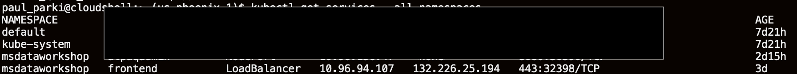

# Build Code from GitHub and Deploy Microservices

## Introduction

This lab will show you how to build images, push them to Oracle Cloud
Infrastructure Registry and deploy the microservices on our Kubernetes cluster.
You will also clone a GitHub repository.

### Objectives

  -   Clone a GitHub repository
  -   Build and push an image to OCI Registry
  -   Deploy and access the front-end microservice

### What Do You Need?

* An Oracle Cloud paid account or free trial. To sign up for a trial account with $300 in credits for 30 days, click [here](http://oracle.com/cloud/free).
* The OKE cluster and the ATP databases that you created in Lab 1


## **STEP 1**: Set values for workshop in the environment and source ~/.bashrc 

1. Run `source addAndSourcePropertiesInBashrc.sh`

    ```
    <copy>cd $MSDATAWORKSHOP_LOCATION; source addAndSourcePropertiesInBashrc.sh</copy>
    ```

    ```
    <copy>source ~/.bashrc</copy>
    ```

## **STEP 2**: Understand shortcut commands and development process

A number of shortcut commands are provided in order to analyze and debug the workshop kubernetes environment including the following:

`msdataworkshop` - Lists all of the kubernetes resources (deployments, pods, services, secrets) involved in the workshop

`describepod` - Gives information on a given pod and can use abbreviated names for arguments, such as `describepod admin` or `describepod order`

`logpod` - Provides the logs for a given pod/container and can use abbreviated names for arguments, such as `logpod admin` or `logpod order`

`deletepod` - Deletes a given pod/container and can use abbreviated names for arguments, such as `deletepod admin` or `deletepod order`

As the deployments in the workshop are configured with `imagePullPolicy: Always` , once you have finished the workshop, you can develop and test changes to a microservice using the following sequence...
    
    1. Modify microservice source
    2. Run `./build.sh` to build and push the newly modified microservice image to the repository
    3. Run `deletepod` (eg `deletepod admin`, `deletepod order`, etc.) to delete the old pod and start a new pod with the new image.
    4. Verify changes.
    
If changes have been made to the deployment yaml then re-run `./deploy.sh` in the appropriate microservice's directory.

## **STEP 3**: Build and push the Docker images

1. Run the `build.sh` script to build and push the
    microservices images into the repository

    ```
    <copy>cd $MSDATAWORKSHOP_LOCATION ; ./build.sh</copy>
    ```

  

  In a few minutes, you should have successfully built and pushed all the images into the OCIR repository.

  

2.  Go to the Console, click the hamburger menu in the top-left corner and open
    **Developer Services > Container Registry**.

  

3. Mark all the images as public (**Actions** > **Change to Public**):

  
  
  NOTE THAT THE IMAGES WILL USUALLY BE LOCATED IN THE ROOT COMPARTMENT.
  THEREFORE, YOU MAY NEED TO SELECT THE ROOT COMPARTMENT FROM THE `Compartment` DROPDOWN LIST ON THE LEFT.

## **STEP 4**: Build deploy and access FrontEnd UI microservice

1. Run `./setJaegerAddress.sh` and verify successful outcome.

 It may be necessary to run this script multiple times if the Jaeger load balancer has not been provisioned yet.

   ```
   <copy>cd $MSDATAWORKSHOP_LOCATION; ./setJaegerAddress.sh</copy>
   ```

2. Source the `.bashrc` file with the following command.

   ```
      <copy>source ~/.bashrc</copy>
   ```

  

3.  Change directory into `frontend-helidon` folder:

    ```
    <copy>cd $MSDATAWORKSHOP_LOCATION/frontend-helidon</copy>
    ```

4. Run the build script which will build the frontend-helidon application, store it in a docker image and push it to Oracle Registry

    ```
    <copy>./build.sh</copy>
    ```

  

  After a couple of minutes, the image should have been successfully built and pushed into the OCIR repository.


## **STEP 5**: Start the frontend-helidon service

1.  Run the deploy script from the same directory
    as build. This will create the deployment and pod for this image in the OKE
    cluster `msdataworkshop` namespace:

    ```
    <copy>cd $MSDATAWORKSHOP_LOCATION/frontend-helidon;./deploy.sh</copy>
    ```

   

2.  Once successfully created, check that the frontend pod is running:

    ```
    <copy>kubectl get pods --all-namespaces</copy>
    ```

  

  Alternatively, you can execute the `pods` shortcut command:

  

3. Check that the load balancer service is running, and write down the external IP
    address.

    ```
    <copy>kubectl get services --all-namespaces</copy>
    ```

  

  Alternatively, you can execute the `services` shortcut command.

  

4. You are ready to access the frontend page. Open a new browser tab and enter the external IP URL:

  `https://<EXTERNAL-IP>`

  Note that for convenience a self-signed certificate is used to secure this https address and so it is likely you will be prompted by the browser to allow access.
  
  You will then be prompted to authenticate to access the Front End microservices.  The user is `grabdish` and the password is the on created and stored in a vault secret in Lab 1 Step 4.
  
  
  
  You should then see the Front End home page. You've now deployed and accessed your first microservice of the lab!
  
  Note that links on Front End will not work yet as they access microservices that will be created and deployed in subsequent labs.

  We created a self-signed certificate to protect the frontend-helidon service.  This certificate will not be recognized by your browser and so a warning will be displayed.  It will be necessary to instruct the browser to trust this site in order to display frontend.  In a production implementation a certificate that is officially signed by a certificate authority should be used.
  
  

You may now proceed to the next lab.

## Acknowledgements
* **Author** - Paul Parkinson, Dev Lead for Data and Transaction Processing, Oracle Microservices Platform, Helidon
* **Adapted for Cloud by** - Nenad Jovicic, Enterprise Strategist, North America Technology Enterprise Architect Solution Engineering Team
* **Documentation** - Lisa Jamen, User Assistance Developer - Helidon
* **Contributors** - Jaden McElvey, Technical Lead - Oracle LiveLabs Intern
* **Last Updated By/Date** - Tom McGinn, June 2020

