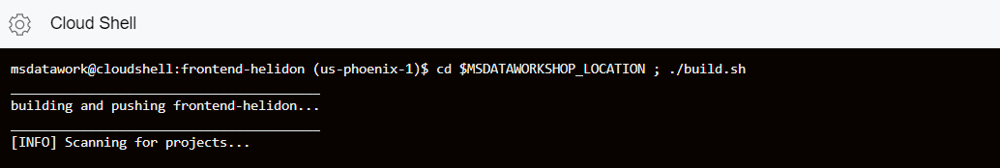
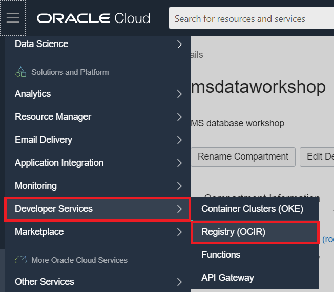
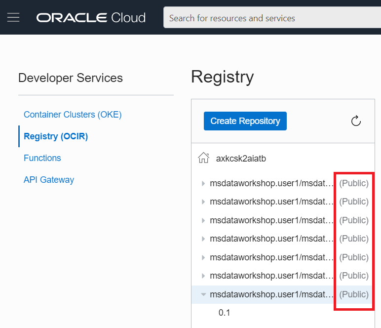
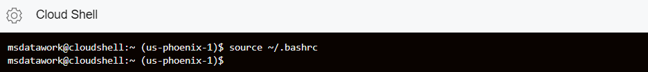
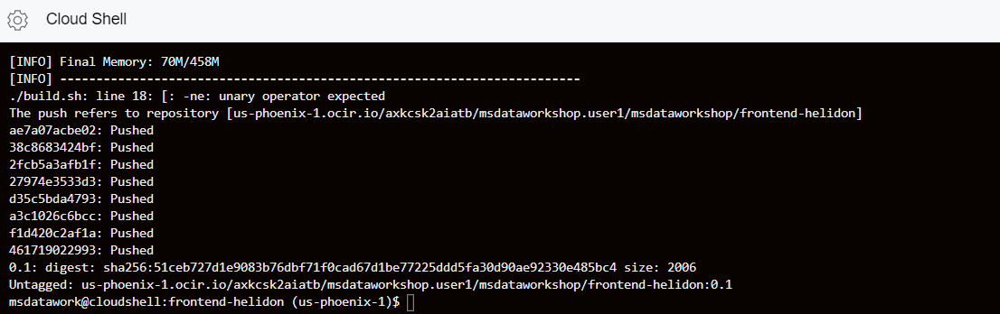
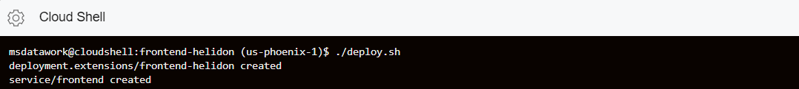
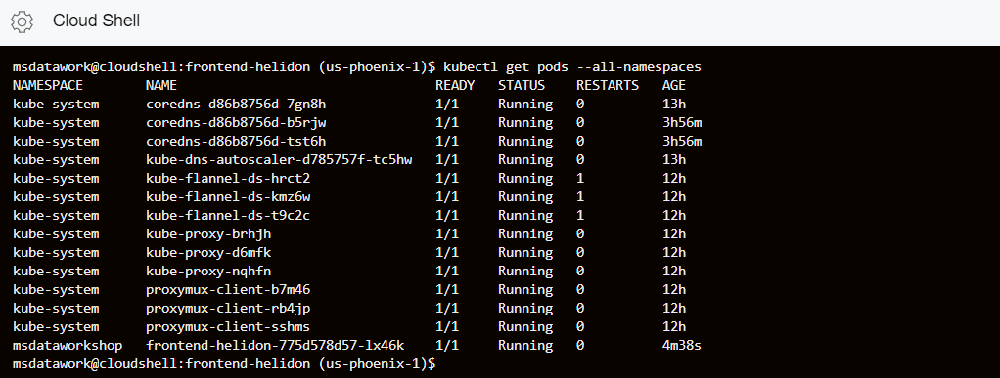
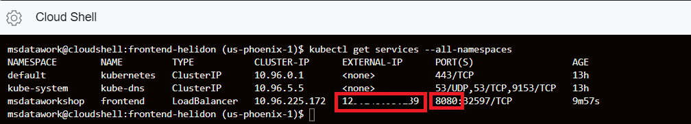
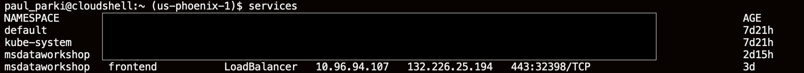
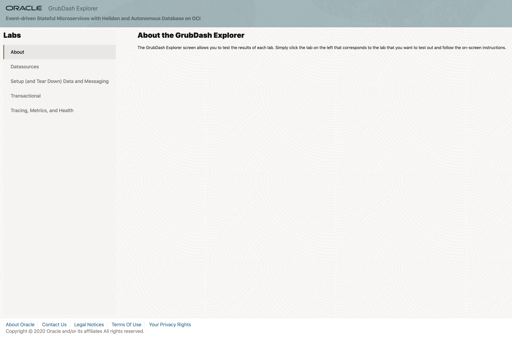

# Build Code from GitHub and Deploy Microservices

## Introduction

This lab will show you how to build images, push them to Oracle Cloud
Infrastructure Registry and deploy the microservices on our Kubernetes cluster.
You will also clone a GitHub repository.

### Objectives

  -   Clone a GitHub repository
  -   Build and push an image to OCI Registry
  -   Deploy and access the front-end microservice

### What Do You Need?

* An Oracle Cloud paid account or free trial. To sign up for a trial account with $300 in credits for 30 days, click [here](http://oracle.com/cloud/free).
* The OKE cluster and the ATP databases that you created in Lab 1


## **STEP 1**: Set values for workshop in the environment

1. Run `./addAndSourcePropertiesInBashrc.sh`

   ```
   <copy>./addAndSourcePropertiesInBashrc.sh</copy>
   ```

2. Source the `.bashrc` file with the following command.

  ```
  <copy>source ~/.bashrc</copy>
  ```

## **STEP 2**: Build and push the Docker images

1. Run the `build.sh` script to build and push the
    microservices images into the repository

    ```
    <copy>cd $MSDATAWORKSHOP_LOCATION ; ./build.sh</copy>
    ```

  

  In a couple of minutes, you should have successfully built and pushed all the images into the OCIR repository.

  

2.  Go to the Console, click the hamburger menu in the top-left corner and open
    **Developer Services > Container Registry**.

  

3. Mark all the images as public (**Actions** > **Change to Public**):

  

## **STEP 3**: Build deploy and access FrontEnd UI microservice

1. Run `./setJaegerAddress.sh` and verify successful outcome.

 It may be necessary to run this script multiple times if the Jaeger load balancer has not been provisioned yet.

   ```
   <copy>./setJaegerAddress.sh</copy>
   ```

2. Source the `.bashrc` file with the following command.

   ```
      <copy>source ~/.bashrc</copy>
   ```
      
  

3.  Change directory into `/frontend-helidon` folder:

    ```
    <copy>cd ~/msdataworkshop-master/frontend-helidon</copy>
    ```

   
4.  Run the build script which will build the frontend-helidon application, store it in a docker image and push it to Oracle Registry

    ```
    <copy>./build.sh</copy>
    ```

  

  After a couple of minutes, the image should have been successfully pushed into the repository.

  


5.  Run the deploy script from the same directory
    as build. This will create a new pod and service for this image in the OKE
    cluster `msdataworkshop` namespace:

    ```
    <copy>./deploy.sh</copy>
    ```

   

7.  Once successfully created, check that the frontend pod is running:

    ```
    <copy>kubectl get pods --all-namespaces</copy>
    ```

  

  Alternatively, you can execute the `pods` shortcut command:

  

8. Check that the load balancer service is running, and write down the external IP
    address and port. 

    ```
    <copy>kubectl get services --all-namespaces</copy>
    ```

  

  Alternatively, you can execute the `services` shortcut command.

  

9. You are ready to access the frontend page. Open a new browser tab and enter the external IP and port URL:

  `http://<EXTERNAL-IP>:8080`

  

You may now proceed to the next lab.

## Acknowledgements
* **Author** - Paul Parkinson, Dev Lead for Data and Transaction Processing, Oracle Microservices Platform, Helidon
* **Adapted for Cloud by** - Nenad Jovicic, Enterprise Strategist, North America Technology Enterprise Architect Solution Engineering Team
* **Documentation** - Lisa Jamen, User Assistance Developer - Helidon
* **Contributors** - Jaden McElvey, Technical Lead - Oracle LiveLabs Intern
* **Last Updated By/Date** - Tom McGinn, June 2020

## See an issue?
Please submit feedback using this [form](https://apexapps.oracle.com/pls/apex/f?p=133:1:::::P1_FEEDBACK:1). Please include the *workshop name*, *lab* and *step* in your request.  If you don't see the workshop name listed, please enter it manually. If you would like us to follow up with you, enter your email in the *Feedback Comments* section.
