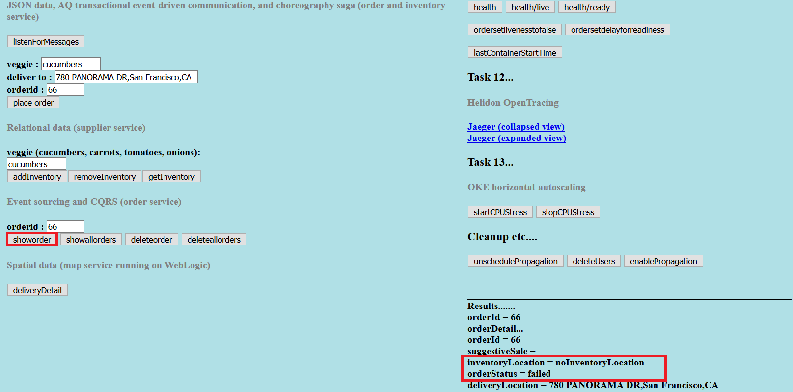

# Setup Service Broker and Messaging

## Introduction

This lab will show you how to create an Oracle Cloud Infrastructure Service
Broker and bind it to the two existing Autonomous Transaction Processing
databases. This way we will be able to connect the OKE Helidon microservices to
the ATP instances.


### Objectives
-   Create and bind OCI Service Broker to existing ATP instance
-   Setup Oracle Advanced Queuing in existing ATP instances

### What Do You Need?

* An Oracle Cloud paid account or free trial. To sign up for a trial account with $300 in credits for 30 days, click [here](http://oracle.com/cloud/free).
* OKE cluster and the ATP databases created
* Microservices code from GitHub built and deployed


## **STEP 5**: Verify streaming orders into the orders database

1. As you have successfully set up the databases, you can now test the
    “VeggieDash” Food Order application. You will interact with several
    different data types, check the event driven communication, event sourcing
    and Command Query Responsibility Segregation via order and inventory
    services. Go ahead and deploy the related order, inventory and supplier
    Helidon services. The Food Order application consists of the following
    tables shown in the ER diagram

   

    The Food Order application consists of a mock Mobile App (Frontend Helidon
    microservice) that places and shows orders via REST calls to the order-helidon
    microservice. Managing inventory is done with calls over gRPC to the
    supplier-helidon microservice, as shown in the below architecture diagram.

   

2. To deploy the order Helidon service, open the Cloud Shell and go to the
    order folder, using the following command.

    ```
    <copy>cd $MSDATAWORKSHOP_LOCATION/order-helidon</copy>
    ```

   

3. Build the order Helidon image, using the following command

    ```
    <copy>./build.sh</copy>
    ```

   

4. Once you’ve successfully built the docker image, go ahead and deploy it.

    ```
    <copy>./deploy.sh</copy>
    ```

   

5. Go ahead and execute the same steps for building and deploying the inventory
    Helidon service. We can actually speed this process by running all the above
    commands sequentially, using the following command.

    ```
    <copy>cd $MSDATAWORKSHOP_LOCATION/inventory-helidon ; ./build.sh ; ./deploy.sh</copy>
    ```

   

   Once the image has been deployed in a pod, you should see the following message.

   

6. Use the same method to build and deploy the supplier Helidon service. Use
    the following command.

    ```
    <copy>cd $MSDATAWORKSHOP_LOCATION/supplier-helidon-se ; ./build.sh ; ./deploy.sh</copy>
    ```

   

7. You can check that all images have been successfully deployed in pods by executing the following command.

    ```
    <copy>pods</copy>
    ```

   

8. The services are ready, and you can proceed to test the application
    mechanisms. Open the frontend microservices home page.

   

9. To allow the inventory service to listen for events click **listenForMessages**.

   

10. Check the inventory of a given item such as cucumbers, by typing `cucumbers`
    in the veggie field and clicking **getInventory**. You should see the inventory
    count result 0.

   

11. (Optional) If for any reason you see a different count, click **removeInventory** to bring back the count to 0.

12. Let’s try to place an order for cucumbers by clicking **place order**.

   

13. To check the status of the order, click **showorder**. You should see a failed
    order status.

   

   This is expected, because the inventory count for cucumbers was 0.

14. Click **addInventory** to add the cucumbers in the inventory. You
    should see the outcome being an incremental increase by 1.

   

15. Go ahead and place another order by clicking **place order**, and then click
    **showorder** to check the order status.

   

   

   The order should have been successfully placed, which is demonstrated with the order status showing success.

## Conclusion

Although this might look as a basic transactional mechanic, but the difference
in the microservices environment is that it’s not using a two-phase XA commit,
and therefore not using distributed locks. In a microservices environment with
potential latency in the network, service failures during the communication
phase or delays in long running activities, an application shouldn’t have
locking across the services. Instead, the pattern that is used is called the
saga pattern, which instead of defining commits and rollbacks, allows each
service to perform its own local transaction and published an event. The other
services listen to that event and perform the next local transaction.

In this architecture, there is a frontend service which mimics some mobile app
requests for placing orders. The frontend service is communicating with the
order service to place an order. The order service is then inserting the order
into the order database, while also sending a message describing that order.
This approach is called the event sourcing pattern, which due to its decoupled
non-locking nature is prominently used in microservices. Event sourcing pattern
entails sending an event message for every work or any data manipulation that
was conducted. In this example, while the order was inserted in the order
database, an event message was also created in the Advanced Queue of the Oracle
database.

Implementing the messaging queue inside the Oracle database provides a unique
capability of making the event sourcing actions (manipulating data and sending
an event message) atomically within the same transaction. The benefit of this
approach is that it provides a guaranteed once delivery, and it doesn’t require
writing additional application logic to handle possible duplicate message
deliveries, as it would be the case with solutions using separate datastores and
event messaging platforms.

In this example, once the order was inserted into the Oracle database, an event
message was also sent to the interested parties, which in this case is the
inventory service. The inventory service receives the message and checks the
inventory database, modifies the inventory if necessary, and sends back a
message if the inventory exists or not. The inventory message is picked up by
the order service which based on the outcome message, sends back to the frontend
a successful or failed order status.

This approach fits the microservices model, because the inventory service
doesn’t have any REST endpoints, and instead it purely uses messaging. The
services do not talk directly to each other, as each service is isolated and
accesses its datastore, while the only communication path is through the
messaging queue.

This architecture is tied with the Command Query Responsibility Segregation
(CQRS) pattern, meaning that the command and query operations use different
methods. In our example the command was to insert an order into the database,
while the query on the order is receiving events from different interested
parties and putting them together (from suggestive sales, inventory, etc).
Instead of actually going to suggestive sales service or inventory service to
get the necessary information, the service is receiving events.

Let’s look at the Java source code to understand how Advanced Queuing and Oracle
database work together.


What is unique to Oracle and Advanced Queuing is that a JDBC connection can be
invoked from AQ JMS session. Therefore we are using this JMS session to send and
receive messages, while the JDBC connection is used to manipulate the datastore.
This mechanism allows for both the JMS session and JDBC connection to exist
within same atomic local transaction.

You have successfully configured the databases with the necessary users, tables
and message propagation across the two ATP instances. You may proceed to the
next lab.


## Acknowledgements
* **Author** - Paul Parkinson, Consulting Member of Technical Staff
* **Adapted for Cloud by** -  Nenad Jovicic, Enterprise Strategist, North America Technology Enterprise Architect Solution Engineering Team
* **Contributors** - Jaden McElvey, Technical Lead - Oracle LiveLabs Intern
* **Last Updated By/Date** - Tom McGinn, June 2020

## See an issue?
Please submit feedback using this [form](https://apexapps.oracle.com/pls/apex/f?p=133:1:::::P1_FEEDBACK:1). Please include the *workshop name*, *lab* and *step* in your request.  If you don't see the workshop name listed, please enter it manually. If you would like for us to follow up with you, enter your email in the *Feedback Comments* section.
