# Data-centric microservices walkthrough with Helidon MP

## Introduction

This lab will show you how to deploy and run data-centric microservices highlighting use of different data types, data and transaction patterns, and various Helidon MP features.
The lab will then show you metrics, health checks and probes, and tracing that have been enabled via Helidon annotations and configuration.


### Objectives
-   Create and bind OCI Service Broker to existing ATP instance
-   Set up Oracle Advanced Queuing in existing ATP instances

### What Do You Need?

* An Oracle Cloud paid account or free trial. To sign up for a trial account with $300 in credits for 30 days, click [here](http://oracle.com/cloud/free).
* OKE cluster and the ATP databases created
* Microservices code from GitHub built and deployed


## **STEP 1**: Deploy GrubDash store services

1. After you have successfully set up the databases, you can now test the
    “GrubDash” Food Order application. You will interact with several
    different data types, check the event-driven communication, saga, event-sourcing
    and Command Query Responsibility Segregation via order and inventory
    services. Go ahead and deploy the related order, inventory and supplier
    Helidon services. The Food Order application consists of the following
    tables shown in the ER diagram:

   

    The Food Order application consists of a mock Mobile App (Frontend Helidon
    microservice) that places and shows orders via REST calls to the order-helidon
    microservice. Managing inventory is done with calls to the
    supplier-helidon microservice.  
    When an order is placed, the order service inserts the order in JSON format and in the same local transaction sends an `orderplaced` message using AQ JMS.
    The inventory service dequeues this message, validates and adjusts inventory, and enqueues a message stating the inventory location for the item ordered or an `inventorydoesnotexist` status if there is insufficient inventory.
    This dequeue, database operation, and enqueue are done within the same local transaction.
    Finally, the order service dequeues the inventory status message for the order and returns the resultant order success or failure to the frontend service.

    This is shown in the below architecture diagram.

   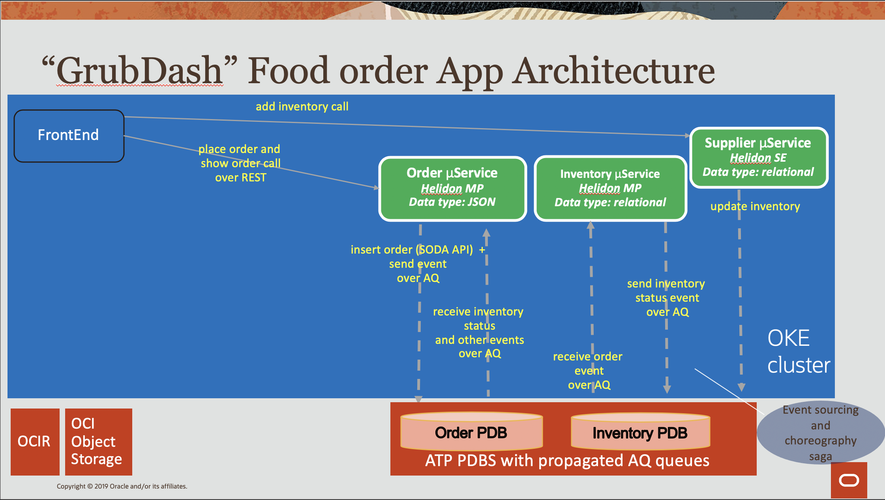

2. Open the Cloud Shell and go to the order folder, using the following command.

    ```
    <copy>cd $MSDATAWORKSHOP_LOCATION/order-helidon</copy>
    ```

   

3. Deploy it.

    ```
    <copy>./deploy.sh</copy>
    ```

   

4. Go ahead and execute the same steps for deploying the inventory
    Helidon service, using the following command.

    ```

    <copy>cd $MSDATAWORKSHOP_LOCATION/inventory-helidon  ; ./deploy.sh</copy>

    ```

   

   Once the image has been deployed in a pod, you should see the following message.

   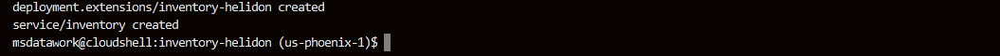

5. Use the same method to deploy the supplier Helidon service. Use
    the following command.

    ```
    <copy>cd $MSDATAWORKSHOP_LOCATION/supplier-helidon-se ; ./deploy.sh</copy>
    ```

   

6. You can check that all images have been successfully deployed in pods by executing the following command.

    ```
    <copy>pods</copy>
    ```

   

7. The services are ready, and you can proceed to test the application
    mechanisms.


## **STEP 2**: Verify order and inventory activity of GrubDash store

1.   Open the frontend microservices home page.
  If you need the URL, execute the `services` shortcut command and note the External-IP:PORT of the msdataworkshop/frontend/LoadBalancer.
    ```
    <copy>services</copy>
    ```

     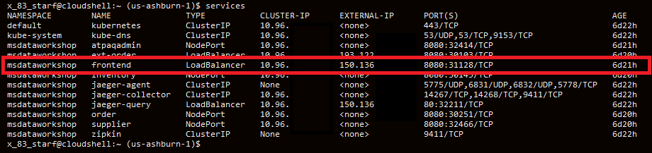

2. Click **Transactional** under **Labs**.

   

3. Check the inventory of a given item such as sushi, by typing `sushi`
    in the `food` field and clicking **Get Inventory**. You should see the inventory
    count result 0.

   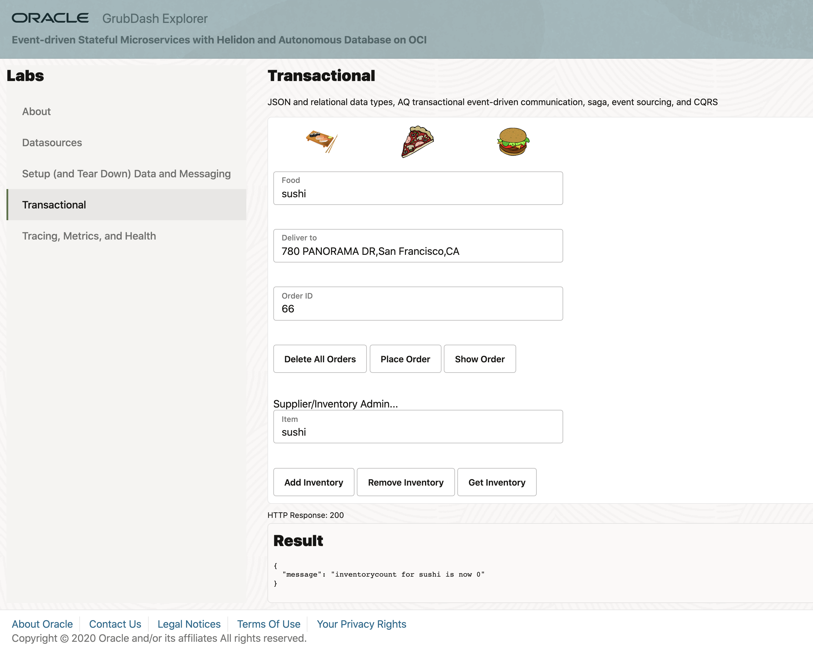

4. (Optional) If for any reason you see a different count, click **Remove Inventory** to bring back the count to 0.

5. Let’s try to place an order for sushi by clicking **Place Order**.

   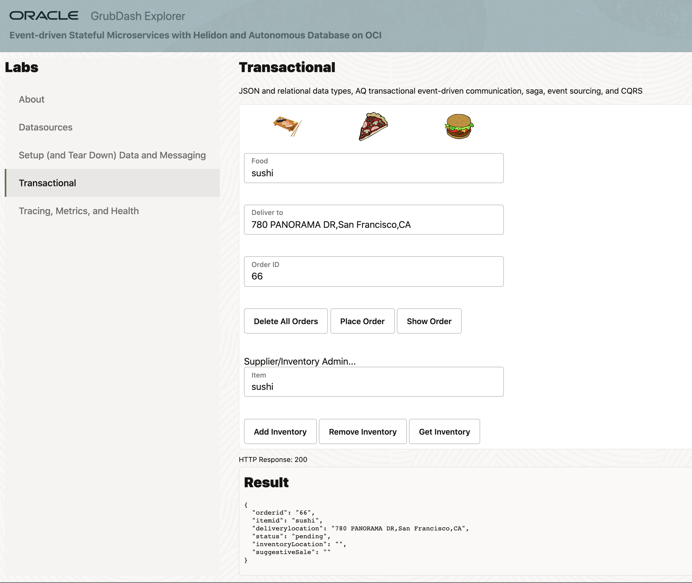

6. To check the status of the order, click **Show Order**. You should see a failed
    order status.

   

   This is expected, because the inventory count for sushi was 0.

7. Click **Add Inventory** to add the sushi in the inventory. You
    should see the outcome being an incremental increase by 1.

   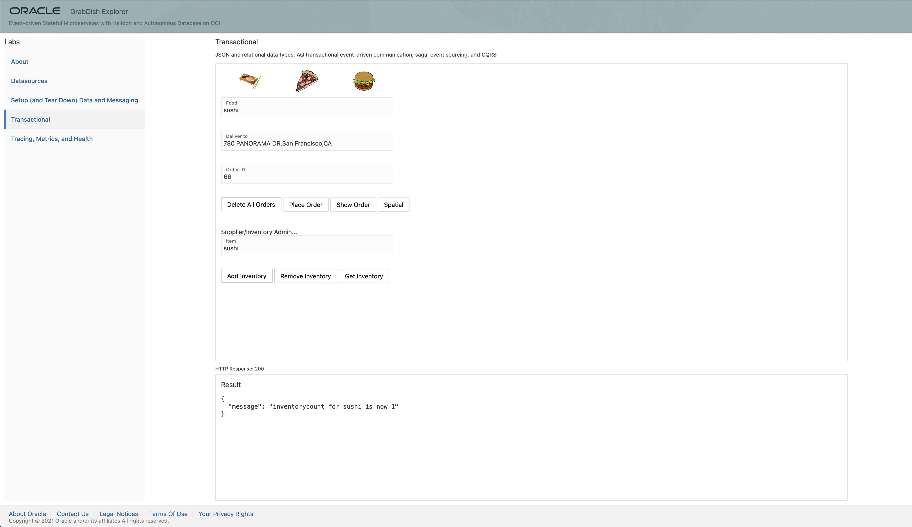

8. Go ahead and place another order by increasing the order ID by 1 (67) and then clicking **Place Order**. Next click **Show Order** to check the order status.

   

   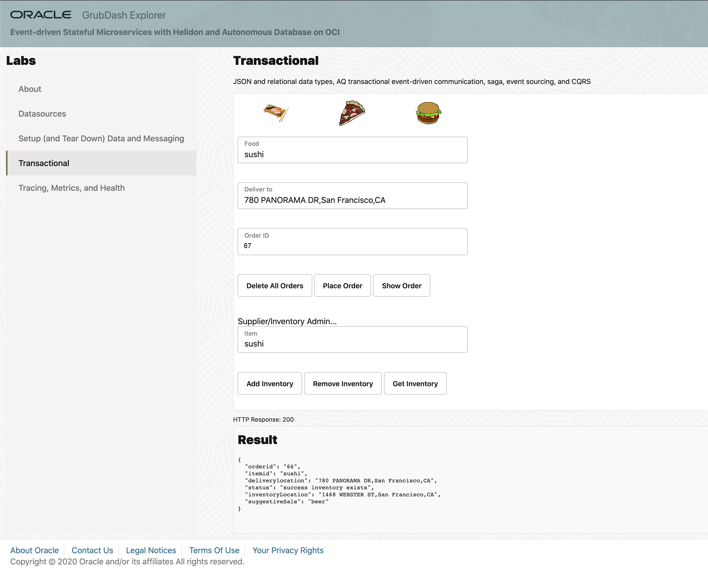

   The order should have been successfully placed, which is demonstrated with the order status showing success.


Although this might look like a basic transactional mechanic, the difference in the microservices environment is that it’s not using a two-phase XA commit, and therefore not using distributed locks. In a microservices environment with potential latency in the network, service failures during the communication phase or delays in long running activities, an application shouldn’t have locking across the services. Instead, the pattern that is used is called the saga pattern, which instead of defining commits and rollbacks, allows each service to perform its own local transaction and publish an event. The other services listen to that event and perform the next local transaction.

In this architecture, there is a frontend service which mimics some mobile app requests for placing orders. The frontend service is communicating with the order service to place an order. The order service is then inserting the order into the order database, while also sending a message describing that order. This approach is called the event sourcing pattern, which due to its decoupled non-locking nature is prominently used in microservices. The event sourcing pattern entails sending an event message for every work or any data manipulation that was conducted. In this example, while the order was inserted in the order database, an event message was also created in the Advanced Queue of the Oracle database.

Implementing the messaging queue inside the Oracle database provides a unique capability of performing the event sourcing actions (manipulating data and sending an event message) atomically within the same transaction. The benefit of this approach is that it provides a guaranteed once delivery, and it doesn’t require writing additional application logic to handle possible duplicate message deliveries, as it would be the case with solutions using separate datastores and event messaging platforms.

In this example, once the order was inserted into the Oracle database, an event message was also sent to the interested parties, which in this case is the inventory service. The inventory service receives the message and checks the inventory database, modifies the inventory if necessary, and sends back a message if the inventory exists or not. The inventory message is picked up by the order service which based on the outcome message, sends back to the frontend a successful or failed order status.

This approach fits the microservices model, because the inventory service doesn’t have any REST endpoints, and instead it purely uses messaging. The services do not talk directly to each other, as each service is isolated and accesses its datastore, while the only communication path is through the messaging queue.

This architecture is tied with the Command Query Responsibility Segregation (CQRS) pattern, meaning that the command and query operations use different methods. In our example the command was to insert an order into the database, while the query on the order is receiving events from different interested parties and putting them together (from suggestive sales, inventory, etc). Instead of actually going to suggestive sales service or inventory service to get the necessary information, the service is receiving events.

Let’s look at the Java source code to understand how Advanced Queuing and Oracle database work together.


What is unique to Oracle and Advanced Queuing is that a JDBC connection can be invoked from an AQ JMS session. Therefore we are using this JMS session to send and receive messages, while the JDBC connection is used to manipulate the datastore. This mechanism allows for both the JMS session and JDBC connection to exist within same atomic local transaction.

You have successfully configured the databases with the necessary users, tables and message propagation across the two ATP instances. You may proceed to the next step.

## **STEP 3**: Verify metrics

1. Notice @Timed and @Counted annotations on placeOrder method of $MSDATAWORKSHOP_LOCATION/order-helidon/src/main/java/io/helidon/data/examples/OrderResource.java

   


2. Click **Tracing, Metrics, and Health**

   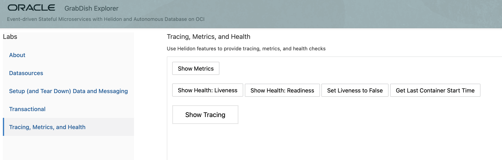

3. Click **Show Metrics** and notice the long string of metrics (including those from placeOrder timed and counted) in prometheus format.

   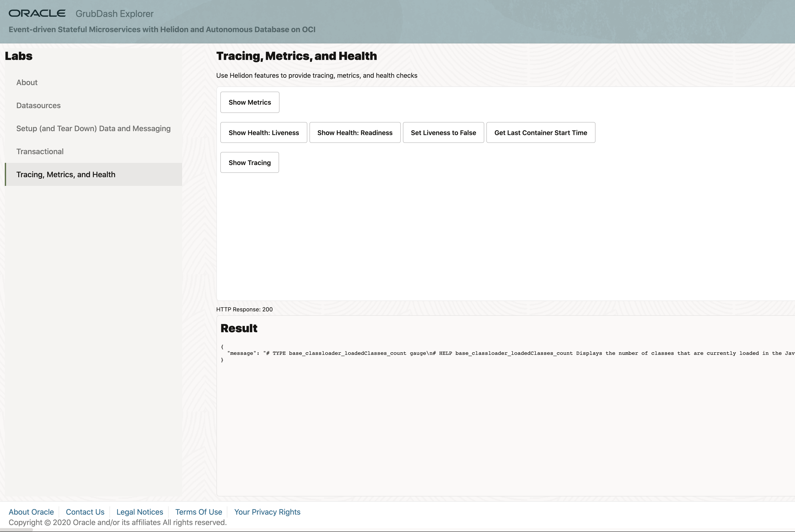


## **STEP 4**: Verify health

1. Oracle Cloud Infrastructure Container Engine for Kubernetes (OKE) provides health probes which check a given    container for its liveness (checking if the pod is up or down) and readiness (checking if the pod is ready to take
requests or not). In this STEP you will see how the probes pick up the health that the Helidon microservice advertises. Click **Tracing, Metrics, and Health** and click **Show Health: Liveness**

   

2. Notice health check class at `$MSDATAWORKSHOP_LOCATION/order-helidon/src/main/java/io/helidon/data/examples/OrderServiceLivenessHealthCheck.java` and how the liveness method is being calculated.

    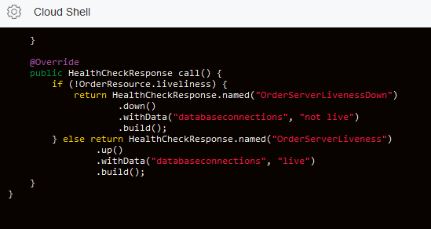

3. Notice liveness probe specified in `$MSDATAWORKSHOP_LOCATION/order-helidon/order-helidon-deployment.yaml` The `livenessProbe` can be set up with different criteria, such as reading from a file or an HTTP GET request. In this example the OKE health probe will use HTTP GET to check the /health/live and /health/ready addresses every 3 seconds, to see the liveness and readiness of the service.

   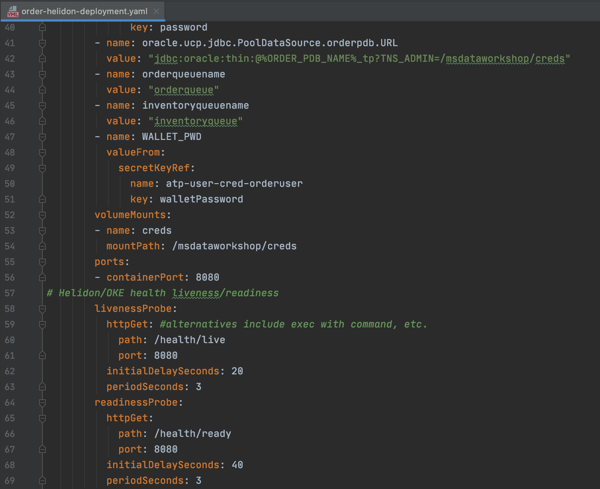

4. In order to observe how OKE will manage the pods, the microservice has been created with the possibility to set up the liveliness to “false”. Click **Get Last Container Start Time** and note the time the container started.

   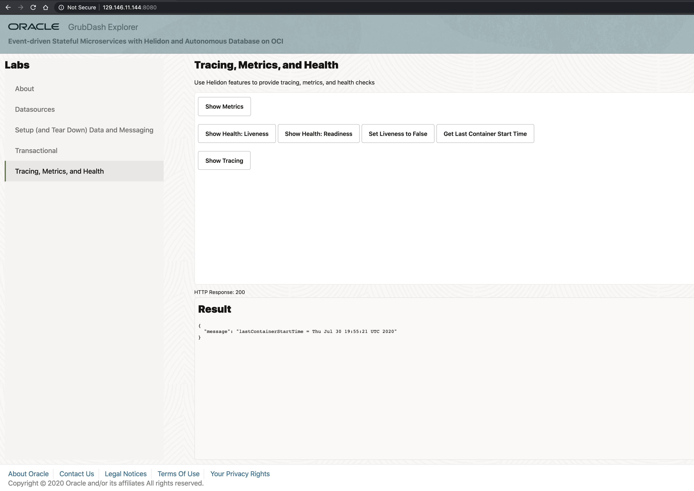

5. Click **Set Liveness to False** . This will cause the Helidon Health Check to report false for liveness which will result in OKE restarting the pod/microservice

   

6. Click **Get Last Container Start Time**.
   It will take a minute or two for the probe to notice the failed state and conduct the restart and as it does you may see a connection refused exception.

   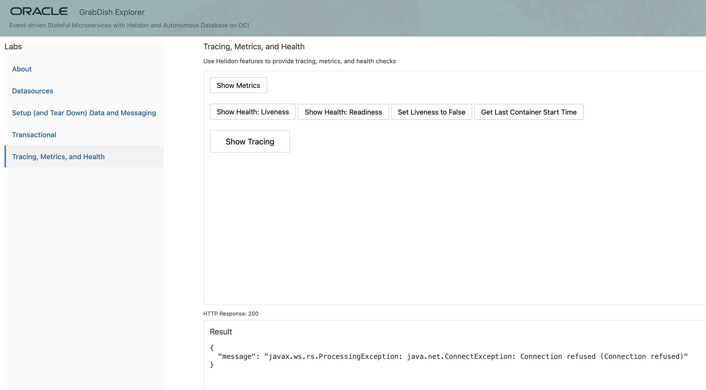

   Eventually you will see the container restart and note the new/later container startup time reflecting that the pod was restarted.

   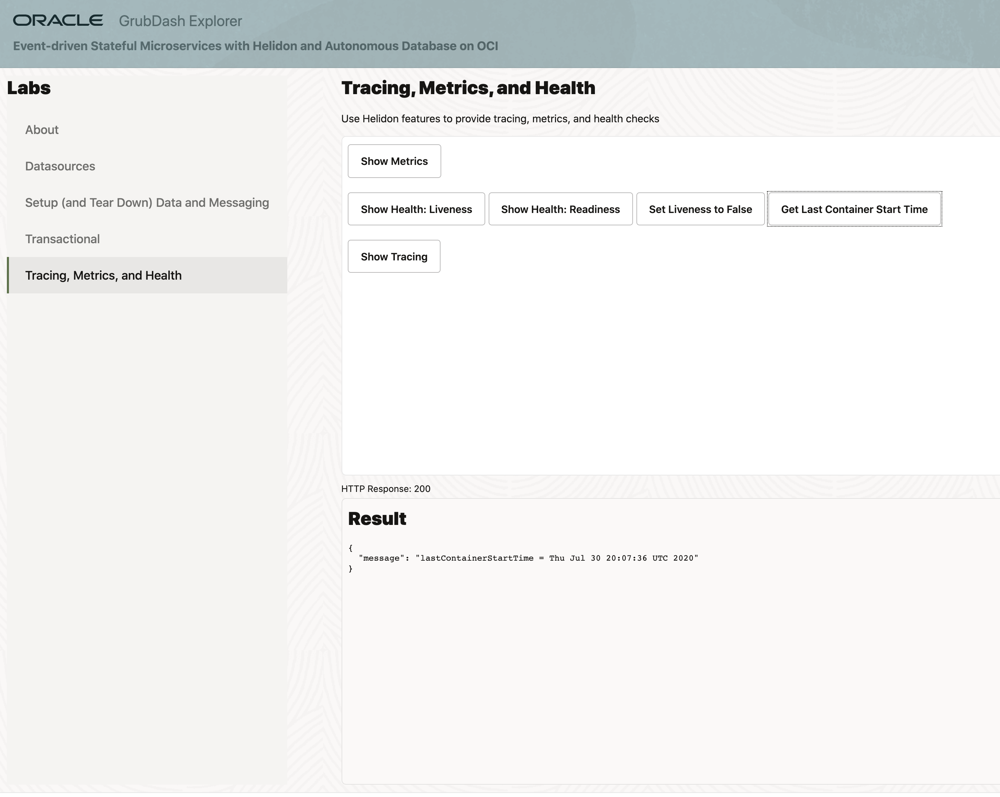


## **STEP 5**: Verify tracing

1. Notice @Traced annotations on `placeOrder` method of `$MSDATAWORKSHOP_LOCATION/frontend-helidon/src/main/java/io/helidon/data/examples/FrontEndResource.java` and `placeOrder` method of `$MSDATAWORKSHOP_LOCATION/order-helidon/src/main/java/io/helidon/data/examples/OrderResource.java`
   Also notice the additional calls to set tags, baggage, etc. in this `OrderResource.placeOrder` method.

   

2. Place an order if one was not already created successfully in STEP 1 of this Lab.

3. Click **Show Tracing** to open the Jaeger UI. Select `frontend.msdataworkshop` from the `Service` dropdown menu and click **Find Traces**.

    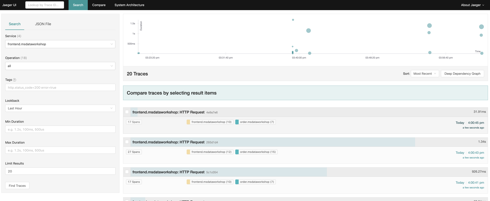

   Select a trace with a large number of spans and drill down on the various spans of the trace and associated information. In this case we see placeOrder order, saga, etc. information in logs, tags, and baggage.

   *If it has been more than an hour since the trace you are looking for, select a an appropriate value for Lookback and click Find Traces.*

    


## Acknowledgements
* **Author** - Paul Parkinson, Dev Lead for Data and Transaction Processing, Oracle Microservices Platform, Helidon
* **Adapted for Cloud by** - Nenad Jovicic, Enterprise Strategist, North America Technology Enterprise Architect Solution Engineering Team
* **Documentation** - Lisa Jamen, User Assistance Developer - Helidon
* **Contributors** - Jaden McElvey, Technical Lead - Oracle LiveLabs Intern
* **Last Updated By/Date** - Tom McGinn, June 2020

## Need Help?
Please submit feedback or ask for help using this [LiveLabs Support Forum](https://community.oracle.com/tech/developers/categories/building-microservices-with-oracle-converged-database). Please login using your Oracle Sign On and click the **Ask A Question** button to the left.  You can include screenshots and attach files.  Communicate directly with the authors and support contacts.  Include the *lab* and *step* in your request. 
