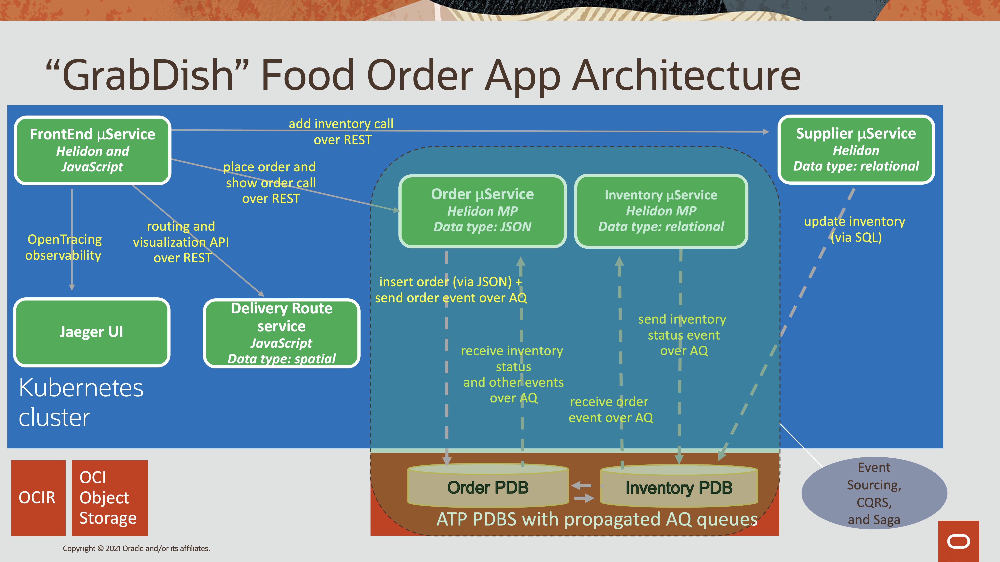

# Polyglot Microservices

## Introduction

The illustration below shows four microservices – Order, Inventory, Delivery, Supplier, and the infrastructure required to run them.



For more information on microservices visit http://developer.oracle.com/microservices

This lab will show you how to switch the Inventory microservice to a Python, Node.js, .NET, Go or Java Helidon SE implementation while retaining the same application functionality.

Estimates Lab Time - 10 minutes

Quick walk through on how to switch the Inventory microservice to Python while retaining the same application functionality.

[](youtube:zltpjX721PA)

### Objectives

-   Undeploy the existing Java Helidon MP Inventory microservice
-   Deploy an alternate implementation of the Inventory microservice and test the application functionality

### Prerequisites

This lab assumes you have already completed the previous labs.

## **STEP 1**: Undeploy the Java Helidon MP Inventory Microservice

1. To undeploy the Inventory Helidon MP service, open the Cloud Shell and go to the
    inventory-helidon folder, using the following command.

    ```
    <copy>cd $GRABDISH_HOME/inventory-helidon ; ./undeploy.sh</copy>
    ```

   

## **STEP 2**: Deploy an alternate implementation of the Inventory Microservice

In this step you can choose between three different implementations of the Inventory Microservice: (1) Java Helidon SE, (2) Python, or (3) Node.js

1. Select one of the alternate implementations and deploy the service for the selected implementation.  

   If you selected **Python**, deploy this service:

    ```
    <copy>cd $GRABDISH_HOME/inventory-python; ./deploy.sh</copy>
    ```

   If you selected **Node.js**, deploy this service:

    ```
    <copy>cd $GRABDISH_HOME/inventory-nodejs; ./deploy.sh</copy>
    ```

   If you selected **.NET**, deploy this service:

    ```
    <copy>cd $GRABDISH_HOME/inventory-dotnet; ./deploy.sh</copy>
    ```

   If you selected **Go**, deploy this service:

    ```
    <copy>cd $GRABDISH_HOME/inventory-go; ./deploy.sh</copy>
    ```

   If you selected **Java Helidon SE**, deploy this service:

    ```
    <copy>cd $GRABDISH_HOME/inventory-helidon-se; ./deploy.sh</copy>
    ```

## **STEP 3**: Verify application functionality

1. Repeat **Lab 2: Step 3** to verify that the functionality of the GrabDish store remains the same while using the new implementation.  You will need to use different order ID's, for example 166 and 167.

## **STEP 4**: Re-deploy the Java Helidon MP Inventory Microservice

1. To undeploy any other inventory services and then deploy the Inventory Helidon MP service, issue the following commands.

    ```
    <copy>
    for i in inventory-helidon-se inventory-python inventory-nodejs inventory-dotnet inventory-go; do cd $GRABDISH_HOME/$i; ./undeploy.sh; done
    cd $GRABDISH_HOME/inventory-helidon ; ./deploy.sh
    cd $GRABDISH_HOME
    </copy>
    ```

## Acknowledgements
* **Authors** - Richard Exley, Maximum Availability Architecture; Curtis Dinkel, Maximum Availability Architecture; Rena Granat, Maximum Availability Architecture; Paul Parkinson, Developer Evangelist
* **Adapted for Cloud by** -  Nenad Jovicic, Enterprise Strategist, North America Technology Enterprise Architect Solution Engineering Team
* **Documentation** - Lisa Jamen, User Assistance Developer - Helidon
* **Contributors** - Jaden McElvey, Technical Lead - Oracle LiveLabs Intern
* **Last Updated By/Date** - Richard Exley, April 2021
