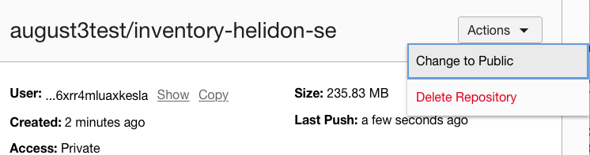
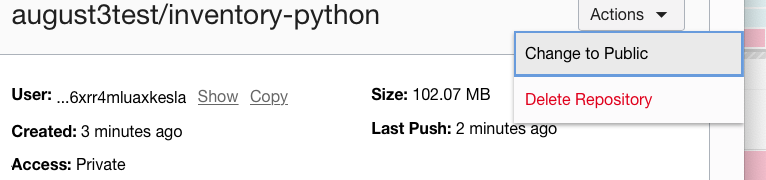

# Review Polyglot Code
## Introduction

This lab will show you how to switch the Inventory microservice to a Python, Node.js or Java Helidon SE implementation while retaining the same application functionality.


### Objectives
-   Undeploy the existing Java Helidon MP Inventory microservice
-   Deploy an alternate implementation of the Inventory mmicroservice and test the application functionality

### What Do You Need?

This lab assumes you have already completed the earlier labs in this workshop.

## **STEP 1**: Undeploy the Java Helidon MP Inventory Microservice

1. To undeploy the Inventory Helidon service, open the Cloud Shell and go to the
    inventory-helidon folder, using the following command.

    ```
    <copy>cd $MSDATAWORKSHOP_LOCATION/inventory-helidon ; ./undeploy.sh</copy>
    ```

   

## **STEP 2**: Deploy and alternate implementation of the Inventory Microservice

In this step you can choose between three different implementations of the Inventory Microservice - 1. Java Helidon SE, 2. Python, or 3. Node.js

1. Java Helidon SE: To build the Java Helidon SE implementation of the Inventory Microservice, open the Cloud Shell and execute the following command the following command.
    ```
    <copy>cd $MSDATAWORKSHOP_LOCATION/inventory-helidon-se ; ./build.sh </copy>
    ```

   

   Make the new repository public:

   

   Deploy the new microservice:

    ```
    <copy>cd $MSDATAWORKSHOP_LOCATION/inventory-helidon-se; ./deploy.sh</copy>
    ```

2. Python: To build the Python implementation of the Inventory Microservice, open the Cloud Shell and execute the following command the following command.
    ```
    <copy>cd $MSDATAWORKSHOP_LOCATION/inventory-python ; ./build.sh </copy>
    ```
   

   Make the new repository public:

   

   Deploy the new microservice:

    ```
    <copy>cd $MSDATAWORKSHOP_LOCATION/inventory-python; ./deploy.sh</copy>
    ```

3. Node.js: To build the Node.js implementation of the Inventory Microservice, open the Cloud Shell and execute the following command the following command.
    ```
    <copy>cd $MSDATAWORKSHOP_LOCATION/inventory-nodejs ; ./build.sh</copy>
    ```
   

   Make the new repository public:

   

   Deploy the new microservice:

    ```
    <copy>cd $MSDATAWORKSHOP_LOCATION/inventory-nodejs; ./deploy.sh</copy>
    ```

## **STEP 3**: Verify Application Functionality

1. Open the frontend microservices home page.

2. Click **Transactional** under **Labs**.

   

3. Check the inventory of a given item such as sushi, by typing `sushi`
    in the `food` field and clicking **Get Inventory**. You should see the inventory
    count result 0.

   

4. (Optional) If for any reason you see a different count, click **Remove Inventory** to bring back the count to 0.

5. Let’s try to place an order for sushi by clicking **Place Order**.

   

6. To check the status of the order, click **Show Order**. You should see a failed
    order status.

   

   This is expected, because the inventory count for sushi was 0.

7. Click **Add Inventory** to add the sushi in the inventory. You
    should see the outcome being an incremental increase by 1.

   

8. Go ahead and place another order by clicking **Place Order**, and then click
    **Show Order** to check the order status.

   

   

   The order should have been successfully placed, which is demonstrated with the order status showing success.


## Conclusion


## Acknowledgements
* **Authors** - Richard Exley, Consulting Member of Technical Staff; Curtis Dinkel, Principal Member of Technical Staff; Rena Granat, Consulting Member of Technical Staff
* **Adapted for Cloud by** -  Nenad Jovicic, Enterprise Strategist, North America Technology Enterprise Architect Solution Engineering Team
* **Contributors** - Jaden McElvey, Technical Lead - Oracle LiveLabs Intern
* **Last Updated By/Date** - Tom McGinn, June 2020

See an issue?  Please open up a request [here](https://github.com/oracle/learning-library/issues).   Please include the workshop name and lab in your request.
