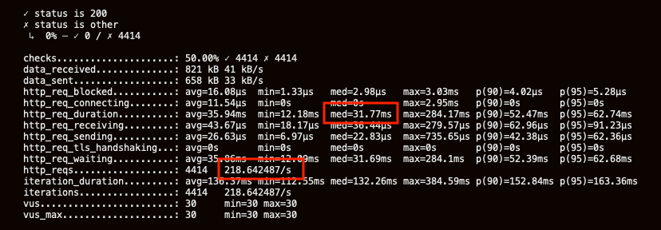
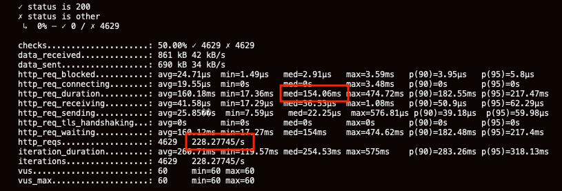
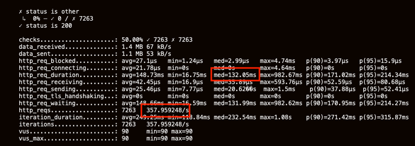
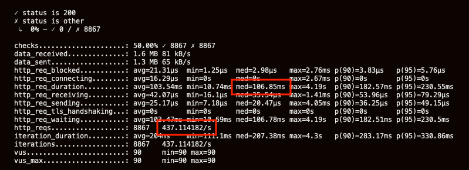
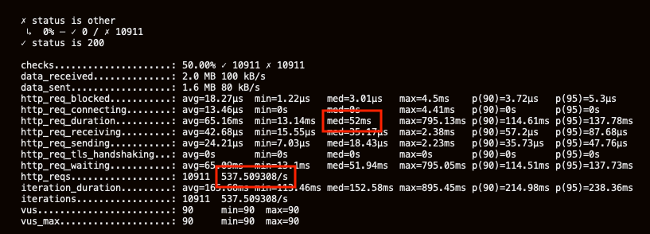

# Scaling The Application
## Introduction

This lab will show how the application can be scaled at the application and database tiers to maintain optimal performance.


### Objectives
-   Install the k6 load testing tool
-   Start the external load balancer for the order-helidon microservice
-   Test the performance of the existing deployment and identify the point at which performance begins to degrade
-   Scale the application tier to improve performance and identify the point at which further application tier scaling does not help
-   Scale the database tier and demonstrate how performance is improved

### What Do You Need?

This lab assumes that you have already completed labs 1 through 4.

## **STEP 1**: Setup: Install the k6 load testing tool and start and external load balancer for the Order service

1. To install the k6 tool.

    ```
    <copy>cd $MSDATAWORKSHOP_LOCATION/k6; wget https://github.com/loadimpact/k6/releases/download/v0.27.0/k6-v0.27.0-linux64.tar.gz; tar -xzf k6-v0.27.0-linux64.tar.gz; ln k6-v0.27.0-linux64/k6 k6</copy>
    ```


2. Start an external load balancer for the order service.

    ```
    <copy>cd $MSDATAWORKSHOP_LOCATION/order-helidon; kubectl create -f ext_order_service.yaml -n msdataworkshop</copy>
    ```

    Repeatedly view the service until the external IP address has been allocated.  Make a note of the IP address.

    ```
    <copy>services</copy>
    ```


   Set the LB environment variable to the external IP address of the ext-order service.

    ```
    <copy>export LB='123.123.123.123'</copy>
    ```

## **STEP 2**: Load Test and Scale the Application Tier

1. Execute a test with 30 virtual users by executing the following command.
 
    ```
    <copy>cd $MSDATAWORKSHOP_LOCATION/k6; ./test.sh 30</copy>
    ```

   Note the median response time for the requests and the request rate.



2. Execute a test with 60 virtual users by executing the following command.
 
    ```
    <copy>cd $MSDATAWORKSHOP_LOCATION/k6; ./test.sh 60</copy>
    ```

   Note the median response time for the requests and the request rate.  Note how the response time has degraded and the request rate has not improved.



3. Scale to 2 service replicas.
 
    ```
    <copy>kubectl scale deployment.apps/order-helidon --replicas=2 -n msdataworkshop</copy>
    ```
 
   List the running pods.
 
    ```
    <copy>pods</copy>
    ```

   Note there are now two order-helidon replicas.  Keep polling until both replicas are ready.


4. Reexecute the test with 60 virtual users by executing the following command.
 
    ```
    <copy>cd $MSDATAWORKSHOP_LOCATION/k6; ./test.sh 60</copy>
    ```

   Note the median response time for the requests.  Throughput has increased and response time has returned to normal.


5. Execute a test with 90 virtual users by executing the following command.
 
    ```
    <copy>cd $MSDATAWORKSHOP_LOCATION/k6; ./test.sh 90</copy>
    ```

   Note the median response time for the requests and the request rate.  Note how the response time has degraded and the request rate has not improved.



6. Scale to 3 Replicas.
 
    ```
    <copy>kubectl scale deployment.apps/order-helidon --replicas=3 -n msdataworkshop</copy>
    ```
 
   List the running pods.
 
    ```
    <copy>pods</copy>
    ```

   Note there are now three order-helidon replicas.  Keep polling until all replicas are ready.


7. Reexecute the test with 90 virtual users by executing the following command.

    ```
    <copy>cd $MSDATAWORKSHOP_LOCATION/k6; ./test.sh 90</copy>
    ```

  Note the median response time for the requests and the request rate.  Note how the response time is still degraded and the request rate has not improved.



## **STEP 3**: Load Test and Scale the Database Tier

1. Scale the Order DB ATP database to 2 OCPUs.


   Waiting until the scaling has completed (Lifecycle State: Available).


2. Reexecute the test with 90 virtual users by executing the following command.

    ```
    <copy>cd $MSDATAWORKSHOP_LOCATION/k6; ./test.sh 90</copy>
    ```

   Note the median response time for the requests and the request rate.  Throughput has increased and response time has improved.



## Conclusion

Application and Database tiers can be scaled to maintain application performance and throughput during periods of increased loads.

## Acknowledgements
* **Authors** - Richard Exley, Maximum Avaiability Architecture; Curtis Dinkel, Maximum Avaiability Architecture; Rena Granat, Maximum Avaiability Architecture;
* **Adapted for Cloud by** -  Nenad Jovicic, Enterprise Strategist, North America Technology Enterprise Architect Solution Engineering Team
* **Contributors** - Jaden McElvey, Technical Lead - Oracle LiveLabs Intern
* **Last Updated By/Date** - Tom McGinn, June 2020

See an issue?  Please open up a request [here](https://github.com/oracle/learning-library/issues).   Please include the workshop name and lab in your request.
