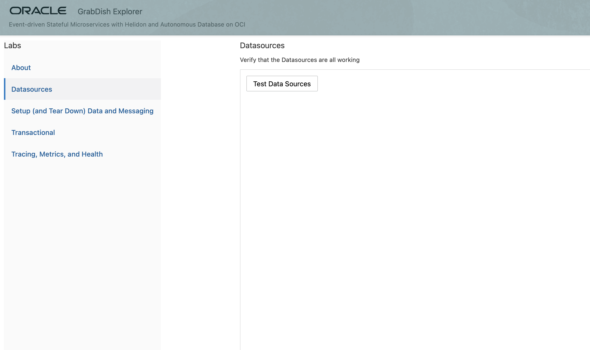
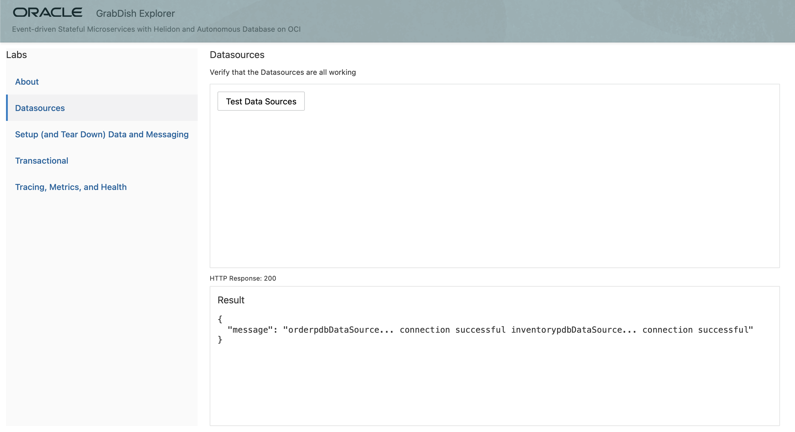
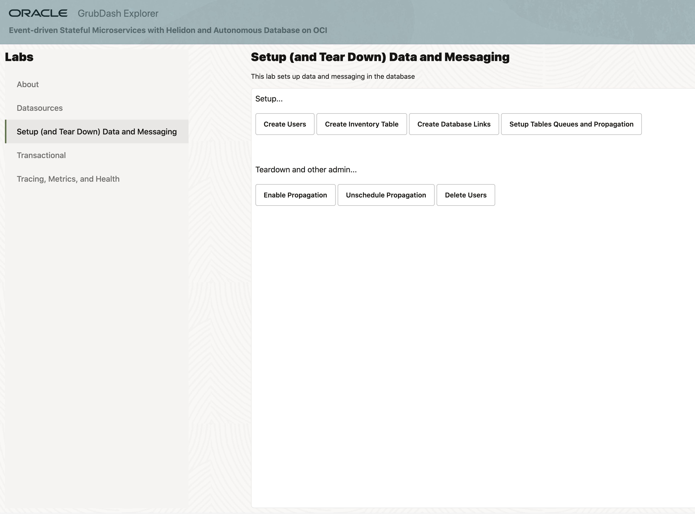
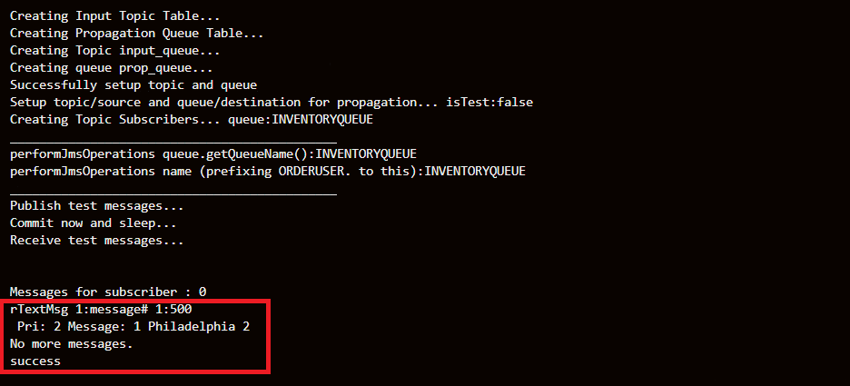

# Setup ATP Connectivity, Data, and Messaging

## Introduction

This lab will show you how to create kubernetes secrets for the two existing Autonomous Transaction Processing (ATP)
databases. Secrets will allow us to connect the OKE Helidon microservices to
the ATP instances.

### Objectives
-   Create secrets to connect to existing ATP instances
-   Set up data and Oracle Advanced Queuing in existing ATP instances

### What Do You Need?

* An Oracle Cloud paid account or free trial. To sign up for a trial account with $300 in credits for 30 days, click [here](http://oracle.com/cloud/free).
* OKE cluster and the ATP databases created
* Microservices code from GitHub (or zip) built and deployed

## **STEP 1**: Create Secrets To Connect To ATP PDBs
You will run a script that will download the connection information (wallet, tnsnames.ora, etc.) and then create kubernetes secrets from the information that will be used to connect to the ATP instances provisioned earlier.

1.  Verify that the ATP PDB values are set in the `msdataworkshop.properties` file you created.

2.  Change directory into atp-secrets-setup.

    ```
    <copy>cd $MSDATAWORKSHOP_LOCATION/atp-secrets-setup</copy>
    ```

3.  Execute createAll.sh and notice output creating secrets.

    ```
    <copy>./createAll.sh</copy>
    ```

  

4.  Execute `msdataworkshop` and notice secrets for order and inventory database and users.
    ```
    <copy>msdataworkshop</copy>
    ```

  

  If there is an issue, execute `deleteAll.sh` to delete all secrets in workshop namespace
    ```
    <copy>./deleteAll.sh</copy>
    ```

  


## **STEP 2**: Verify and understand ATP connectivity via Helidon microservice deployment in OKE
You will verify the connectivity from the frontend Helidon microservice to the atp admin microservice connecting to the ATP PDBs.

1.  First, let’s analyze the Kubernetes deployment YAML file: `atpaqadmin-deployment.yaml`.

    ```
    <copy>cat $MSDATAWORKSHOP_LOCATION/atpaqadmin-deployment.yaml</copy>
    ```

    The volumes are set up and credentials are brought from each of the bindings
    (inventory and order). The credential files in the secret are base64 encoded
    twice and hence they need to be decoded for the program to use them, which
    is what the `initContainer` takes care. Once done, they will be mounted for
    access from the container `helidonatp`. The container also has the DB
    connection information such as the JDBC URL, DB credentials and Wallet,
    created in the previous step.

2.  Let’s analyze the `microprofile-config.properties` file.

    ```
    <copy>cat $MSDATAWORKSHOP_LOCATION/atpaqadmin/src/main/resources/META-INF/microprofile-config.properties</copy>
    ```

    This file defines the `microprofile` standard. It also has the definition of
    the data sources that will be injected. You will be using the universal
    connection pool which takes the JDBC URL and DB credentials to connect and
    inject the datasource. The file has default values which will be overwritten
    with the values specific for our Kubernetes deployment.

3.  Let’s also look at the microservice source file `ATPAQAdminResource.java`.

    ```
    <copy>cat $MSDATAWORKSHOP_LOCATION/atpaqadmin/src/main/java/oracle/db/microservices/ATPAQAdminResource.java</copy>
    ```

    Look for the inject portion. The `@Inject` will have the two data sources
    under `@Named` as “orderpdb” and “inventorypdb” which were mentioned in the
    `microprofile-config.properties` file.

4.  Go into the ATP admin folder.

    ```
    <copy>cd $MSDATAWORKSHOP_LOCATION/atpaqadmin</copy>
    ```


5.  Setup information necessary for ATP DB links and AQ propagation and create the `atpaqadmin` deployment and service using the following command.

    ```
    <copy>./deploy.sh</copy>
    ```

  

6.  Once successfully deployed, verify the existence of the deployment and
    service using the following command. You should notice that we now have the
    `atpaqadmin` pod up and running.

    ```
    <copy>pods</copy>
    ```

  

7.  Use the frontend LoadBalancer URL `http://<external-IP>:8080` to open the frontend webpage. If you need the URL, execute the `services` shortcut command and note the External-IP of the msdataworkshop/frontend/LoadBalancer.

  

8. Click **Datasources** tab and then **Test Data Sources** button.

  

  The frontend is calling the `atpaqadmin` service and has successfully established
  connections to both databases `orderpdb` and `inventorypdb`.

9.  Open the frontend microservice home page and click the following buttons in
    order: **Create Users**, **Create Inventory Table**, **Create Database Links**,
    **Setup Tables Queues and Propagation**.

  

  The results of `Setup Tables Queues and Propagation` should take a couple of minutes
  to complete, therefore we could open the Cloud Shell and check the logs, as we
  are waiting until all the messages have been received and confirmed.

17. (Optional) While waiting for `Setup Tables Queues and Propagation` to complete, open the Cloud Shell and check the logs using the following command:

    ```
    <copy>logpod admin</copy>
    ```

  

  We will see testing messages going in both directions between the two ATP
  instances across the DB link

  

18. (Optional) If it is necessary to restart, rerun the process or clean up the
    database:

    If **Setup Tables Queues and Propagation** was executed, you need to run
    **Unschedule Propagation** first.

    Afterwards, click **Delete Users**.

## Acknowledgements
* **Author** - Paul Parkinson, Dev Lead for Data and Transaction Processing, Oracle Microservices Platform, Helidon
* **Adapted for Cloud by** - Nenad Jovicic, Enterprise Strategist, North America Technology Enterprise Architect Solution Engineering Team
* **Documentation** - Lisa Jamen, User Assistance Developer - Helidon
* **Contributors** - Jaden McElvey, Technical Lead - Oracle LiveLabs Intern
* **Last Updated By/Date** - Tom McGinn, June 2020

## See an issue?
Please submit feedback using this [form](https://apexapps.oracle.com/pls/apex/f?p=133:1:::::P1_FEEDBACK:1). Please include the *workshop name*, *lab* and *step* in your request.  If you don't see the workshop name listed, please enter it manually. If you would like for us to follow up with you, enter your email in the *Feedback Comments* section.
