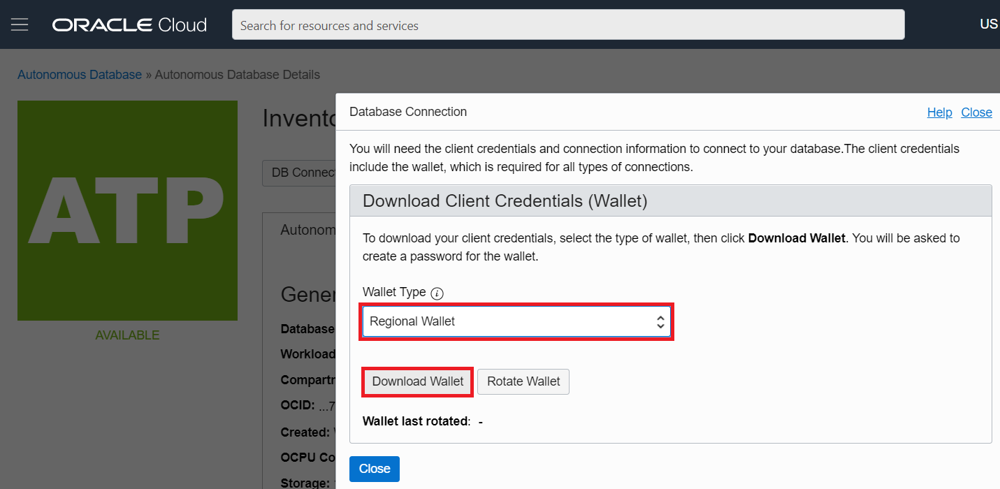
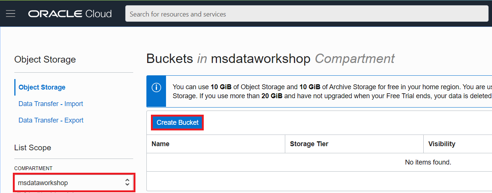
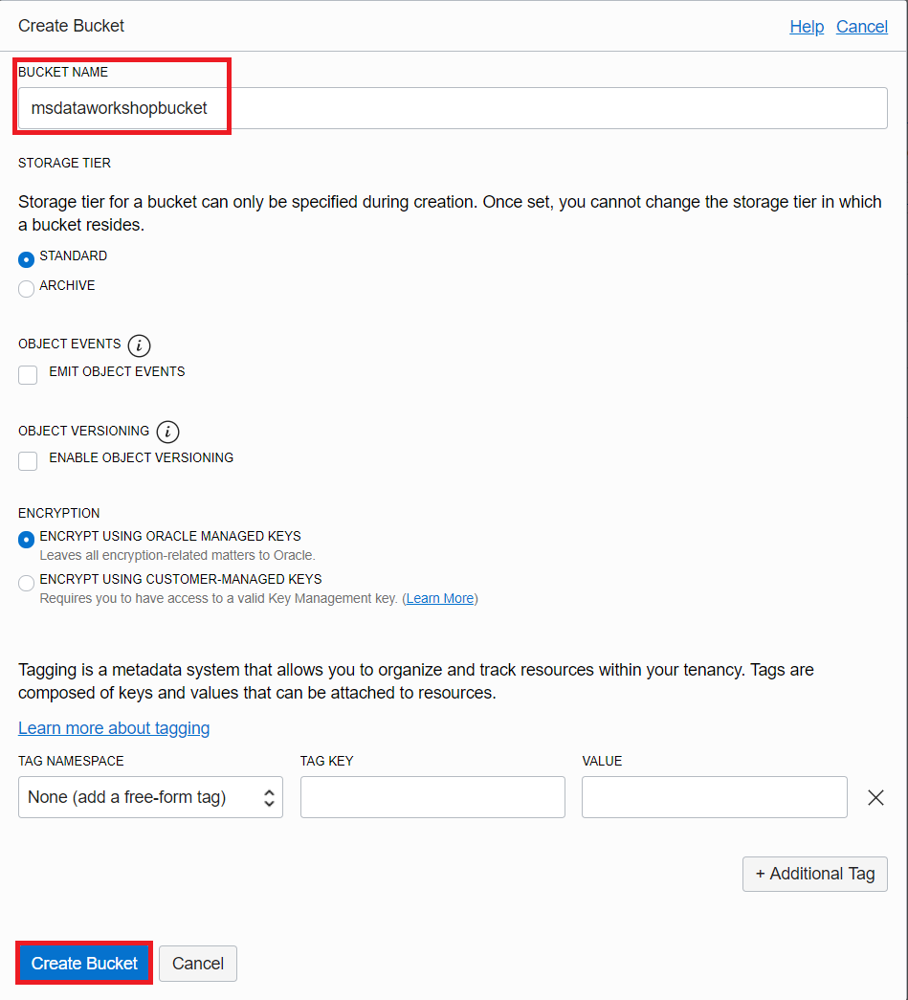
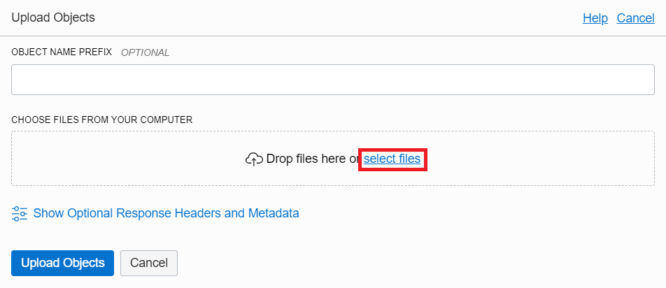
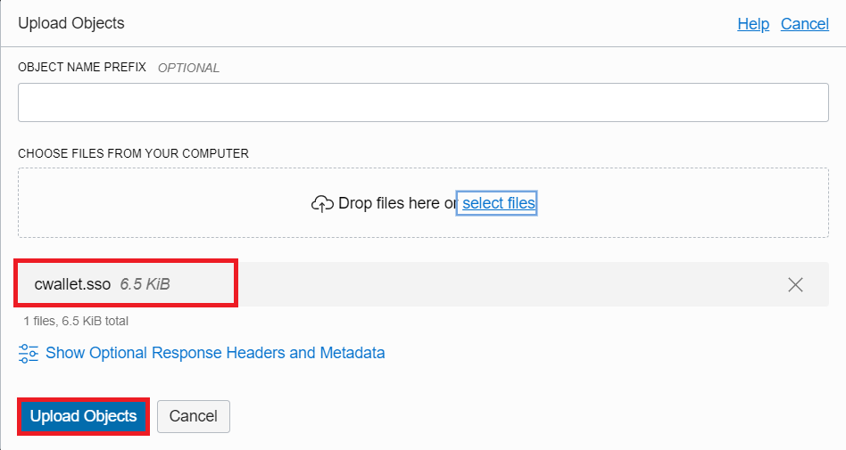
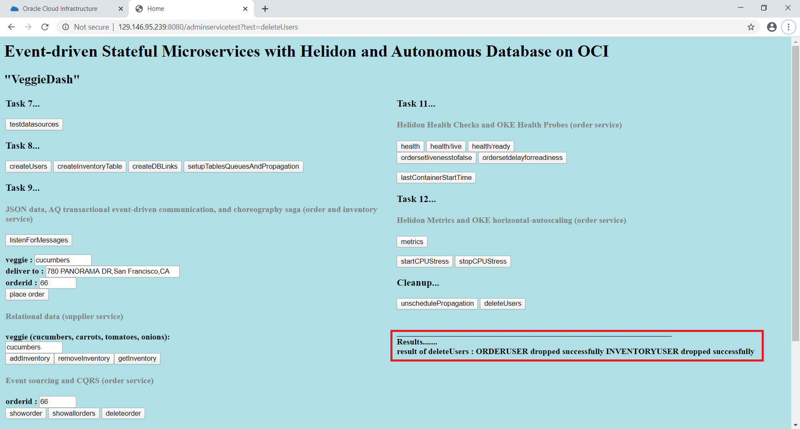

# Setup ATP Connectivity, Data, and Messaging

## Introduction

This lab will show you how to create kubernetes secrets for the two existing Autonomous Transaction Processing
databases. This way we will be able to connect the OKE Helidon microservices to
the ATP instances.

### Objectives
-   Create secrets to connect to existing ATP instances
-   Setup data and Oracle Advanced Queuing in existing ATP instances

### What Do You Need?

* An Oracle Cloud paid account or free trial. To sign up for a trial account with $300 in credits for 30 days, click [here](http://oracle.com/cloud/free).
* OKE cluster and the ATP databases created
* Microservices code from GitHub (or zip) built and deployed

## **STEP 1**: Create Secrets To Connect To ATP PDBs
You will run a script that will download the connection information (wallet, tnsnames.ora, etc.) and then create kubernetes secrets from the information that will be used to connect to the ATP instrances provisioned earlier.

1.  Verify values are set in $MSDATAWORKSHOP_LOCATION/msdataworkshop.properties 

2.  cd into atp-secrets-setup dir.

    ```
        <copy>cd $MSDATAWORKSHOP_LOCATION/atp-secrets-setup</copy>
        ``` 

3.  execute createAll.sh and notice output creating secrets.

    ```
        <copy>./createAll.sh</copy>
        ``` 

  

4.  execute msdataworkshop and notice secrets for order and inventory database and users.

    ```
        <copy>msdataworkshop</copy>
        ``` 

  

  If there is an issue, execute deleteAll.sh to delete all secrets in workshop namespace

    ```
        <copy>./deleteAll.sh</copy>
        ``` 

  
    ```

## **STEP 2**: Verify and understand ATP connectivity via Helidon microservice deployment in OKE
You will verify the connectivity from the frontend Helidon microservice
    deployment to the ATP using the previously created service broker binding.

1.  First, let’s analyze the Kubernetes deployment YAML file: `atpaqadmin-service.yaml`.

    ```
    <copy>cat $MSDATAWORKSHOP_LOCATION/atpaqadmin/atpaqadmin-service.yaml</copy>
    ```

    The volumes are set up and credentials are brought from each of the bindings
    (inventory and order). The credential files in the secret are base64 encoded
    twice and hence they need to be decoded for the program to use them, which
    is what the `initContainer` takes care. Once done, they will be mounted for
    access from the container `helidonatp`. The container also has the DB
    connection information such as the JDBC URL, DB credentials and Wallet,
    created in the previous step.

2.  Let’s analyze the `microprofile-config.properties` file.

    ```
    <copy>cat $MSDATAWORKSHOP_LOCATION/atpaqadmin/src/main/resources/META-INF/microprofile-config.properties</copy>
    ```

    This file defines the `microprofile` standard. It also has the definition of
    the data sources that will be injected. You will be using the universal
    connection pool which takes the JDBC URL and DB credentials to connect and
    inject the datasource. The file has default values which will be overwritten
    with the values specific for our Kubernetes deployment.

3.  Let’s also look at the microservice source file `ATPAQAdminResource.java`.

    ```
    <copy>cat $MSDATAWORKSHOP_LOCATION/atpaqadmin/src/main/java/oracle/db/microservices/ATPAQAdminResource.java</copy>
    ```

    Look for the inject portion. The `@Inject` will have the two data sources
    under `@Named` as “orderpdb” and “inventorypdb” which were mentioned in the
    `microprofile-config.properties` file.

4.  Go into the ATP admin folder.

    ```
    <copy>cd $MSDATAWORKSHOP_LOCATION/atpaqadmin</copy>
    ```

  

5.  Create the `atpaqadmin` deployment and service using the following command.

    ```
    <copy>./deploy.sh</copy>
    ```

  

6.  Once successfully deployed, verify the existence of the deployment and
    service using the following command. You should notice that we now have the
    `atpaqadmin` pod up and running.

    ```
    <copy>pods</copy>
    ```

  

7.  Use the URL `http://<external-IP>:8080` to open the frontend webpage.

  

8. Click **testdatasources**.

  

  *If you do not see the correct results immediate wait a few minutes and click testdatasources again.*

  The frontend is calling the `atpaqadmin` service and has successfully established
  connections to both databases `orderpdb` and `inventorypdb`.

## **STEP 3**: Setup AQ in the database
In this step you will set up the AQ messaging queue by creating database
    links between the two ATP databases, and perform queue propagation. Advanced
    Queuing provides database-integrated message queuing functionality. We are
    going to download the connection information zip file for each of the ATP
    instances.

1.  Go to the Cloud Console and click **Autonomous Transaction Processing**.

  

2.  If you don’t see the two ATP instances, make sure you have selected the
    right compartment.

  

3.  Click on the `InventoryDB` name.

  

4.  On the InventoryDB page click **DB Connection**, select the regional Wallet and download the zip file.

  

  *Note: Make sure you select Regional Wallet.*

  

5. On the next page you will be asked to provide the password, please type the same password used when you created the instance and click **Download**.

  

6.  Once downloaded, extract the zip file on your computer, and upload the
    `cwallet.sso` into object storage. Go to the Object Storage page and click **Create
    Bucket**. Make sure you are in the `msdataworkshop` compartment.

  

  

7.  Name the compartment `msdataworkshopbucket`, leave the defaults and click
    **Create Bucket**. You should see the newly created bucket in the list.

  

8.  Click `msdataworkshopbucket`, under Object, click **Upload Objects**, select
    the extracted `cwallet.sso` file from your computer and click **Upload
    Objects**.

  

  

  

  

  

9. Once uploaded, go back to the `msdataworkshopbucket` page, and you should see the uploaded file in the list.

  

10.  For convenience, create a pre-authenticated URL to the Object eliminating
    the need to sign-in when accessing the object. Click the other options icon
    located to the right of the `cwallet.sso` object, and select **Create
    Pre-Authenticated Request**.

  

11. On the next page confirm the defaults and click **Create Pre-Authenticated Request**. Once created, copy the Pre-authenticated request URL, as it will not be shown again. Save the URL in your text file.

  

12. Open the Cloud Shell and go to the `atpaqadmin` folder.

    ```
    <copy>cd $MSDATAWORKSHOP_LOCATION/atpaqadmin</copy>
    ```

  

13. Edit the Kubernetes deployment file `atpaqadmin-deployment.yaml` with nano.

    ```
    <copy>nano atpaqadmin-deployment.yaml</copy>
    ```

  

14.  We need to provide values in the section marked with “\# PROVIDE VALUES FOR
    THE FOLLOWING...”. Provide values for the following items:

    - cwalletobjecturi
    - orderhostname
    - orderport
    - orderservice\_name
    - orderssl\_server\_cert\_dn
    - inventoryhostname
    - inventoryport
    - inventoryservice\_name
    - inventoryssl\_server\_cert\_dn

    `cwalletobjecturi` – is the pre-authenticated URL which we’ve created in the previous step, when uploading `cwallet.sso` to the Object storage.

  The rest of the values should be in the `tnsnames.ora` file which was extracted from the zip file. When looking for the information in `tnsnames.ora` look for the information under the \_HIGH TNS aliases, so for `orderdb` look for values in `orderdb_high` connection string, and for `inventorydb` look for values in `inventorydb_high` connection string.

  

  Once you have edited the lines, the result should look like this:

  

15. Redeploy the `atpaqadmin` image.

    ```
    <copy>./redeploy.sh</copy>
    ```

  

15.  Once created, run the `pods` command to check that the `atpaqadmin` pod is
    in running state. You should see the `atpaqadmin` pod up and running

    ```
    <copy>pods</copy>
    ```

  

16.  Open the frontend microservice home page and click the following buttons in
    order: **createUsers**, **createInventoryTable**, **createDBLinks**,
    **setupTablesQueuesAndPropagation**.

  

  

  

  

  

  

  

  

  The results of `setupTablesQueuesAndPropagation` should take a couple of minutes
  to complete, therefore we could open the Cloud Shell and check the logs, as we
  are waiting until all the messages have been received and confirmed.

17. (Optional) While waiting for `setupTablesQueuesAndPropagation` to complete, open the Cloud Shell and check the logs using the following command:

    ```
    <copy>logpod admin</copy>
    ```

  

  We will see testing messages going in both directions between the two ATP
  instances across the DB link

  

18. (Optional) If it is necessary to restart, rerun the process or clean up the
    database:

    If **setupTablesQueuesAndPropagation** was executed, you need to run
    **unschedulePropagation** first.

  

  Afterwards, click **deleteUsers**.

  