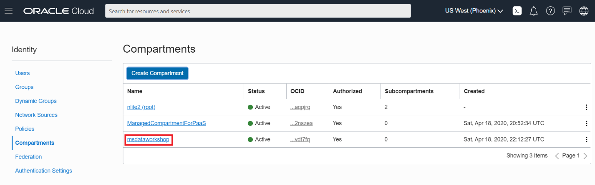
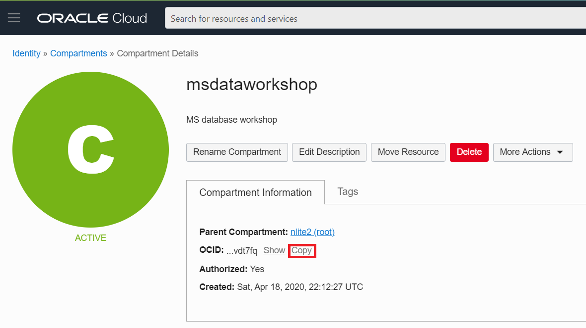
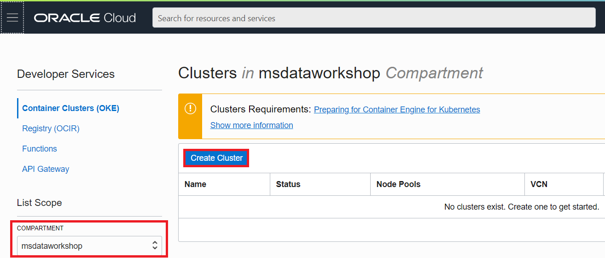
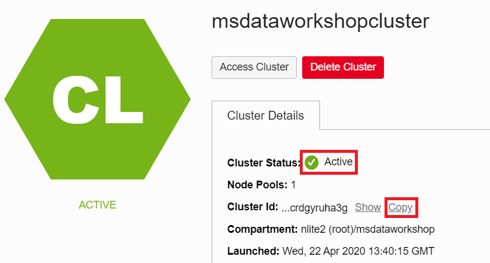
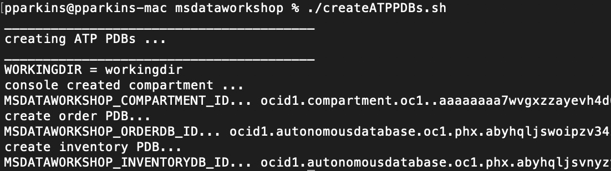
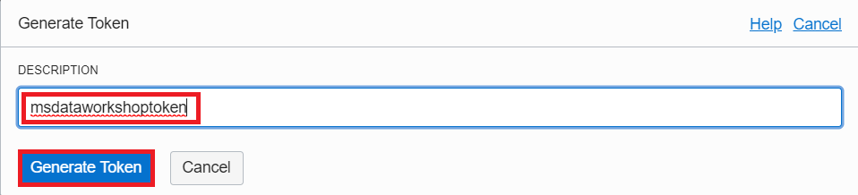

# Setup OCI, OKE, ATP and Cloud shell
## Introduction

This 25-minute lab will show you how to set up the Oracle Cloud Infrastructure (OCI) Container Engine for Kubernetes (OKE) for creating and deploying a front-end Helidon application which accesses the backend Oracle Autonomous Database (ATP).

### Objectives

* Collect important information that you will use throughout this workshop
* Set up the OKE cluster
* Set up the ATP databases

### What Do You Need?

* An Oracle Cloud paid account or free trial with credits. To sign up for a trial account with $300 in credits for 30 days, click [here](http://oracle.com/cloud/free).

 You will not be able to complete this workshop with the 'Always Free' account. Make sure that you select the free trial account with credits.

## **STEP 1**: Launch the Cloud Shell

Cloud Shell is a small virtual machine running a Bash shell which you access through the OCI Console. Cloud Shell comes with a pre-authenticated CLI which is set to the OCI Console tenancy home page region. It also provides up-to-date tools and utilities.

Click the Cloud Shell icon in the top-right corner of the Console.

  

## **STEP 2**: Download workshop source code
1. To work with application code, you need to download a GitHub repository using
    the following curl and unzip command. The workshop assumes this is done from your root directory.

   ```
   <copy>cd ~ ; curl -sL https://tinyurl.com/yyvf9bpk --output master.zip ; unzip master.zip ; rm master.zip</copy>
   ```

  You should now see `msdataworkshop-master` in your root directory


2. Change directory into the msdataworkshop-master directory:

   ```
   <copy>cd msdataworkshop-master</copy>
   ```

## **STEP 3**: Create an OCI compartment and an OKE cluster in that compartment

1. Open up the hamburger menu in the top-left corner of the Console and select **Identity > Compartments**.

   

2. Click **Create Compartment** with the following parameters and click **Create Compartment**:
    - Compartment name: `msdataworkshop`
    - Description: `MS workshop compartment`

    

    

3. Once the compartment is created, click the name of the compartment and then click **Copy** to copy the OCID.

    

    

4. Go back into your cloud shell and verify you are in the `~/msdataworkshop-master` directory.

5. Run `./setCompartmentId.sh <COMPARTMENT_OCID> <REGION_ID>` where your `<COMPARTMENT_OCID>` and `<REGION_ID>` values are set as arguments.

  For example:

   `./setCompartmentId.sh ocid1.compartment.oc1..aaaaaaaaxbvaatfz6yourcomparmentidhere5dnzgcbivfwvsho77myfnqq us-ashburn-1`

5.  To create an OKE cluster, return to the OCI console and open up the hamburger button in the top-left
        corner of the Console and go to **Developer Services > Kubernetes Clusters**.

      

6. Make sure you are in the newly created compartment and click **Create Cluster**.

      

7. Choose **Quick Create** as it will create the new cluster along with the new network
    resources such as Virtual Cloud Network (VCN), Internet Gateway (IG), NAT
    Gateway (NAT), Regional Subnet for worker nodes, and a Regional Subnet for load
    balancers. Click **Launch Workflow**.

      

8. Change the name of the cluster to `msdataworkshopcluster`, accept all the other
    defaults, and click **Next** to review the cluster settings.


9. Once reviewed click **Create Cluster**, and you will see the resource creation progress.

      

10. Close the creation window.

      

11. Once launched it should usually take around 5-10 minutes for the cluster to be
    fully provisioned and the Cluster Status should show Active.

      

      

    _There is no need to wait for the cluster to be fully provisioned at this point as we will verify cluster creation and create a kube config in order to access it in a later step._

## **STEP 4**: Create ATP databases

  Run the `createATPPDBs.sh` script.

    ```
    <copy>./createATPPDBs.sh</copy>
    ```
   Notice creation of the ORDERDB and INVENTORYDB PDBs.


   

   _OCIDs for the PDBs are stored and will be used later to create kubernetes secrets that microservices will use to access them._


## **STEP 5**: Create an OCI Registry and Auth key and login to it from Cloud Shell
You are now going to create an Oracle Cloud Infrastructure Registry and an Auth key. Oracle Cloud Infrastructure Registry is an Oracle-managed registry that enables you to simplify your development-to-production workflow by storing, sharing, and managing development artifacts such as Docker images.

1. Open up the hamburger menu in the top-left corner of the console and go to **Developer Services > Container Registry**.

  

2. Take note of the namespace (for example, `axkcsk2aiatb` shown in the image below).  Click **Create Repository** , specify the following details for your new repository, and click **Create Repository**.
    - Repository Name: `<firstname.lastname>/msdataworkshop`
	- Access: `Public`

  Make sure that access is marked as `Public`.  

  

  

  Go to Cloud Shell and run `./addOCIRInfo.sh` with the namespace and repository name as arguments

  ```
  <copy>./addOCIRInfo.sh <namespace> <repository_name></copy>
  ```

  For example `./addOCIRInfo.sh axkcsk2aiatb msdataworkshop.user1/msdataworkshop`

3. You will now create the Auth token by going back to the User Settings page. Click the Profile icon in the top-right corner of the Console and select **User Settings**.

  

4. Click on **Auth Tokens** and select **Generate Token**.

  

5. In the description type `msdataworkshoptoken` and click **Generate Token**.

  

6. Copy the token value.

  

7. Go to Cloud Shell and run `./dockerLogin.sh <USERNAME> "<AUTH_TOKEN>"` where `<USERNAME>` and `"<AUTH_TOKEN>"` values are set as arguments.

  * `<USERNAME>` - is the username used to log in (typically your email address). If your username is federated from Oracle Identity Cloud Service, you need to add the `oracleidentitycloudservice/` prefix to your username, for example `oracleidentitycloudservice/firstname.lastname@something.com`
  * `"<AUTH_TOKEN>"` - paste the generated token value and enclose the value in quotes.

  For example `./dockerLogin.sh user.foo@bar.com "8nO[BKNU5iwasdf2xeefU;yl"`


8.  Once successfully logged into Container Registry, we can list the existing docker images. Since this is the first time logging into Registry, no images will be shown.

    ```
    <copy>docker images </copy>
    ```

    


## **STEP 6**: Access OKE from the Cloud Shell

1. Run `./verifyOKEAndCreateKubeConfig.sh`

 ```
 <copy>./verifyOKEAndCreateKubeConfig.sh</copy>
 ```

2. Notice `/.kube/config` is created for the cluster and the `msdataworkshop` namespace is also created.

  


## **STEP 7**: Install GraalVM, Jaeger, and Frontend Loadbalancer
Run the `installGraalVMJaegerAndFrontendLB.sh` script to install both GraalVM and Jaeger.

 ```
 <copy>./installGraalVMJaegerAndFrontendLB.sh</copy>
 ```

You may now proceed to the next lab.

## Acknowledgements

* **Author** - Paul Parkinson, Dev Lead for Data and Transaction Processing, Oracle Microservices Platform, Helidon
* **Adapted for Cloud by** - Nenad Jovicic, Enterprise Strategist, North America Technology Enterprise Architect Solution Engineering Team
* **Documentation** - Lisa Jamen, User Assistance Developer - Helidon
* **Contributors** - Jaden McElvey, Technical Lead - Oracle LiveLabs Intern
* **Last Updated By/Date** - Tom McGinn, June 2020


## See an issue?
Please submit feedback using this [form](https://apexapps.oracle.com/pls/apex/f?p=133:1:::::P1_FEEDBACK:1). Please include the *workshop name*, *lab* and *step* in your request.  If you don't see the workshop name listed, please enter it manually. If you would like for us to follow up with you, enter your email in the *Feedback Comments* section.
