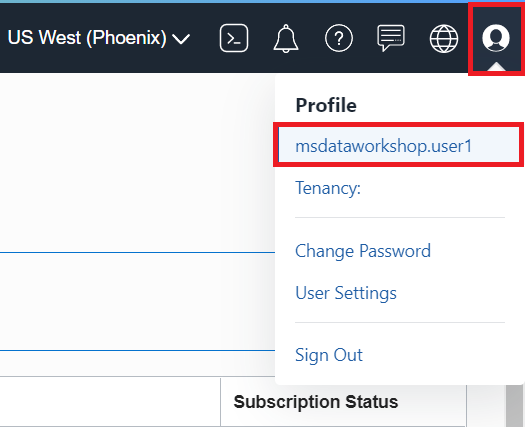
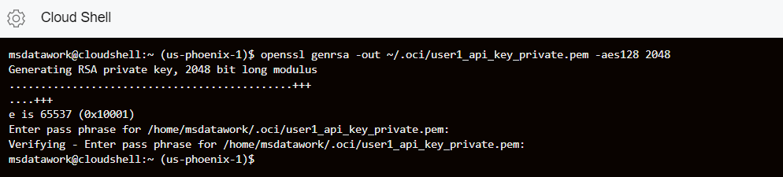
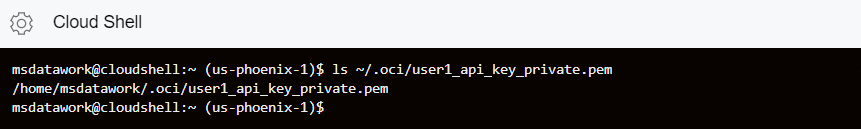
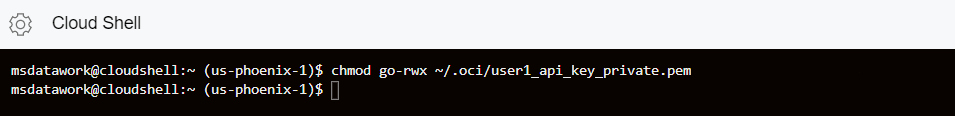
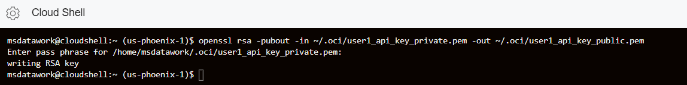
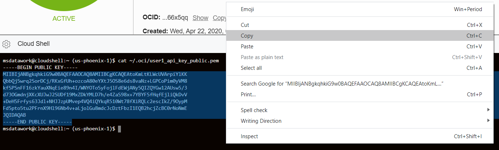
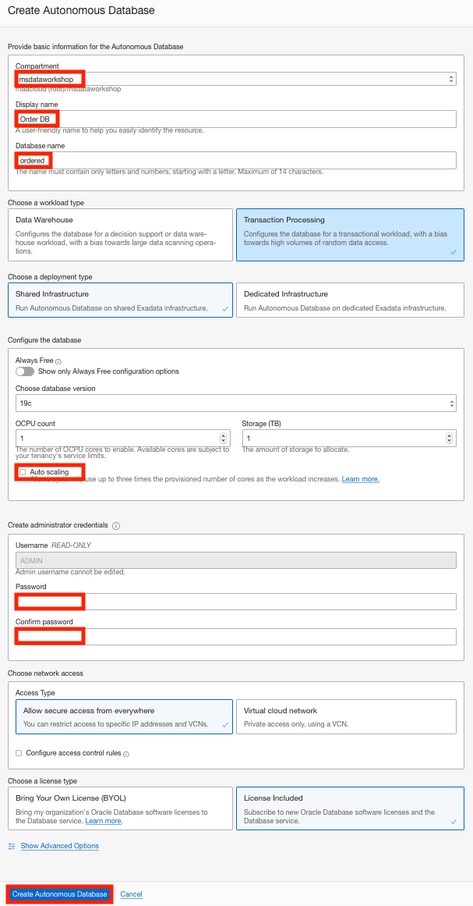
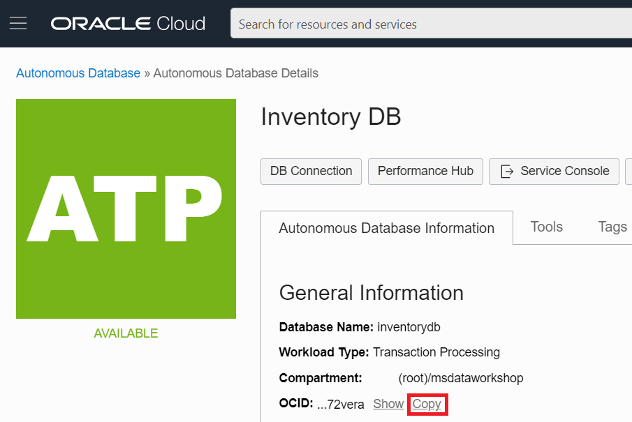
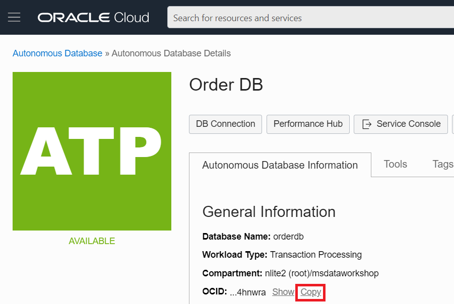
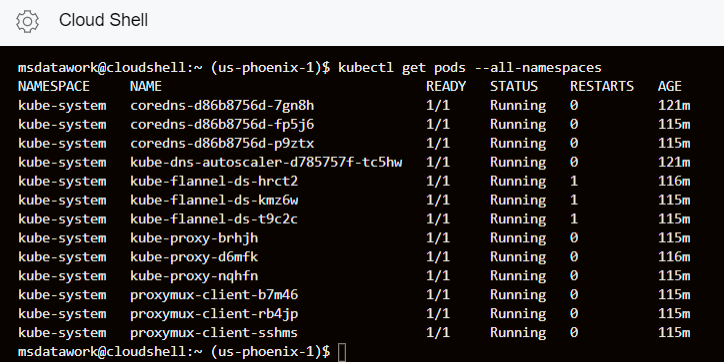

# Setup OCI, OKE, ATP and Cloud shell
## Introduction

This 25-minute lab will show you how to setup the Oracle Cloud Infrastructure Container Engine for Kubernetes for creating and deploying a front-end Helidon application which accesses in the backend the Oracle Autonomous Database.

### Objectives

* Collect important information that you will use throughout this workshop
* Set up the OKE cluster
* Set up the ATP databases

### What Do You Need?

* An Oracle Cloud paid account or free trial. To sign up for a trial account with $300 in credits for 30 days, click [here](http://oracle.com/cloud/free).

 You will not be able to complete this workshop with the 'free always' account. Make sure that you select the free trial account with credits.

## **STEP 1**: Download and save the msdataworkshop.properties file
You'll need to keep track of important information about the tenancy, such as resource IDs, Tenancy OCID, Region name, Object Storage Namespace and user OCID.

1.  Download and save <a href="files/msdataworkshop.properties" target="\_blank">msdataworkshop.properties</a> to store and keep track of the data you will need in later labs.
2. Open this file in a text editor. You will update it throughout this lab.

   You will later copy this information to your root directory using Cloud Shell and source it for the workshop.


## **STEP 2**: Create the basic OCI resources

1. On your Oracle Cloud account, open up the hamburger menu in the top-left corner of the Console. Choose **Administration > Tenancy Details**.

  

2. The Tenancy Details page shows information about your cloud account. Add the Tenancy OCID to your `msdataworkshop.properties` file by clicking on the **Copy** link next to it.

 Also add the Object Storage Namespace to your `msdataworkshop.properties` file - you will need this when logging into Docker.

  

3. To get the Region name, open up the hamburger menu in the top-left corner of the Console and choose **Administration > Region Management**. Add the region identifier to your `msdataworkshop.properties` file.

  

  In this example, the home region is US West, and the region identifier is `us-phoenix-1`.

  

4. To get the User OCID, open up the User icon in the top-right corner of the Console, and click your user name. If your user is federated, it will be prefixed with `oracleidentitycloudservice/`.

  

5. On the next page, copy and paste the User OCID to your `msdataworkshop.properties` file by clicking on the **Copy** link next to it.

  

## **STEP 3**: Create User API Keys

To create a user API key, you will use the Cloud Shell. Cloud Shell is a small virtual machine running a Bash shell which you access through the OCI Console. Cloud Shell comes with a pre-authenticated OCI CLI, set to the Console tenancy home page region, as well as up-to-date tools and utilities.

1.	Click the Cloud Shell icon in the top-right corner of the Console.

  

2. Once the Cloud Shell has started, confirm that the `.oci` directory doesn’t already exist.

    ```
    <copy>ls ~/.oci</copy>
    ```

  

3. Assuming the` ~/.oci` directory does not already exist, create it using the following command.

    ```
    <copy>mkdir ~/.oci</copy>
    ```

  

4. Generate a private key with the following command. Choose a private key name you can remember. When prompted, enter a passphrase to encrypt the private key file.  When prompted again, re-enter the passphrase to confirm it. Be sure to make note of this password as you will need it later.

    ```
    <copy>openssl genrsa -out ~/.oci/user1_api_key_private.pem -aes128 2048</copy>
    ```

  

5. Confirm that the private key file has been created in the directory you specified using the following command. Note the complete path to the private key because you will need it later.

    ```
    <copy>ls -l ~/.oci/user1_api_key_private.pem</copy>
    ```

  

6. Change permissions on the file to ensure that only you can read it.

    ```
    <copy>chmod go-rwx ~/.oci/user1_api_key_private.pem</copy>
    ```

  

7. Generate a public key in the same location as the private key file using the following command. When prompted, enter the same passphrase you previously used to encrypt the private key file.

    ```
    <copy>openssl rsa -pubout -in ~/.oci/user1_api_key_private.pem -out ~/.oci/user1_api_key_public.pem</copy>
    ```

  

8. Confirm that the public key file has been created in the directory you specified.

    ```
    <copy>ls -l ~/.oci</copy>
    ```

  

9. Copy the content of the public key file you just created to your clipboard by opening the file, selecting the entire content and right-click to copy.

    ```
    <copy>cat ~/.oci/user1_api_key_public.pem</copy>
    ```

  

10. Having created the API key pair, upload the public key value to Oracle Cloud Infrastructure. In the top-right corner of the Console, open the Profile menu (User menu icon) and then click **User Settings** to view the details.

  

11. On the API Keys page, click **Add Public Key**.

  

12. Paste the public key's value into the window and click **Add**. The key is uploaded, and its fingerprint is displayed.

  

  

## **STEP 4**: Create a Compartment for OKE and ATP Resources

You will now create a compartment which would hold the resources used by OKE and ATP.

1. Open up the hamburger in the top-left corner of the Console and select **Identity > Compartments**.

  

2. Click **Create Compartment** with the following parameters and click **Create Compartment**:
    - Compartment name: `msdataworkshop`
    - Description: `MS workshop compartment`

  

  

3. Once the compartment is created, click on the name of the compartment and add the compartment name and OCID to your `msdataworkshop.properties` file. This is the `OCI_COMPARTMENT_ID` property in your file.

  

  

## **STEP 5**: Create an Oracle Cloud Infrastructure Registry and Auth key
You are now going to create an Oracle Cloud Infrastructure Registry and an Auth key. Oracle Cloud Infrastructure Registry is an Oracle-managed registry that enables you to simplify your development to production workflow by storing, sharing, and managing development artifacts such as Docker images.

1. Open up the hamburger button in the top-left corner of the console and go to **Developer Services > Container Registry**.

  

2. Click **Create Repository** , specify the following details for your new repository, and click **Create Repository**.
    - Repository Name: `<firstname.lastname>/msdataworkshop`
	  - Access: `Public`

  Make sure that access is marked as `public`.  Add the repository name to the appropriate portion of the `DOCKER_REGISTRY` property in your `msdataworkshop.properties` file and complete the remaining edits to the `DOCKER_REGISTR`Y property."

  

  

3. You will now create the Auth key by going back to the User Settings page. Click the Profile icon in the top-right corner of the Console and select **User Settings**.

  

4. Click on **Auth Tokens** and select **Generate Token**.

  

5. In the description type `msdataworkshoptoken` and click **Generate Token**. Once the token has been generated, it is important that you add the token to your `msdataworkshop.properties` file as it will not be shown again.

  

  

## **STEP 6**: Create OKE Cluster

1.  To create an OKE cluster, open up the hamburger button in the top-left
    corner of the Console and go to **Developer Services > Kubernetes Clusters**.

  

2. Make sure you are in the newly created compartment and click **Create Cluster**.

  

3. Choose **Quick Create** as it will create the new cluster along with the new network
resources such as Virtual Cloud Network (VCN), Internet Gateway (IG), NAT
Gateway (NAT), Regional Subnet for worker nodes, and a Regional Subnet for load
balancers. Click **Launch Workflow**.

  

4. Change the name of the cluster to `msdataworkshopcluster` , accept all the other
defaults, and click **Next** to review the cluster settings.


5. Once reviewed click **Create Cluster**, and you will see the resource creation progress.

  

6. Close the creation window.

  

7. Once launched it should usually take around 5-10 minutes for the cluster to be
fully provisioned and the Cluster Status should show Active. Go to the
`msdataworkshopcluster` page and check that the Cluster Status shows Active. Add the Cluster ID to your `msdataworkshop.properties` file.

  

  

## **STEP 7**: Setup ATP databases

1. To create the two Autonomous Transaction Processing databases, open up the
    hamburger button in the top-left corner of the Console and go to Autonomous
    Transaction Processing.

  

2. You will create the ATP databases in the same compartment as the OKE cluster, so make sure compartment `msdataworkshop` is displayed, and click **Create Autonomous Database**.

  

3. You will create two ATP databases called `orderdb` and `inventorydb`. On the Create
Autonomous Database page provide the following basic information and click **Create Autonomous Database**:

    -   Compartment: `msdataworkshop`
    -   Display name: `Order DB`
    -   Database name: `orderdb`
    -   Workload type: `Transaction Processing`
    -   Deployment type: `Shared Infrastructure`
    -   Leave the defaults for version, OCPU count and Storage
    -   Auto scaling: `off`
    -   Provide `Welcome12345` as admin password.
    -   Leave the defaults for network access, which is “Allow secure access from
        everywhere”
    -   License type: `License included`

  

4. It will take a couple of minutes for the database to be provisioned, in the
meantime you can proceed to create the second ATP instance. Click the Autonomous
Database link in the top-left corner of the page to get back to the Autonomous
Database main page and click **Create Autonomous Database**.

  

  

5. For `inventorydb` database follow the same steps and provide the following basic
information and click **Create Autonomous Database**:

    -   Compartment: `msdataworkshop`
    -   Display name: `Inventory DB`
    -   Database name: `inventorydb`
    -   Workload type: `Transaction Processing`
    -   Deployment type: `Shared Infrastructure`
    -   Leave the defaults for version, OCPU count and Storage
    -   Auto scaling: `off`
    -   Provide `Welcome12345` as admin password.
    -   Leave the defaults for network access, which is “Allow secure access from
        everywhere”
    -   License type: `License included`

  

6. Once both databases are provisioned you should see the state changed to
Available. Click on each of the ATP names in order to go to their pages and copy
their OCIDs to your `msdataworkshop.properties` file.

  

  

  

  You have successfully created the two ATP databases that will be used for
  backend inventory and order datastores.

## **STEP 8**: Access OKE from the Cloud Shell
For this step, we are going to use the Cloud Shell to access the OKE cluster
we created in Step 5 and we will verify that all the cluster resources are up
and running.

1.  In the Cloud console go to **Developer Services > Kubernetes Clusters**.

    

2. From the available clusters select the `msdataworkshopcluster` you have created in Step 5.

    

3. On the cluster page click **Access Cluster** button to get the list of available methods of accessing the cluster.

    

4.  Click on **Launch Cloud Shell**, copy the Cloud Shell command, and execute it.
    This will configure `kubectl` and create a new `kubeconfig` file in the default
    `~/.kube/config` location, allowing you to manage your cluster remotely via
    Cloud Shell.

    

5.  You can now verify the OKE cluster and check that all the pods are up and
    running using the following command

    ```
    <copy>kubectl get pods --all-namespaces</copy>
    ```

    

    *Note: You may have to execute the command a couple times to see all the pods.*

You may proceed to the next lab.

## Acknowledgements

* **Author** - Paul Parkinson, Dev Lead for Data and Transaction Processing, Oracle Microservices Platform, Helidon
* **Adapted for Cloud by** - Nenad Jovicic, Enterprise Strategist, North America Technology Enterprise Architect Solution Engineering Team
* **Documentation** - Lisa Jamen, User Assistance Developer - Helidon
* **Contributors** - Jaden McElvey, Technical Lead - Oracle LiveLabs Intern
* **Last Updated By/Date** - Tom McGinn, June 2020


## See an issue?
Please submit feedback using this [form](https://apexapps.oracle.com/pls/apex/f?p=133:1:::::P1_FEEDBACK:1). Please include the *workshop name*, *lab* and *step* in your request.  If you don't see the workshop name listed, please enter it manually. If you would like for us to follow up with you, enter your email in the *Feedback Comments* section.
