# Setup Service Broker and Messaging

## Introduction

This lab will show you how to create an Oracle Cloud Infrastructure Service
Broker and bind it to the two existing Autonomous Transaction Processing
databases. This way we will be able to connect the OKE Helidon microservices to
the ATP instances.

### Objectives
-   Create and bind OCI Service Broker to existing ATP instance
-   Setup Oracle Advanced Queuing in existing ATP instances

### What Do You Need?

* An Oracle Cloud paid account or free trial. To sign up for a trial account with $300 in credits for 30 days, click [here](http://oracle.com/cloud/free).
* OKE cluster and the ATP databases created
* Microservices code from GitHub built and deployed

## **STEP 1**: Setup OCI Open Service Broker

For the microservices to talk to the ATP instances, we need to create an OCI
    Service Broker. OCI Service Broker for Kubernetes is an implementation of
    the Open Service Broker API. OCI Service Broker for Kubernetes is
    specifically for interacting with Oracle Cloud Infrastructure services from
    Kubernetes clusters. It includes service broker adapters to bind to the
    following OCI services: Object Storage, Autonomous Transaction Processing,
    Autonomous Data Warehouse.

1.  Log in to the Cloud Console and open the Cloud
    Shell by clicking the Cloud Shell icon in the top-right corner of the
    Console.

  

2. Inside Cloud Shell go to the service broker folder.

    ```
    <copy>cd $MSDATAWORKSHOP_LOCATION/osb-atp-and-oss</copy>
    ```

  

3.  Edit the `setupOSB.sh` with `vi` and set the following variables. You can expand
    the cloud shell window for convenience, by clicking the maximize button on
    the top-right corner of the Cloud Shell.

  

    ```
    <copy>vi setupOSB.sh</copy>
    ```

  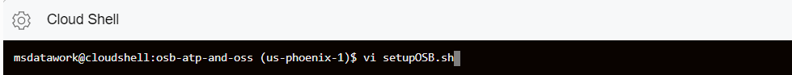

4.  Modify the values in **`<>`** brackets:

    ```
    kubectl create clusterrolebinding cluster-admin-brokers --clusterrole=cluster-admin --user=<USER_ID>
    kubectl create secret generic ocicredentials \
    \--from-literal=tenancy=<TENANCY_OCID> \
    \--from-literal=user=<USER_OCID> \
    \--from-literal=fingerprint=<USER_FINGERPRINT> \
    \--from-literal=region=<REGION_CODE> \
    \--from-literal=passphrase=<PRIVATEKEY_PASSPHRASE> \
    \--from-file=privatekey=<PRIVATEKEY_FILE_LOCATION>
    ```

5. Keep in mind that `<USER_ID>` is not equal to `<USER_OCID>`, and it is a new parameter not used yet. Leave it as your username. In our example it’s `msdataworkshop.user1`.

    - `<TENANCY_OCID>` - is the Tenancy OCID
    - `<USER_OCID>` - is the User OCID
    - `<USER_FINGERPRINT>` - is the fingerprint value created when adding the Public key in the console
    - `<REGION_CODE>` - is the Region identifier
    - `<PRIVATEKEY_PASSPHRASE>` - is the passphrase used to create the Private key file
    - `<PRIVATEKEY_FILE_LOCATION>` - is the absolute path for Private key file location

    Once you have edited the two `kubectl` commands, the result should look
    something like this.

  

6.  Once the script was edited, execute it using the following command. The
    script has basic setup for Kubernetes service catalog. It installs the
    service catalog `cli svcat`, adds the service catalog helm repo. It also
    generates a secret that is being used to install the OCI service broker, and
    set it up with the Kubernetes cluster.

    ```
    <copy>./setupOSB.sh</copy>
    ```

  

    It will take a couple of minutes to set the broker, and during the initial check
    performed by the script, you might temporary see Status “ErrorFetchingCatalog”
    for the oci-service-broker.

  

7.  (Optional) If the broker is still not ready, continue to check again with the
    commands:

    ```
    <copy>svcat get brokers</copy>
    ```

  Once ready, it should show the `oci-service-broker` with status “Ready”.

  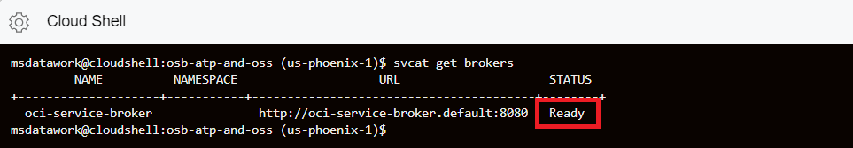

    ```
    <copy>svcat get classes</copy>
    ```

  

    ```
    <copy>svcat get plans</copy>
    ```

  

The commands are used to check the available OCI services that could be accessed
through the service broker, such as Autonomous Transaction Processing, Object
Storage and others.

## **STEP 2**: Using OCI service broker, create binding to 2 existing ATP instances
You will now use the created OCI service broker and create bindings to the
    two Autonomous Transaction Processing databases.

1. In Cloud Shell go to the service broker folder:

    ```
    <copy>cd $MSDATAWORKSHOP_LOCATION/osb-atp-and-oss</copy>
    ```

  

2. Edit the `setupATP.sh` with `vi`.

    ```
    <copy>vi setupATP.sh</copy>
    ```

  

3. Modify the values in **`<>`** brackets:

    ```
    export orderpdb_ocid=<ORDERPDB_OCID>
    export orderpdb_compartmentId=<ORDERPDB_COMPARTENT_OCID>
    export orderpdb_walletPassword=$(echo <ORDERPDB_WALLET_PW> | base64)
    export orderpdb_admin_password=$(echo <ORDERPDB_ADMIN_PW> | base64)
    export orderpdb_orderuser_password=$(echo <ORDERPDB_ORDERUSER_PW> | base64)
    export inventorypdb_ocid=<INVENTORYPDB_OCID>
    export inventorypdb_compartmentId=<INVENTORYPDB_COMPARTENT_OCID>
    export inventorypdb_walletPassword=$(echo <INVENTORYPDB_WALLET_PW> | base64)
    export inventorypdb_admin_password=$(echo <INVENTORYPDB_ADMIN_PW> | base64)
    export inventorypdb_inventoryuser_password=$(echo <INVENTORYPDB_INVENTORYUSER_PW> | base64)
    ```

  `<ORDERPDB_OCID>` and `<INVENTORYPDB_OCID>` are the OCIDs copied when
  creating the two ATP instances.

  `<ORDERPDB_COMPARTENT_OCID>` and `<INVENTORYPDB_COMPARTENT_OCID>` are the
  OCID used when creating the compartment.

  For all the passwords use the original password when creating the two ATP
  instances.

  Once you have edited the lines, the result should look something like this:

  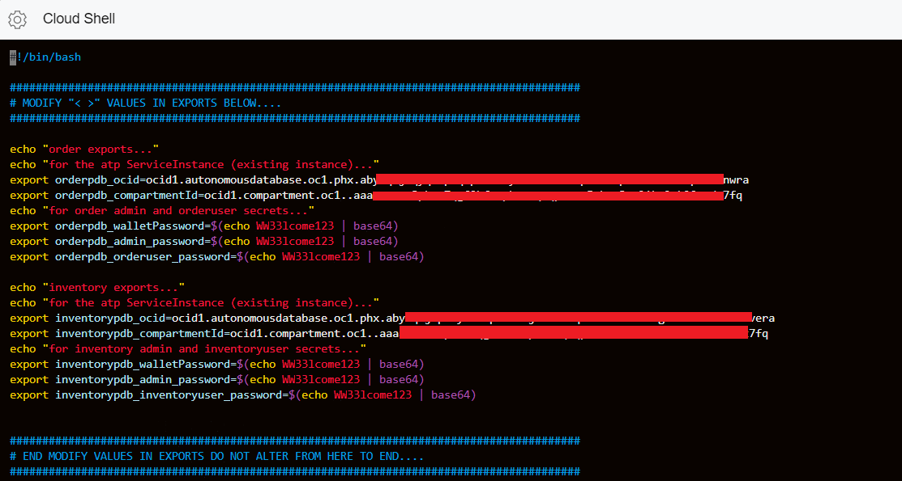

4. Once the script is edited, execute it:

    ```
    <copy>./setupATP.sh</copy>
    ```

  

  The script will try to cleanup some of the existing secrets, but since this is
  the first time we are executing, it will show “Error from server (NotFound):
  secrets” messages.

  

  Next it will create service catalog instances as well as the corresponding
  binding and secrets.

  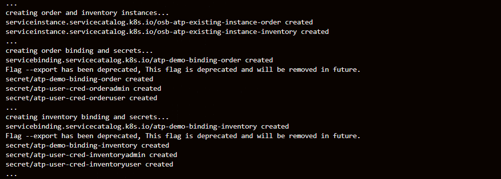

  At the end the script displays all the instance bindings with their status.

  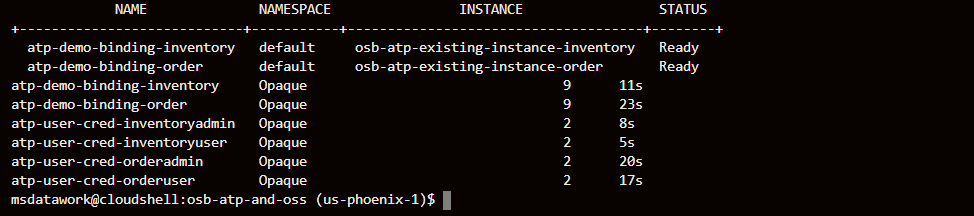

## **STEP 3**: Verify and understand ATP connectivity via Helidon microservice deployment in OKE
You will verify the connectivity from the frontend Helidon microservice
    deployment to the ATP using the previously created service broker binding.

1.  First, let’s analyze the Kubernetes deployment YAML file: `atpaqadmin-service.yaml`.

    ```
    <copy>cat ~/msdataworkshop-master/atpaqadmin/atpaqadmin-service.yaml</copy>
    ```

    The volumes are set up and credentials are brought from each of the bindings
    (inventory and order). The credential files in the secret are base64 encoded
    twice and hence they need to be decoded for the program to use them, which
    is what the `initContainer` takes care. Once done, they will be mounted for
    access from the container `helidonatp`. The container also has the DB
    connection information such as the JDBC URL, DB credentials and Wallet,
    created in the previous step.

2.  Let’s analyze the `microprofile-config.properties` file.

    ```
    <copy>cat ~/msdataworkshop-master/atpaqadmin/src/main/resources/META-INF/microprofile-config.properties</copy>
    ```

    This file defines the `microprofile` standard. It also has the definition of
    the data sources that will be injected. You will be using the universal
    connection pool which takes the JDBC URL and DB credentials to connect and
    inject the datasource. The file has default values which will be overwritten
    with the values specific for our Kubernetes deployment.

3.  Let’s also look at the microservice source file `ATPAQAdminResource.java`.

    ```
    <copy>cat ~/msdataworkshop-master/atpaqadmin/src/main/java/oracle/db/microservices/ATPAQAdminResource.java</copy>
    ```

    Look for the inject portion. The `@Inject` will have the two data sources
    under `@Named` as “orderpdb” and “inventorypdb” which were mentioned in the
    `microprofile-config.properties` file.

4.  Go into the ATP admin folder.

    ```
    <copy>cd $MSDATAWORKSHOP_LOCATION/atpaqadmin</copy>
    ```

  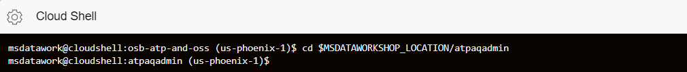

5.  Create the `atpaqadmin` deployment and service using the following command.

    ```
    <copy>./deploy.sh</copy>
    ```

  

6.  Once successfully deployed, verify the existence of the deployment and
    service using the following command. You should notice that we now have the
    `atpaqadmin` pod up and running.

    ```
    <copy>pods</copy>
    ```

  

7.  Use the URL `http://<external-IP>:8080` to open the frontend webpage.

  

8. Click **testdatasources**.

  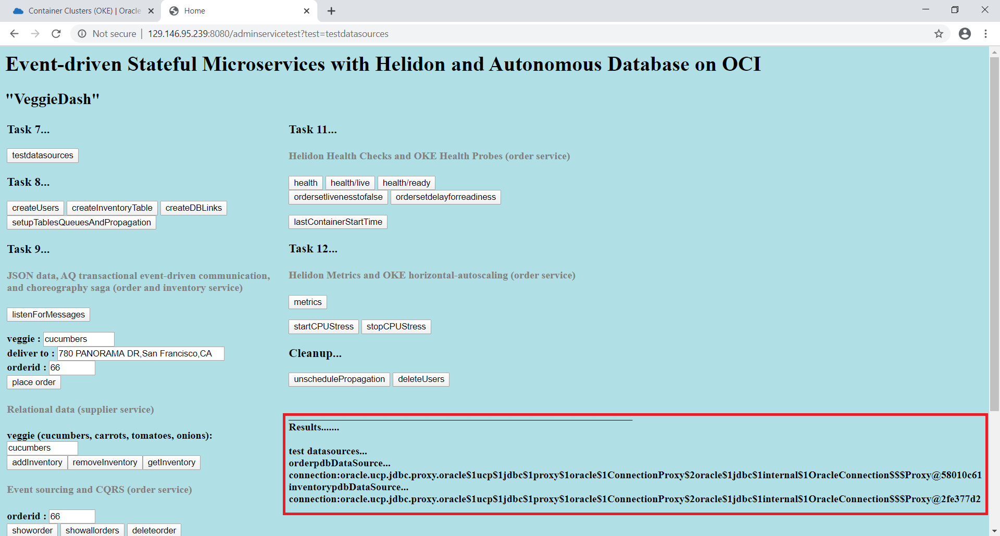

  The frontend is calling the `atpaqadmin` service and has successfully established
  connections to both databases `orderpdb` and `inventorypdb`.

## **STEP 4**: Setup AQ in the database
In this step you will set up the AQ messaging queue by creating database
    links between the two ATP databases, and perform queue propagation. Advanced
    Queuing provides database-integrated message queuing functionality. We are
    going to download the connection information zip file for each of the ATP
    instances.

1.  Go to the Cloud Console and click **Autonomous Transaction Processing**.

  

2.  If you don’t see the two ATP instances, make sure you have selected the
    right compartment:

  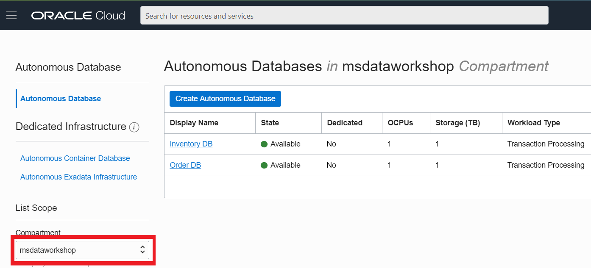

3.  Click on the `InventoryDB` name.

  

4.  On the InventoryDB page click **DB Connection**, select the
    regional Wallet and download the zip file.

  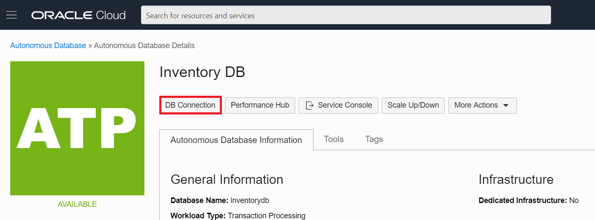

  

5. On the next page you will be asked to provide the password, please type the same password used when you created the instance and click **Download**.

  

6.  Once downloaded, extract the zip file on your computer, and upload the
    `cwallet.sso` into object storage. Go to the Object Storage page and click **Create
    Bucket**. Make sure you are in the `msdataworkshop` compartment.

  

  

7.  Name the compartment `msdataworkshopbucket`, leave the defaults and click
    **Create Bucket**. You should see the newly created bucket in the list.

  

8.  Click `msdataworkshopbucket`, under Object, click **Upload Objects**, select
    the extracted `cwallet.sso` file from your computer and click **Upload
    Objects**.

  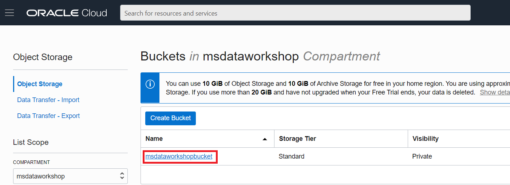

  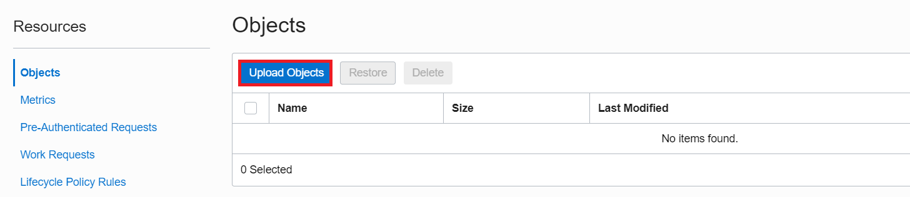

  

  

  

9. Once uploaded, go back to the `msdataworkshopbucket` page, and you should see the uploaded file in the list.

  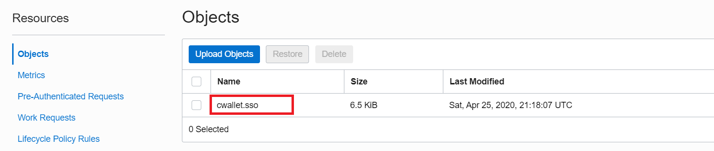

10.  For convenience, create a pre-authenticated URL to the Object eliminating
    the need to sign-in when accessing the object. Click the other options icon
    located to the right of the `cwallet.sso` object, and select **Create
    Pre-Authenticated Request**.

  

11. On the next page confirm the defaults and click **Create Pre-Authenticated Request**. Once created, copy the Pre-authenticated request URL, as it will not be shown again.

  

12. Open the Cloud Shell and go to the `atpaqadmin` folder.

    ```
    <copy>cd $MSDATAWORKSHOP_LOCATION/atpaqadmin</copy>
    ```

  

13. Edit the Kubernetes deployment file `atpaqadmin-deployment.yaml` with vi.

    ```
    <copy>vi atpaqadmin-deployment.yaml</copy>
    ```

  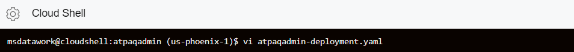

14.  We need to provide values in the section marked with “\# PROVIDE VALUES FOR
    THE FOLLOWING...”. Provide values for the following items:

    - cwalletobjecturi
    - orderhostname
    - orderport
    - orderservice\_name
    - orderssl\_server\_cert\_dn
    - inventoryhostname
    - inventoryport
    - inventoryservice\_name
    - inventoryssl\_server\_cert\_dn

    `cwalletobjecturi` – is the pre-authenticated URL which we’ve created in the previous step, when uploading `cwallet.sso` to the Object storage.

  The rest of the values should be in the `tnsnames.ora` file which was extracted from the zip file. When looking for the information in `tnsnames.ora` look for the information under the \_HIGH TNS aliases, so for `orderdb` look for values in `orderdb_high` connection string, and for `inventorydb` look for values in `inventorydb_high` connection string.

  

  Once you have edited the lines, the result should look like this:

  

15. Redeploy the `atpaqadmin` image.

    ```
    <copy>./redeploy.sh</copy>
    ```

  

15.  Once created, run the `pods` command to check that the `atpaqadmin` pod is
    in running state. You should see the `atpaqadmin` pod up and running

    ```
    <copy>pods</copy>
    ```

  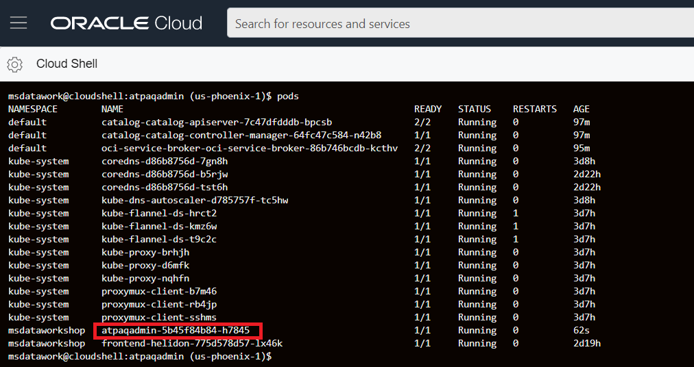

16.  Open the frontend microservice home page and click the following buttons in
    order: **createUsers**, **createInventoryTable**, **createDBLinks**,
    **setupTablesQueuesAndPropagation**.

  

  

  

  

  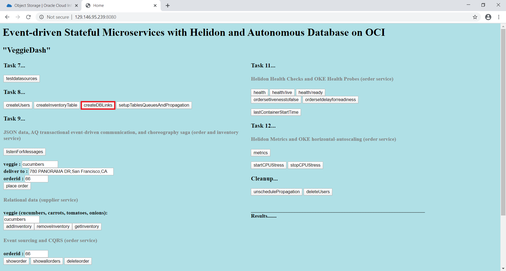

  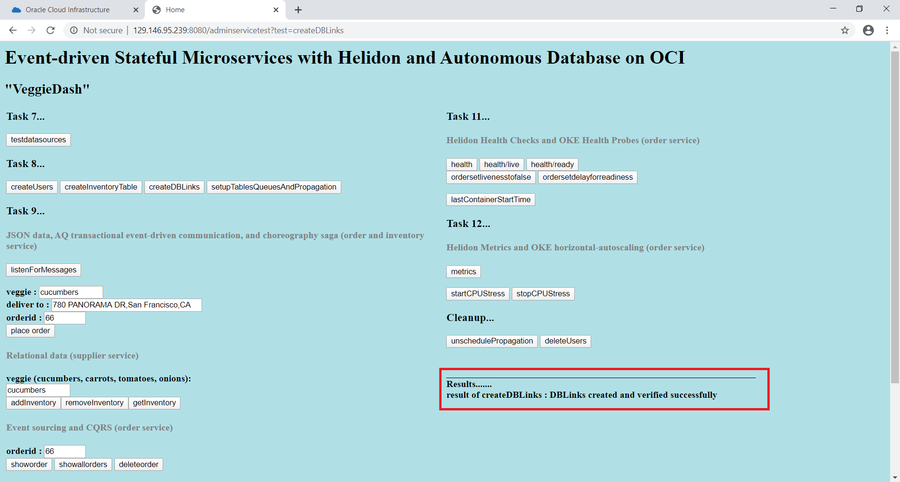

  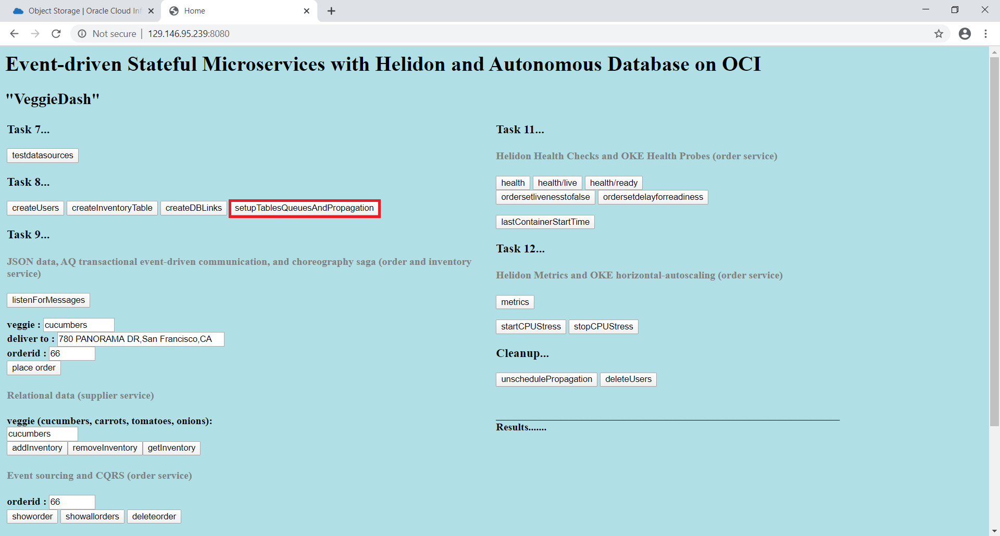

  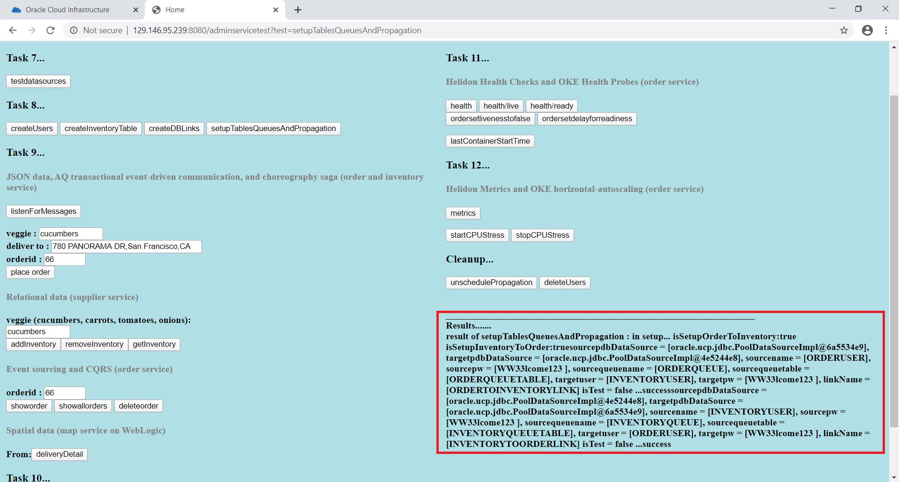

  The results of `setupTablesQueuesAndPropagation` should take a couple of minutes
  to complete, therefore we could open the Cloud Shell and check the logs, as we
  are waiting until all the messages have been received and confirmed.

17. (Optional) While waiting for `setupTablesQueuesAndPropagation` to complete, open the Cloud Shell and check the logs using the following command:

    ```
    <copy>logpod admin</copy>
    ```

  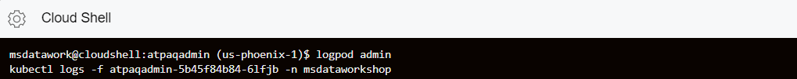

  We will see testing messages going in both directions between the two ATP
  instances across the DB link

  

18. (Optional) If it is necessary to restart, rerun the process or clean up the
    database:

    If **setupTablesQueuesAndPropagation** was executed, you need to run
    **unschedulePropagation** first.

  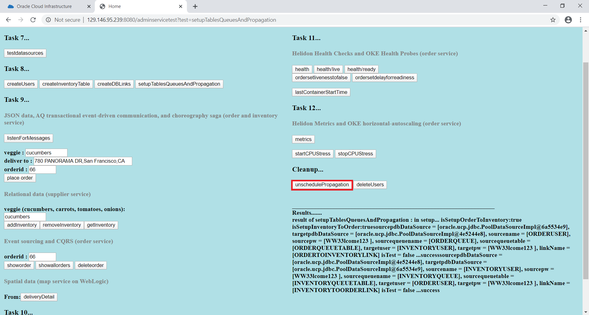

  Afterwards, click **deleteUsers**.

  

You have successfully configured the databases with the necessary users, tables
and message propagation across the two ATP instances.

## Acknowledgements
* **Author** - Paul Parkinson, Consulting Member of Technical Staff
* **Adapted for Cloud by** -  Nenad Jovicic, Enterprise Strategist, North America Technology Enterprise Architect Solution Engineering Team
* **Last Updated By/Date** - Tom McGinn, April 2020

See an issue?  Please open up a request [here](https://github.com/oracle/learning-library/issues).   Please include the workshop name and lab in your request.
