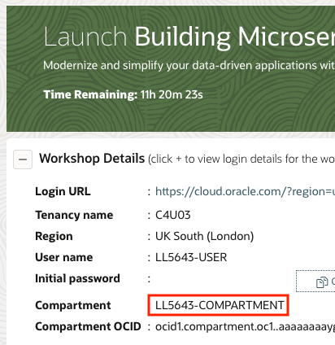
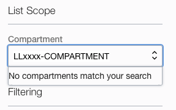

# Setup

## Introduction

In this lab we will provision and setup the resources to execute microservices in your environment.

Estimates Lab Time - 20 minutes

### Objectives

* Clone the setup and microservices code
* Execute setup

## **STEP 1**: Select Your Compartment

You have been assigned your own OCI compartment for running this workshop.  The name of the compartment is shown on the Launch page.

1. Copy the compartment name (not OCID) from the workshop reservation page.



2. Select the hamburger menu from the top left corner of the OCI Console and navigate to the Compute --> Compute --> Instances page.


3. Search for compartment using the compartment name from step#1 in the "Compartment" field under "List Scope". 



4. Select your compartment name from the drop down list.


## **STEP 2**: Launch the Cloud Shell

Cloud Shell is a small virtual machine running a "bash" shell which you access through the OCI Console. Cloud Shell comes with a pre-authenticated command line interface which is set to the OCI Console tenancy region. It also provides up-to-date tools and utilities.

Click the Cloud Shell icon in the top-right corner of the Console.

  


## **STEP 3**: Make a Clone of the Workshop Setup Script and Source Code

1. To work with the application code, you need to make a clone from the GitHub repository using the following command.  

    ```
    <copy>git clone -b 21.6.1 --single-branch https://github.com/oracle/microservices-datadriven.git
    </copy>
    ```

   You should now see the directory `microservices-datadriven` in the current directory.

2. Run the following command to edit your .bashrc file so that you will be returned to the workshop directory when you connect to the cloud shell in the future.

    ```
    <copy>
    sed -i.bak '/grabdish/d' ~/.bashrc
    echo "source $PWD/microservices-datadriven/grabdish/env.sh" >>~/.bashrc
    </copy>
    ```

## **STEP 4**: Start the Setup

1. Execute the following sequence of commands to start the setup.  

    ```
    <copy>
    source microservices-datadriven/grabdish/env.sh
    source setup.sh
    </copy>
    ```

   Note, the cloud shell may disconnect after a period of inactivity. If that happens, you may reconnect and then run this command to resume the setup:

    ```
    <copy>
    source setup.sh
    </copy>
    ```

   The setup process will typically take around 20 minutes to complete.  

2. The setup will ask for you to enter your Compartment OCID. This can be found in the workshop reservation page console.

  

4. The setup will ask you to enter an Auth Token so that docker can login to the OCI Registry. Please follow these steps to create an Auth Token.

  a. Locate your menu bar and click on the person icon at the far upper right. From the drop-down menu, select your user's name.

   

  b. On the left side of the page, click Auth Tokens and click Generate Token.

   

  c. Enter "grabdish" in the description field and click Generate Token.

   

   The new Auth Token is displayed.

  d. Click Copy to copy the Auth Token to the clipboard.

   

  e. Paste the Auth Token when requested by Setup. **Note**: The token is not displayed. Press Enter after pasting the token.

  f. Click Close to close the Generate Token dialog.

5. The setup will ask you to enter an Admin password for the databases.  For simplicity, the same password will be used for both the Order and Inventory databases.  Database passwords must be 12 to 30 characters and contain at least one uppercase letter, one lowercase letter, and one number. The password cannot contain the double quote (") character or the word "admin". **Note**: The passwords typed are not displayed.

6. The setup will also ask you to enter a UI password that will be used to enter the microservice frontend user interface.  Make a note of the password as you will need it later.  The UI password must be 8 to 30 characters.

## **STEP 5**: Complete the Setup

Once the majority of the setup has been completed the setup will periodically provide a summary of the setup status.  Once everything has completed you will see the message: **SETUP_VERIFIED completed**.

If any of the background setup jobs are still running you can monitor their progress with the following command.

```
<copy>
ps -ef | grep "$GRABDISH_HOME/utils" | grep -v grep
</copy>
```

Their log files are located in the $GRABDISH_LOG directory.

```
<copy>
ls -al $GRABDISH_LOG
</copy>
```

Once the setup has completed you are ready to move to the next lab.  Note, the non-java-builds.sh script may continue to run even after the setup has completed.  The non-Java builds are only required in Lab 3 and so we can continue with Lab 2 while the builds continue in the background.

## Acknowledgements

* **Authors** - Paul Parkinson, Dev Lead for Data and Transaction Processing, Oracle Microservices Platform, Helidon; Richard Exley, Consulting Member of Technical Staff, Oracle MAA and Exadata, Irina Granat, Consulting Member of Technical Staff, Oracle MAA and Exadata,

* **Adapted for Cloud by** - Nenad Jovicic, Enterprise Strategist, North America Technology Enterprise Architect Solution Engineering Team
* **Documentation** - Lisa Jamen, User Assistance Developer - Helidon
* **Contributors** - Jaden McElvey, Technical Lead - Oracle LiveLabs Intern
* **Last Updated By/Date** - Richard Exley, April 2021
