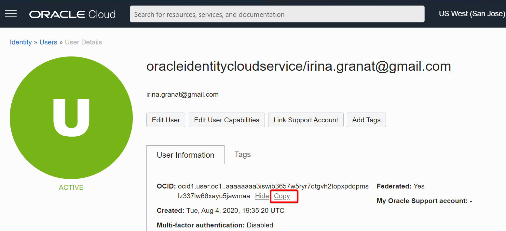
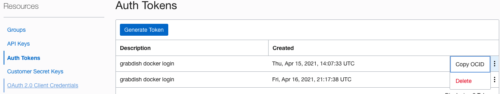

# Setup

## Introduction

In this lab we will provision and setup the resources to execute microservices in your tenancy.  

Estimates Lab Time - 25 minutes
<if type="multicloud-freetier">
- Estimates Lab Time - 25 minutes
+ Estimates Lab Time - 25 minutes
</if>

### Objectives

* Clone the setup and microservices code
* Execute setup

## **STEP 1**: Login to the OCI Console and Launch the Cloud Shell

If you haven't already, sign in to your account.

## **STEP 2**: Select the Home Region

Be sure to select the **home region** of your tenancy.  Setup will only work in the home region.

  

## **STEP 3**: Check Your Tenancy Service Limits

If you have a **fresh** free trial account with credits then you can be sure that you have enough quota to complete this workshop and you can proceed to the next step.

If, however, you have already used up some of the quota on your tenancy, perhaps while completing other workshops, there may be insufficient quota left to run this workshop. The most likely quota limits you may hit are summarized in the following table.

| Service          | Scope  | Resource                                             | Available | Free Account Limit |
|------------------|:------:|------------------------------------------------------|:---------:|:------------------:|
| Compute          | AD-1   | Cores for Standard.E2 based VM and BM Instances      | **3**     | 6                  |
| Container Engine | Region | Cluster Count                                        | **1**     | 1                  |
| Database         | Region | Autonomous Transaction Processing Total Storage (TB) | **2**     | 2                  |
|                  | Region | Autonomous Transaction Processing OCPU Count         | **4**     | 8                  |
| LbaaS            | Region | 100Mbps Load Balancer Count                           | **3**     | 3                  |

Quota usage and limits can be check through the console: **Governance & Administration** --> **Governance** --> **Limits, Quotas and Usage**, For example:

  

The Tenancy Explorer may be used to locate existing resources: **Governance & Administration** --> **Governance** --> **Tenancy Explorer**. Use the "Show resources in subcompartments" feature to locate all the resources in your tenancy:

  

It may be necessary to delete some resources in order to make space to run the workshop.  Once you have sufficient space you may proceed to the next step.

## **STEP 4**: Launch the Cloud Shell

Cloud Shell is a small virtual machine running a "bash" shell which you access through the OCI Console. Cloud Shell comes with a pre-authenticated command line interface which is set to the OCI Console tenancy region. It also provides up-to-date tools and utilities.

2. Click the Cloud Shell icon in the top-right corner of the Console.

  

## **STEP 5**: Create a Folder to Contain the Workshop Code

1. Create a directory to contain the workshop code. The directory name will also be used to create a compartment of the same name in your tenancy.  The directory name must have between 1 and 13 characters, contain only letters or numbers, and start with a letter.  Make sure that a compartment of the same name does not already exist in your tenancy or the setup will fail. For example:

    ```
    <copy>mkdir grabdish
    </copy>
    ```

   All the resources that are created by the setup will be created in this compartment.  This will allow you to quickly delete and cleanup afterwards.  

2. Change directory to the directory that you have created. The setup will fail if you do not complete this step. For example:

    ```
    <copy> cd grabdish
    </copy>
    ```

## **STEP 6**: Make a Clone of the Workshop Setup Script and Source Code

1. To work with the application code, you need to make a clone from the GitHub repository using the following command.  

    ```
    <copy>git clone -b 21.6.1 --single-branch https://github.com/oracle/microservices-datadriven.git
    </copy>
    ```

   You should now see the directory `microservices-datadriven` in the directory that you created.

2. Run the following command to edit your .bashrc file so that you will be returned to the workshop directory when you connect to the cloud shell in the future.

    ```
    <copy>
    sed -i.bak '/grabdish/d' ~/.bashrc
    echo "source $PWD/microservices-datadriven/grabdish/env.sh" >>~/.bashrc
    </copy>
    ```

## **STEP 7**: Start the Setup

1. Execute the following sequence of commands to start the setup.  

    ```
    <copy>
    source microservices-datadriven/grabdish/env.sh
    source setup.sh
    </copy>
    ```

   Note, the cloud shell may disconnect after a period of inactivity. If that happens, you may reconnect and then run this command to resume the setup:

    ```
    <copy>
    source setup.sh
    </copy>
    ```

   The setup process will typically take around 20 minutes to complete.  

2. The setup will ask for you to enter your User OCID.  

   Be sure to provide the user OCID and not the user name or tenancy OCID.

   The user OCID will look something like `ocid1.user.oc1..aaaaaaaanu5dhxbl4oiasdfasdfasdfasdf4mjhbta` . Note the "ocid1.user" prefix.

   This can be found in the OCI console.  Note that in some cases the name link may be inactive in which case select the `User Settings` link. Do not select the "Tenancy" link.

  

  

3. The setup will automatically upload an Auth Token to your tenancy so that docker can login to the OCI Registry.  If there is no space for a new Auth Token, the setup will ask you to remove an existing token to make room.  This can be done through the OCI console.

  

  

4. The setup will ask you to enter an admin password for the databases.  For simplicity, the same password will be used for both the order and inventory databases.  Database passwords must be 12 to 30 characters and contain at least one uppercase letter, one lowercase letter, and one number. The password cannot contain the double quote (") character or the word "admin".

5. The setup will also ask you to enter a UI password that will be used to enter the microservice frontend user interface.  Make a note of the password as you will need it later.  The UI password must be 8 to 30 characters.

## **STEP 8**: Monitor the Setup

The setup will provision the following resources in your tenancy:

| Resources              | OCI Console Navigation                                                        |
|------------------------|-------------------------------------------------------------------------------|
| Object Storage Buckets | Storage --> Object Storage --> Buckets                                        |
| Databases (2)          | Oracle Database --> Autonomous Database --> Autonomous Transaction Processing |
| OKE Cluster            | Developer Services --> Containers --> Kubernetes Clusters (OKE)               |
| Registry Repositories  | Developer Services --> Containers --> Container Registry                      |

You can monitor the setup progress from a different browser window or tab.  It is best not to use the original browser window as this may disturb the setup.  Most browsers have a "duplicate" feature that will allow you to quickly created a second window or tab.

   

 From the new browser window or tab, navigate around the console to view the resources within the new compartment.  The table includes the console navigation for each resource.  For example, here we show the database resources:

   

## **STEP 9**: Complete the Setup

Once the majority of the setup has been completed the setup will periodically provide a summary of the setup status.  Once everything has completed you will see the message: **SETUP_VERIFIED completed**.

If any of the background setup jobs are still running you can monitor their progress with the following command.

```
<copy>
ps -ef | grep "$GRABDISH_HOME/utils" | grep -v grep
</copy>
```

Their log files are located in the $GRABDISH_LOG directory.

```
<copy>
ls -al $GRABDISH_LOG
</copy>
```

Once the setup has completed you are ready to [move on to Lab 2](#next).  Note, the non-java-builds.sh script may continue to run even after the setup has completed.  The non-Java builds are only required in Lab 3 and so we can continue with Lab 2 while the builds continue in the background.

## Acknowledgements

* **Authors** - Paul Parkinson, Developer Evangelist; Richard Exley, Consulting Member of Technical Staff, Oracle MAA and Exadata
* **Adapted for Cloud by** - Nenad Jovicic, Enterprise Strategist, North America Technology Enterprise Architect Solution Engineering Team
* **Documentation** - Lisa Jamen, User Assistance Developer - Helidon
* **Contributors** - Jaden McElvey, Technical Lead - Oracle LiveLabs Intern
* **Last Updated By/Date** - Richard Exley, April 2021
