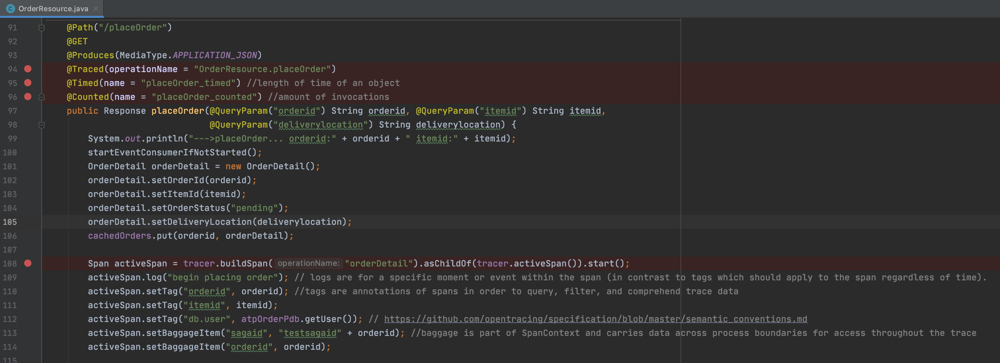
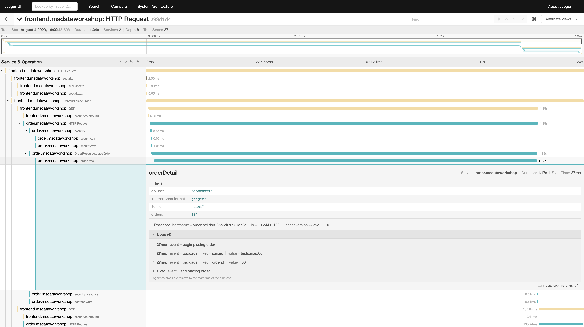

# Tracing Using Jaeger

## Introduction

This lab will show you can trace microservice activity using Jaeger.

Estimated lab Time - 10 minutes

  -   Open the Jaeger User Interface and view traces
  -   Learn how they work

Quick walk through on how you can trace microservice activity using Jaeger.

[](youtube:ku9rzWFpLfA)

## **STEP 1**: Verify tracing

1. Notice @Traced annotations on `placeOrder` method of `$GRABDISH_HOME/frontend-helidon/src/main/java/io/helidon/data/examples/FrontEndResource.java` and `placeOrder` method of `$GRABDISH_HOME/order-helidon/src/main/java/io/helidon/data/examples/OrderResource.java`
   Also notice the additional calls to set tags, baggage, etc. in this `OrderResource.placeOrder` method.

   

2. Place an order if one was not already created successfully in Lab 2 Step 3.

3. Identify the external IP address of the Jaeger Load Balancer by executing the following command:

    ```
    <copy>services</copy>
    ```

    

4. Open a new browser tab and enter the external IP URL:

  `https://<EXTERNAL-IP>`

   Note that for convenience a self-signed certificate is used to secure this https address and so it is likely you will be prompted by the browser to allow access.

5. Select `frontend.msdataworkshop` from the `Service` dropdown menu and click **Find Traces**.

    

   Select a trace with a large number of spans and drill down on the various spans of the trace and associated information. In this case we see placeOrder order, saga, etc. information in logs, tags, and baggage.

   *If it has been more than an hour since the trace you are looking for, select a an appropriate value for Lookback and click Find Traces.*

    

## Acknowledgements
* **Author** - Paul Parkinson, Developer Evangelist
               Richard Exley, Consulting Member of Technical Staff, Oracle MAA and Exadata
* **Adapted for Cloud by** - Nenad Jovicic, Enterprise Strategist, North America Technology Enterprise Architect Solution Engineering Team
* **Documentation** - Lisa Jamen, User Assistance Developer - Helidon
* **Contributors** - Jaden McElvey, Technical Lead - Oracle LiveLabs Intern
* **Last Updated By/Date** - Richard Exley, April 2021