# Transactional Tests: Compare MongoDB, Postgres, and Kafka to Oracle DB with TEQ/AQ

## Introduction

This lab will show you how to test different failure scenarios and compare/contrast the behavior when using different resources.

Estimated Lab Time - 10 minutes

### Objectives

-   Test the three failure scenarios shown in the following table...


   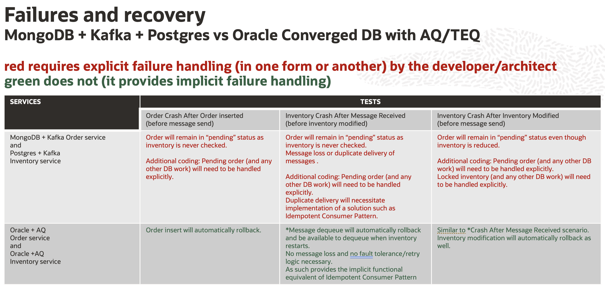


### Prerequisites

* Completion of Lab 1 Setup and Lab 2 Microservices Walk-through

## **STEP 1**: Install MongoDB, Postgres, and Kafka, and deploy Order and Inventory services that use them.

1.  Install MongoDB, Postgres, and Kafka:

    ```
    <copy>cd $GRABDISH_HOME/mongodb-kafka-postgres;./install-all.sh</copy>
    ```


2.  Undeploy any existing Order, Inventory, and Supplier Services and deploy the MongoDB, Postgres, and Kafka backed Order and Inventory implementations by copying and running the following commands.
    
    ```
    <copy>
    for i in order-helidon inventory-helidon inventory-helidon-se inventory-python inventory-nodejs inventory-dotnet inventory-go supplier-helidon-se; do cd $GRABDISH_HOME/$i; ./undeploy.sh; done
    cd $GRABDISH_HOME/order-mongodb-kafka ; ./deploy.sh
    cd $GRABDISH_HOME/inventory-postgres-kafka ; ./deploy.sh
    cd $GRABDISH_HOME
    
    </copy>
    ```

3. Check that all pods and services are running by running the `msdataworkshop` command.

    ```
    <copy>msdataworkshop</copy>
    ```


## **STEP 2**: Run tests against MongoDB, Postgres, Kafka implementations


1. Add Inventory until there is a value of 10 for sushi.

   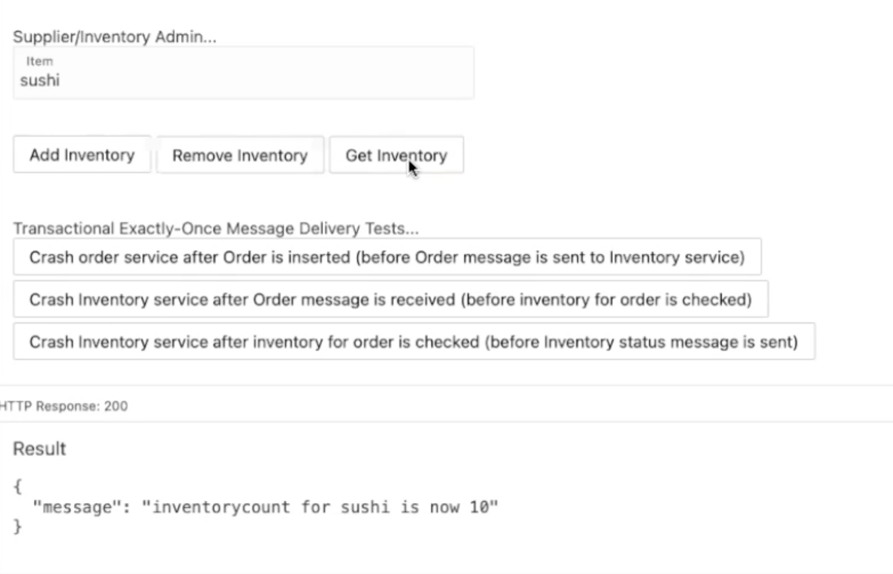
   
2. Click the `Crash order service after Order is inserted (before Order message is sent to Inventory service)` button. 

   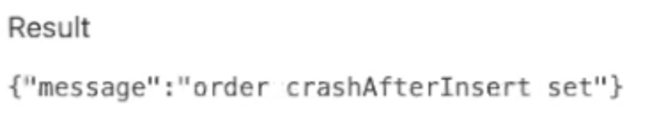
   
3. Click the `Place Order` button to place order `66`

   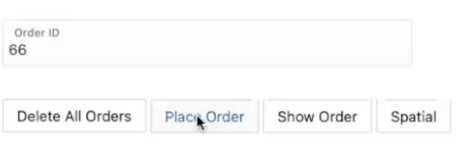
   
4. The request will hang due to the failure. Refresh the browser, return to the `Transactional` page, and click the `Show Order` button for order `66`.  
   You may see a "connection refused" message as the Order service has crashed and is restarting.
   
   
   
5. Click the `Show Order` button until the order is present. Notice the order is in a pending state and will remain in this state, requiring explicit handling.

   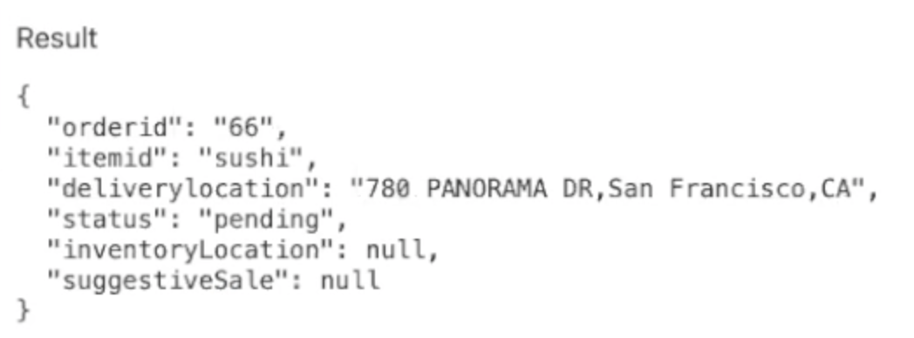
   
6. Click the `Get Inventory` button and notice inventory remains at 10 as expected.

   
   
7. Click the `Crash Inventory service after Order message is received (before inventory for order is checked)` button.

   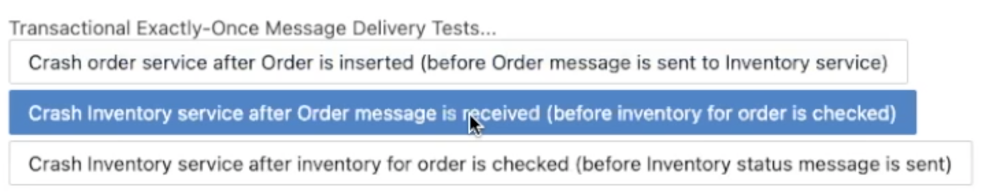
   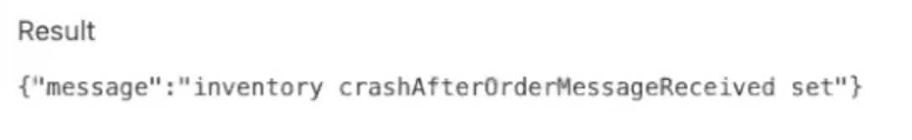
   
8. Enter order number `67` and click the `Place Order` button.

   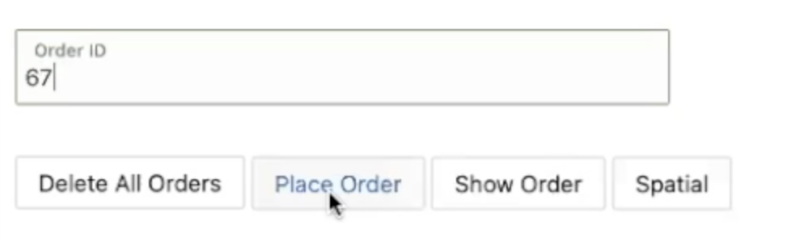
   
9. Notice the pending order status. The order will remain pending until the Inventory service restarts and receives the duplicate message deliver for the order.

   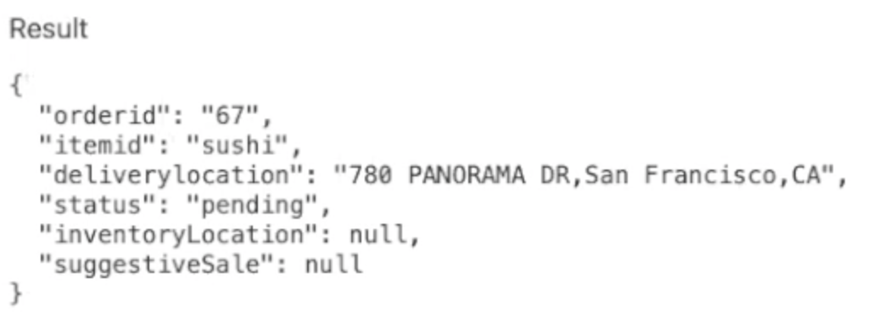
   
10. Continue to click the `Show Order` button until the successful order status is shown.
   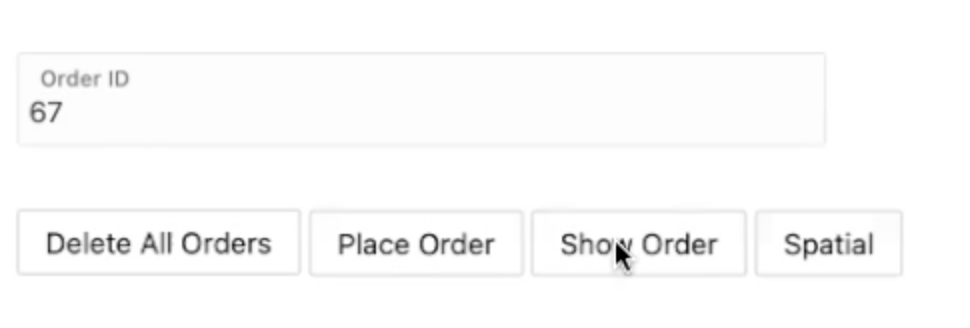
   
11. Notice the successful order status due to duplicate message being delivered. 
   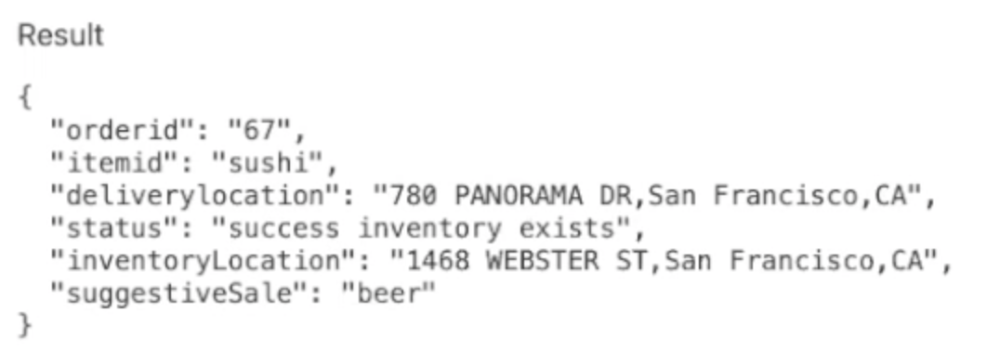
   
12. Click the `Get Inventory` button and notice inventory has been reduced to correct value of 9.
   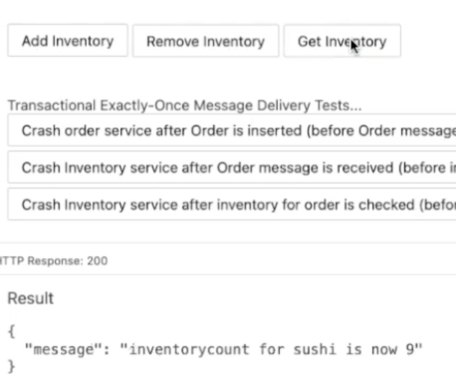
   
13. Click  the `Crash Inventory service after inventory for order is checked (before Inventory status message is sent)` button.
   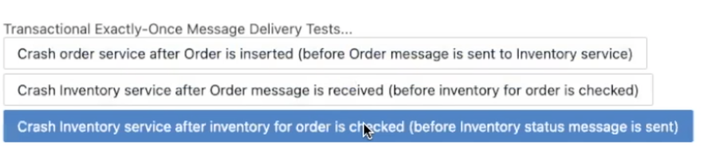
   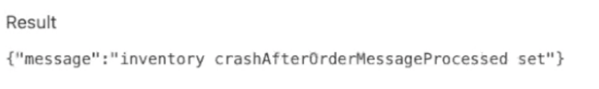
   
14. Enter order number `68` and click the `Place Order` button.
   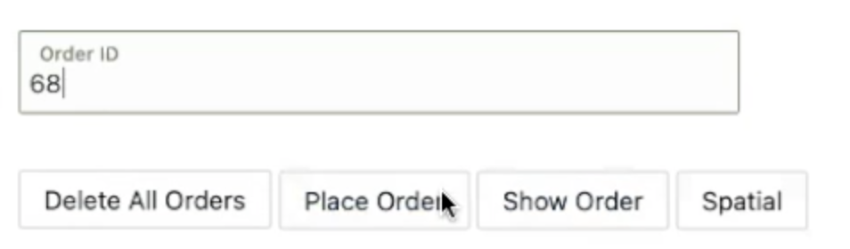
   
15. Notice the pending order status. The order will remain pending until the Inventory service restarts and receives the duplicate message deliver for the order
   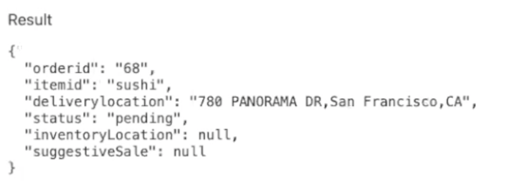
   
16. Continue to click the `Show Order` button until the successful order status is shown.
   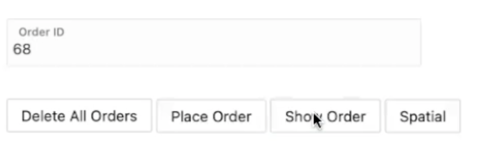
   
17. Notice the successful order status due to duplicate message being delivered.
   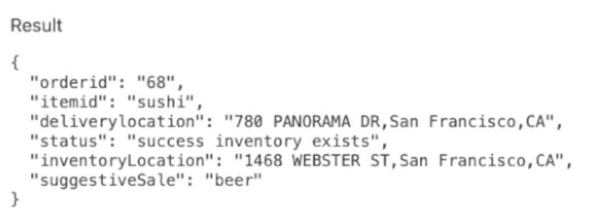
   
18. Click the `Get Inventory` button and notice inventory has been reduced to incorrect value of 7 as the duplicate message delivery has reduced inventory twice for the same order.
   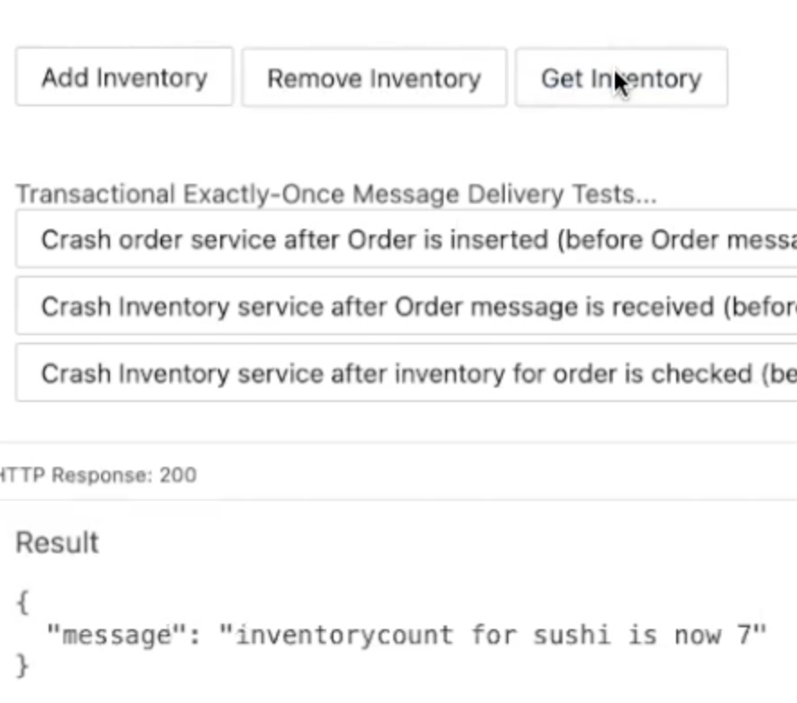
  
## **STEP 3**: Deploy Order and Inventory services that use Oracle and AQ/TEQ.

1.  Undeploy MongoDB, Postgres, and Kafka backed Order and Inventory implementations and deploy the Oracle + TEQ/AQ backed Order and Inventory implementations by copying and running the following commands.
    
    ```
    <copy>
    for i in order-mongodb-kafka inventory-postgres-kafka; do cd $GRABDISH_HOME/$i; ./undeploy.sh; done
    cd $GRABDISH_HOME/order-helidon ; ./deploy.sh
    cd $GRABDISH_HOME/inventory-helidon ; ./deploy.sh
    cd $GRABDISH_HOME/supplier-helidon-se ; ./deploy.sh
    cd $GRABDISH_HOME
    
    </copy>
    ```

3. Check that all pods and services are running by running the `msdataworkshop` command.

    ```
    <copy>msdataworkshop</copy>
    ```
   
## **STEP 4**: Run tests against Oracle DB + AQ implementations


1. Add Inventory until there is a value of 10 for sushi.

   
   
2. Click the `Crash order service after Order is inserted (before Order message is sent to Inventory service)` button. 
   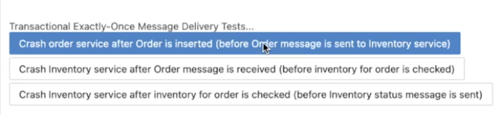
   
   
3. Click the `Place Order` button to place order `66`

   
   
4. The request will hang due to the failure. Refresh the browser, return to the `Transactional` page, and click the `Show Order` button for order `66`.  
   You may see a "connection refused" message as the Order service has crashed and is restarting.
   
   
5. Click the `Show Order` button until the order is present. Notice the order is null as order `66` was correctly automatically rolled back. 
   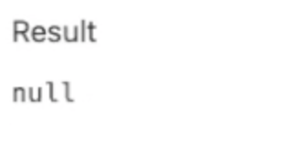
   
6. Click the `Get Inventory` button and notice inventory remains at 10 as expected.
   
   
7. Click the `Crash Inventory service after Order message is received (before inventory for order is checked)` button.
   
   
   
8. Enter order number `67` and click the `Place Order` button.

   
   
9. Notice the pending order status. The order will remain pending until the Inventory service restarts and receives the re-delivery of the message from the Order service.
   
   
10. Continue to click the `Show Order` button until the successful order status is shown.
   
   
11. Notice the successful order status due to transactional exactly-once message delivery (of the message that was put back on the queue due to implicit rollback resulting from Inventory service crash). 
   
   
12. Click the `Get Inventory` button and notice inventory has been reduced to correct value of 9.
   
   
13. Click  the `Crash Inventory service after inventory for order is checked (before Inventory status message is sent)` button.
   
   
   
14. Enter order number `68` and click the `Place Order` button.
   
   
15. Notice the pending order status. The order will remain pending until the Inventory service restarts and receives the re-delivery of the message from the Order service.
   
   
16. Continue to click the `Show Order` button until the successful order status is shown.
   
   
17. Notice the successful order status due to transactional exactly-once message delivery (of the message that was put back on the queue due to implicit rollback resulting from Inventory service crash).
   
   
18. Click the `Get Inventory` button and notice inventory has been reduced to correct value of 8 as the order message was delivered exactly once..
   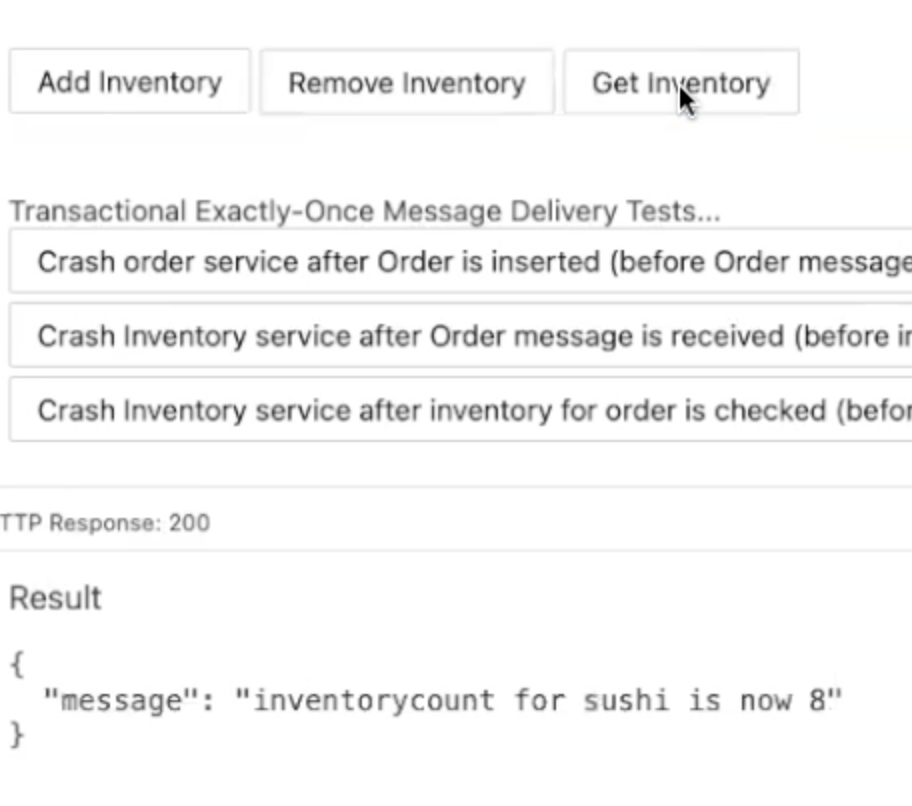
  
   
## Acknowledgements
* **Author** - Paul Parkinson, Developer Evangelist
* **Last Updated By/Date** - Paul Parkinson, June 2021
