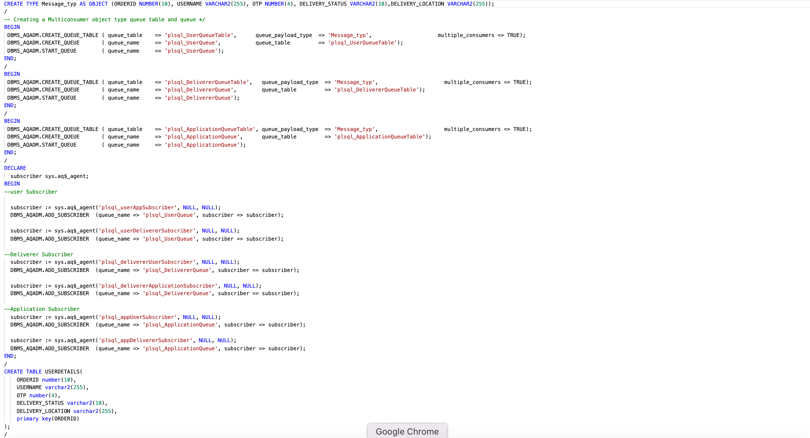

# Second- Factor Authentication workflow using Oracle AQ

## Introduction

This workflow relies on a secure and verified delivery from an Application to the User. The Application will share a secure four-digit OTP with the User; the User will share 4-digit OTP to the Deliverer. The Deliverer will verify the User's identity with the help of OTP and hand over the order to the User.

- Estimated Time: 15 minutes

### Objectives

This Lab will help you understand OTP workflow (one-time-password)/ Second-Factor Authentication/ 2FA based on order delivery with multiconsumer classic Queues.


### Prerequisites

- This workshop assumes you have an Oracle cloud account and configured setup in Lab 1.

## Task 1: Creation of required queues- User, Deliverer, Application

1. Below are the code samples to create required queues

   

2. Execute the following sequence of commands into cloud shell:

  ```bash

  <copy>cd $ORACLEAQ_HOME; source workflowCreateAQ.sh;

  </copy>

  ```

## Task 2: User placed the order, and Application will generate 4-digit OTP

Below are the code samples to create the workflow

  

  1. User places an order

      - Message(OrderId, username,  0   , deliveryLocation, "PENDING")

  2. Application accepts the order; Application updates the OTP and share OTP as four-digit unique/one-time pin to User.

      - Message(OrderId, username, 9707 , deliveryLocation, "PENDING")

  3. Application adds the order details in records Table.

      - Message(OrderId, username, 9707 , deliveryLocation, "PENDING")

  4. Application shares order details to Deliverer with OTP as 0.

      - Message(OrderId, username,   0  , deliveryLocation, "PENDING")

## Task 3: Deliverer meets User

  1. User shares OTP to Deliverer.

      - Message(OrderId, username, 9707 , deliveryLocation, "PENDING")

  2. Deliverer requests Application to validate user's OTP.

      - Message(OrderId, username, 9707 , deliveryLocation, "PENDING")

## Task 4: Application Validates the OTP shared by Deliverer

- **Application validation is successful:**

    1. Application updates DELIVERY STATUS as "DELIVERED" in the exiting record.

    2. Application shares the DELIVERY STATUS as "DELIVERED" to Deliverer.

        - Message(OrderId, username, 9707 , deliveryLocation, "DELIVERED")

    3. Application shares the DELIVERY STATUS as "DELIVERED" to User.

        - Message(OrderId, username, 9707 , deliveryLocation, "DELIVERED")

    4. Deliverer handover the order to User.

- **Application validation is failed:**

    1. Application updates DELIVERY STATUS as "FAILED" in the Database.

    2. Application shares the DELIVERY STATUS as "FAILED" to Deliverer.

        - Message(OrderId, username, 9707 , deliveryLocation, "FAILED")

    3. Application shares the DELIVERY STATUS as "FAILED" to User.

        - Message(OrderId, username, 9707 , deliveryLocation, "FAILED")

    4. Deliverer declines delivery to User.

    - Execute the following sequence of commands into cloud shell:

    ```bash

    <copy>cd $ORACLEAQ_HOME; source workflowEnqueueDequeueAQ.sh;

    </copy>

    ```

   [VISIT THE GITHUB CODE HERE](https://github.com/oracle/microservices-datadriven/tree/main/workshops/oracleAQ)

## Task 5: Workflow using Java

1. Execute the following sequence of commands into cloud shell:

  ```bash

  <copy> curl http://localhost:8081/oracleAQ/workflowAQ </copy>

  ```

[VISIT THE GITHUB CODE HERE](https://github.com/oracle/microservices-datadriven/tree/main/workshops/oracleAQ/aqJava/src/main/java/com/examples/workflowTEQ/WorkflowAQ.java)

## Task 6: Cleanups: Drop the QueueTables(User, Deliverer, Application)

1. Below are the code samples to cleanup workflow Queues

     

     - Stop User, deliverer, application Queues

     - Drop User, deliverer, application Queues

     - Drop User, deliverer, application Queue Tables  

2. Execute the following sequence of commands into cloud shell:

     ```bash

     <copy>cd $ORACLEAQ_HOME; source workflowCleanupAQ.sh;

     </copy>

     ```

 You may now **proceed to the next lab.**

## Acknowledgements

- **Author** - Mayank Tayal, Developer Advocate

- **Last Updated By/Date** - Mayank Tayal, February 2022
