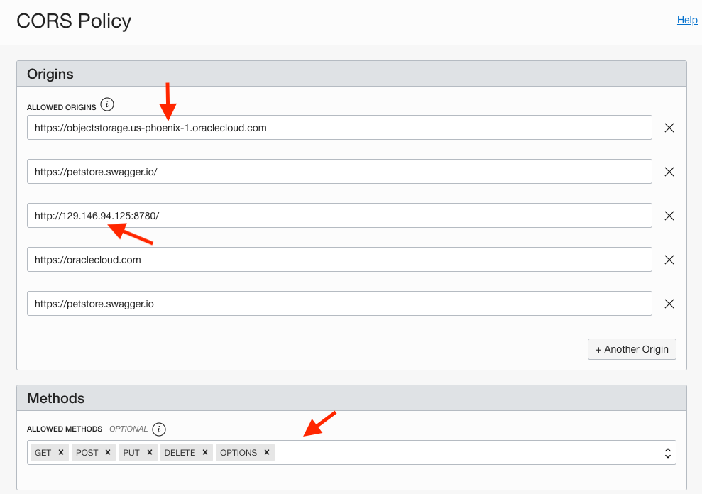

## MyToDoReact version 1.0.
Copyright (c) 2021 Oracle, Inc.

Licensed under the Universal Permissive License v 1.0 as shown at https://oss.oracle.com/licenses/upl/

# Lab 3 -- Backend (Java/Helidon)

## **Summary**

As with most React applications (https://reactjs.org/), this todo application uses remote APIs to handle data persistence. The backend exposes 5 REST APIs including:
- 1) retrieving the current list of todo items
- 2) Adding a new todo item
- 3) finding a todo item by its id
- 4) updating an existing todo item
- 5) deleting a todo item.


The backend is implemented using the following Java classes (under ./backend/src/...):   
- Main.java: starts and configure the main entry points.
- ToDoItem.java: maps a Todo Item instance to/from JSON  document
- ToDoItemStorage.java: storing the Todo item in a persistent storage using the Oracle database
- ToDoListAppService.java: implements the Helidon service and exposes the REST APIs

## **STEP 0**: Chmod all shell scripts

```
  <copy>chmod +x *.sh</copy>
```

## **STEP 1**: Build and push the Docker image

1. Ensure that the "DOCKER_REGISTRY" environment variable is set. This will be used to push the docker image to the OCI image registry.
If the variable is not set or set to an empty string the push will fail (but the docker image will be built).

2. Pick a database service alias from ./backend/target/classes/wallet/tnsnames.ora i.e., mtdrdb_tp


3. Edit ./backend/target/classes/application.yaml to set the database service and user password

   


4. Copy the edited ./backend/target/classes/application.yaml to backend/src/main/resources/application.yaml (i.e. replace the existing one)

5. Run the `build.sh` script to build and push the
    microservices images into the repository

    ```
    <copy>cd $MTDRWORKSHOP_LOCATION/backend; ./build.sh</copy>
    ```

  In a couple of minutes, you should have successfully built and pushed the images into the OCIR repository.


6.  Go to the Console, click the hamburger menu in the top-left corner and open
    **Developer Services > Container Registry**.

7. Mark all the images as public (**Actions** > **Change to Public**):

8. There is no ingress to Cloud Shell from the internet, only egress but if running this lab OUTSIDE the Cloud Shell, you may test the build using the following commands (replace <DOCKER_REGISTRY> by your actual registry).

```
<copy>docker run -p 8080:8080 $DOCKER_REGISTRY/todolistapp-helidon-se:0.1</copy>
```

## **STEP 2**: Deploy the image on Kubernetes and Check the Status

1. Run the `deploy.sh` script

```
  <copy>cd $MTDRWORKSHOP_LOCATION/backend; ./deploy.sh</copy>
```

--> service todolistapp-helidon-se-service created
--> deployment/todolistapp-helidon-se-deployment created

3. Check the status using the following commands
   $ kubectl get services
```
  <copy>kubectl get services</copy>
```
NAME                             TYPE           CLUSTER-IP     EXTERNAL-IP    PORT(S)        AGE
kubernetes                       ClusterIP      10.96.0.1      <none>         443/TCP        36d
todolistapp-helidon-se-service   LoadBalancer   10.96.74.197   130.61.66.27   80:32344/TCP   33s

$ kubectl get pods
```
  <copy>kubectl get pods</copy>
```
NAME                                                 READY   STATUS    RESTARTS   AGE
todolistapp-helidon-se-deployment-7fd6dcb778-c9dbv   1/1     Running   0          5m40s
todolistapp-helidon-se-deployment-7fd6dcb778-gjdfv   1/1     Running   0          5m39s


$ kubectl logs -f todolistapp-helidon-se-deployment-7fd6dcb778-c9dbv

Returns the todolist:
http://130.61.66.27/todolist

## **STEP 3**: Configuring the API Gateway

1. Open up the hamburger menu in the top-left corner of the Console and select **Developer Services> API Management**.

 

2. Select your Gateway and click on it


3. Click "Deployments"


4. Create and Edit a new deployment


Click Next then set your Object Storage



Put the External IP address of the Kubernetes service in the URL postfixed by /toolist


Put the External IP address of the Kubernetes service in the URL postfixed by /toolist/${request.path[id]}


5. Test the deployment through the API Gateway Endpoint

 

 The existing row(s) in the Todoitem table will be retrieved and displayed.

## **STEP 4**: ReDeploy on Kubernetes
If the image has changed, delete the pod and redo Step 1, 2 & 3.

1. Run the `undeploy.sh` script

```
  <copy>cd $MTDRWORKSHOP_LOCATION/backend; ./undeploy.sh</copy>
```

$ kubectl delete pod todolistapp-helidon-se-deployment-7fd6dcb778-c9dbv

--> pod "todolistapp-helidon-se-deployment-7fd6dcb778-c9dbv" deleted

```
<copy>kubectl delete deployment todolistapp-helidon-se-deployment -n todoapp
</copy>
```

```
<copy>kubectl delete service todolistapp-helidon-se-service -n todoapp </copy>

```

## Acknowledgements
* **Workshop by** - Kuassi Mensah, Dir. Product Management, Java Database Access
* **Application by** - Jean de Lavarene, Sr. Director of Development, JDBC/UCP
* **Original scripts by** - Paul Parkinson, Developer Evangelist, Microservices

## Need Help?
Please submit feedback or ask for help using this [LiveLabs Support Forum](https://community.oracle.com/tech/developers/categories/building-microservices-with-oracle-converged-database). Please login using your Oracle Sign On and click the **Ask A Question** button to the left.  You can include screenshots and attach files.  Communicate directly with the authors and support contacts.  Include the *lab* and *step* in your request.
