# Access Bob's Book Application and Explore Verrazzano and Other Consoles

## Introduction

In Lab 3, we deployed the Bob's Book application. In this lab, we will access the application and verify that it is working. Later, we will explore the Verrazzano and Grafana consoles.

### Objectives

In this lab, you will:

* Access the Bob's Book application.
* Explore the Verrazzano console.
* Explore the Grafana console.

### Prerequisites

* Run Lab 1, which creates an OKE Cluster on the Oracle Cloud Infrastructure.
* Run Lab 2, which installs Verrazzano on a Kubernetes cluster.
* Run Lab 3, which deploys the Bob's Book application.
* You should have a text editor, where you can paste the commands and URLs and modify them, as per your environment. Then you can copy and paste the modified commands for running them in the *Cloud Shell*.

## Task 1: Access the Bob's Book application

1. We need an `EXTERNAL_IP` address through which we can access the Bob's Book application. To get the `EXTERNAL_IP` address of the istio-ingressgateway service, copy the following command and paste it in the *Cloud Shell*.

      ```bash
      <copy> kubectl get service \
      -n "istio-system" "istio-ingressgateway" \
      -o jsonpath={.status.loadBalancer.ingress[0].ip}; echo</copy>
      ```

   The output should be similar to the following:
      ```bash
         $ kubectl get service \
         > -n "istio-system" "istio-ingressgateway" \
         > -o jsonpath={.status.loadBalancer.ingress[0].ip}; echo
         XX.XX.XX.XX
      ```
2. To open the Robert's Book Store Home Page, copy the following URL and replace *XX.XX.XX.XX* with your *EXTERNAL_IP* address which we got in the last step, as shown in the following image.

      ```bash
      <copy>https://bobs-books.bobs-books.XX.XX.XX.XX.nip.io/</copy>
      ```

   

3. Click *Advanced*, as shown:

   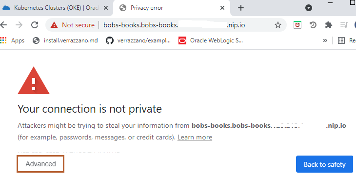

4. Select *Proceed to bobs-books.bobs-books. EXTERNAL_IP .nip.io(unsafe)* to access the application.

   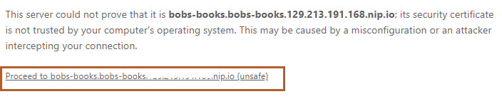

   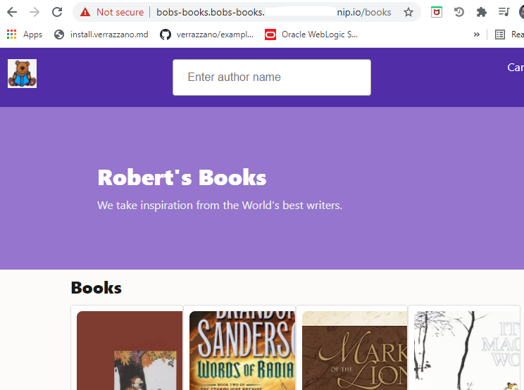

5. To open the Bob's Book Store Home page, open a new tab and copy the following URL and replace *XX.XX.XX.XX* with your `EXTERNAL_IP` address, as shown in the following image.

      ```bash
      <copy>https://bobs-books.bobs-books.XX.XX.XX.XX.nip.io/bobbys-front-end/</copy>
      ```

   

   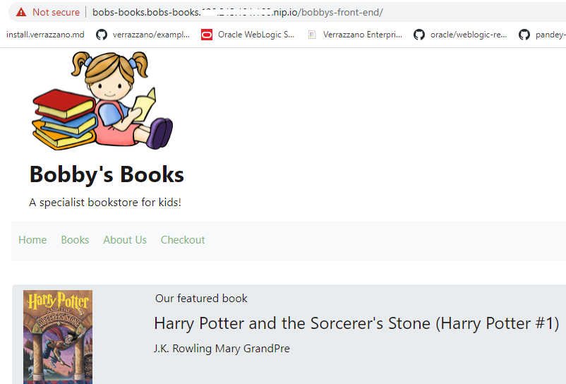

   > Leave this page open  because we will use it in Lab 8.

6. To open the Bob's Book Order Manager UI, open a new tab and copy the following URL and replace *XX.XX.XX.XX* with your *EXTERNAL_IP* address as shown in the following image.

      ```bash
      <copy>https://bobs-books.bobs-books.XX.XX.XX.XX.nip.io/bobs-bookstore-order-manager/orders</copy>
      ```

   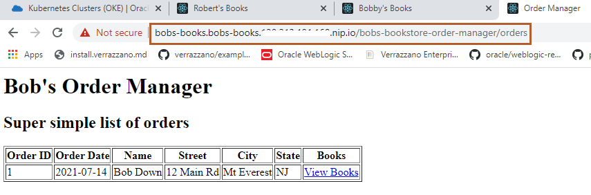

7. Go Back to the *Bob's Books* page and let's purchase a book. Click *Books* as shown in the following image.

   

8. Select the image for the *Twilight* Book, as shown in the following image.

   

9. First, click *Add to cart* and then *Checkout* as shown in the following image.

   

10. Enter the details for purchasing the book. For *Your State*, enter your two digit state code and then click *Submit Order*.

   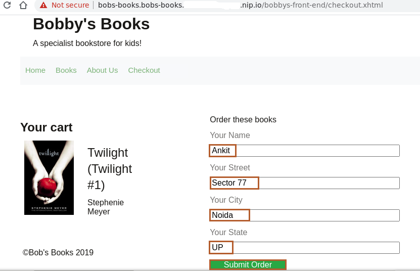
11. Go back to the *Order Manager* page and select the *Refresh* button to check if your order is successfully recorded in the order manager.

   

## Task 2: Explore the Verrazzano Console

Verrazzano installs several consoles. The endpoints for an installation are stored in the `Status` field of the installed Verrazzano Custom Resource.

1. You can get the endpoints for these consoles by using the following command:

      ```bash
      <copy>kubectl get vz -o jsonpath="{.items[].status.instance}" | jq .</copy>
      ```

   The output should be similar to the following:
      ```bash
      $ kubectl get vz -o jsonpath="{.items[].status.instance}" | jq .
      {
      "consoleUrl": "https://verrazzano.default.XX.XX.XX.XX.nip.io",
      "elasticUrl": "https://elasticsearch.vmi.system.default.XX.XX.XX.XX.nip.io",
      "grafanaUrl": "https://grafana.vmi.system.default.XX.XX.XX.XX.nip.io",
      "keyCloakUrl": "https://keycloak.default.XX.XX.XX.XX.nip.io",
      "kialiUrl": "https://kiali.vmi.system.default.XX.XX.XX.XX.nip.io",
      "kibanaUrl": "https://kibana.vmi.system.default.XX.XX.XX.XX.nip.io",
      "prometheusUrl": "https://prometheus.vmi.system.default.1XX.XX.XX.XX.nip.io",
      "rancherUrl": "https://rancher.default.XX.XX.XX.XX.nip.io"
      }
      $
      ```
    Click the links to open the *Verrazzano* Console.

2. Click *Advanced*.

   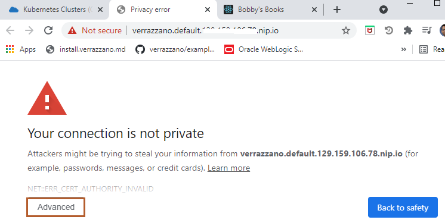

3. Select *Proceed to verrazzano default XX.XX.XX.XX.nip.io(unsafe)*.

   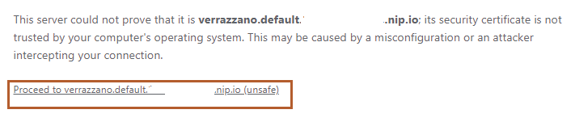

4. Because it redirects to the Keycloak console  URL for authentication, again on this page, click *Advanced*.

   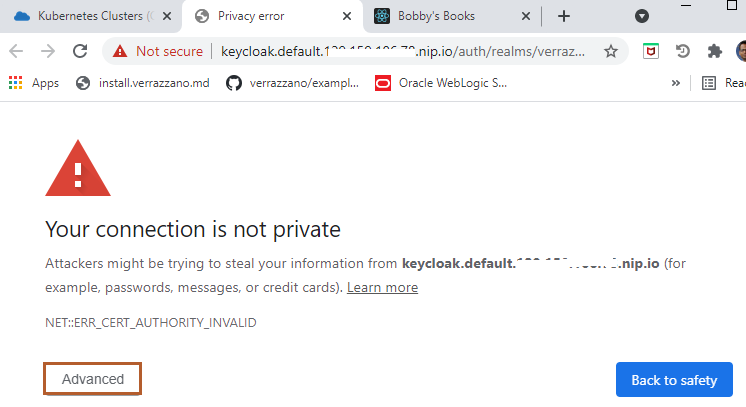

5. Select *Proceed to Keycloak default XX.XX.XX.XX.nip.io(unsafe)*.

   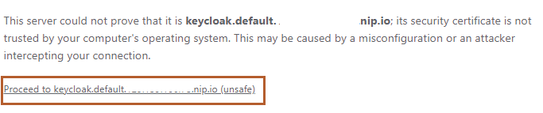

6. Now we need the user name and password for the Verrazzano console. *Username* is *verrazzano* and to find out the password, go back to the *Cloud Shell* and paste the following command to find out the password for the *Verrazzano Console*.

      ```bash
      <copy>kubectl get secret --namespace verrazzano-system verrazzano -o jsonpath={.data.password} | base64 --decode; echo</copy>
      ```

   The output should be similar to the following:
      ```bash
      $ kubectl get secret --namespace verrazzano-system verrazzano -o jsonpath={.data.password} | base64 --decode; echo
      aBsNxxZnl1ea3Vzp
      $
      ```

7. Copy the password and go back to the browser, where the *Verrazzano Console* is open.

   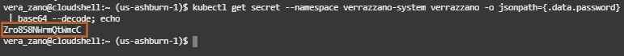

8. Paste the password in the *Password* field and enter *verrazzano* as *Username* and then click *Sign In*.

   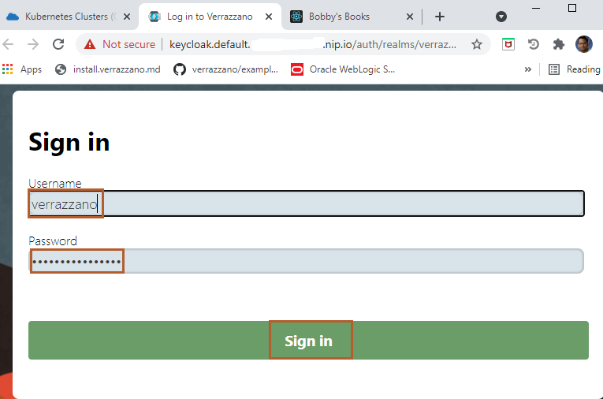

   In the Home Page of the Verrazzano Console, you can see *System Telemetry* and because we installed the *Development Profile* of Verrazzano, you can see it in the *General Information* section.

   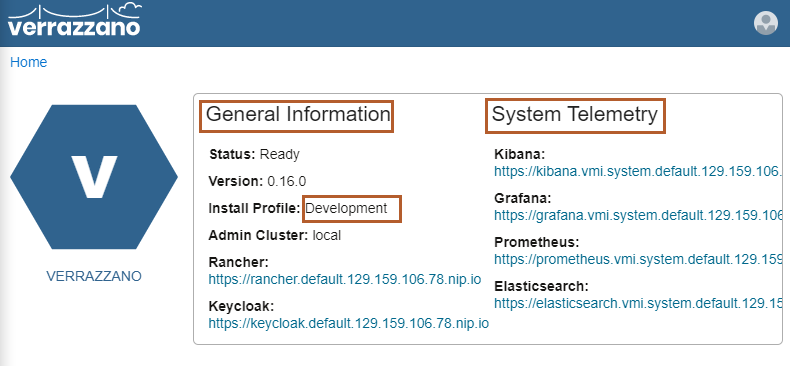

9. Because we have deployed the Bob's Book application, you can see it under *OAM Applications*. Select *bobs-books* to view different components of this application.

   

   There are 10 components for this application as you can see under *Components*.

10. To explore the configuration for a particular component, first select the *Sort by* drop-down menu and select *Name*, then select the *bobby-coh* component as shown:

    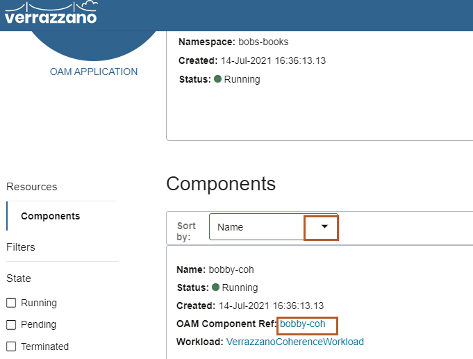

11. You can see *General Information* for this component. To learn about the *Workload Spec*, select *bobby-coh* as shown:

    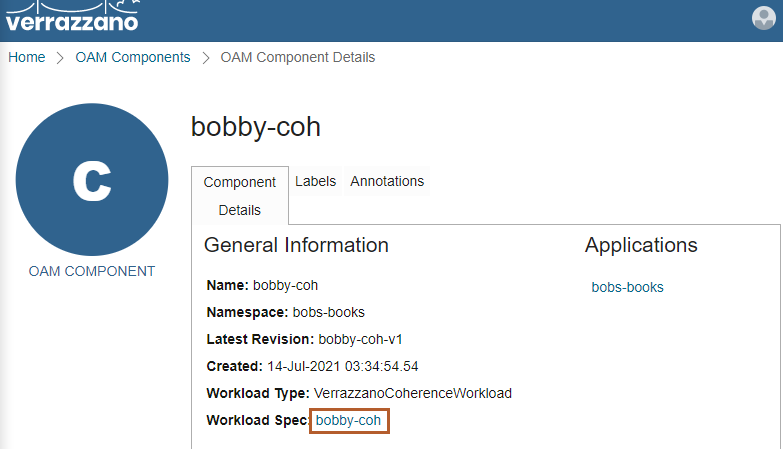

12. Here you can see the configuration details for the *bobby-coh* component. Click *Close*.

    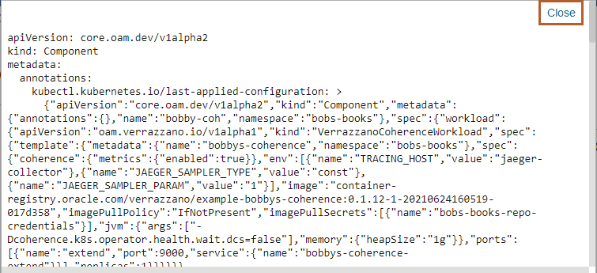

## Task 3: Explore the Grafana Console

1. Select *Home* to go back to Verrazzano Console Home Page.

    

2. In this page, you'll see the link for opening the *Grafana console*. Select the link for the *Grafana Console* as shown:

    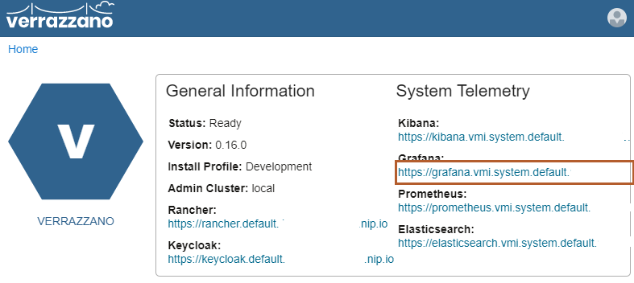

3. Click *Advanced*.

    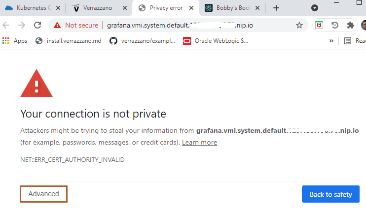

4. Select *grafana.vmi.system.default.XX.XX.XX.XX.nip.io(unsafe)*.

    

5. The Grafana Home Page opens. Select *Home*  at the top left.

    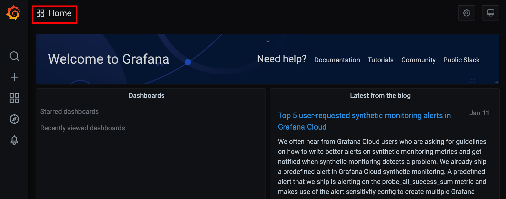

6. Type *WebLogic* and you will see *WebLogic Server Dashboard* under *General*. Select *WebLogic Server Dashboard*.

    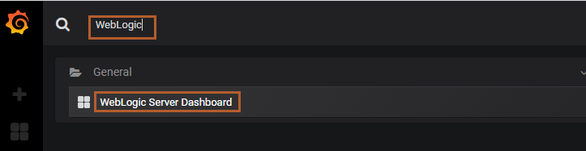

    Here you can observe the two domains under *Domain* and Running Servers, Deployed Applications, Server Name and their Status, Heap Usage, Running Time, JVM Heap. If your application has resources like JDBC and JMS, you can also get details about it here.

    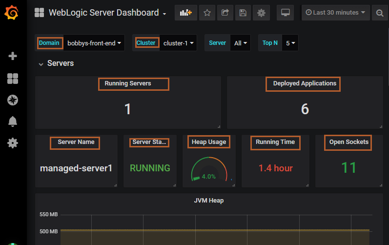

7. Now, select WebLogic Server Dashboard and type *Helidon* and you will see *Helidon Monitoring Dashboard*. Select *Helidon Monitoring Dashboard*.

    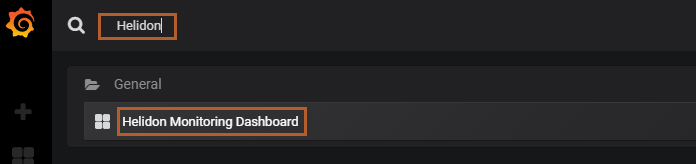

    Here you can see various details like the *Status* of your application and its *Uptime*, Garbage Collector, and Mark Sweep Total and its Time, Thread Count.

    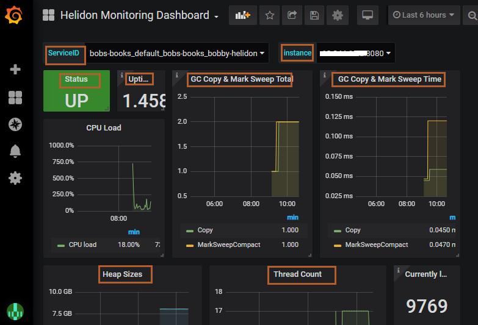

8. Now, select Helidon Monitoring Dashboard and type *Coherence* and you will see *Coherence Dashboard Main*. Select *Coherence Dashboard Main*.

    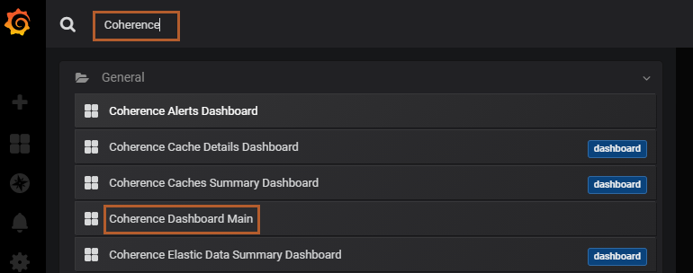

9. Here you can see the details of the *Coherence Cluster*. For the Bob's Books application, we have two Coherence clusters, one for Bob's Books and another for Robert's Books. You need to select the drop-down menu for *Cluster Name* to view both the clusters.

    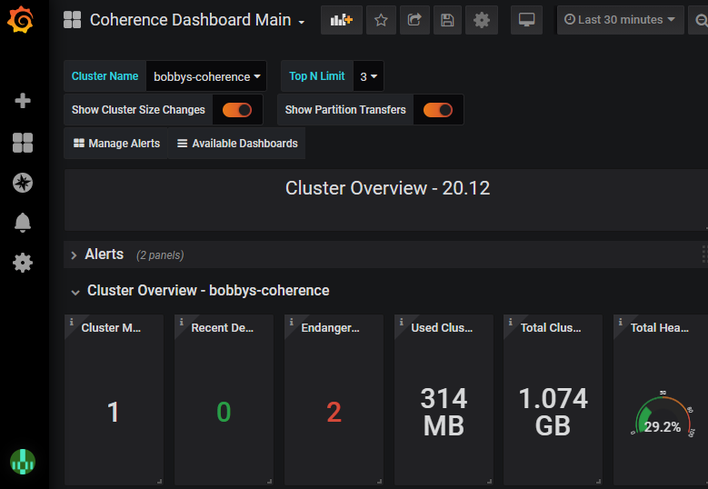

    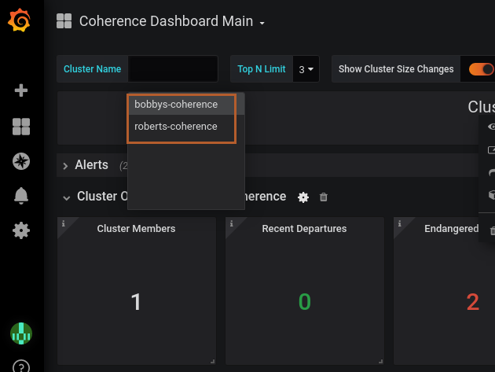

## Task 4: Explore the Kiali Console

1. Go to Verrazzao console and click on the link for Kiali Console.

   

2. On Left side, Click on Graph.

   

3. In the Namespace dropdown, check the box for *bobs-books* and make the curser move outside the dropdown. 
   

4. You can view the graphical view of *bobs-books* application. Click *Legend* to view the *Legend* view.

   

5. Here you can view, what each shapes represents, like circle represents the *Workloads*.

   

6. On Left side, Click on *Applications*.

   


Leave the *Cloud Shell* open; we will use it for upcoming labs.

## Acknowledgements

* **Author** -  Ankit Pandey
* **Contributors** - Maciej Gruszka, Peter Nagy
* **Last Updated By/Date** - Kamryn Vinson, January 2022
