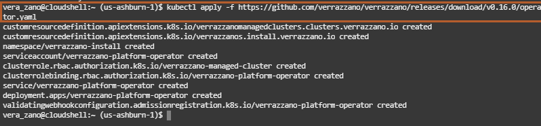
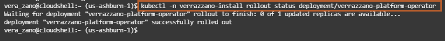
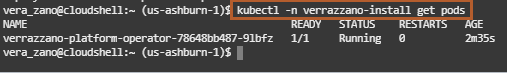
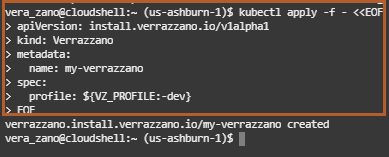
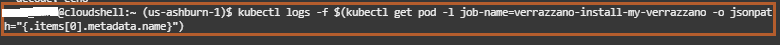
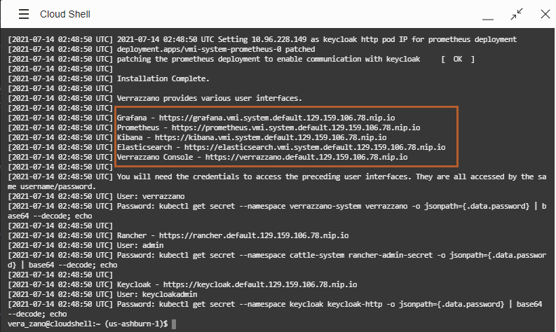
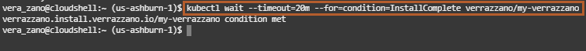
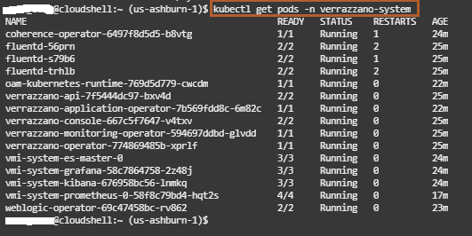
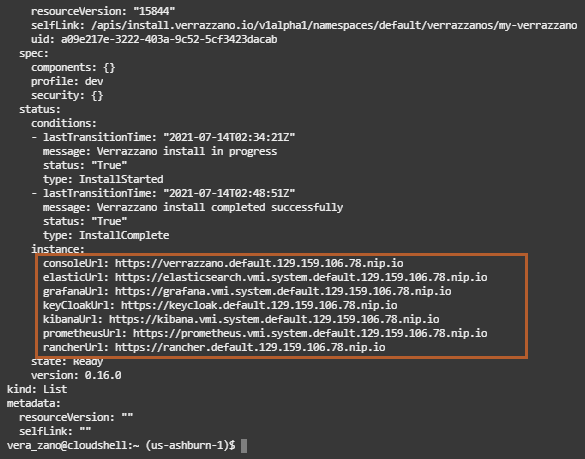

# Install Verrazzano on a Kubernetes Cluster in the Oracle Cloud Infrastructure (OCI)

## Introduction

This lab walks you through the steps to install Verrazzano on a Kubernetes cluster in the Oracle Cloud Infrastructure.

### About Product/Technology

Verrazzano is an end-to-end enterprise container platform for deploying cloud-native and traditional applications in multicloud and hybrid environments. It is made up of a curated set of open source components – many that you may already use and trust, and some that were written specifically to pull together all of the pieces that make Verrazzano a cohesive and easy to use platform.

Verrazzano includes the following capabilities:

* Hybrid and multicluster workload management
* Special handling for WebLogic, Coherence, and Helidon applications
* Multicluster infrastructure management
* Integrated and pre-wired application monitoring
* Integrated security
* DevOps and GitOps enablement

### Objectives

In this lab, you will:

* Install the Verrazzano platform operator.
* Install the development (`dev`) profile of Verrazzano.
* Verify the successful Verrazzano installation.

### Prerequisites

Verrazzano requires the following:

* A Kubernetes cluster and a compatible `kubectl`.
* At least 2 CPUs, 100GB disk storage, and 16GB RAM available on the Kubernetes worker nodes. This is sufficient to install the development profile of Verrazzano. Depending on the resource requirements of the applications you deploy, this may or may not be sufficient for deploying your applications.

In Lab 1, we created a Kubernetes cluster on the Oracle Cloud Infrastructure. We will use that Kubernetes cluster, *cluster1*, for installing the development profile of Verrazzano.

## Task 1: Install the Verrazzano Platform Operator

Verrazzano provides a platform [operator](https://kubernetes.io/docs/concepts/extend-kubernetes/operator/) to manage the life cycle of Verrazzano installations. You can install, uninstall, and update Verrazzano installations by updating the [Verrazzano custom resource](https://verrazzano.io/docs/reference/api/verrazzano/verrazzano/).

Before installing Verrazzano, we need to install the Verrazzano Platform Operator.

1. Copy the following command and paste it in the *Cloud Shell* to run it.

    ```bash
    <copy>kubectl apply -f https://github.com/verrazzano/verrazzano/releases/download/v1.0.0/operator.yaml</copy>
    ```

    

    > This `operator.yaml` file contains information about the operator and the service accounts and custom resource definitions. By running this *kubectl apply* command, we are specifying whatever is in the `operator.yaml` file.
    > All deployments in Kubernetes happen in a namespace. When we deploy the Verrazzano Platform Operator, it happens in the namespace called "verrazzano-install".

2. To find out the deployment status for the Verrazzano Platform Operator, copy the following command and paste it in the *Cloud Shell*.

    ```bash
    <copy>kubectl -n verrazzano-install rollout status deployment/verrazzano-platform-operator</copy>
    ```

    

    > Confirm that the operator pod associated with the Verrazzano Platform Operator is correctly defined and running. A Pod is a unit which runs containers / images and Pods belong to nodes.

3. To find out the pod status, copy and paste the following command in the *Cloud Shell*.

    ```bash
    <copy>kubectl -n verrazzano-install get pods</copy>
    ```

    

## Task 2: Installation of the Verrazzano development profile

An installation profile is a well-known configuration of Verrazzano settings that can be referenced by name, which can then be customized as needed.

Verrazzano supports the following installation profiles: development (`dev`), production (`prod`), and managed cluster (`managed-cluster`).

* The production profile, which is the default, provides a 3-node Elasticsearch and persistent storage for the Verrazzano Monitoring Instance (VMI).
* The development profile provides a single node Elasticsearch and no persistent storage for the VMI.
* The managed-cluster profile installs only managed cluster components of Verrazzano. To take full advantage of multicluster features, the managed cluster should be registered with an admin cluster.

To change profiles in any of the following commands, set the *VZ_PROFILE* environment variable to the name of the profile you want to install.

For a complete description of Verrazzano configuration options, see the [Verrazzano Custom Resource Definition](https://verrazzano.io/docs/reference/api/verrazzano/verrazzano/).

In this lab, we are going to install the *development profile of Verrazzano*, which has the following characteristics:

* It has a lightweight installation.
* It is for evaluation purposes.
* No persistence.
* Single-node Elasticsearch cluster topology.

The following image describes the Verrazzano components that are installed with each profile.


According to our DNS choice, we can use nip.io (wildcard DNS) or [Oracle OCI DNS](https://docs.cloud.oracle.com/en-us/iaas/Content/DNS/Concepts/dnszonemanagement.htm). In this lab, we are going to install using nip.io (wildcard DNS).

An ingress controller is something that helps provide access to Docker containers to the outside world (by providing an IP address). The ingress routes the IP address to different clusters.

1. Install using the nip.io DNS Method. Copy the following command and paste it in the *Cloud Shell* to install Verrazzano.

    ```bash
    <copy>kubectl apply -f - <<EOF
    apiVersion: install.verrazzano.io/v1alpha1
    kind: Verrazzano
    metadata:
      name: my-verrazzano
    spec:
      profile: ${VZ_PROFILE:-dev}
    EOF
    </copy>
    ```

    

    > It takes around 15 to 20 minutes to complete the installation.

2. To find out how the installation process is going, you can copy and paste the following command in the *Cloud Shell* to monitor the console log.

    ```bash
    <copy>kubectl logs -f $(kubectl get pod -l job-name=verrazzano-install-my-verrazzano -o jsonpath="{.items[0].metadata.name}")</copy>
    ```

    > The console log contains information about all the steps performed by the platform operator for installing Verrazzano, the components being installed, and the URLs we can use for accessing them.

    
    

3. To verify the successful installation, copy the following command and paste it in the *Cloud Shell*. It checks for the condition, if *InstallComplete* condition is met, and notifies you. Here *my-verrazzano* is the name of the *Verrazzano Custom Resource*.

    ```bash
    <copy>kubectl wait --timeout=20m --for=condition=InstallComplete verrazzano/my-verrazzano</copy>
    ```

    

## Task 3: Verification of a successful Verrazzano installation

Verrazzano installs multiple objects in multiple namespaces. Verrazzano components are installed in the namespace *verrazzano-system*.

1. Please verify that all the pods associated with the multiple objects have a *Running* status.

    ```bash
    <copy>kubectl get pods -n verrazzano-system</copy>
    ```

    

    Verrazzano installs several consoles. The endpoints for an installation are stored in the `Status` field of the installed Verrazzano Custom Resource.

2. To get the endpoints for these consoles, copy the following command and paste it in the *Cloud Shell* and look at the `Status.Instance` field:

    ```bash
    <copy>kubectl get vz -o yaml</copy>
    ```

    

Leave the *Cloud Shell* open; we need it for Lab 3.

## Acknowledgements

* **Author** -  Ankit Pandey
* **Contributors** - Maciej Gruszka, Peter Nagy
* **Last Updated By/Date** - Kamryn Vinson, July 2021
