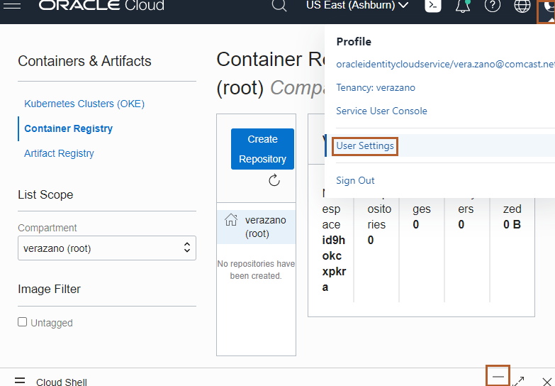
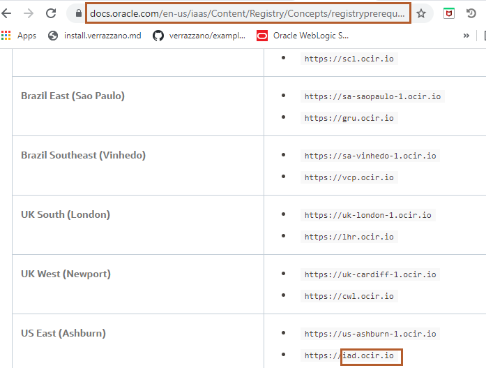
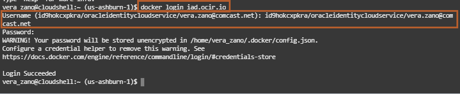
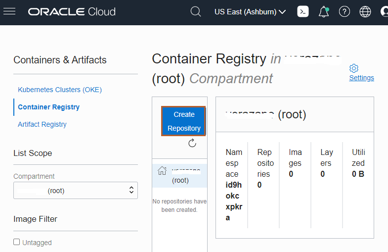
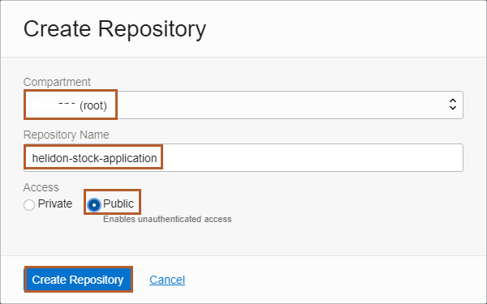
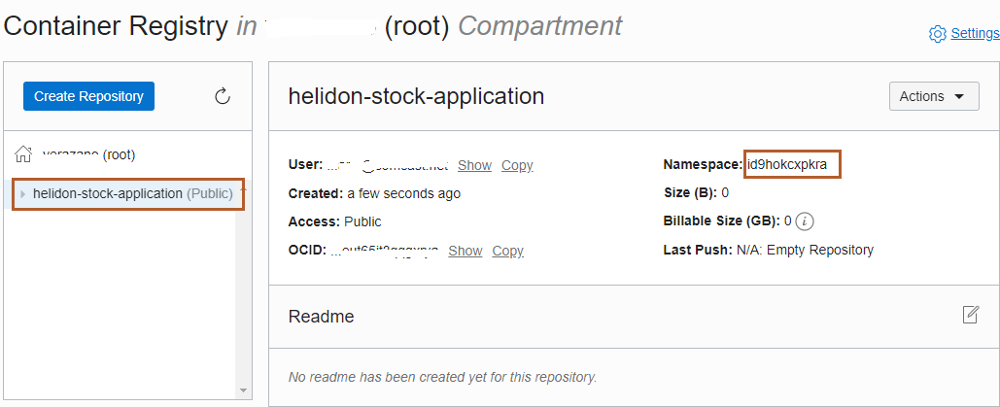
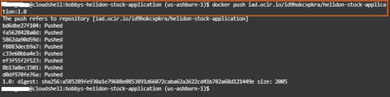
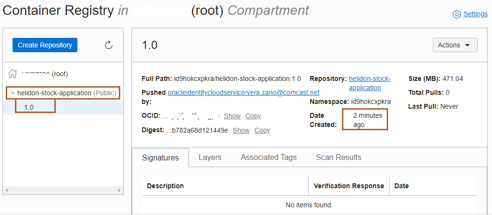

# Push the Docker Image for bobbys-helidon-stock-application to the Oracle Cloud Container Registry

## Introduction

In Lab 5, we modified bobbys-helidon-stock-application and built a new Docker image. In this Lab, we will push that image into a repository inside the Oracle Cloud Container Registry.

### Objectives

In this lab, you will:

* Generate an Authentication Token to log in to the Oracle Cloud Container Registry.
* Push bobbys-helidon-stock-application Docker image to your Oracle Cloud Container Registry repository.

### Prerequisites

You should have a text editor, where you can paste the commands and URLs and modify them, as per your environment. Then you can copy and paste the modified command for running them in the *Cloud Shell*.

## Task 1: Generate an Authentication Token to Login to the Oracle Cloud Container Registry

In this step, we are going to generate an *Authentication Token*, that we will use to log in to the Oracle Cloud Container Registry.

1. Select the User Icon in the top right corner and then select *User Settings*.

    

2. Scroll down and select *Auth Tokens*.

    

3. Click *Generate Token*.

    

4. Copy *helidon-stock-application* and paste it in the *Description* box and click *Generate Token*.

    

5. Select *Copy* under Generated Token and paste it in the text editor. We cannot copy it later.

    

## Task 2: Push the bobbys-helidon-stock-application Docker image to your Oracle Cloud Container Registry Repository


1. In Lab 5, you opened a URL [https://docs.oracle.com/en-us/iaas/Content/Registry/Concepts/registryprerequisites.htm#Availab](https://docs.oracle.com/en-us/iaas/Content/Registry/Concepts/registryprerequisites.htm#Availab) and saved the endpoint for your Region name in a text editor. In my case, it is US East (Ashburn).

    

 2. Copy the following command and paste it in your text editor and then replace the `END_POINT_OF_REGION_NAME` with the endpoint of your region.

    ```bash
    <copy> docker login `END_POINT_OF_REGION_NAME`</copy>
    ```

3. In the previous lab, you determined the Tenancy Namespace. Make the user name as follows: `NAMESPACE_OF_YOUR_TENANCY`/oracleidentitycloudservice/`YOUR_ORACLE_CLOUD_USERNAME`. Here, replace `NAMESPACE_OF_YOUR_TENANCY` with your tenancy's namespace and `YOUR_ORACLE_CLOUD_USERNAME` with your Oracle Cloud Account user name and then copy the replaced user name from your text editor and paste it in the *Cloud Shell*. For Password , paste the Authentication Token from your text editor or where you saved it.

    

4. Go back to the Container Registry, select *Hamburger Menu -> Developer Services -> Container Registry*.

    

5. Select the compartment and then click *Create Repository*.

    

6. Select the compartment and enter *helidon-stock-application* as the Repository Name, then choose Access as *Public* and then click *Create Repository*.

    

    After the repository *helidon-stock-application* has been created, you can verify the Namespace and it should be same as your tenancy's namespace.

    

7. As part of Lab 5, you copied the Docker image full name into your text editor. To push your Docker image into your repository inside the Oracle Cloud Container Registry, copy and paste the following command in your text editor and then replace `ENDPOINT_OF_YOUR_REGION_NAME`/`NAMESPACE_OF_YOUR_TENANCY`/helidon-stock-application:1.0 with Docker image full name, which you have saved in your text editor.

    ```bash
    <copy>docker push `ENDPOINT_OF_YOUR_REGION_NAME`/`NAMESPACE_OF_YOUR_TENANCY`/helidon-stock-application:1.0</copy>
    ```

    

    After the *docker push* command runs successfully, expand the *helidon-stock-application* repository and you will notice a new image has been uploaded in this repository.

    

Leave the *Cloud Shell* and Container Registry repository page open; we will need them for the next labs.

## Acknowledgements

* **Author** -  Ankit Pandey
* **Contributors** - Maciej Gruszka, Peter Nagy
* **Last Updated By/Date** - Kamryn Vinson, January 2022
