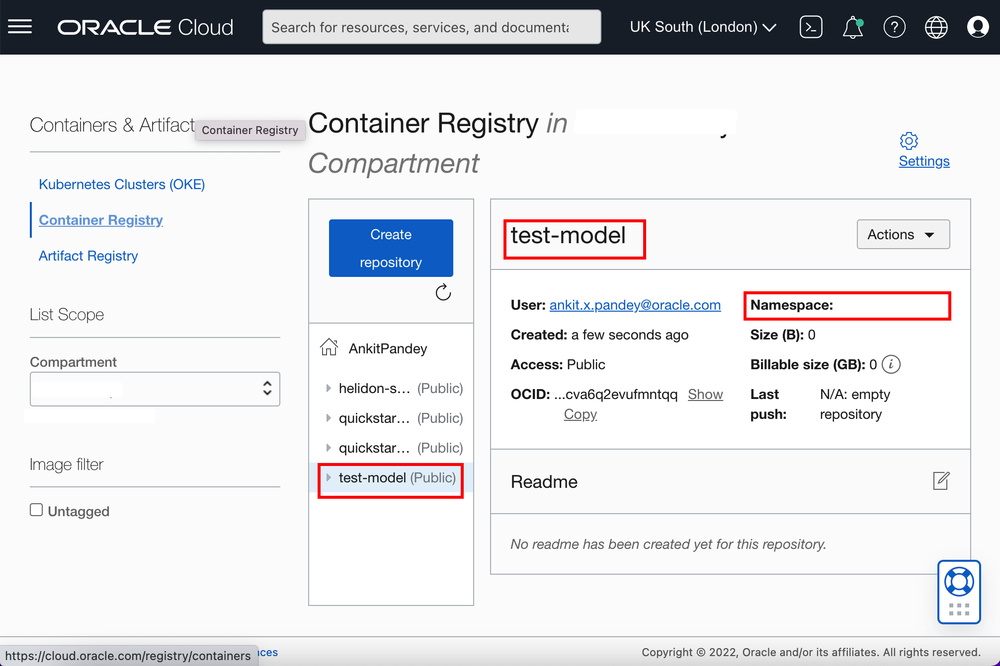
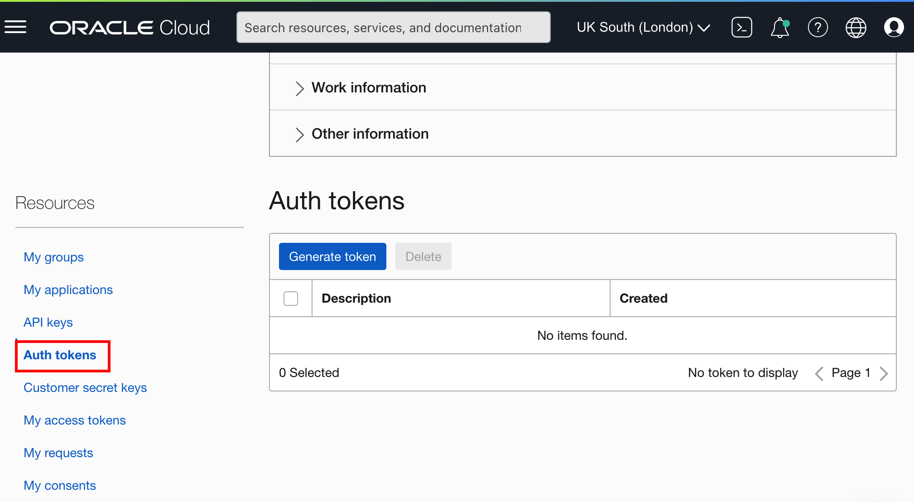
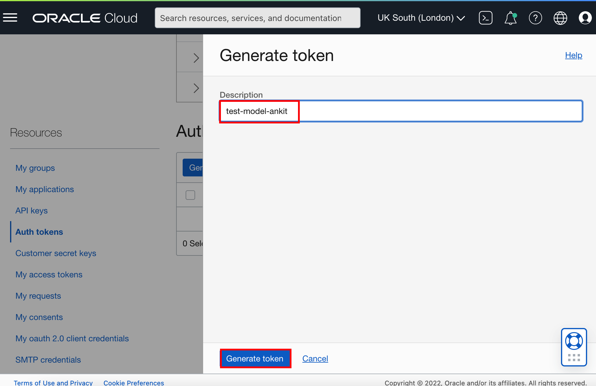
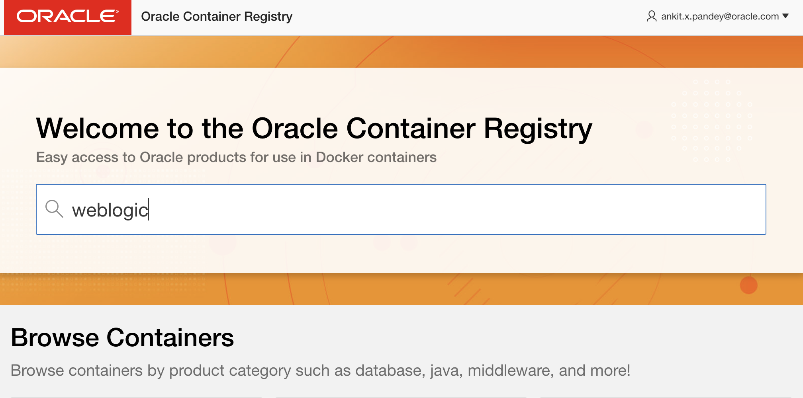
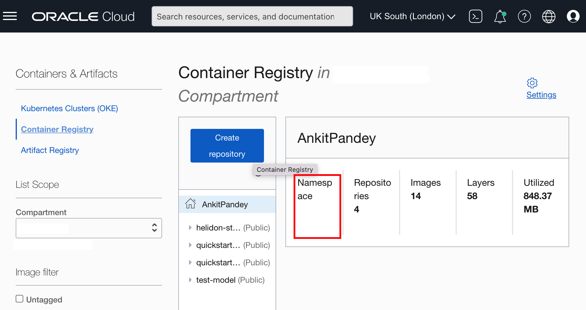

# Creation of Images for the Oracle Container Engine for Kubernetes (OKE) on Oracle Cloud Infrastructure (OCI)
## Introduction

In this Lab, We creates a repository in Oracle Cloud Container Image Registry Repository. We also generate the authentication token. Then we accept the license agreement for the WebLogic Server Images, as we use this images in this workshop as primary image. At last, we create an auxiliary image, and push it to newly created repository using the generated authentication token. 

***About WebLogic Kubernetes Toolkit Image Section***

The Image section helps you build container images for deploying WebLogic-based applications in a Kubernetes environment using the [WebLogic Image Tool](https://oracle.github.io/weblogic-image-tool/).

**Primary Image** - The image containing the Oracle Fusion Middleware software. It is used as the basis of all containers that run WebLogic Servers for the domain.

**Auxiliary Image** - The image that supplies the WebLogic Deploy Tooling software and the model files. At runtime, the auxiliary image’s content is merged with the primary image’s content.
    

The primary image is the one used for running the domain and the auxiliary image contains the data that defines the domain. One primary image can be reused for hundreds of domains whereas an auxiliary image is domain-specific. When using auxiliary images, the primary image contains the OS, JDK, and FMW software installations; the auxiliary image supplies the specifics for a single domain.


### Objectives

In this lab, you will:

* Create a repository inside Oracle Cloud Container Image Registry.
* Generate an authentication token to push auxiliary image to Oracle Cloud Container Image Registry.
* Enter WebLogic Server Image tag inside the Primary Image Tag in WebLogic Kubernetes Toolkit UI Application.
* Create an Auxiliary Image and push the image to Oracle Cloud Container Image Registry.

### Prerequisites

* You must have an Oracle account. As we need to accept the license agreement for WebLogic Server Images in Oracle Container Registry.
* You must have Oracle Cloud Account. You must have information about your tenancy name and cloud account credentials.
* Successfully created the virtual machine, which consist of all required softwares.
* You should have a text editor, where you can paste the commands and URLs and modify them, as per your environment. Then you can copy and paste the modified commands for running them in the terminal.

## Task 1: Creation of repository inside Oracle Cloud Container Registry Repository

You creates a public repository in this task. Later, we will push Auxiliary Image in this repository.

1. In the Console, select the *Hamburger Menu* -> *Developer Services* -> *Container Registry* as shown.
    

2. Select your compartment, where you are allowed to create the repository. Click *Create Repository*.
    

3. Enter *`test-model-your_first_name`* as Repository name and Access as *Public* then click *Create repository*.
    

4. Once your repository is ready, you need to note down the tenancy namespace somewhere.
    

## Task 2: Generate an Authentication Token to push Auxiliary Image to the Oracle Cloud Container Registry

In this step, we are going to generate an *Authentication Token*, that we will use to push auxiliary image into the Oracle Cloud Container Registry Repository.

1. Select the User Icon in the top right corner and then select *MyProfile*.

    

2. Scroll down and select *Auth Tokens*.

    

3. Click *Generate Token*.

    

4. Copy *`test-model-your_first_name`* and paste it in the *Description* box and click *Generate Token*.

    

5. Select *Copy* under Generated Token and paste it in the text editor. We cannot copy it later. You need to use this in Task 4 of this lab.  Click *Close*.

    

## Task 3: Enter details of Primary Container Image 

In this Task, we are using the pre-build WebLogic Server Images. To use that images, we need to accept the license agreement. First, we accept the license agreement for WebLogic Server Images, later we use the WebLogic Server Image Tag as *Primary Image* in the WebLogic Kubernetes Toolkit UI.

1. Click the link for the Oracle Container Registry [https://container-registry.oracle.com/](https://container-registry.oracle.com/) and sign in. For this, you need an Oracle Account.
    
    
2. Enter your *Oracle Account Credentials* in the Username and Password fields, and then click *Sign In*.
    

3. In the Home page of Oracle Container Registry, Search for *weblogic*.
    

4. Click *weblogic* as shown and select *English* as the language, then click *Continue*.
    
    

5. Click *Accept* to accept the license agreement.
    

6. Click *Image*.We already pre-filled *Image Tag* with the below value. As you enter the *Image Tag*, It also populates the *Image Registry Address*.

    ````bash
    <copy>container-registry.oracle.com/middleware/weblogic:12.2.1.3-ol8</copy>
    ````

    


## Task 4: Prepare Auxiliary Image and Push the Auxiliary Image to Oracle Container Image Registry 

In this task, We are creating an Auxiliary image, which we will push to the Oracle Cloud Container Registry.

1. To create the Auxiliary Image Tag, we need the following information:

    * End point for the Region
    * Tenancy Namespace

    You can find out your *Region Name* in top right corner in the Oracle Cloud Console.
    

2. To find out the endpoint for your Region, select this URL [https://docs.oracle.com/en-us/iaas/Content/Registry/Concepts/registryprerequisites.htm#Availab](https://docs.oracle.com/en-us/iaas/Content/Registry/Concepts/registryprerequisites.htm#Availab). In my case, it is *UK South (London)* as the region name, thus its endpoint is *lhr.ocir.io*. Find out your endpoint for your own *Region Name* and save it in the text editor. We will also need it for the next lab.
    

3. In Task 1 of this lab, You already noted the tenancy namespace. If not, then for finding the Namespace of the tenancy, select the *Hamburger Menu* -> *Developer Services* -> *Container Registry*, as shown. In the compartment, you will find the Namespace.
    

4. Now you have both the Tenancy Namespace and Endpoint for your region. Copy the following command and paste it in your text editor. Then replace the `END_POINT_OF_YOUR_REGION` with the endpoint of your region name, `NAMESPACE_OF_YOUR_TENANCY` with your tenancy's namespace and `your_first_name` with your first name in lower case. Click on *Auxiliary Image* tab as shown.
    

    ````bash
    <copy>END_POINT_OF_YOUR_REGION/NAMESPACE_OF_YOUR_TENANCY/test-domain-your_first_name:v1</copy>
    ````

> For example, in my case Auxiliary Image tag is `lhr.ocir.io/tenancynamespace/test-domain-ankit:v1`.

5. In the previous step, you also determined the tenancy namespace.
Enter the  Auxiliary Image Registry Push Username as follows: `NAMESPACE_OF_YOUR_TENANCY`/`YOUR_ORACLE_CLOUD_USERNAME`. <br>
* Replace `NAMESPACE_OF_YOUR_TENANCY` with your tenancy's namespace
* Replace `YOUR_ORACLE_CLOUD_USERNAME` with your Oracle Cloud Account user name and then copy the replaced username from your text editor and paste it in the *Auxiliary Image Registry Push Username*.
* For Password, copy and paste the Authentication Token from your text editor(or wherever you saved it) and paste it in the *Auxiliary Image Registry Push Username*.
    

6. Click *Create Auxiliary Image*.
    

7. As we already prepared the model in Lab 2, so click on *No*.
    

8. Select *Downloads* folder where we want to save *WebLogic Deployer* and click *Select* as shown.
    

9. Once Auxiliary images is successfully created, On *Create Auxiliary Image Complete* window, click *Ok*.
    

10. Click *Push Auxiliary Image* to push the image in repository inside your Oracle Cloud Container Image Registry.
    
11. Once image is successfully pushed, On *Push Image Complete* window, click *Ok*. 
    


## Acknowledgements

* **Author** -  Ankit Pandey
* **Contributors** - Maciej Gruszka, Sid Joshi
* **Last Updated By/Date** - Kamryn Vinson, March 2022