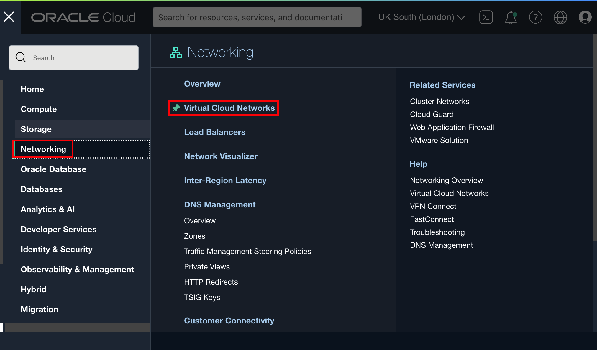
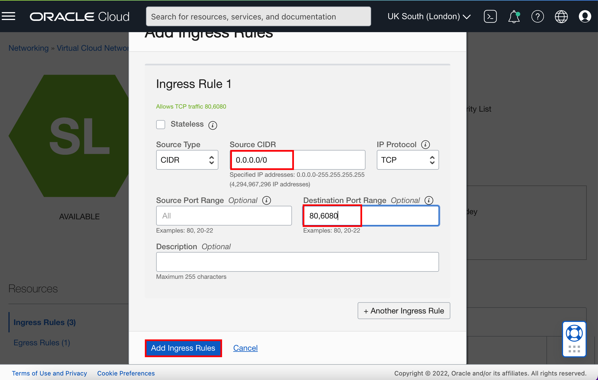
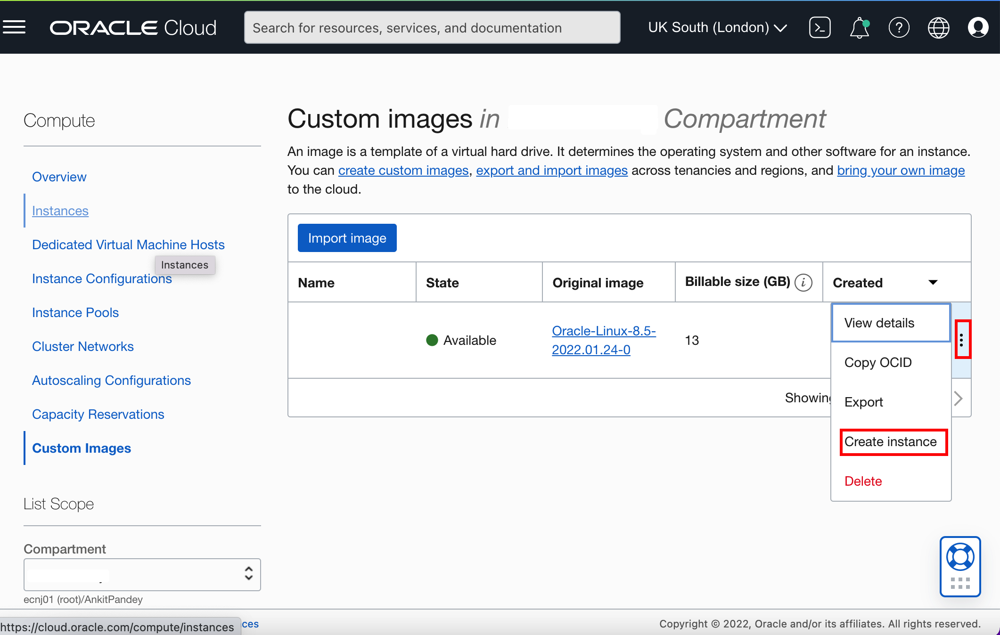
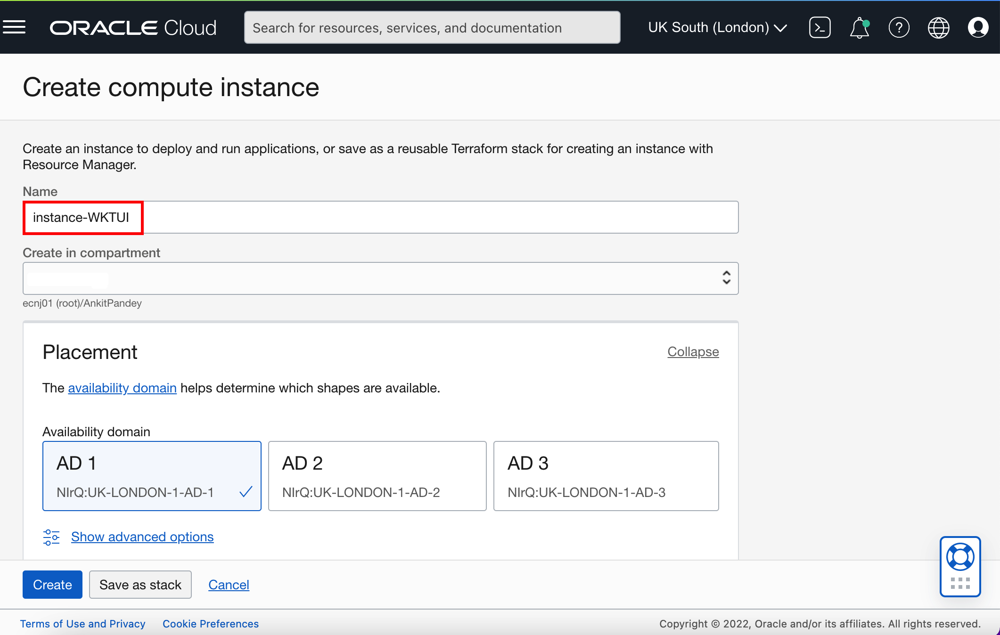

# Creation of VM from Maketplace Image

## Introduction

In this lab, You download the custom image from the market place. Then you will create a 3-node Kubernetes cluster configured with all of the necessary network resources. The nodes will be deployed in different availability domains to enusre high availability. We will create Virtual Cloud Network, which we will use in this lab later. Then we will create the instance using the created virtual network and downloaded custom image.

### Objectives

In this lab, you will:

* Download the required artifacts from Marketplace.
* Use the *Quick Create* cluster feature to create an OKE (Oracle Kubernetes Engine) instance with the required network resources, a node pool, and three worker nodes. The *Quick Create* approach is the fastest way to create a new cluster. If you accept all the default values, you can create a new cluster in just a few clicks.
* Create Virtual Cloud Networks, Subnet, Security lists. Then you will add Ingress Rules, to open ports, so you can remotly access your Virtual Machine.
* Create Virtual Machine from the custom image which you downloads from Marketplace using the created Virtual Cloud Network.

### About Oracle Cloud Infrastructure Container Engine for Kubernetes

Oracle Cloud Infrastructure Container Engine for Kubernetes is a fully-managed, scalable, and highly available service that you can use to deploy your container applications to the cloud. Use the Container Engine for Kubernetes (sometimes abbreviated OKE) when your development team wants to reliably build, deploy, and manage cloud-native applications. You specify the compute resources that your applications require, and OKE provisions them on the Oracle Cloud Infrastructure in an existing OCI tenancy.

To create the Container Engine for Kubernetes (OKE), complete the following steps:

* Create the network resources (VCN, subnets, security lists, etc.).
* Create a cluster.
* Create a `NodePool`.

This lab shows you how the *Quick Start* feature creates and configures all the necessary resources for a 3-node Kubernetes cluster. All the nodes will be deployed in different availability domains to ensure high availability.

For more information about OKE and custom cluster deployment, see the [Oracle Container Engine](https://docs.cloud.oracle.com/iaas/Content/ContEng/Concepts/contengoverview.htm) documentation.

### About Oracle Virtual Cloud Networks

Oracle virtual cloud networks (VCNs) provide customizable and private cloud networks in Oracle Cloud Infrastructure (OCI). Just like a traditional data center network, the VCN provides customers with complete control over their cloud networking environment. This includes assigning private IP address spaces, creating subnets and route tables, and configuring stateful firewalls.

For more information about Virtual Cloud Network and Subnet, see the [Oracle Virtual Cloud Network](https://www.oracle.com/in/cloud/networking/virtual-cloud-network/) documentation.


### Prerequisites

* You must have an [Oracle Cloud Infrastructure](https://cloud.oracle.com/en_US/cloud-infrastructure) enabled account.

## Task 1: Downloading the required artifacts from MarketPlace Image


## Task 2: Set up an Oracle Kubernetes Engine Instance on the Oracle Cloud Infrastructure

The *Quick Create* feature uses the default settings to create a *quick cluster* with new network resources as required. This approach is the fastest way to create a new cluster. If you accept all the default values, you can create a new cluster in just a few clicks. New network resources for the cluster are created automatically, along with a node pool and three worker nodes.

1. In the Console, select the *Hamburger Menu* -> *Developer Services* -> *Kubernetes Clusters (OKE)* as shown.
        

2. In the Cluster List page, select the Compartment of your choice, where you are allowed to create a cluster, and then click *Create Cluster*.
        
> You need to select a compartment in which you are allowed to create a cluster and also, a repository inside the Oracle Container Registry.

3. In the Create Cluster Solution dialog, select *Quick Create* and click *Launch Workflow*. `Quick Create` will create a new cluster with the default settings, along with new network resources for the new cluster.


4. Specify the following configuration details on the Cluster Creation page (please pay attention to the value you place in the *Shape* field):

    * **Name**: The name of the cluster. Leave the default value.
    * **Compartment**: The name of the compartment. Leave the default value.
    * **Kubernetes version**: The version of Kubernetes. Leave the default value which should be *v1.22.5* or select the latest version available.
    * **Kubernetes API Endpoint**: Are the cluster master nodes going to be routable or not. Select the *Public Endpoint* value.
    * **Kubernetes Worker Nodes**: Are the cluster worker nodes going to be routable or not. Leave the default *Private Workers* value.
    * **Shape**: The shape to use for each node in the node pool. The shape determines the number of CPUs and the amount of memory allocated to each node. The list shows only those shapes available in your tenancy that are supported by OKE. Select *VM.Standard2.1* (which is typically available in Oracle Free Tier Account).
    * **Number of nodes**: The number of worker nodes to create. Leave the default value, *3*.

        Click *Next* to review the details you entered for the new cluster.

        
        

5. On the *Review* page, click *Create Cluster* to create the new network resources and the new cluster.
        
    > You see the network resources being created for you. Wait until the request to create the node pool is initiated and then click *Close*.
      


    > Then, the new cluster is shown on the *Cluster Details* page. When the master nodes are created, the new cluster gains a status of *Active* (it takes about 7 minutes).


## Task 3: Creation of Virtual Cloud Networks and Subnet

In Task 1, we downloaded the artifacts which is required for creation of Virtual Machine. In Task 4 of this lab, we will create the Virtual machine. To Access this Virtual Machine using *noVNC*, we need to open ports 80,6080. In this task, we are going to create Virtual Cloud Network using *Start VCN Wizard*. It automatically creates Subnet and Security Lists. Once Virtual Cloud Network created, we add *Ingress Rules* in Default Security list of Public Subnet. This allows you to access Remote Desktop on your Virtual machine at port 80,6080.

1. In the Console, select the *Hamburger Menu* -> *Networking* -> *Virtual Cloud Networks* as shown.
        

2. Choose your own *Compartment*, then click *Start VCN Wizard*.
        

3. Select *Create VCN with Internet Connectivity* and then click *Start VCN Wizard*.
        
 > This creates a VCN with a public subnet that can be reached from the internet. It also creates a private subnet that can connect to the internet through a NAT gateway, and also privately connect to the Oracle Services Network.

4. Enter *WKTUI-VCN* as `VCN Name` and then click *Next*.
        

5. On Review page, click *Create*.
        
 > It creates the Virtual Cloud Network, Public Subnet, Private Subnet, Internet gateway (IG), NAT gateway (NAT), Service gateway (SG).

6. Once you see message "Virtual Cloud Network creation complete" then click *View Virtual Cloud Network*.
        

7. Click on Public Subnet *Public Subnet WKTUI-VCN*.
        

8. On Security Lists Page, click *Default Security List for WKTUI-VCN*.
        

9. Click *Add Ingress Rule*.
        

10. Enter *0.0.0.0/0* as `Source CIDR` and *80,6080* as `Destination Port Range`, then click *Add Ingress Rules*.
        
 > This enables you to access the Virtual Machine remotely on port 80,6080.

11. Select the *Hamburger Menu* -> *Compute* -> *Custom Images*.
        

12. Click on `Three dots` in the custom image section and click *Create Instance* as shown below.
        

13. Enter *instance-WKTUI* as Name and Select the VCN, subnet you just created.
        
        

14. Select *Generate a key pair for me*, and save the private key and public key. Click *Create*.
        

     > You can view the instance in provisioning state.
     

15. Once you see instance in *RUNNING* state, then click on *Copy* to copy your instance *Public IP* and paste it in your text editor.
        

16. Copy the below URL and replace *XX.XX.XX.XX* with your public ip.

````bash
<copy>http://XX.XX.XX.XX:6080/vnc.html?password=LiveLabs.Rocks_99&resize=scale&quality=9&autoconnect=true&reconnect=true</copy>
````

 > If you see any window, asking for password for refreshing the repository, click *Cancel*.

 > For copy and paste between the host machine and remote desktop, Use the Clipboard. For example, if you want copy from the host machine and want to paste it inside the remote desktop, you need to first paste in the clipboard first, then you can paste it in remote desktop.

## Task 4: Creation of VM from MarketPlace Image


## Acknowledgements

* **Author** -  Ankit Pandey
* **Contributors** - Maciej Gruszka, Sid Joshi
* **Last Updated By/Date** - Kamryn Vinson, March 2022
