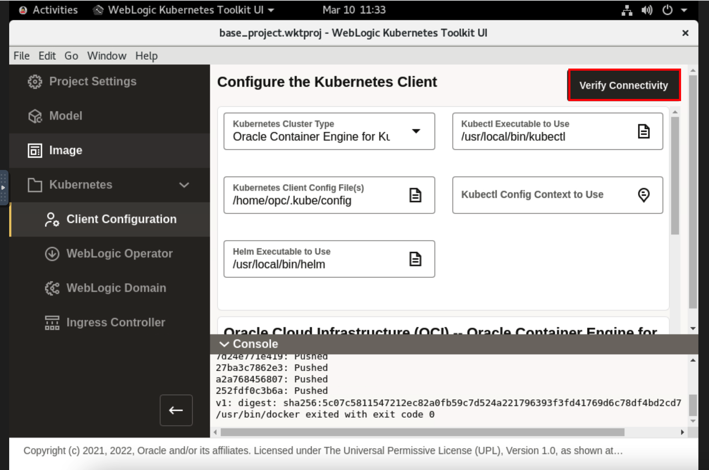

# Deployment of WebLogic Kubernetes Operator to the Oracle Container Engine for Kubernetes (OKE) on Oracle Cloud Infrastructure (OCI) From WebLogic Kubernetes Toolkit UI

## Introduction

In this lab, we authenticate OCI CLI using the browser, which will creates *.oci/config* file. As we will use kubectl to manage the cluster remotely using the *Local Access*. It needs a *kubeconfig* file. This kubeconfig file will be generated using the OCI CLI. Then we verify the connectivity to Kubernetes cluster from the WebLogic Kubernetes Toolkit UI. At last, we install the WebLogic Kubernetes Operator to Kubernetes cluster(OKE).

### Objectives

In this lab, you will:

* Configure kubectl (Kubernetes Cluster CLI) to connect to Oracle Container Engine for Kubernetes (OKE) on Oracle Cloud Infrastructure (OCI).
* Verify Connectivity of WebLogic Kubernetes Toolkit UI to Oracle Container Engine for Kubernetes (OKE) on Oracle Cloud Infrastructure (OCI).
* Install the WebLogic Kubernetes Operator to Oracle Container Engine for Kubernetes (OKE) on Oracle Cloud Infrastructure (OCI). 

### Prerequisites
* You must have Oracle Cloud Account. You must have information about your tenancy name and cloud account credentials.
* Successfully created the virtual machine, which consist of all required softwares.

## Task 1: Configure kubectl (Kubernetes Cluster CLI) to connect to Oracle Container Engine for Kubernetes (OKE) on Oracle Cloud Infrastructure (OCI)

In this Task, we creats the configuration file *.oci/config* and *.kube/config* in */home/opc* directory. This configuration file allow us to access Oracle Kubernetes Cluster (OKE) from this virtual machine.

For more information on Client Configuration, see [Client Configuration](https://oracle.github.io/weblogic-toolkit-ui/navigate/kubernetes/k8s-client-config/).

1. In the Console, select the *Hamburger Menu* -> *Developer Services* -> *Kubernetes Clusters (OKE)* as shown.
    

2. Click *Access Cluster*. 
    

3. Select *Local Access* and then click on *Copy* as shown.
    

4. Go back to terminal, Click on *Activities* and select the *Terminal*.
    

5. Paste the copied command in the terminal. For *Do you want to create a new config file?*, Type *y* then press *Enter*. For *Do you want to create your config file by logging in through a browser?*, Type *y* then press *Enter*.
    

6. In Chrome Browser, Click *Accept all*.
    

7. Enter your tenancy name and click *Continue*.
    

8. Enter your Cloud account Username and Password and then click *Sign In*.
    
    > You will see *Authorization Completed* as shown.
    

9. In *Enter a passphrase for your private key*, leave it empty and press *Enter*.
    

10. Use the upper arrow key to run the *oce ce ...* command again and re-run it multiple time, until you see the *New config written to the Kubeconfig file /home/opc/.kube/config*.
    

## Task 2: Verify Connectivity of WebLogic Kubernetes Toolkit UI to Oracle Container Engine for Kubernetes (OKE) on Oracle Cloud Infrastructure (OCI)

In this task, we verify the connectivity to *Oracle Kubernetes Cluster(OKE)* from the `WebLogic Kubernetes Toolkit UI` application.

1. Go back to WebLogic Kubernetes Tool Kit UI, Click *Activities* and select the WebLogic Kubernetes Tool Kit UI window. Click *Client Configuration* under Kubernetes.
    
    

2. Click *Verify Connectivity*.
    

3. Once you see *Verify Kubernetes Client Connectivity Success* window, Click *Ok*.
    

## Task 3: Install the WebLogic Kubernetes Operator to Oracle Container Engine for Kubernetes (OKE) on Oracle Cloud Infrastructure (OCI)

***WebLogic Kubernetes Operator***

This section provides support for installing the WebLogic Kubernetes Operator (the “operator”) in the target Kubernetes cluster. 

1. Click *WebLogic Operator*. You  see some pre-filled values. lets it remain the same and click *Install Operator*.

    **Kubernetes Namespace** - The Kubernetes namespace to which to install the operator. 
    **Kubernetes Service Account** - The Kubernetes service account for the operator to use when making Kubernetes API requests. 
    **Helm Release Name to Use for Operator Installation** - The Helm release name to use to identify this installation. 

     
    
    
    

 > For more information on *WebLogic Kubernetes Operator Image*, *Kubernetes Namespace Selection Strategy*, *WebLogic Kubernetes Role Bindings*, *External REST API Access*, *Third Party Integrations* and *Java Logging*, see the [WebLogic Kubernetes Operator](https://oracle.github.io/weblogic-toolkit-ui/navigate/kubernetes/k8s-wko/) documentation.

2. Once you see *WebLogic Kubernetes Operator Installation Complete*, Click *Ok*.
    

## Acknowledgements

* **Author** -  Ankit Pandey
* **Contributors** - Maciej Gruszka, Sid Joshi
* **Last Updated By/Date** - Kamryn Vinson, March 2022