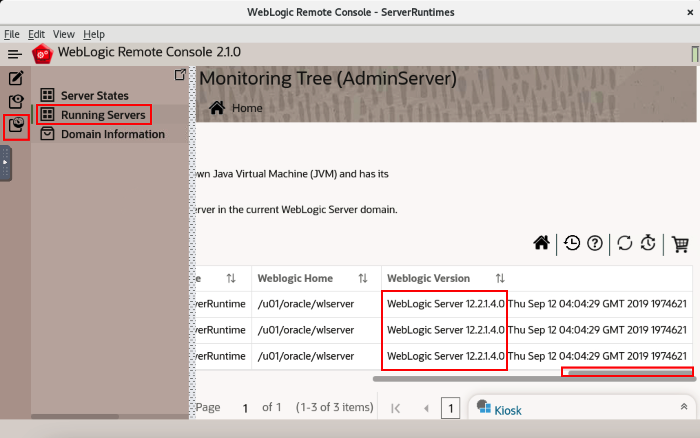

# Using the Upgrade WebLogic Server Image as Primary Image 

## Introduction

In this lab, we modify the primary image, we use WebLogic Server Image with *12.2.1.4-slim-ol8* tag. Then we re-deploy the domain using WebLogic Kubernetes Toolkit UI. At last, we verify that newly managed server pods are using the updated WebLogic Server images using WebLogic Remote Console.

### Objectives

In this lab, you will:

* Enter detail of new WebLogic Server Image (12.2.1.4) as Primary Image in WebLogic Kubernetes Toolkit UI Application.
* Update a deployed application by a rolling restart of the new  primary image.

### Prerequisites

* You must have an [Oracle Cloud Infrastructure](https://cloud.oracle.com/en_US/cloud-infrastructure) enabled account.
* You must have Oracle Cloud Account. You must have information about your tenancy name and cloud account credentials.
* Successfully created the virtual machine, which consist of all required softwares.
* You should have a text editor, where you can paste the commands and URLs and modify them, as per your environment. Then you can copy and paste the modified commands for running them in the terminal.


## Task 1: Enter detail of new WebLogic Server Image as Primary Image

In this task, we update the primary image. In Lab 3, we were using WebLogic Server 12.2.1.3.0 version image, but now we want to use upgrade WebLogic Server 12.2.1.4.0 image. As you modify the value of primary image tag in *Image* section, It automatically updated in *WebLogic Domain* section.

1. Go back to WebLogic Kubernetes Toolkit UI, click *Image*. Changed the WebLogic Server Tag to *12.2.1.4-slim-ol8*.
    

## Task 2: Update a deployed application by a rolling restart of the new  primary image

In this task, we re-deploy the WebLogic Domain. As we changed our primary image, so we will notice rolling restart of the servers one by one. As you click on *Deploy Domain*, it start an *Introspector job*, which terminates the running admin server pods, and creates a new pod for admin server which uses WebLogic Server 12.2.1.4.0 image. Introspector do the same process with both the managed servers. Later, we use the WebLogic Remote Console, to verify that server pods are using the updated WebLogic Server 12.2.1.4.0 Image.

1. Click *WebLogic Domain* -> *Deploy Domain*. This will re-deploy the domain, it will use new primary image which contains WebLogic Server 12.2.1.4 version.
    

2. Once you see *WebLogic Domain Deployment to Kubernetes Complete* window, Click *Ok*.
    

3. Go back to *Terminal* and copy the below command and paste in terminal. You will notice rolling restart of servers one by one. First, Admin Server pods terminates and comes in *Running* state.
    ```bash
    <copy>kubectl get pods -n test-domain-ns -w</copy>
    ```
    

4. To Verify that Admin Server and Managed Server pods are using updated WebLogic Server image, click *Monitoring Tree* icon and then select *Running Servers*. Use the *Scroll* bar below to view the *WebLogic Server Version*.
    
## Acknowledgements

* **Author** -  Ankit Pandey
* **Contributors** - Maciej Gruszka, Sid Joshi
* **Last Updated By/Date** - Kamryn Vinson, January 2022