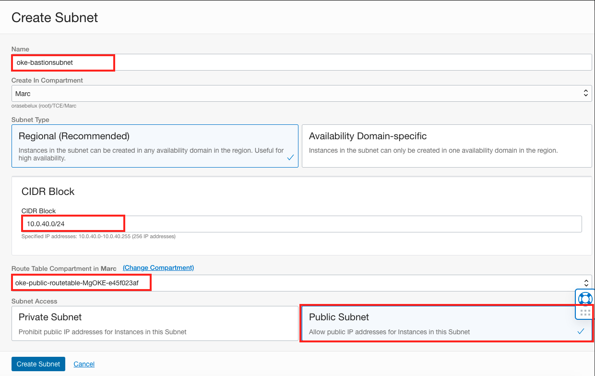

# Setup Network

## Introduction

In this lab, we will create the needed network for the lab

Estimated Lab Time: 10 minutes

### Objectives
* Create a subnet to install MySQL
* Create a subnet to install a Virtual Machine

	

## Task 1: Create the subnet for MySQL

We will create a private subnet to install MySQL.

1. In the previous lab, we have installed a OKE cluster. Let's get details about that cluster. First, go to Networking / Virtual Cloud Networks (VCN). And identify the VCN that the wizard has created for you.  

	

2. Click on the VCN name. Check the list of subnet created by the OKE wizard. And take notes of the CIDR block (IP ranges) of each subnet.

  

3. By default, the range should be 	10.0.0.0/28 - 10.0.0.10/24 - 10.0.20.0/24. We will create another subnet for our database in 10.0.30.0/24.
4. Click the button "Create Subnet".
5. Use these parameters:
  * Name : "oke-databasesubnet". 
  * With CIDR block (IP Range) 10.0.30.0/24.
  * Route-table: Take the private route table.
  * Subnet Access: private 
  * Leave the other value as default.

	

## Task 2: Create the subnet for the Virtual Machine

We will create a public subnet to install the Virtual Machine.

1. In the same screen, click again the button "Create Subnet".

2. Use these parameters:
  * Name : "oke-bastionsubnet". 
  * With CIDR block (IP Range) 10.0.40.0/24.
  * Route-table: Take the **public** route table.
  * Subnet Access: **public** 
  * Leave the other value as default.
	

## Learn More

*(optional - include links to docs, white papers, blogs, etc)*

* [URL text 1](http://docs.oracle.com)
* [URL text 2](http://docs.oracle.com)

## Acknowledgements
* **Author** - <Name, Title, Group>
* **Contributors** -  <Name, Group> -- optional
* **Last Updated By/Date** - <Name, Month Year>
