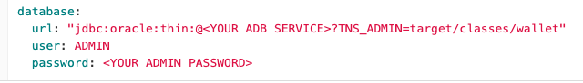
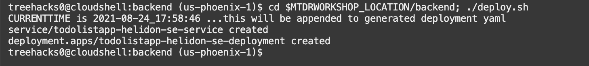
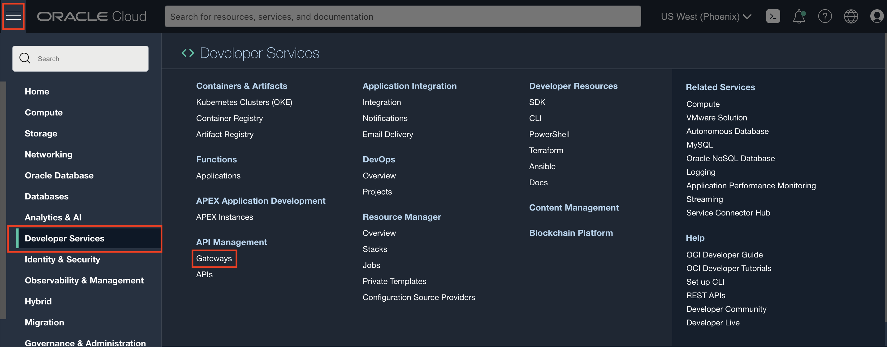
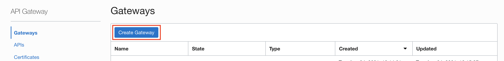
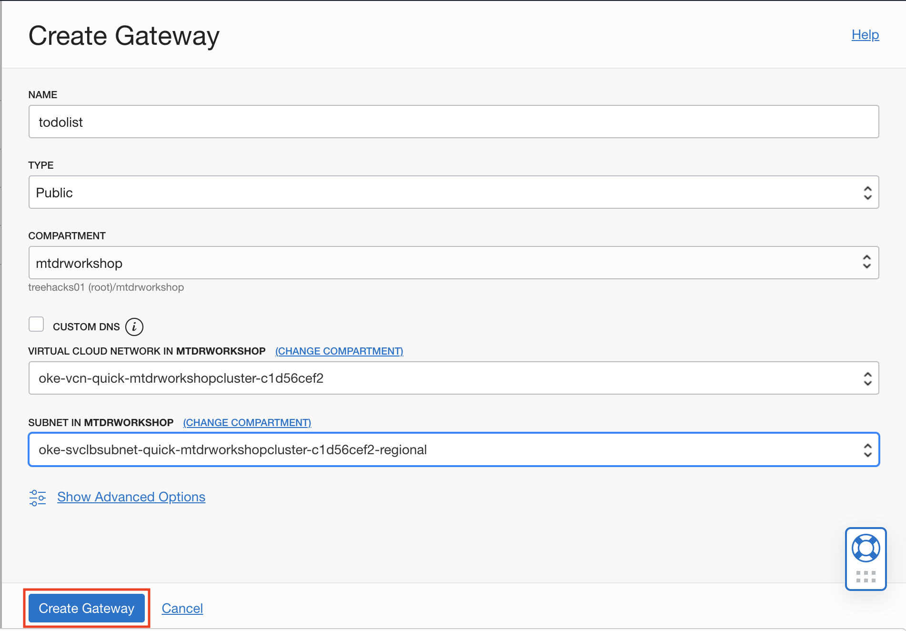
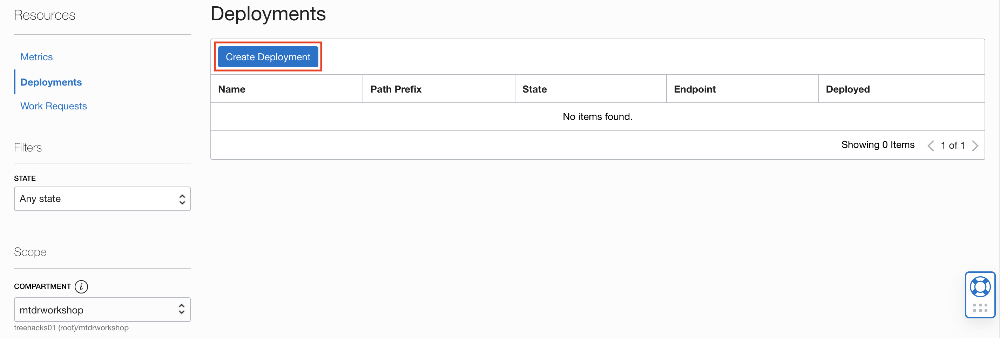
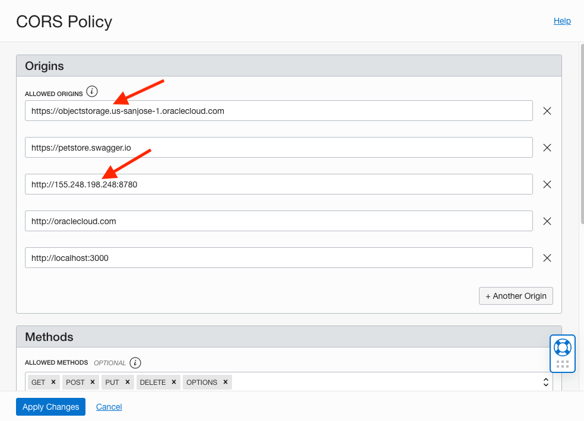

# Deploy the Backend Docker Image to Kubernetes

## Introduction

In this tutorial, you will deploy the pre-built Helidon Java backend Docker image to OKE, then configure the API Gateway.

Estimated time: 25-minutes

### Understand the Java backend application

As with most React applications (https://reactjs.org/), this application uses remote APIs to handle data persistence. The backend implements five REST APIs including:

* Retrieving the current list of todo items
* Adding a new todo item
* Finding a todo item by its ID
* Updating an existing todo item
* Deleting a todo item

The APIs are documented using Swagger at http://130.61.67.158:8780/swagger-ui/#/.

The backend is implemented using the following Java classes (under ./backend/src/...):

* Main.java: starts and configures the main entry points
* ToDoItem.java: maps a Todo Item instance to and from the JSON document
* ToDoItemStorage.java: stores the Todo item in a persistent store i.e., the Oracle Autonomous database
* ToDoListAppService.java: implements the Helidon service and exposes the REST APIs


### Objectives

* Set values for environment variables
* Build and deploy the Docker image of the application
* Deploy the image on the Oracle Kubernetes Engine (OKE)
* Describe the steps for undeploying
* Configure the API Gateway
* Test the backend application

### Prerequisites

* This tutorial requires the completion of the **Setup Dev Environment** tutorial and the provision of the Orace Cloud Infrastructure (OCI) components.

## Task 1: Set values for workshop environment variables

1. Set the root directory of the workshop.

``` bash
<copy>export MTDRWORKSHOP_LOCATION=~/mtdrworkshop</copy>
```

2. Run source addAndSourcePropertiesInBashrc.sh.
The following command will set the values of environment variables in `mtdrworkshop.properties` and source `~/.bashrc`.

``` bash
<copy>cd $MTDRWORKSHOP_LOCATION; source addAndSourcePropertiesInBashrc.sh</copy>
```

## Task 2: Build and push the Docker images to the OCI Registry

1. Ensure that the "DOCKER\_REGISTRY" variable is set

For example:
`<region-key>.ocir.io/<object-storage-namespace>/<firstname.lastname>/<repo-name>`.
If the variable is not set or is an empty string, the push will fail (but the docker image will be built).

2. Make sure to be in backend/target/classes/wallet directory and then execute.

``` bash
<copy>unzip ~/mtdrworkshop/setup-dev-environment/wallet.zip</copy>
```

3. Select the mtdrb\_tp service alias (see the list of aliases in
./backend/target/classes/wallet/tnsnames.ora)

4. Edit ./backend/target/classes/application.yaml to set the database service and user password

5. Copy the edited ./backend/target/classes/application.yaml to ./backend/src/main/resources/application.yaml
6. Edit ./backend/src/main/java/com/oracle/todoapp/Main.java
6.1. Locate the following code fragment

6.2. Replace `eu-frankfurt-1` in `https://objectstorage.eu-frankfurt-1.oraclecloud.com` with your region
6.3. Save the file
7. Run `build.sh` script to build and push the
microservices images into the repository

``` bash
<copy>cd $MTDRWORKSHOP_LOCATION/backend; ./build.sh</copy>
```

In a few minutes, you would have successfully built and pushed the images into the OCIR repository.
8. Check your container registry from the root compartment
Go to the Oracle Cloud Console, click the navigation menu in the top-left corner and open **Developer Services** then **Container Registry**.


9. Mark **Access** as **Public** (if **Private**)
9.1 From the Actions drop-down list, select **Actions** and **Change to Public**.


## Task 3: Deploy on Kubernetes and Check the Status

1. Run the `deploy.sh` script

```
<copy>cd $MTDRWORKSHOP_LOCATION/backend; ./deploy.sh</copy>
```


2. Check the status using the following commands:
3. Check the status using the following command; it returns the Kubernetes service of MyToDo application with a load balancer exposed through an external API
**$ kubectl get services**

``` bash
<copy>kubectl get services</copy>
```


4. The following command displays the list of PODs
**$ kubectl get pods**

``` bash
<copy>kubectl get pods</copy>
```


5. Use the following command to continuously tail the log of one of the PODss.

$ kubectl logs -f

Example kubectl lgs -f todolistapp-helidon-se-deployment-7fd6dcb778-c9dbv

Returns
http://130.61.66.27/todolist

## Task 4: UnDeploy (optional)

If you make changes to the image then you need to delete the service and the pods by running undeploy.sh then redo the following steps: **Build and Push the Docker Image to the OCI Registry** and **Deploy in Kubernetes and Check the Status**.

1. Run the `undeploy.sh` script

``` bash
	<copy>cd $MTDRWORKSHOP_LOCATION/backend; ./undeploy.sh</copy>
```


2. Rebuild the image + Deploy + (Re)Configure the API Gateway

## Task 5: Configure the API Gateway

The API Gateway protects any RESTful service running on Container Engine for Kubernetes, Compute, or other endpoints through policy enforcement, metrics, and logging.
Rather than exposing the Helidon service directly, we will use the API Gateway to define cross-origin resource sharing (CORS).

1. From the navigation menu select **Developer Services** then select **Gateways**.




2. Specify the root compartment on the left side then click **Create Gateway**


3. Configure the basic info: name, compartment, VCN and Subnet
Then click **Create**.
    
    * VCN: pick one of the virtual circuit networks
    * Subnet pick the public subnet

   Observe that the ToDolist gateway has been successfully created.
    

4. Click **Deployments**


5. Click **Create Deployment**
   

6. Create a **TodDolist deployment**.
   

7. Configure CORS policies:
   
    * CORS is a security mechanism that will prevent running application loaded from origin A from using resources from origin B.
    * Allowed Origins is the list of all servers (origins) that are allowed to access the API deployment typically of a Kubernetes cluster IP.
    * Allowed methods GET, PUT, DELETE, POST, and OPTIONS are all needed.

8. Configure the headers.
   

9. Configure the routes by defining two routes:
   
    * /todolist for the first two APIs: GET, POST, OPTIONS
    * /todolist/{id} for the remaining three APIs: GET, PUT, DELETE
   

## Task 6: Testing the backend application through the API Gateway

1. Navigate to the newly created Gateway Deployment Detail and copy the endpoint
   

2. Testing through the **API Gateway endpoint**.
Postfix the gateway endpoint with "/todolist" as shown in the following screen shot.
   

It should display the row you have created in **Setup the Dev Environment**.

You may now [proceed to the next tutorial](#next).

## Acknowledgements

* **Author** \- Kuassi Mensah\, Dir\. Product Management\, Java Database Access
* **Contributors** \- Jean de Lavarene\, Sr\. Director of Development\, JDBC/UCP
* **Last Updated By/Date** \- Kamryn Vinson\, July 2021