## MyToDoReact version 1.0.
Copyright (c) 2021 Oracle, Inc.

Licensed under the Universal Permissive License v 1.0 as shown at https://oss.oracle.com/licenses/upl/


# Lab 2 -- Setup ATP Connectivity

## Introduction

This lab will show you:
a) how to create kubernetes secrets for an existing Autonomous Transaction Processing (ATP). The secrets will allow us to connect the Java microservice in Helidon  microservice to the ATP instances.
b) how to create the database user todouser and the todoitem table.

### Objectives
- Download the database Wallet
- Upload the Wallet to an Object Storage bucket
- Create a Pre-Authenticated link
- Download the Wallet from Object Storage into the workshop Cloud environment
- Create the Database User and Table
### What Do You Need?

* An Oracle Cloud paid account or free trial. To sign up for a trial account with $300 in credits for 30 days, click [here](http://oracle.com/cloud/free).
* OKE cluster and the ATP databases created
* Microservices code from GitHub (or zip) built and deployed

## **STEP 1**: Download the database Wallet

Select Autonomous Transaction Processing from the side menu in the OCI Console
  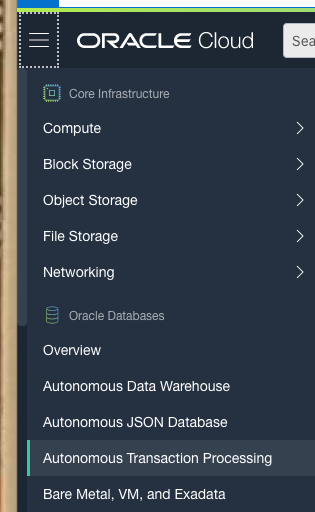

Select the correct compartment on the left-hand side (if not already selected) and select the MTDRDB.


Click the DB Connection button
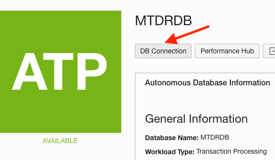

Select Regional Wallet from the drop-down menu and click the Download Wallet button.


Provide a password and click the Download button to save the wallet zip file to your computer.
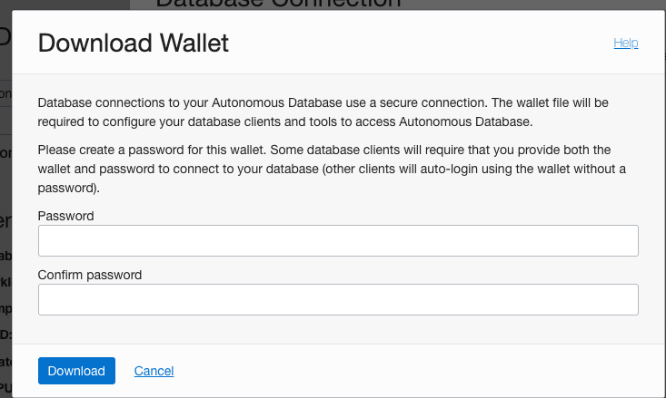
Close the Database Connection window

## **STEP 2**: Upload the Wallet to an Object Storage bucket

Select Object Storage from the side menu in the OCI Console.


Select the correct compartment on the left-hand side (if not already selected) and click the Create Bucket button.


Provide a name, accept the defaults and click the Create button


Select the bucket you've just created and in the bucket screen click the Upload button under Objects.


Provide the wallet zip you saved to your computer earlier and click the Upload button.
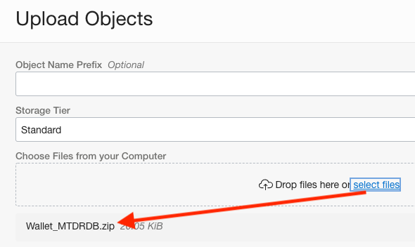

Close the Upload window when done.

## **STEP 3**: Create a Pre-Authenticated link

You should now see the wallet zip object you just uploaded in the list of Objects. Click the "…" menu to the far right of the object and select Create Pre-Authenticated Request.


Click the Create Pre-Authenticated Request button (default values are sufficient).
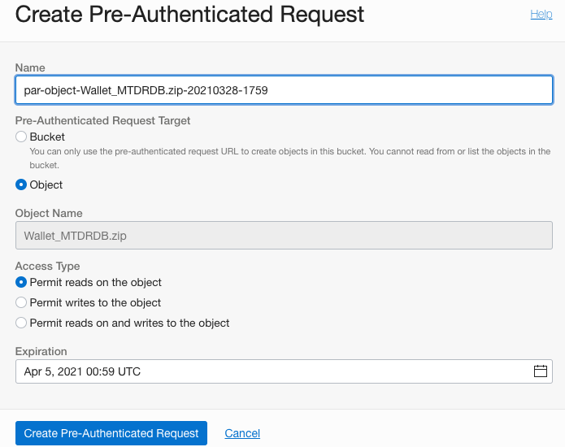

Copy the value of the Pre-Authenticated Request URL as it will be used i te next section.


Close the Pre-Authenticated Request window when done.

## **STEP 4**: Download the Wallet from Object Storage into the workshop Cloud environment

1. Run `cd mtdrworkshop/backend/target/classes/wallet`

```
<copy>cd mtdrworkshop/backend/target/classes/wallet</copy>
```

2. Download the Wallet zip file using the Pre-Authenticated URL saved in the previous steps.
Example

```
<copy>curl -sL https://objectstorage.us-phoenix-1.oraclecloud.com/p/DX4nwVB7O4trriaEbI3KNvLsIbxyqVdLALuNcv7-Q5EvLiaC0CMFVrAnC_0tCGDV/n/oracleonpremjava/b/mtdrworkshop/o/Wallet_MTDRDB.zip --output wallet.zip
```
3. Unzip the walletPassword
```
<copy>unzip wallet.zip</copy>
```
4. Drop the zip file
```
 rm wallet.zip</copy>
```

The wallet directory should look like the following picture
  

## **STEP 5**: Create the Database User and Table

1. From the hamburger menu (top left), select "Autonomous Transaction Processing"
  

2. Click on MTDRDB
  

3. Click on Tools
  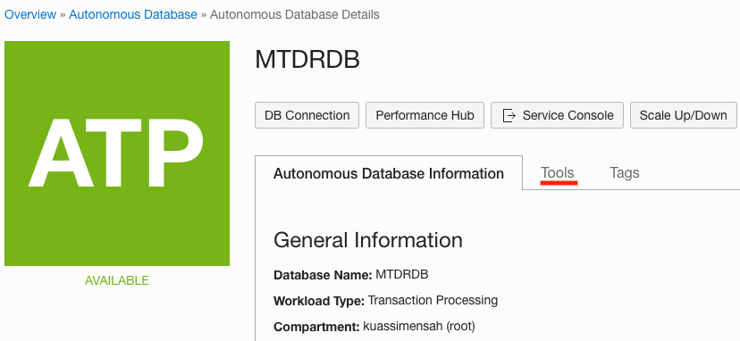

4. Click on "Open Database Actions"
  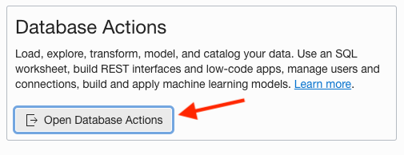

   A new tab appears

5. Login using Admin and the Admin password
  

6. Click on SQL under Development
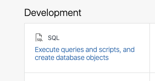

7. Create a database user e.g., Todouser

   Copy the following command in the Worksheet and replace "<User Password>" with the actual password
   ```
   <copy>create user todouser identified by <User Password> default tablespace DATA quota unlimited on DATA;</copy>
   ```
   Press the execute (green) button at the top of the Worksheet
   

  8. Copy the following command in the Worksheet and execute.
   ```
   <copy>grant create session, create view, create sequence, create procedure, create table, create trigger, create type, create materialized view to todouser;</copy>
   ```
   Press the execute (green) button and observe the successful completion of the command.
   

9. Connect as the newly created todouser using Database Actions | SQL

   a. Click the hamburger menu (top left of the SQL Developer Web tab)
   

   b. A "Database Action" sidebar column appears to the left

   c. Click on "Administration" then "Database Users"

   d. Select TODOUSER at the right bottom of the new page then REST Enable it
   

   e. REST Enable Todouser
   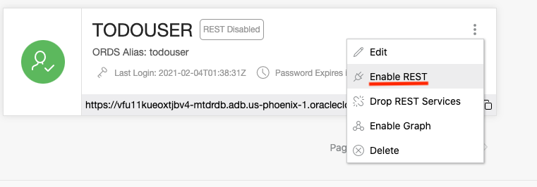

  f. Click the icon and sign in as TODOUSER
  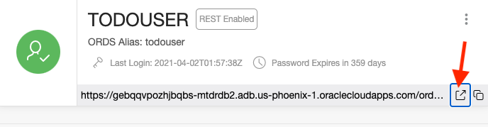

  g. Select the SQL box (Execute SQL queries ...)

  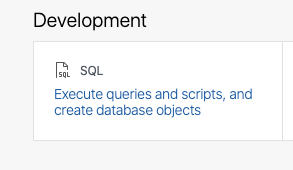

8. Create the TODOITEM table

   You are connected as TODOUSER

   Copy the following command in the Worksheet and execute.
   ```
   <copy>CREATE TABLE todoitem (
     id NUMBER GENERATED ALWAYS AS IDENTITY,
     description VARCHAR2(4000),
     creation_ts TIMESTAMP WITH TIME ZONE DEFAULT CURRENT_TIMESTAMP,
     done NUMBER(1,0),
     PRIMARY KEY (id)
    );</copy>
   ```
Press the execute (green) button and observe the successful completion of the command

## Acknowledgements
* **Application by** - Jean de Lavarene, Senior Director of Development, JDBC/UCP
* **Workshop by** - Kuassi Mensah, Director Product Management, Java Database Access
* **Original scripts by** - Paul Parkinson, Dev Lead for Data and Transaction Processing, Oracle Microservices Platform, Helidon

## Need Help?
Please submit feedback or ask for help using this [LiveLabs Support Forum](https://community.oracle.com/tech/developers/categories/building-microservices-with-oracle-converged-database). Please login using your Oracle Sign On and click the **Ask A Question** button to the left.  You can include screenshots and attach files.  Communicate directly with the authors and support contacts.  Include the *lab* and *step* in your request.
