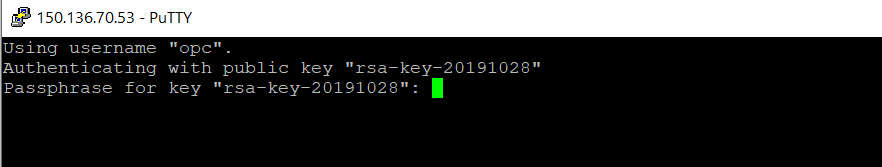
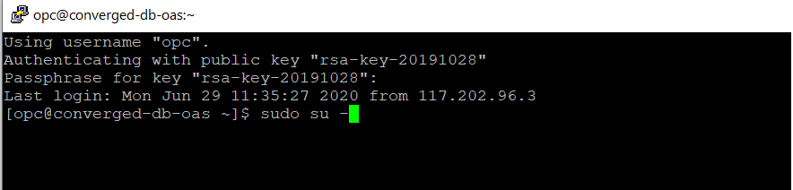
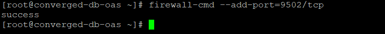
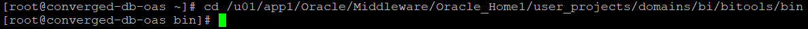
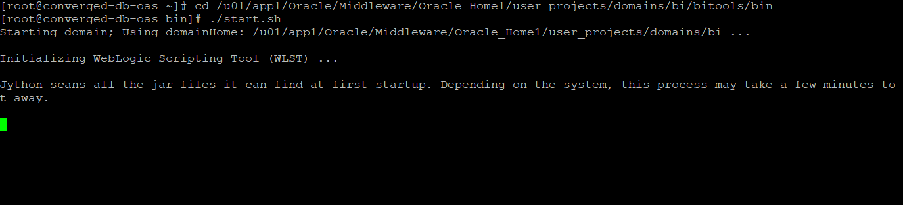
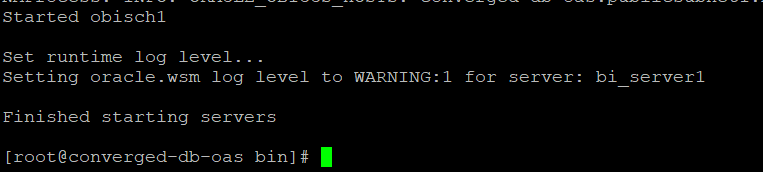
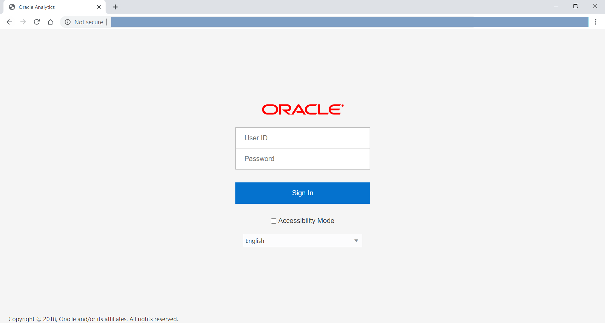
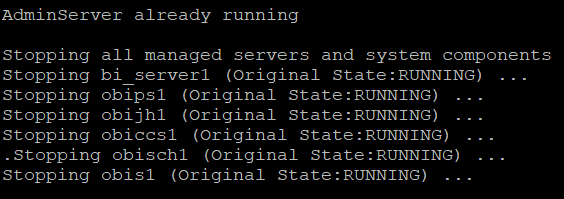

# OAS Environment Setup #

## Introduction ##
In this lab you will setup the environment manually if required.  Otherwise, the post script of Compute Instance step will start the required services of OAS.  Only **Step 2** and **Step 3** are required for rest of the Labs in this workshop.

### Pre-requisites ###

This lab assumes you have completed the following labs:  
- Lab 1: Login to Oracle Cloud  
- Lab 2: Generate SSH Key  
- Lab 3: Create Compute Instance  

## Step 1: Manual start-up of OAS services

Password for putty private key : Admin123

**Login to Root** 

      <copy>
      sudo su - 
      </copy>

Check for firewall status with this command:

      <copy>
      systemctl status firewalld
      </copy>

If it is already running ,please ensure to open the ports you require to open to the internet.
OAS runs on port number 9502 with TCP protocol. So, let’s add it.

      <copy>
      firewall-cmd –add-port=9502/tcp
      </copy>

Check for the success output.

**Starting of Services**
Make sure you start database before running.
Navigate to this path by this command

      <copy>
      cd /u01/app1/Oracle/Middleware/Oracle\_Home1/user\_projects/domains/bi/bitools/bin
      </copy>
 

Make sure you are in the bin folder and start all the services like Node Manager, Web-logic and few subcomponents by this single command.

      <copy>
      ./start.sh
      </copy>
 
  
**Note :**
You can also start manually or start the necessary services with these commands.
Run these start commands individually to start each process in this path

      <copy>
      cd /u01/app1/Oracle/Middleware/Oracle\_Home1/user\_projects/domains/bi/bin
      </copy>

./startNodeManager.sh  

./startManagedWebLogic.sh

./startWebLogic.sh

./startComponent.sh

./startRSDaemon.sh

It will take around 4-5 minutes of time to start the services.

Once the Database is up and running, you can see the Admin Server succeeded like below mentioned.

 

OAS will be in the SHUTDOWN state initially once the machine is restarted.
If you get the original state as FAILED, then it may have error in the previous start/stop process.

Once OAS is running, all the micro services like obis, obips, obiccs, obijh, obisch will be started.

Make sure you get this output as Finished starting Servers in the command line.

## Step 2: Login to Oracle Analytics Server

Open web browser (preferabily Chrome) and access the OAS Data Visualization service by the below URL structure.  

Lab 3 - Create Compute Instance will provide you the instance IP address. ?? (public / private)

      <copy>
      http://Your-Machine-IP:9502/dv/ui
      </copy>
 

Login with the below credentials;

Username	: Weblogic

Password 	: Admin123

## Step 3: Create a connection to database

1. From Home screen, click on **Create** button and select **Connection**.

2. Select **Oracle Database** for connecting to database and provide required connection details.  

**Connection Details:**	

| Argument  | Description   |
| ------------- | ------------- |
| Connection Name | ConvergedDB_Retail |
| Connection Type | Basic  |
| Host |   |
| Port |   |
| Service Name |   |
| Username |   |
| Password |   |

Select the Schema user  XXXXXXX  and select table name XXXXXXXXX and click add to add the dataset.

3. Once connection details are provided click **Save** to save the connection.

## Step 4: Manual stop of OAS services

In the same bin folder mentioned in starting the services,

cd /u01/app1/Oracle/Middleware/Oracle\_Home1/user\_projects/domains/bi/bitools/bin

Enter ./stop.sh to stop all the services.

      <copy>
      ./stop.sh
      </copy>

Make sure you get this output as Finished starting Servers in the command line.

**Note :**
You can also stop services manually or stop the necessary services with these commands.
Run these stop commands individually to stop each process in this path

cd /u01/app1/Oracle/Middleware/Oracle_Home1/user_projects/domains/bi/bin

./stopNodeManager.sh

./stopManagedWebLogic.sh

./stopWebLogic.sh

./stopComponent.sh

./stopRSDaemon.sh

## Acknowledgements

- **Authors** - Sudip Bandyopadhyay, Vishwanath Venkatachalaiah
- **Contributors** - Jyotsana Rawat, Satya Pranavi Manthena, Kowshik Nittala
- **Team** - North America Analytics Specialists
- **Last Updated By** - Kay Malcolm, Director, Database Product Management, June 2021
- **Expiration Date** - June 2021

**Issues?**
Please submit an issue on our [issues](https://github.com/oracle/learning-library/issues) page. We review it regularly.