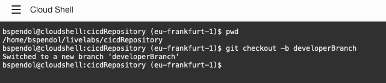
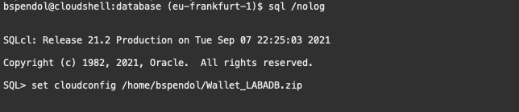
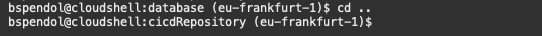
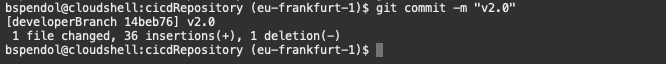
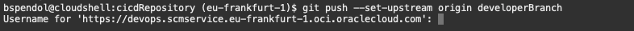
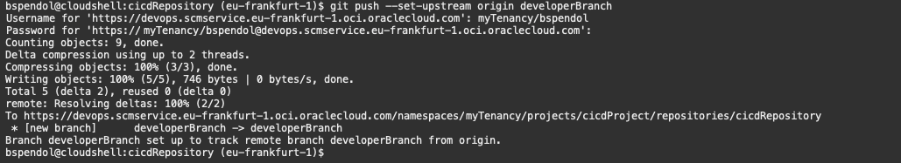
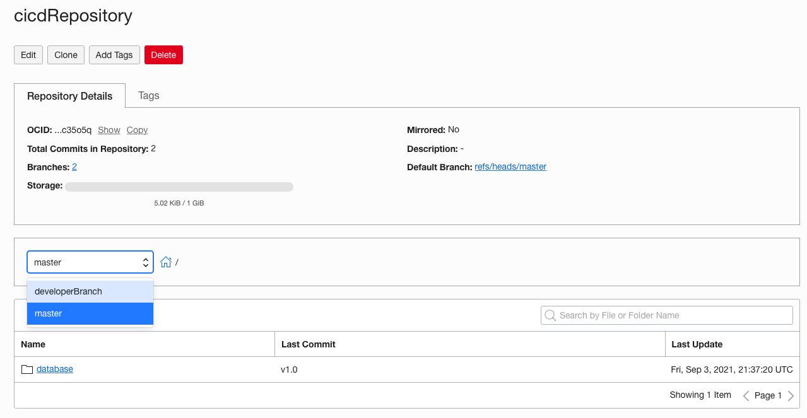
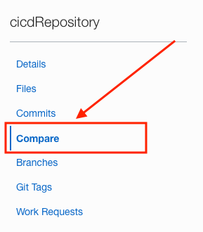
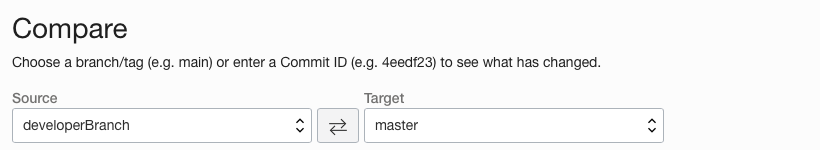
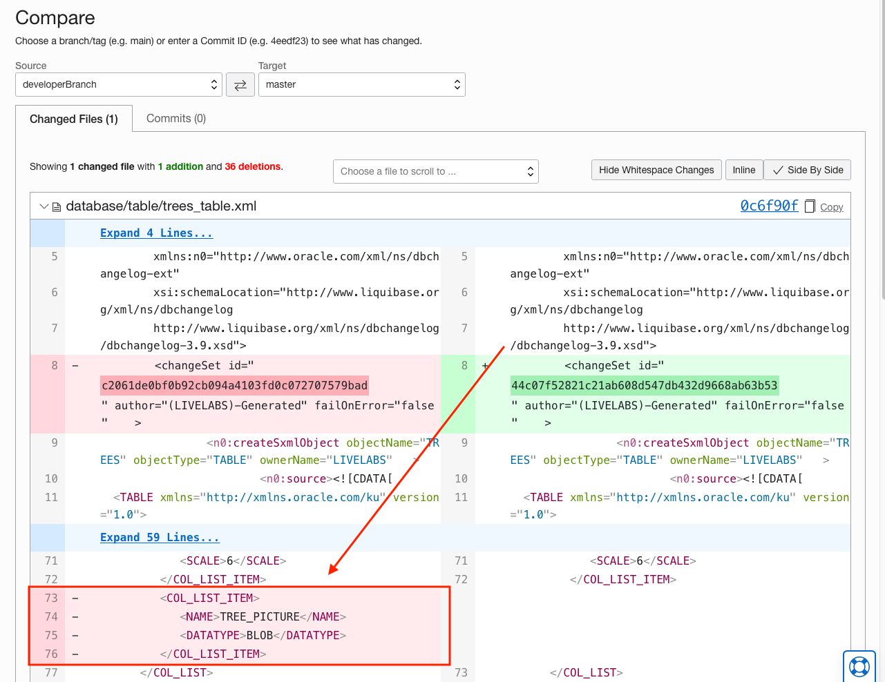

# Oracle Database CI/CD for Developers - Lab 2: Create a Branch and a Database Change

## Introduction

In this lab you will use the SQLcl to create object in an Autonomous Database. Once the objects are created, SQLcl will be used to export the object definitions so that we can commit them to our OCI Code Repository.

Estimated Lab Time: 30-45 minutes

### Objectives

- Create a branch of your code repository
- Create a change in the database
- Commit the branch and change to the code repository

### Prerequisites

- You have completed the [Setups](../setups/setups.md).
- You have completed [Lab 1](../sqlcl/sqlcl.md).

## Task 1: Create and Commit a Branch

We have our main code line for our database objects in the repository. Let's now pretend we are a developer and need to clone the repository and start an assigned tickets/task in this development cycle or sprint. The task at hand is to add a column to our trees table so that people can upload a photo of the tree.

This requires us to create a branch of the repository that we can work in and commit our code to.

1. Start by **navigating to the git repository directory** in the Cloud Shell at the path 

   ```
   /home/YOUR_USER_NAME/livelabs/cicdRepository
   ```
   To get there, you can issue a **cd /home/USER_NAME/livelabs/cicdRepository** but remember to **replace USER_NAME with your username**.

   ````
   <copy>
   cd /home/USER_NAME/livelabs/cicdRepository
   </copy>
   ````


2. Now that we are in our **repository directory**, we need to **create a branch** of our code to work in. To do this, **issue the following command** at the Cloud Shell:

   ````
   <copy>
   git checkout -b developerBranch
   </copy>
   ````
   

3. We can see that we are now working with the new branch by issuing a **git status** at the Cloud Shell.
   ````
   <copy>
   git status
   </copy>
   ````
   

4. **Change the directory** to the database directory in preparation for the next steps.

   ````
   <copy>
   cd database
   </copy>
   ````

5. Time to **create a change** in the database. And as before, we use **SQLcl** to log into our Autonomous Database.

   ````
   <copy>
   sql /nolog
   </copy>
   ````

 6. As before, we have to tell SQLcl where to look for the Autonomous Database wallet. Remember, we downloaded it in our home directory and we can use the following command to set its location. Just remember to **replace USER_NAME with your username**. You can look at the previous lab to find the exact location if needed.

      ### **Jeff's Tips** SQLcl remembers the commands you ran! Use the up arrow on your keyboard to find the command that you previously used to set the wallet location.

      ````
      <copy>
      set cloudconfig /home/USER_NAME/Wallet_LABADB.zip
      </copy>
      ````
      


7. Now we are going to connect as the livelabs user. Issue the following command at the SQLcl prompt

   ````
   <copy>
   conn livelabs@LABADB_high
   </copy>
   ```` 
   

   And then provide the password we used to create the user at the password prompt.

   ````
   <copy>
   PAssw0rd11##11
   </copy>
   ```` 
   


8. We are going to create a simple database change by **adding a column to the trees table**. We can issue the following SQL command at the SQLcl prompt to add the tree_picture column.

   ````
   <copy>
   alter table trees add (tree_picture blob);
   </copy>
   ```` 

   

9. We have completed our ticket/task that was assigned to us, time to generate the schema again using SQLcl and Liquibase. As we did in the previous lab, we are going to issue the **lb genschema -split** command at the SQLcl prompt.

   ````
   <copy>
   lb genschema -split
   </copy>
   ```` 
   

   Once the schema files are generated, we can exit SQLcl by issuing an exit command at the SQLcl prompt.
   ````
   <copy>
   exit
   </copy>
   ````
     

10. To commit our code to the repository on this new branch, change your directory to the top level of the project (the cicdRepository directory). To do this, issue a **cd ..** at the Cloud Shell.

      ````
      <copy>
      cd ..
      </copy>
      ```` 

      

11. In the **cicdRepository directory**, just as in lab 1, we are going to run **git add .** at the Cloud Shell.

      ````
      <copy>
      git add .
      </copy>
      ```` 
      

12. Issue a **git commit -m "V2.0"** at the Cloud Shell. This will indicate that we are working on a **new version** of the code in our developer branch.

      ````
      <copy>
      git commit -m "v2.0"
      </copy>
      ```` 

      

13. Then we **push** the new code up to our repository. This push will be slightly different because we are pushing to a branch. Our push command will be slightly different because we have to create the branch on the push. **Issue the following command** at the Cloud Shell prompt.

      ````
      <copy>
      git push --set-upstream origin developerBranch
      </copy>
      ```` 
      

      Upon pressing return, we need to again provide our **username and password (auth token)** as we did when we cloned the environment in the setup step as well as in Lab 1 when we pushed the code to the repository.

      

14. You can view the files in the OCI Cloud Console on the **repository details page**. There will now be 2 branches.

      

15. On the left side of the page, find the Compare ,menu item and click it.

      

16. If you select **developerBranch for the Source** and **master for the target**

      

      You will see that the following XML is new in the developerBranch that does not exist in main showing the change we made on the table and committed to our developer branch.
      ```
      <COL_LIST_ITEM>
         <NAME>TREE_PICTURE</NAME>
         <DATATYPE>BLOB</DATATYPE>
      </COL_LIST_ITEM>
      ```
      


## Acknowledgements

- **Authors** - Jeff Smith, Distinguished Product Manager and Brian Spendolini, Trainee Product Manager
- **Last Updated By/Date** - Brian Spendolini, August 2021