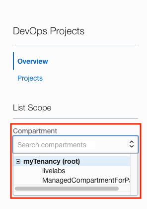
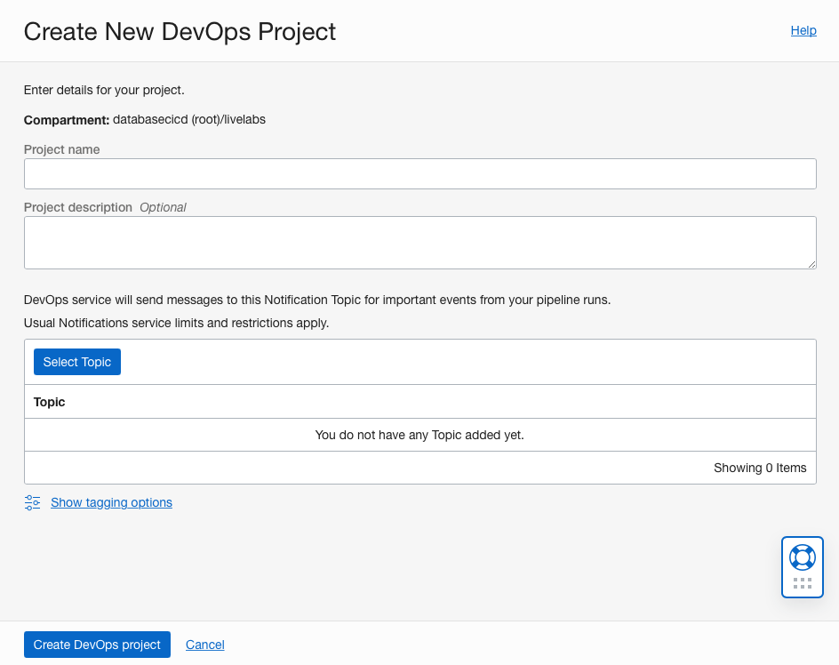
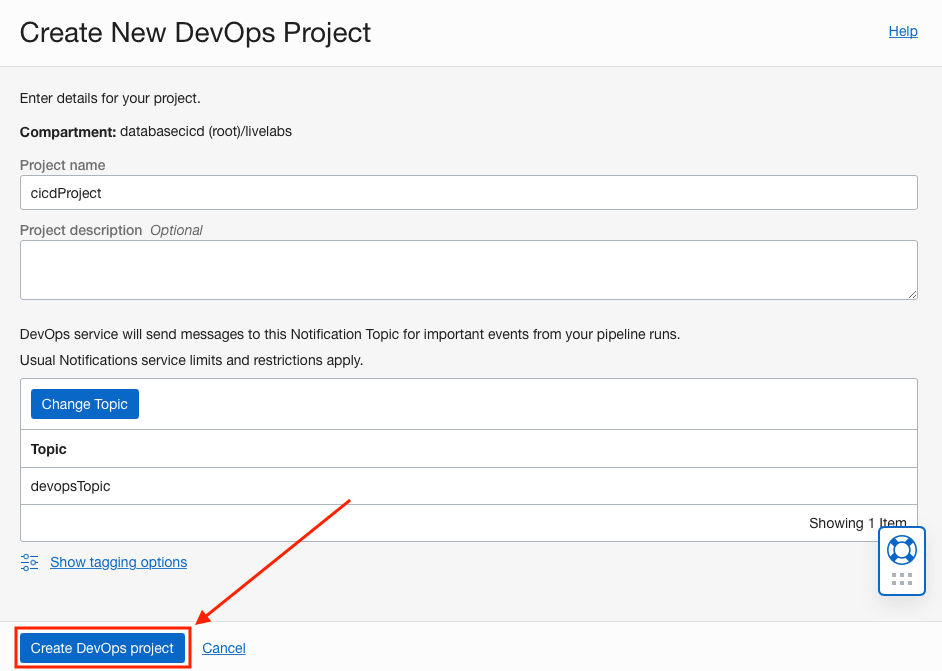

# Oracle Database CI/CD for Developers: Setups

## Introduction

This part of the lab will guide you through some setup items that have to be performed before we can start the lab.

Estimated Lab Time: 20 minutes

### Objectives

- Create a Compartment
- Create an Autonomous Database
- Create a Notification Topic
- Create a DevOps Project and Repository

### Prerequisites

- You have completed [Lab 1, Clone and Create a Github Repository](../repo/repo.md).

## Task 1: Create a Compartment

We are going to create a **Compartment** for this lab so that our database is in a specific compartment for this LiveLab and can also be easily found and used for additional LiveLabs.

1. To create a compartment, use the OCI web console drop down menu and select **Identity & Security**, then **Compartments**.

    

2. On the Compartments page, click the **Create Compartment** button.

    

3. Using the **Create Compartment** modal, set the following values:

    **Name:** livelabs

    ````
    <copy>
    livelabs
    </copy>
    ````

    

    **Description:** livelabs

    ````
    <copy>
    livelabs
    </copy>
    ````
    

    **Parent Compartment:** Use the root compartment (Should be auto-selected, your root compartment will be named different, but will have (root) after it)

    

4. When your Create Compartment modal looks like the following image (root compartment name will be different but have (root) after the name), click the **Create Compartment** button.

    

## Task 2: Create an Autonomous Database

1. Use the OCI web console drop down menu to go to **Oracle Database** and then **Autonomous Database**.

    

2. On the Autonomous Database page, change your compartment to the livelabs compartment using the **Compartment** dropdown on the left side of the page.

    

3. With the livelabs compartment selected, click the **Create Autonomous Database** button on the top of the page.

    


4. In the **Create Autonomous Database** page, we start in the **Provide basic information for the Autonomous Database** section. Here we can ensure our **Compartment** is **livelabs** and give our database a **Display Name**. We can use **ORDS ADB** as the Display Name.

    **Display Name:** ORDS ADB

    ````
    <copy>
    ORDS ADB
    </copy>
    ````
    

    For the **Database Name**, we can use **ORDSADB**.

      **Database Name:** ORDSADB

    ````
    <copy>
    ORDSADB
    </copy>
    ````
      

    The **Provide basic information for the Autonomous Database** section should look like the following image:

     

5. For Database **Workload Type**, choose **Transaction Processing**.

     

6. In the **Deployment Type** section, choose **Shared Infrastructure** if not already selected for you.

     

7. Next we have the **Configure the database** section. Start here by clicking the **Always Free** toggle button so that it is switched to the right side as seen in the following image.

     

8. Use the **Choose database version** dropdown to choose **21c** as the database version.

   

9. Your **Configure the database** section should look like the following image.

   

10. The next section is **Create administrator credentials**. Here, provide a password that conforms to the password complexity rules of:

    ```
    Password must be 12 to 30 characters and contain at least one uppercase letter, one lowercase letter, and one number.
    The password cannot contain the double quote (") character or the username "admin".
    ```

    If the password does conform to these rules and matches in both fields, the section should look like the following image.

   

11. For the **Choose network access** section, select **Secure access from everywhere** if not already selected. Leave the **Configure access control rules** checkbox unchecked.

   

12. The **Choose a license type** section should default to **License Included**.

   

13. When the **Create Autonomous Database** is completely filled out, click the **Create Autonomous Database** button on the bottom left of the page.

   

14. Your Autonomous Database should be done creating in just a few short minutes. 

## Task 3: Create a Notification Topic

1. Use the OCI web console drop down menu to go to **Developer Services** and then **Notifications**.

    

2. On the Notifications page, change your compartment to the **livelabs** compartment using the **Compartment** dropdown on the left side of the page.

    

3. With the livelabs compartment selected, click the **Create Topic** button on the top of the page.

    

4. Using the **Create Topic** slider,

    

   set the Name to **devopsTopic**.

     **Name:** devopsTopic

    ````
    <copy>
    devopsTopic
    </copy>
    ````

     

5. Next, click the **Create** button on the bottom of the slider.

     

## Task 4: Create a DevOps Project and Repository

1. Use the OCI web console drop down menu to go to **Developer Services** and then **DevOps**.

    

2. On the DevOps Projects page, change your compartment to the **livelabs** compartment using the **Compartment** dropdown on the left side of the page.

    

3. With the livelabs compartment selected, click the **Create DevOps Project** button in the **Welcome to DevOps Projects** banner on the top of the page.

    

4. Using the **Create New DevOps Project** slider,

    

   set the Project name to **cicdProject**.

     **Project Name:** cicdProject

    ````
    <copy>
    cicdProject
    </copy>
    ````

   

5. While still in the **Create New DevOps Project** slider, click the **Select Topic** button.

   

6. Using the **Select Topic** slider, 

   

   keep the **Create using topic name** radio button selected

   

   ensure the **Compartment select list** is set top **livelabs**

   

   and the **Topic select list** is set to **devopsTopic**
   
   

7. Now click the **Select Topic button** on the bottom of the **Select Topic** slider.

   

8. Back on the **Create New DevOps Project** slider, with the **Project Name** and **Topic** selected, click the **Create DevOps Project** button.

   

## Conclusion

In this lab you created a Compartment and an Autonomous Database.

## Acknowledgements

- **Authors** - Jeff Smith, Distinguished Product Manager and Brian Spendolini, Trainee Product Manager
- **Last Updated By/Date** - Brian Spendolini, August 2021