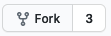
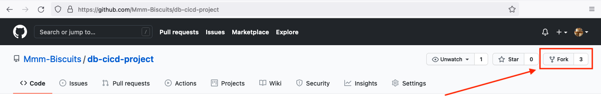
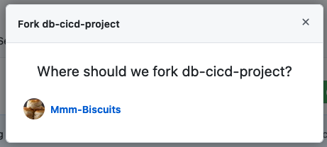

# Oracle Database CI/CD for Developers - Lab 1: Clone and Create a Github Repository

## Introduction

In this lab you will review the methods used in the previous labs to see how we can expose data for application development from REST endpoints.

Estimated Lab Time: 10 minutes

### Objectives

- Fork a GitHub Project
- Clone a GitHub Project

### Prerequisites

- The following lab requires an <a href="https://www.oracle.com/cloud/free/" target="\_blank">Oracle Cloud account</a>. You may use your own cloud account, a cloud account that you obtained through a trial, or a training account whose details were given to you by an Oracle instructor.
- You have a [GitHub Account](https://github.com)
- You have configured the GitHub account for [SSH access](https://docs.github.com/en/github/authenticating-to-github/connecting-to-github-with-ssh)
- SSH Access to GitHub has been tested and is working on your local environment

## Clone and Create a Github Repository

### Task 1: Hello Repo

For this lab, we will be using GitHub for our repository and there is a sample repository you can fork and clone. 

1. Start by going to the following URL:

````
<copy>
https://github.com/Mmm-Biscuits/db-cicd-project
</copy>
````


2. Now, on this page, click the **fork** button  in the upper right of the page.



3. In the Fork Project Modal Window, select the repository you would like to fork this project into. This would probably be your GitHub repository.



4. Once the project is forked, you can now clone it to your local environment. Just ensure that you change **YOUR_GITHUB_USERNAME** to your GitHub username. 

```
> git clone git@github.com:YOUR_GITHUB_USERNAME/db-cicd-project.git
```

Say my username was fluffybunny, the URL would be

```
> git clone git@github.com:fluffybunny/db-cicd-project.git
```

You can copy the command here and add your username. Then run the command to start the clone process on your local environment:

````
<copy>
git clone git@github.com:YOUR_GITHUB_USERNAME/db-cicd-project.git
</copy>
````

The above command will create a directory called db-cicd-project for you and pull any code that was in the repository. It is now time to fill this repository with database goodness.

The following repository directory structure is what the sample repository that you forked contains:

```
db-cicd-project
    apps
    database
    etc
        presetup
        setup
        postsetup
    static
        css
        html
        images
        js
    ut
        utPLSQL
    README.md
    version.txt
```

Using this directory structure, we are going to start to work with the database and SQLcl in the next part of this LiveLab. 


## Acknowledgements

- **Authors** - Jeff Smith, Distinguished Product Manager and Brian Spendolini, Trainee Product Manager
- **Last Updated By/Date** - Brian Spendolini, August 2021