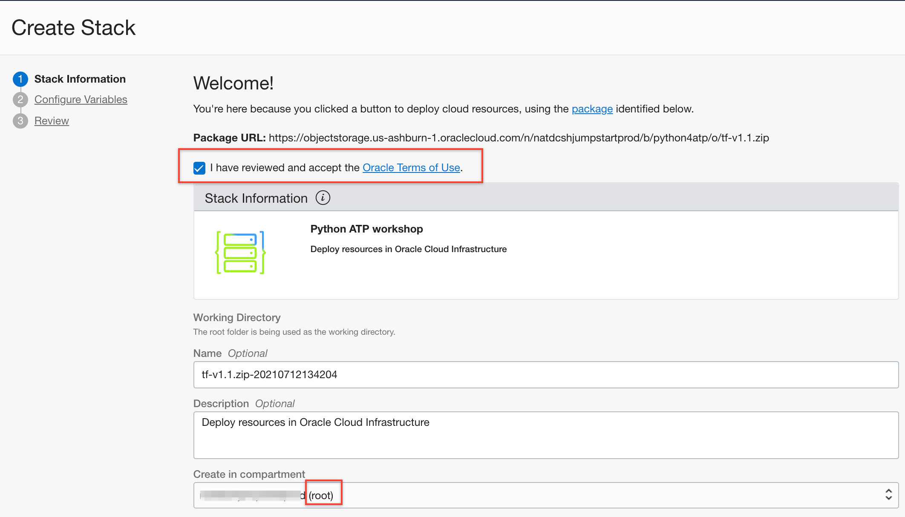
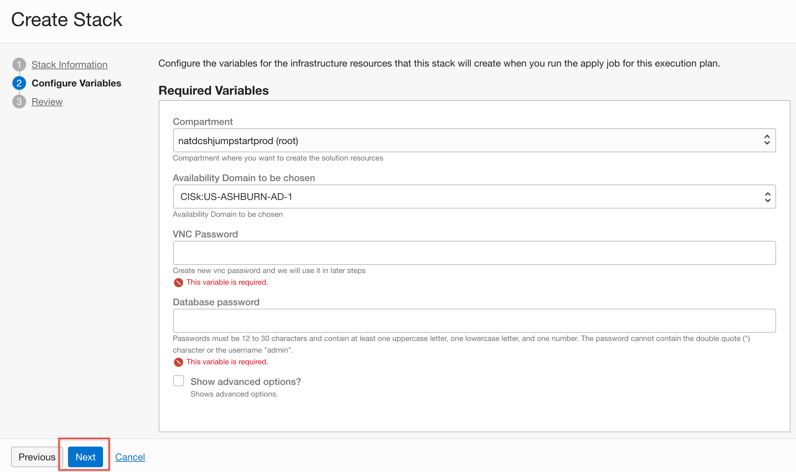

# Setup Cloud Environment

## Before You Begin
### Objectives
- Log into OCI tenancy.
- Setup your IAAS environment and create common components.
- Create a new Cloud Developer Image from Marketplace.
- Create an Autonomous Transaction Processing (ATP) Database.
- Load Data into your ATP Instance.

### Introduction

In Lab 1 (as Derek) you will initiate the Oracle cloud environment that you will use to create and deploy your microservices applications. This environment will be contained within a cloud Compartment, and communication within the Compartment will be via a Virtual Cloud Network (VCN). The Compartment and VCN will isolate and secure the overall environment. You will deploy two Oracle Cloud Services for this environment. An Oracle Cloud Developer Image will be used to develop and deploy your microservices code. The microservices will access data within an Autonomous Transaction Processing (ATP) Cloud Service.

To deploy these services, you will be using Terraform, a tool for building, changing, and versioning infrastructure safely and efficiently. It is an important tool for anyone looking to standardize IaaS (Infrastructure as a Service) within their organization.

*We recommend that you create a notes page to write down all of the credentials you will need.*

## STEP 1: Prepare Terraform

1. Login to the Oracle Cloud

2. To run our Terraform folder in the cloud, we will take advantage of OCI resource manager. It is a cloud service for executing terraform jobs without having to install anything locally. In order for resource manager to create resources for you, it needs to know a few key credentials on the OCI console.

3. Click on the profile icon in the top right. Then click into the tenancy link.

  

4. Copy the **Object Storage Namespace** in your notes.

  

## STEP 2: Prepare your terraform script for execution

This will create your cloud resources (VCN, Compute Image, Autonomous Transaction Processing Instance, among other things).

1. Download the terraform zip file [here](https://objectstorage.us-ashburn-1.oraclecloud.com/n/natdcshjumpstartprod/b/python4atp/o/python4atp-tf.zip).  Then unzip it.

2. Now create a private key (id\_rsa) and a public key (id\_rsa.pub). The public key is used when you are prompted for a SSH key when you create services, and the matching private key is used to access those services after creation. (eg: Cloud Developer Image).  Enter this in a command shell or terminal window. 
  ````
  <copy>ssh-keygen -b 2048 -t rsa</copy>
  ````
  

3.  Now open the ssh\_keys folder and note that it is empty. This is because we need to add our private key.

  

4. Go to the location of your private key, then copy and paste it into your ssh\_keys folder.  Be sure the name is id_rsa (default when creating ssh keys).  This file name is used in the terraform script elsewhere.

  

5. Now rezip your folder and remove the original zip.

  

## STEP 3: Create a Resource Manager Stack

Terraform provides a reusable process for creating infrastructure.  In some cases, like this one, you don't have to know anything about how the process works. You can deploy different pre-designed infrastructure designs for many different purposes, which frees up users to focus on their projects.

1. On the OCI console, click on the hamburger menu upper left and scroll down to **Solutions and Platform**. Hover over **Resource Manager** and click on **Stacks**.

   

2. Make sure the **Compartment** on the left side says root. If not, then change it to root. Then, click **Create Stack**.

  

3. Click on **Browse** and find the zipped **python4dev.zip** file. Then, you can give your **Stack** a name (or accept default), like **python4dev**. You can also give a description if you'd like, but it is not necessary. Make sure you are still in the root compartment, and using Terraform version 0.11.x. Then click **Next**.

  

4. You will see a list of variables that will be used.  Start by entering your **vncpasswd** password value.  Save it for when logging in later.

  

5. Next locate the **SSH\_PUBLIC\_KEY** variable and paste the public ssh key you created earlier in the given field. **It must be in text format.**

  

6. Next, populate the **OBJ\_STORE\_NAMESPACE** field with the **Object Storage Namespace** credential you saved earlier. Then click **Next**.

  

7. Finally, review your variables and make sure everything looks good. Then click **create**.  Note the screen will freeze for a few seconds before returning..be patient.

  

## STEP 4: Create OCI Resources in Resource Manager

1. Now inside of the resource manager, hover over **Terraform Actions** and click on **Plan**.

  

2. You can give the plan a name, or keep the default. Then click on **Plan** to begin.

  

3. Wait for the plan to succeed, then click on **Stack Details**.

  

4. Again, hover over **Terraform Actions** and click on **Apply**.

  

5. You can give the apply a name, or keep the default. You can leave the other settings the same. Then click on **Apply**.  **The apply may take several minutes. Please be patient.**

  

## STEP 5: Prepare to Load Data

1. Generate an Auth Token.  Navigate to **Identity** > **Users**.  

  

2. Select the username of the current logged in userid (yours will be different from the screenshot). Save that name in your notes.

  

3. Select **Auth Tokens** on the left, and then **Generate Token**.  Create token **py4dev_token**.

  

  

4. Copy the token and save it in your notes.  If you lose this you can always generate more tokens.

  

5. [Download the database export file](https://objectstorage.us-ashburn-1.oraclecloud.com/n/natdcshjumpstartprod/b/python4atp/o/expdp_alpha.dmp).

6. Go back to the console, and click the **Menu icon** in the upper left corner to open the navigation menu. Under the **Core Infrastructure** section, select **Object Storage** then **Object Storage** .

  

7. Select the Compartment **python4dev**.  Your new Object Storage Bucket should show up in the list. Once it appears click on the `py4dev` bucket url to view the details.

  

8. Navigate to your object storage bucket and then click **Upload Object**.

  

9. Click **select files**, then select the **expdp\_alpha.dmp** for import into the database in the next steps.  Click **Open**, then **Upload Objects**.

  

  

10. Now, select the icon on the far right to retrieve details from **expdp\_alpha.dmp**.

  

11. Copy the URI (don't download the object) and save it in your notes.

  

## STEP 6: Log into SQL Developer and Load Data into userid Alpha.

1. Click the **Menu icon** in the upper left corner to open the navigation menu. Under the **Database** section, select **Autonomous Transaction Processing**.

  

2. Select the **AlphaOffice** Autonomus Transaction Processing Database.  Be sure to select the correct region, and the correct compartment.

  

3. Click **Service Console**.

  

4. Select `Development` and then `SQL Developer Web`

  

5. Log in with your **admin** userid and password (ATP useri/pw).

  

6. When you initially log in there are a number of guided tips.  You can go through these or optionally close the window.

  

7. Enter the following commands.  The first is to create user **alpha**.
  ```
  <copy>create user alpha identified by "&lt;atp password&gt;";
  grant dwrole to alpha;</copy>
  ```

  

8. Create credential.  This is used by the ATP database to access the dmp file in Object Storage.  This is your cloud account userid and your token password (created in a previous step).
  ```
  <copy>BEGIN
    DBMS_CLOUD.CREATE_CREDENTIAL(
      credential_name => 'py4dev_token',
      username => '&lt;cloud account userid&gt;',
      password => '&lt;token password&gt;'
    );
  END;
  /</copy>
  ```

  

9. Import the data.  Paste this into your worksheet window.   
  ```
<copy>
set scan off
set serveroutput on
set escape off
DECLARE
    s varchar2(1000); 
    h1 number;
    errorvarchar varchar2(100):= 'ERROR';
    tryGetStatus number := 0;
begin
    h1 := dbms_datapump.open (operation => 'IMPORT', job_mode => 'SCHEMA', job_name => 'IMPALPHA', version => 'COMPATIBLE'); 
    tryGetStatus := 1;
    dbms_datapump.set_parameter(h1, 'TRACE', 167144-96) ; 
    dbms_datapump.metadata_transform(h1, 'DWCS_CVT_IOTS', 1); 
    dbms_datapump.metadata_transform(h1, 'DWCS_CVT_CONSTRAINTS', 1); 
    dbms_datapump.metadata_filter(h1, 'EXCLUDE_PATH_EXPR',         'IN ( ''CLUSTER'', ''CLUSTERING'', ''DB_LINK'' )'); 
    dbms_datapump.set_parallel(handle => h1, degree => 1); 
    dbms_datapump.add_file(handle => h1, filename => 'IMPORT-'||to_char(sysdate,'hh24_mi_ss')||'.LOG', directory => 'DATA_PUMP_DIR', filetype=>DBMS_DATAPUMP.KU$_FILE_TYPE_LOG_FILE); 
    dbms_datapump.set_parameter(handle => h1, name => 'KEEP_MASTER', value => 1); 
    dbms_datapump.metadata_filter(handle => h1, name => 'SCHEMA_EXPR', value => 'IN(''ALPHA'')'); 
-----------------------------------------------------
    dbms_datapump.add_file(handle => h1, filename => '&lt;object storage file location&gt;', directory => 'PY4DEV_TOKEN', filetype => 5);
-----------------------------------------------------
    dbms_datapump.set_parameter(handle => h1, name => 'INCLUDE_METADATA', value => 1); 
    dbms_datapump.set_parameter(handle => h1, name => 'DATA_ACCESS_METHOD', value => 'AUTOMATIC'); 
    dbms_datapump.set_parameter(handle => h1, name => 'SKIP_UNUSABLE_INDEXES', value => 0);
    dbms_datapump.start_job(handle => h1, skip_current => 0, abort_step => 0); 
    dbms_datapump.detach(handle => h1); 
    errorvarchar := 'NO_ERROR'; 
EXCEPTION
    WHEN OTHERS THEN
    BEGIN 
        IF ((errorvarchar = 'ERROR')AND(tryGetStatus=1)) THEN 
            DBMS_DATAPUMP.DETACH(h1);
        END IF;
    EXCEPTION 
    WHEN OTHERS THEN 
        NULL;
    END;
    RAISE;
END;
/</copy>
  ```

  

10. If your token was not created with the right information (eg password is wrong), you will get an error (invalid setting).  To correct this you need to either drop and re-create the credential or create a new credential with a new name, and then re-run this job **WITH A NEW JOB NAME**.  If you create a new credential with a new name then update the credential in this code.

11. Next grant SQL Developer Web to user **alpha**.  Enter the following.
  ```
  <copy>BEGIN
    ORDS_ADMIN.ENABLE_SCHEMA(
      p_enabled => TRUE,
      p_schema => 'ALPHA',
      p_url_mapping_type => 'BASE_PATH',
      p_url_mapping_pattern => 'alpha',
      p_auto_rest_auth => TRUE
    );
    COMMIT;
  END;
  /</copy>
  ```

  

12. Change the **URL** and swap out **admin** with **alpha** and hit enter to log in as user **alpha**.

  

  

13. Note the tables that are now imported into user **alpha** on the left.  Final step is to insert spatial metadata into the **user\_sco\_geom\_metadata** view.  Enter the following.
  ```
  <copy>insert into user_sdo_geom_metadata select * from sdo_geom_metadata;</copy>
  ```

  

## STEP 7: Connect to your Marketplace Developer Image

For more information about the Marketplace Developer Image [click here](https://cloudmarketplace.oracle.com/marketplace/en_US/listing/54030984).

1. Click on the hamburger menu, and navigate to **Core Infrastructure**. Hover over **Compute** and click on **Instances**.

  

2. Locate your running image to identify the IP address. **If you cannot see your instance, make sure you are in the python4dev compartment.  You will first need to reboot the image to access the port 5901**.  Click on the menu on the far right to reboot.

  

3. After the image has rebooted open a vnc viewer session.  If you don't already have vnc viewer you can download it [here](https://www.realvnc.com/en/connect/download/viewer/).

4. Enter **&lt;your image IP&gt;:5901** into the browser and then press Enter.

  

5. Enter the **vncpasswd** and log in.  You will need to click through some screens initially.  Take the defaults.

  


Please proceed to the next lab.

## Acknowledgements

- **Authors/Contributors** - Derrick Cameron
- **Last Updated By/Date** - Kay Malcolm, April 2020
- **Workshop Expiration Date** - April 31, 2021

See an issue?  Please open up a request [here](https://github.com/oracle/learning-library/issues).   Please include the workshop name and lab in your request. 

