# RESTful Services for your Autonomous Database

## **Introduction**

In this lab you will use the SQL Developer Web browser-based tool, connect to your Autonomous Database and REST enable tables and views and/or develop custom RESTful Services based on your SQL and PL/SQL code.

Estimate time: 30-45 minutes

### Objectives
- Enable a user for REST access
- Publish a RESTful service for a database table

### Required Artifacts
- The following lab requires an <a href="https://www.oracle.com/cloud/free/" target="\_blank">Oracle Cloud account</a>. You may use your own cloud account, a cloud account that you obtained through a trial, or a training account whose details were given to you by an Oracle instructor.

### Prerequisites
This workshop assumes you have completed the following labs:
* [Login to Oracle Cloud](?lab=lab-1-login-oracle-cloud)
* [Provision an Autonomous Database](?lab=lab-2-provision-autonomous-database)
* [Connect to ADB with SQL Dev Web](?lab=lab-3-connect-adb-sql-dev-web)

### Developing RESTful Services in Autonomous Database
You have several development interfaces available, including:
* SQL Developer - Web or Desktop
* APEX
* PL/SQL API

## **Step 1**: Create a user for Application Development
It is not good practice to use a SYS or SYSTEM user to create an application's tables, and neither is it good practice to use the ADMIN account to create applications.

1. Create a USER who will build your applications

    ````
    <copy>
    CREATE USER thor IDENTIFIED BY Mjolnir123NotAGoodPasswd;

    GRANT CONNECT, resource TO thor;

    ALTER USER thor QUOTA UNLIMITED ON DATA; -- this part is important if you want to do INSERTs

    BEGIN -- this part is so you can login as THOR via SQL Developer Web
    ords_admin.enable_schema (
        p_enabled               => TRUE,
        p_schema                => 'THOR',
        p_url_mapping_type      => 'BASE_PATH',
        p_url_mapping_pattern   => 'got', -- this flag says, use 'got' in the URIs for THOR
        p_auto_rest_auth        => TRUE   -- this flag says, don't expose my REST APIs
    );
    COMMIT;
    END;
    /
    </copy>
    ````
    `p_url_mapping_pattern` acts as a schema-alias (so schema names are not exposed) and will be used in URIs where the username would normally appear

2. Run the statements from SQL Developer Web by copying in to the Worksheet and clicking the **Run Script** button.
    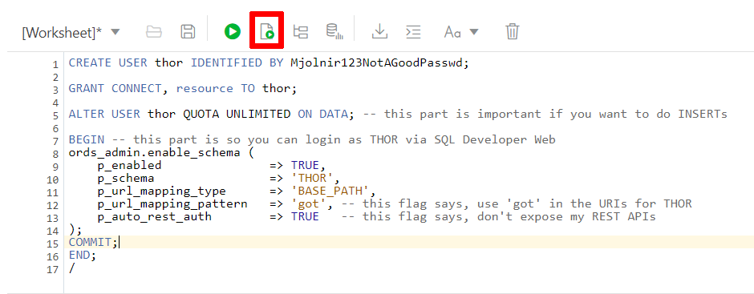

The **Script Output** tab at the bottom of the screen shows the result of the SQL commands
    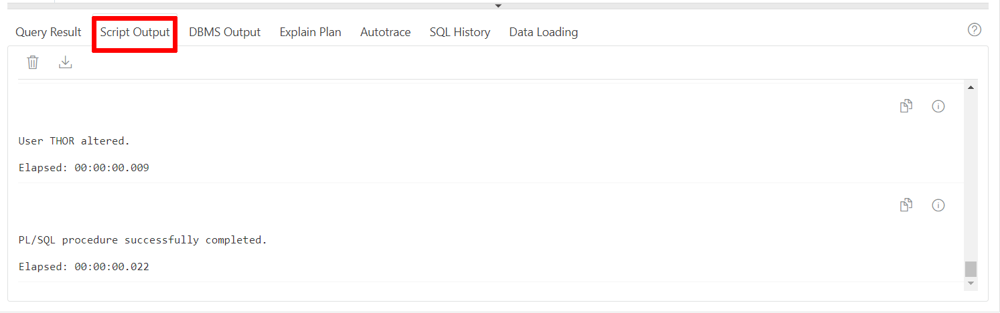

3. Next you will need to login to SQL Developer Web as your new user, `THOR`. Go to SQL Developer Web and copy the URL. The URL should look similar to the text below. **IDENTIFIER** will be your unique system-assigned identifier. **DBNAME** is the name of your database. **REGION** is your account region.

    ````
    https://IDENTIFIER-DBNAME.adb.REGION.oraclecloudapps.com/ords/admin/_sdw/?nav=worksheet
    ````

    In this url replace the text `admin` with the text `got`. Paste this new URL into a new tab. You will be asked to login. Your **Username** will be thor and your **Password** will be `Mjolnir123NotAGoodPasswd`.
    ````
    <copy>Mjolnir123NotAGoodPasswd</copy>
    ````
    

## **Step 2**: Build a simple GET handler

1. You should be logged in as THOR. The window should say THOR(not admin) in the top right. Using the SQL Developer worsheet create a test table by pasting the following text and clicking the run script button.

    ````
    <copy>
    CREATE TABLE runes (
        id        INTEGER,
        message   VARCHAR2 (100),
        CONSTRAINT runes_pk PRIMARY KEY (id)
    );

    INSERT INTO runes (id, message) VALUES (1, 'You people are so petty. And tiny.');
    INSERT INTO runes (id, message) VALUES (2, 'This drink, I like it. Another!');
    INSERT INTO runes (id, message) VALUES (3, 'I choose to run toward my problems and not away from them ...');
    INSERT INTO runes (id, message) VALUES (4, 'Thank you, sweet rabbit');
    INSERT INTO runes (id, message) VALUES (5, 'He''s a friend from work!');
    </copy>
    ````
    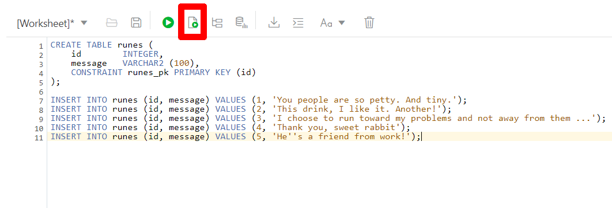

    The **Script Output** tab will show:
    ````
    Table RUNES created.

    Elapsed: 00:00:00.014

    1 row inserted.

    Elapsed: 00:00:00.021

    1 row inserted.

    Elapsed: 00:00:00.005

    1 row inserted.

    Elapsed: 00:00:00.004

    1 row inserted.

    Elapsed: 00:00:00.003

    1 row inserted.

    Elapsed: 00:00:00.003
    ````

2. Build a simple GET handler by pasting the following text and clicking the run script button.

    ````
    <copy>
    BEGIN
        ords.enable_schema (
            p_enabled               => TRUE,
            p_schema                => 'THOR',
            p_url_mapping_type      => 'BASE_PATH',
            p_url_mapping_pattern   => 'got',
            p_auto_rest_auth        => TRUE
        );
    ords.define_module (    
            p_module_name            => 'test',
            p_base_path              => '/test/',
            p_items_per_page         => 25,
            p_status                 => 'PUBLISHED',
            p_comments               => NULL );
    ords.define_template (
            p_module_name            => 'test',
            p_pattern                => 'itaot/', --is there anyone out there?
            p_priority               => 0,
            p_etag_type              => 'HASH',
            p_etag_query             => NULL,
            p_comments               => NULL );
    ords.define_handler (
            p_module_name            => 'test',
            p_pattern                => 'itaot/',
            p_method                 => 'GET',
            p_source_type            => 'json/collection',
            p_items_per_page         => 25,
            p_mimes_allowed          => '',
            p_comments               => NULL,
            p_source                 => 'select * from runes' );

    COMMIT;
    END;
    </copy>
    ````

    

    The **Script Output** tab will show:
    ````
    PL/SQL procedure successfully completed.

    Elapsed: 00:00:01.091
    ````

    *Note: That the ORDS PL/SQL API can be accessed via the ORDS packages (when you are logged in as your APP user: Thor) and ORDS_ADMIN packages (when you are logged in as ADMIN).
    This exercise is using THOR, so all the calls are using ORDS().*

3. Copy the URL you used to login as THOR and replace everything after the schema alias, `/got/`, with the module name and pattern defined in the enable_schema() command, `/test/itaot/`. The URL should look similar to the text below.

    ````
    https://IDENTIFIER-DBNAME.adb.REGION.oraclecloudapps.com/ords/got/test/itaot/
    ````

    *Note: Outputs may look different, depending on the browser you are using.*

    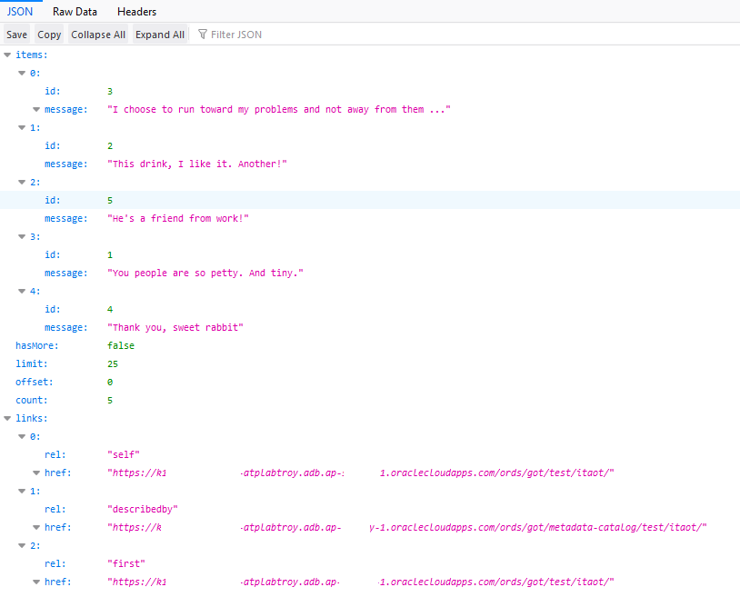

4. Protect the Module with an ORDS privilege
    You should have noticed that you did not provide an OAUTH token or even any user credentials to use that handler.
    Create a new privilege (an ORDS privilege, not a database privilege), assign it to a ROLE (‘SQL Developer’), and use it to protect the TEST module we just created.

    ````
    <copy>
    DECLARE
    l_roles     OWA.VC_ARR;
    l_modules   OWA.VC_ARR;
    l_patterns  OWA.VC_ARR;
    BEGIN
    l_roles(1)   := 'SQL Developer';
    l_modules(1) := 'test';
    ORDS.DEFINE_PRIVILEGE(
        p_privilege_name => 'thewall',
        p_roles          => l_roles,
        p_patterns       => l_patterns,
        p_modules        => l_modules,
        p_label          => '',
        p_description    => 'priv required to hit itaot',
        p_comments       => NULL);      
    COMMIT;
    END;
    </copy>
    ````

    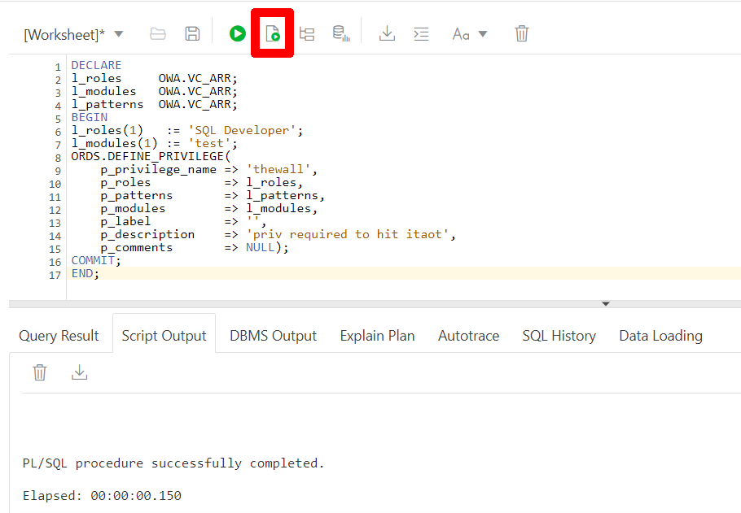

    With this privilege in place try to access *test* again.
    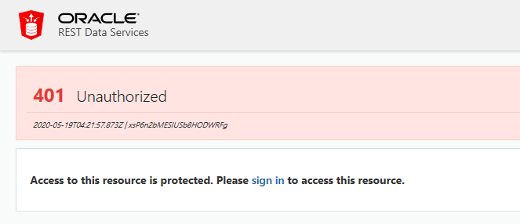

    *Note: If you are logged in as THOR to SQLDeveloper via your browser you are authenticated. You used the role 'SQL Developer' which is an ORDS role assigned to any Database User Authenticated session. If you are not seeing the "401 Unathorized" error, try a different browser, private window, or use a REST client like Insomnia from Google.*

## **Step 3**: Register an OAUTH Client application

1.  This topic explains how to register your applications (called "third-party" applications here) to access a REST API. OAuth 2.0 is a standard Internet protocol that
    provides a means for HTTP servers providing REST APIs to give limited access to third party applications on behalf of an end user.

    - The author of the third-party application must register the application to gain client credentials.
    - Using the client credentials the third party application starts a web flow that prompts the end-user to approve access.
    This is not a full-featured demonstration of how to create and integrate a third party application; it just outlines the concepts involved.

    Register the client application.
    Copy the URL you used to login as THOR and replace everything after the schema alias, `/got/`, with `/oauth/clients/`. The URL should look similar to the text below. Paste this URL into a new browser tab.
    ````
    https://IDENTIFIER-DBNAME.adb.REGION.oraclecloudapps.com/ords/got/oauth/clients/
    ````
    If you are logged out or in a different browser, you may be informed that access is restricted and you are unauthorized. Login as THOR to access the client authorization function.
    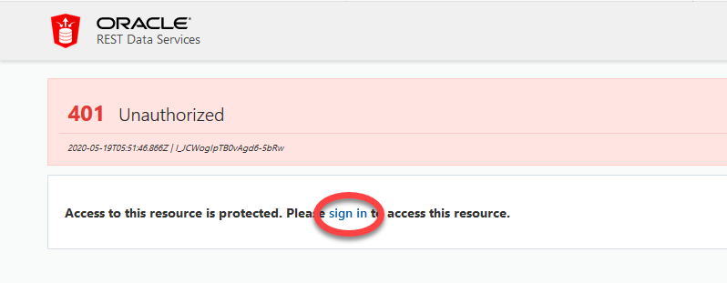

2. Click **New Client**

    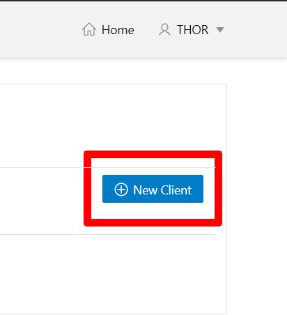

    and enter the following information.

    **Name:**
    ````
    <copy>Test Client</copy>
    ````
    **Description:**
    ````
    <copy>An example OAuth Client</copy>
    ````
    **Redirect URI:**
    ````
    <copy>http://example.org/redirect</copy>
    ````
    **Support e-mail:**
    ````
    <copy>info@example.org</copy>
    ````
    **Support URI:**
    ````
    <copy>http://example.org/support</copy>
    ````
    **Required Privileges:**
    ````
    <copy>SQL Developer</copy>
    ````

    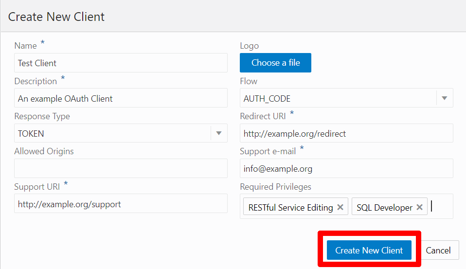

3. Click **Create** to create the client.
    The client will have a **client id** and an **authorization URL**. The **unique value** or **state** should be a unique, unguessable value that the client remembers, and can use later to confirm that the redirect received from Oracle REST Data Services is in response to this authorization request. This value is used to prevent Cross Site Request Forgery attacks; it is very important, cannot be omitted, and must not be guessable or discoverable by an attacker.

4. Click **Edit** to retrieve the **client id**, **authorization URL** and the **unique value**
    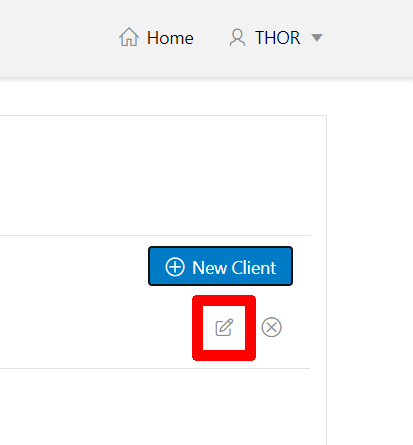

    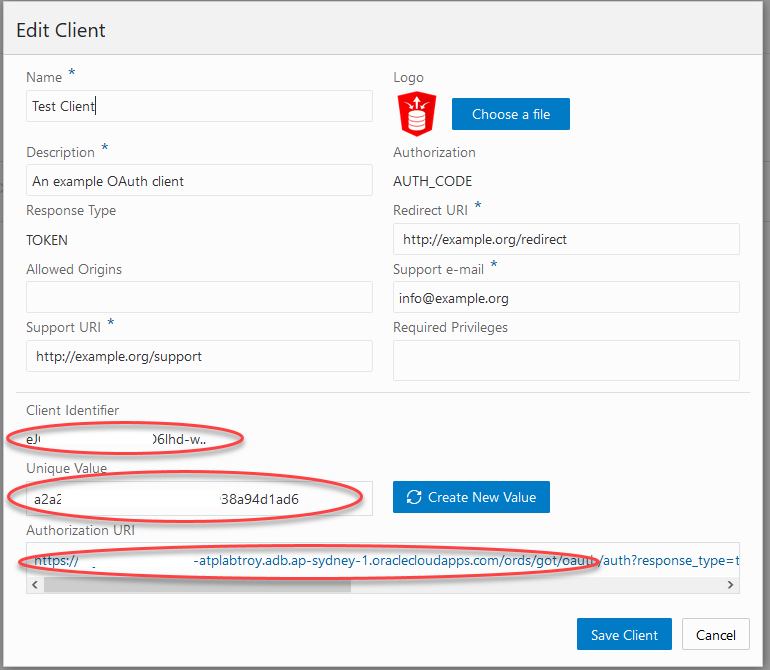

5. In a browser, enter the Autorization URL retrieved from the Test Client. The URL should look similar to the URL below.

    ````
    https://k1NumLetters-atplabtroy.adb.ap-CITY-1.oraclecloudapps.com/ords/got/oauth/auth?response_type=token&client_id=eNumLetters-w..&_auth_=force&state=aUNIQUEVALUEad6
    ````
    *Note: The Autorization URL shown here will not resolve. You must use the URL obtained in Step 4 above*
6. Sign in as THOR to approve this request.
    

7. Approve the request.

    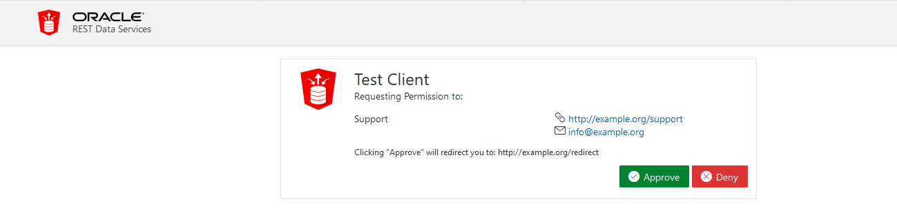

    The browser will redirect to a URL similar to.
    ````
    http://example.org/redirect#token_type=bearer&access_token=-i_Ows8j7JYu0p07jOFMEA..&expires_in=3600
    ````
    and send you to an example site with this message
    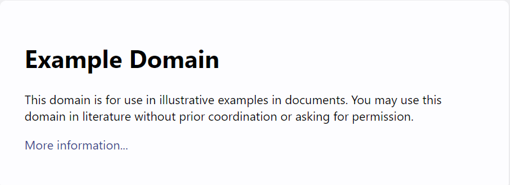

    When registering the OAuth client, you specified http://example.org/redirect as the Redirect URI. On completion of the approval request, the browser is redirected to this registered redirect URI. Appended to the URI is the information about the access token that was generated for the approval.

    In a real application, the third party application would respond to the redirection to the **redirect URI** by caching the access token, redirecting to another page to show the user that they are now authorized to access the REST API, and including the access token in every subsequent request to the REST API. However, in this tutorial you just make note of the access token value and manually create a HTTP request with the access token included, as explained in the next major step.

8. Copy the **access token** from the URL generated (to the example.org/redirect site). The **access token** will be located between the text `access_token=` and `&expires_in`. In the example below the access token is `PL324NumLetters`.
    ````
    https://kNumLetters-atplabtroy.adb.ap-CITY-1.oraclecloudapps.com/ords/got/oauth/%20
    http://example.org/redirect#token_type=bearer&access_token=PL324NumLetters&expires_in=3600&state=aUNIQUEVALUEad6
    ````
    *Note: You must use the URL obtained in Step 7 above.*

    *Note: The access token expires in 3600 seconds (1 hour).*

## **Step 4**: Send an Authorized Request

1. Lastly we are going to send an authorized request. You can use any REST Client, but we are going to use Insomnia for this example. Download Insomnia Core [here](https://insomnia.rest/download/).

    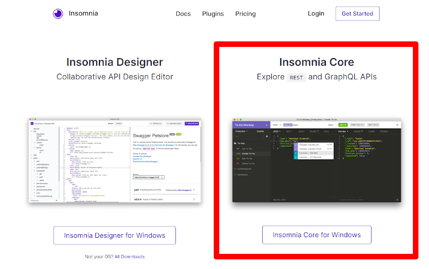

2. Open Insomnia and enter `Ctrl+N` to create a new request. When prompted enter `testRequest` for the **Name** and select **GET** as the request type.

    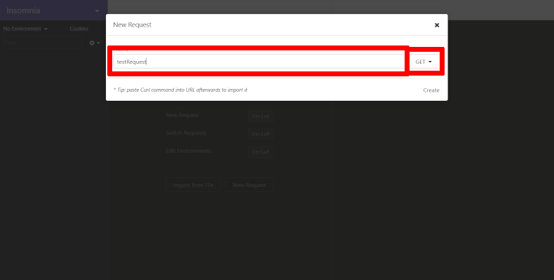

3. Enter the URL you used in Step 2 to access the test table. The URL should be in the format below.

    ````
    https://IDENTIFIER-DBNAME.adb.REGION.oraclecloudapps.com/ords/got/test/itaot/
    ````

    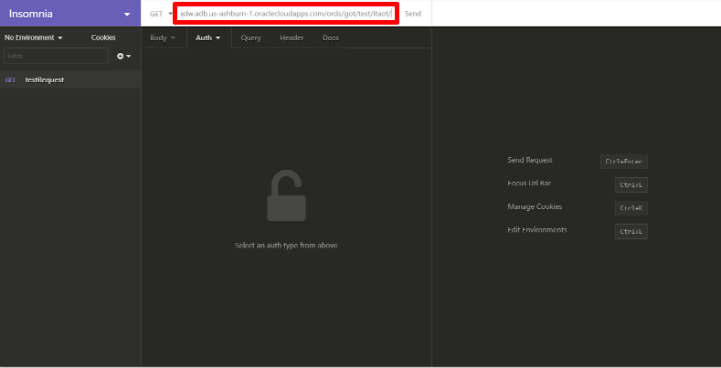

4. Select **Bearer Token** as the **Auth** type.

    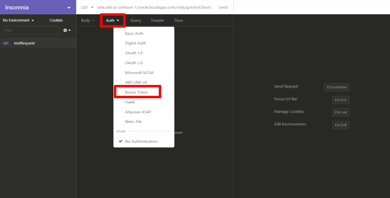

5. Paste the access token from Step 4 into the **TOKEN** field and click **Send**. You should see the response on the right.

    

    After an access token has been acquired, the client application must remember the access token and include it with every request to the protected resource. The access token must be included in the HTTP Authorization request header (explained at http://tools.ietf.org/html/rfc2616#section-14.8).

    If the Authorization header is omitted, then the status *401 Unauthorized* is returned instead. Clear the **TOKEN** field to see the *401 Unauthorized* error.

## Conclusion
In this Lab, you had an opportunity to get an introduction to REST services.

## **Acknowledgements**

 - **Author** - Jeff Smith, 2019
 - **Contributors** - Oracle LiveLabs QA Team (Arabella Yao, Product Manager Intern | Jaden McElvey, Technical Lead | Ayden Smith, Intern)
 - **Last Updated By/Date** - Troy Anthony, May 20 2020

 ## See an issue?
Please submit feedback using this [form](https://apexapps.oracle.com/pls/apex/f?p=133:1:::::P1_FEEDBACK:1). Please include the *workshop name*, *lab* and *step* in your request.  If you don't see the workshop name listed, please enter it manually. If you would like for us to follow up with you, enter your email in the *Feedback Comments* section.
