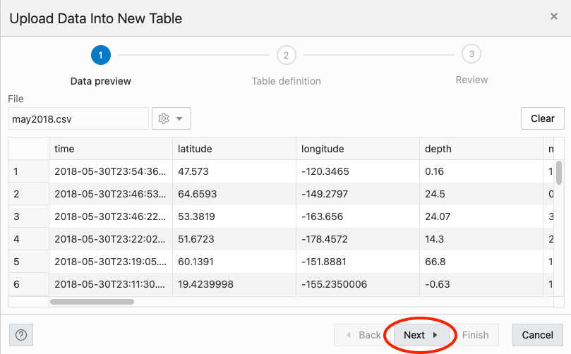
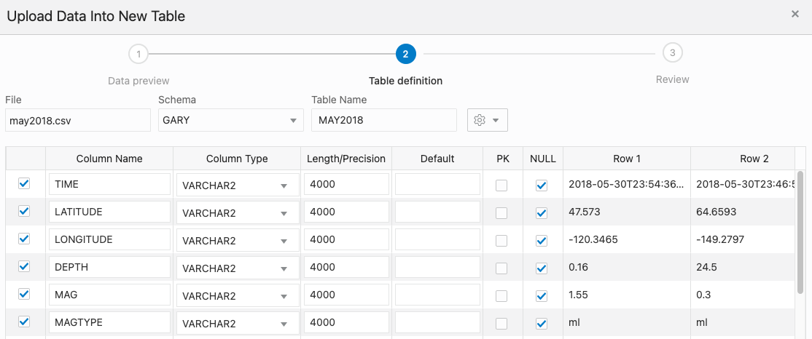
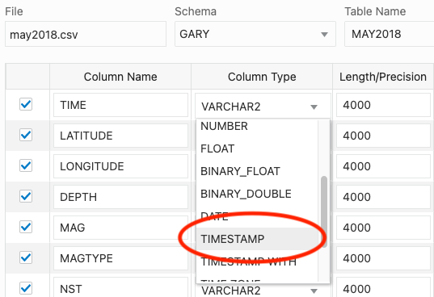
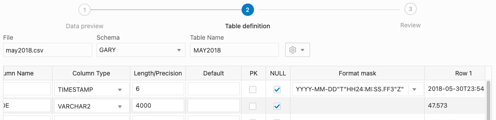
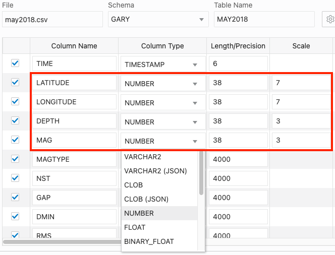
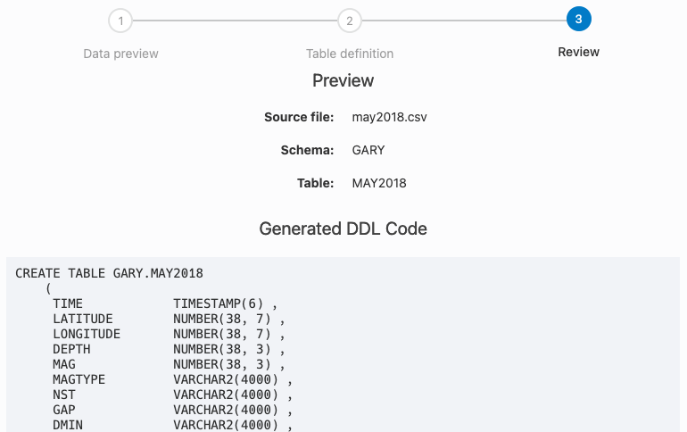
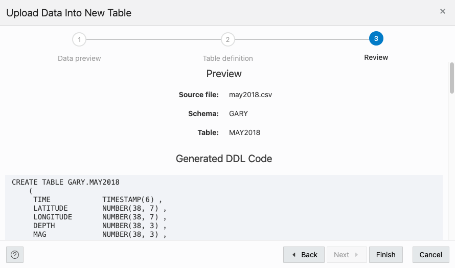
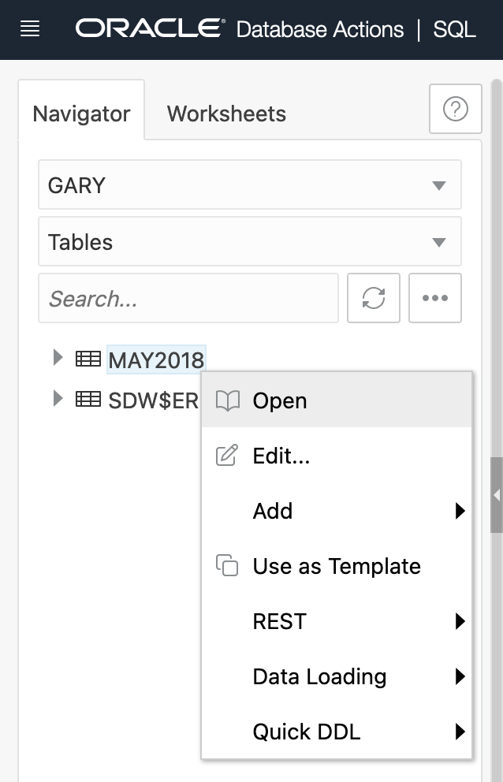
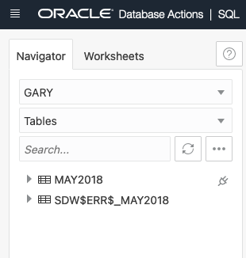

# RESTful Services for your Autonomous Database

## Introduction

In this lab you will use the SQL Developer Web browser-based tool, connect to your Autonomous Database and REST enable tables and views and/or develop custom RESTful Services based on your SQL and PL/SQL code.

Estimate time: 30-45 minutes

### Objectives
- Enable a user for REST access
- Publish a RESTful service for a database table

### Required Artifacts
- The following lab requires an <a href="https://www.oracle.com/cloud/free/" target="\_blank">Oracle Cloud account</a>. You may use your own cloud account, a cloud account that you obtained through a trial, or a training account whose details were given to you by an Oracle instructor.

### Prerequisites
This workshop assumes you have completed the following labs:
* [Login to Oracle Cloud](?lab=lab-1-login-oracle-cloud)
* [Provision an Autonomous Database](?lab=lab-2-provision-autonomous-database)
* [Connect to ADB with SQL Dev Web](?lab=lab-3-connect-adb-sql-dev-web)

### Developing RESTful Services in Autonomous Database
You have several development interfaces available, including:
* SQL Developer - Web or Desktop
* APEX
* PL/SQL API

## **Step 1**: Create a user for Application Development
First, we want to create a database schema for our tables and data. We do this by creating a database user. To create a database user, we start by clicking the Database Actions Menu in the upper left of the page, then clicking Database Users in the Administration List. It is not good practice to use a SYS or SYSTEM user to create an application's tables, and neither is it good practice to use the ADMIN account to create applications.


Now, click the Create User button on the left side of the page. This will slide out the Create User panel.


Start by entering a user name. Let's use GARY as the username. Next we need to enter a password. The password must be complex enough to pass the password profile set by the database. The rules are as follows:

Password must be 12 to 30 characters and contain at least one uppercase letter, one lowercase letter, and one number. The password cannot contain the double quote (") character or the username "admin".


Once we enter the password twice, ensure the REST Enable button is on. This will allow us to use REST services with this database schema from the start. Your panel should look similar to the following image:


Once you are ready, click the Create User button on the bottom of the panel to create the database user.

We next need to give this new user some space to create objects and data. For this, we need to go back to the SQL worksheet and run a simple statement. To get back to the SQL Worksheet, again click the Database Actions menu in the upper left and select SQL in the Development List.


On the SQL Canvas, copy and paste the following statement:
    ````
    <copy>alter user gary quota unlimited on data;</copy>
    ````
Once copied on the canvas, click the run button on the worksheet toolbar.


On the bottom of the worksheet, in the Script Output, you should see that the user Gary has been altered and the quota granted.


## **Step 2**: Load data into the database

We need to load some data into the database so that we can create some REST services upon those tables and data. To do this, we need to login as our newly created user. We have two ways to switch users.

**User Changing Method 1:**

The first method requires us to sign out and back in. Start by clicking the Admin user dropdown menu in the upper right, then selecting Sign Out.


On the page the follows, click Sign In


On the next page, enter gary as the username and click Next


And on the final page, enter the password you used when you created the user and click Sign In.


This will bring you back to Database Actions but as the user we created.


**User Changing Method 2:**

As the Admin user, in the upper left of the page, click the Database Actions Menu. In the Administration List, select Database Users; just as we did previously when creating Gary.


Find Gary's user title and click the open-in-new-tab icon  on the lower right to open a new browser tab/window with a login box.


Enter Gary as the Username and then his password in the password field. Then click Sign in.


In either login method, we end up on the overview page. Now click the SQL tile.


We are now ready to load data into the database. For this task, we will use the Data Loading tab in the SQL Worksheet.


Start by clicking the Data Loading area; the center of the gray dotted-line box.


The Upload Data into New Table model will appear.


We are going to use some sample data to load data into the database and create a table at the same time. Start by downloading this file

[May 2018 Earthquakes](../demodata/may2018.csv)

Once on your desktop, drag the file into the Upload Data into New Table model. You can also click the Select Files button and find where you downloaded it via your operating system's file browser.


The model will then give you a preview of what the data will look like in an Oracle table. Go ahead and click the Next button on the bottom right of the modal.



On the following step of the data loading modal, we can see the name of the table we are going to create as well as the column and data types for the table.



Let's edit a few of these columns. We need a Primary Key for our table. Here, we can use the ID column. Just click the PK checkbox for the ID row.



Next, we want to take the TIME column and make it a TIMESTAMP type. Do this by selecting TIMESTAMP from the Column Type dropdown.



Next, we need to set the timestamp format so that we can load it into the database. Just to the right of the Column Type you will find a Format Mask column. (You may need to use the horizontal scroll bar to see the column to the right)

Enter the following into that column:

**YYYY-MM-DD"T"HH24:MI:SS.FF3"Z"**

You can check the image below for guidance.



Next, we are going to change the LATITUDE, LONGITUDE, DEPTH and MAG columns to NUMBER column Types. Again, use the Column Type dropdown select list to choose NUMBER for each of them. We also need to set the SCALE of each of these columns so that we retain the values to the right of the decimal point.

Set the scale to 7 for LATITUDE, 7 for LONGITUDE, 3 for DEPTH, and 3 for MAG.



Click Next on the bottom right of the modal when done.

On the last step of the modal, we can see the DDL (Data Definition Language) for creating the table, table name and if you scroll down, the column mappings.



When you are done taking a look, click the Finish button in the lower right of the modal.


The Data Loader will now process the file by creating a table and loading the CSV file data into that table. 


Once its done, you will see a row in the Data Loading tab that indicates how many rows were uploaded, if any failed and the table name.


We can take a look at our newly created table and the data in it by using the navigator on the left of the SQL Worksheet. Just right click the table name and select Open from the pop up menu.



In the slider that has come out from the right of the page, we can look at the data definition, triggers, constraints and even the data itself.


## **Step 3:**Auto-REST enable a table

REST enabling a table couldn't be easier. To do this, find the table we just created named MAY2018 in the navigator on the left of the SQL Worksheet.


Right click on the table name and select REST in the pop up menu then Enable.


The REST Enable Object slider will appear from the right side of the page. We are going to use the defaults for this page but take note and copy the Preview URL. This is the URL we will use to access the REST enabled table. When ready, click the Enable button in the lower right of the slider.


Thats it! Your table is REST enabled. Open a new browser window or tab and enter that URL we copied in the previous step. We will see our table data in JSON format via a REST service.


You can also see a plug icon  next to the table to indicate it is REST enabled.



We can work with the REST endpoints by using cURL commands that the SQL Worksheet can provide to us. To get to these endpoints, again right click the table name as we did in the previous step, select REST, then cURL Command.


On the right of the page, we see the cURL for the table MAY2018 side out.


Here we can work with the various REST endpoints. GET ALL is the URL we tried out in the browser previously. Let's take a look at getting a single row. Click on GET Single and you will see a form field for the ID column. Enter **hv70116556** and click the Next button on the lower right of the slide out.


We now have the REST endpoint for getting a single record.


You can grab the URL and put it into a browser window,


or you can copy the curl command and run it where curl is available. If you are unsure if you have curl installed locally or do not want to install it, we can use the OCI cloud shell. While logged into the OCI console, you can click the Cloud Shell icon in the upper right of the page.


This will open a console where you can run the curl command.


## **Step 4:**Securing the REST endpoint


############################################################################################

## **Step 2**: Build a simple GET handler

1. You should be logged in as THOR. The window should say THOR(not admin) in the top right. Using the SQL Developer worsheet create a test table by pasting the following text and clicking the run script button.

    ````
    <copy>
    CREATE TABLE runes (
        id        INTEGER,
        message   VARCHAR2 (100),
        CONSTRAINT runes_pk PRIMARY KEY (id)
    );

    INSERT INTO runes (id, message) VALUES (1, 'You people are so petty. And tiny.');
    INSERT INTO runes (id, message) VALUES (2, 'This drink, I like it. Another!');
    INSERT INTO runes (id, message) VALUES (3, 'I choose to run toward my problems and not away from them ...');
    INSERT INTO runes (id, message) VALUES (4, 'Thank you, sweet rabbit');
    INSERT INTO runes (id, message) VALUES (5, 'He''s a friend from work!');
    </copy>
    ````
    

    The **Script Output** tab will show:
    ````
    Table RUNES created.

    Elapsed: 00:00:00.014

    1 row inserted.

    Elapsed: 00:00:00.021

    1 row inserted.

    Elapsed: 00:00:00.005

    1 row inserted.

    Elapsed: 00:00:00.004

    1 row inserted.

    Elapsed: 00:00:00.003

    1 row inserted.

    Elapsed: 00:00:00.003
    ````

2. Build a simple GET handler by pasting the following text and clicking the run script button.

    ````
    <copy>
    BEGIN
        ords.enable_schema (
            p_enabled               => TRUE,
            p_schema                => 'THOR',
            p_url_mapping_type      => 'BASE_PATH',
            p_url_mapping_pattern   => 'got',
            p_auto_rest_auth        => TRUE
        );
    ords.define_module (    
            p_module_name            => 'test',
            p_base_path              => '/test/',
            p_items_per_page         => 25,
            p_status                 => 'PUBLISHED',
            p_comments               => NULL );
    ords.define_template (
            p_module_name            => 'test',
            p_pattern                => 'itaot/', --is there anyone out there?
            p_priority               => 0,
            p_etag_type              => 'HASH',
            p_etag_query             => NULL,
            p_comments               => NULL );
    ords.define_handler (
            p_module_name            => 'test',
            p_pattern                => 'itaot/',
            p_method                 => 'GET',
            p_source_type            => 'json/collection',
            p_items_per_page         => 25,
            p_mimes_allowed          => '',
            p_comments               => NULL,
            p_source                 => 'select * from runes' );

    COMMIT;
    END;
    </copy>
    ````

    

    The **Script Output** tab will show:
    ````
    PL/SQL procedure successfully completed.

    Elapsed: 00:00:01.091
    ````

    *Note: That the ORDS PL/SQL API can be accessed via the ORDS packages (when you are logged in as your APP user: Thor) and ORDS_ADMIN packages (when you are logged in as ADMIN).
    This exercise is using THOR, so all the calls are using ORDS().*

3. Copy the URL you used to login as THOR and replace everything after the schema alias, `/got/`, with the module name and pattern defined in the enable_schema() command, `/test/itaot/`. The URL should look similar to the text below.

    ````
    https://IDENTIFIER-DBNAME.adb.REGION.oraclecloudapps.com/ords/got/test/itaot/
    ````

    *Note: Outputs may look different, depending on the browser you are using.*

    

4. Protect the Module with an ORDS privilege
    You should have noticed that you did not provide an OAUTH token or even any user credentials to use that handler.
    Create a new privilege (an ORDS privilege, not a database privilege), assign it to a ROLE (‘SQL Developer’), and use it to protect the TEST module we just created.

    ````
    <copy>
    DECLARE
    l_roles     OWA.VC_ARR;
    l_modules   OWA.VC_ARR;
    l_patterns  OWA.VC_ARR;
    BEGIN
    l_roles(1)   := 'SQL Developer';
    l_modules(1) := 'test';
    ORDS.DEFINE_PRIVILEGE(
        p_privilege_name => 'thewall',
        p_roles          => l_roles,
        p_patterns       => l_patterns,
        p_modules        => l_modules,
        p_label          => '',
        p_description    => 'priv required to hit itaot',
        p_comments       => NULL);      
    COMMIT;
    END;
    </copy>
    ````

    

    With this privilege in place try to access *test* again.
    

    *Note: If you are logged in as THOR to SQLDeveloper via your browser you are authenticated. You used the role 'SQL Developer' which is an ORDS role assigned to any Database User Authenticated session. If you are not seeing the "401 Unathorized" error, try a different browser, private window, or use a REST client like Insomnia from Google.*

## **Step 3**: Register an OAUTH Client application

1.  This topic explains how to register your applications (called "third-party" applications here) to access a REST API. OAuth 2.0 is a standard Internet protocol that
    provides a means for HTTP servers providing REST APIs to give limited access to third party applications on behalf of an end user.

    - The author of the third-party application must register the application to gain client credentials.
    - Using the client credentials the third party application starts a web flow that prompts the end-user to approve access.
    This is not a full-featured demonstration of how to create and integrate a third party application; it just outlines the concepts involved.

    Register the client application.
    Copy the URL you used to login as THOR and replace everything after the schema alias, `/got/`, with `/oauth/clients/`. The URL should look similar to the text below. Paste this URL into a new browser tab.
    ````
    https://IDENTIFIER-DBNAME.adb.REGION.oraclecloudapps.com/ords/got/oauth/clients/
    ````
    If you are logged out or in a different browser, you may be informed that access is restricted and you are unauthorized. Login as THOR to access the client authorization function.
    

2. Click **New Client**

    

    and enter the following information.

    **Name:**
    ````
    <copy>Test Client</copy>
    ````
    **Description:**
    ````
    <copy>An example OAuth Client</copy>
    ````
    **Redirect URI:**
    ````
    <copy>http://example.org/redirect</copy>
    ````
    **Support e-mail:**
    ````
    <copy>info@example.org</copy>
    ````
    **Support URI:**
    ````
    <copy>http://example.org/support</copy>
    ````
    **Required Privileges:**
    ````
    <copy>SQL Developer</copy>
    ````

    

3. Click **Create** to create the client.
    The client will have a **client id** and an **authorization URL**. The **unique value** or **state** should be a unique, unguessable value that the client remembers, and can use later to confirm that the redirect received from Oracle REST Data Services is in response to this authorization request. This value is used to prevent Cross Site Request Forgery attacks; it is very important, cannot be omitted, and must not be guessable or discoverable by an attacker.

4. Click **Edit** to retrieve the **client id**, **authorization URL** and the **unique value**
    

    

5. In a browser, enter the Autorization URL retrieved from the Test Client. The URL should look similar to the URL below.

    ````
    https://k1NumLetters-atplabtroy.adb.ap-CITY-1.oraclecloudapps.com/ords/got/oauth/auth?response_type=token&client_id=eNumLetters-w..&_auth_=force&state=aUNIQUEVALUEad6
    ````
    *Note: The Autorization URL shown here will not resolve. You must use the URL obtained in Step 4 above*
6. Sign in as THOR to approve this request.
    

7. Approve the request.

    

    The browser will redirect to a URL similar to.
    ````
    http://example.org/redirect#token_type=bearer&access_token=-i_Ows8j7JYu0p07jOFMEA..&expires_in=3600
    ````
    and send you to an example site with this message
    

    When registering the OAuth client, you specified http://example.org/redirect as the Redirect URI. On completion of the approval request, the browser is redirected to this registered redirect URI. Appended to the URI is the information about the access token that was generated for the approval.

    In a real application, the third party application would respond to the redirection to the **redirect URI** by caching the access token, redirecting to another page to show the user that they are now authorized to access the REST API, and including the access token in every subsequent request to the REST API. However, in this tutorial you just make note of the access token value and manually create a HTTP request with the access token included, as explained in the next major step.

8. Copy the **access token** from the URL generated (to the example.org/redirect site). The **access token** will be located between the text `access_token=` and `&expires_in`. In the example below the access token is `PL324NumLetters`.
    ````
    https://kNumLetters-atplabtroy.adb.ap-CITY-1.oraclecloudapps.com/ords/got/oauth/%20
    http://example.org/redirect#token_type=bearer&access_token=PL324NumLetters&expires_in=3600&state=aUNIQUEVALUEad6
    ````
    *Note: You must use the URL obtained in Step 7 above.*

    *Note: The access token expires in 3600 seconds (1 hour).*

## **Step 4**: Send an Authorized Request

1. Lastly we are going to send an authorized request. You can use any REST Client, but we are going to use Insomnia for this example. Download Insomnia Core [here](https://insomnia.rest/download/).

    

2. Open Insomnia and enter `Ctrl+N` to create a new request. When prompted enter `testRequest` for the **Name** and select **GET** as the request type.

    

3. Enter the URL you used in Step 2 to access the test table. The URL should be in the format below.

    ````
    https://IDENTIFIER-DBNAME.adb.REGION.oraclecloudapps.com/ords/got/test/itaot/
    ````

    

4. Select **Bearer Token** as the **Auth** type.

    

5. Paste the access token from Step 4 into the **TOKEN** field and click **Send**. You should see the response on the right.

    

    After an access token has been acquired, the client application must remember the access token and include it with every request to the protected resource. The access token must be included in the HTTP Authorization request header (explained at http://tools.ietf.org/html/rfc2616#section-14.8).

    If the Authorization header is omitted, then the status *401 Unauthorized* is returned instead. Clear the **TOKEN** field to see the *401 Unauthorized* error.

## Conclusion
In this lab, you had an opportunity to get an introduction to REST services.

## **Acknowledgements**

 - **Author** - Jeff Smith, 2019
 - **Contributors** - Oracle LiveLabs QA Team (Arabella Yao, Product Manager Intern | Jaden McElvey, Technical Lead | Ayden Smith, Intern)
 - **Last Updated By/Date** - Troy Anthony, May 20 2020

 ## Need Help?
Please submit feedback or ask for help using our [LiveLabs Support Forum](https://community.oracle.com/tech/developers/categories/livelabsdiscussions). Please click the **Log In** button and login using your Oracle Account. Click the **Ask A Question** button to the left to start a *New Discussion* or *Ask a Question*.  Please include your workshop name and lab name.  You can also include screenshots and attach files.  Engage directly with the author of the workshop.

If you do not have an Oracle Account, click [here](https://profile.oracle.com/myprofile/account/create-account.jspx) to create one.
